# Proposal Approval – Nintex workflow analysis

This document analyses [`Proposal_Approval.nwf`](../Proposal_Approval.nwf), a Nintex Workflow 2016 export from SharePoint 2016. The `.nwf` wraps the workflow definition as escaped XML, together with the column list of the list it runs on. I decoded it and read every action, condition, query, field update, task and email. **Proposal Approval** is a list workflow on the **Draft Proposals** document library, export version `4311`. Its task forms are published under `/Divisions/PDD/Projects`, so the workflow appears to live on that site.

**How this relates to the other files in the repo:** this is **not** the approval workflow of the Project Establishment Form described in [`template-xsn.md`](template-xsn.md). That workflow runs on the *Project Establishment Forms* library and is not in this repo. *Proposal Approval* approves draft proposal **documents** and gets them a proposal number. The two processes meet in two places:

- both use the `Workflow Tasks` list of the `/Divisions/PDD/Projects` site;
- this workflow looks for the approved PDF in the **Proposals** library at `http://portal/Divisions/Proposals/` (A185). The PEF form reads that same library through its *Proposals* data connection to fill in proposal numbers and links.

How to read this document:

- **Action IDs.** Identifiers such as A001 or A055 (`[A###]`) number the workflow's actions in the order they appear in the export. A001 is the workflow's own settings record. A range such as A005–A041 covers an action and everything nested inside it.
- **Branches.** For a "Set a condition" action (WFIfElse), the first child branch is the **No** branch, which runs when the condition is FALSE. The second is the **Yes** branch, which runs when it is TRUE. The export labels them `LLabel=No` and `RLabel=Yes`. A "Run if" action (NWRunIf2) runs its children only when its condition is TRUE.
- **Literal `&nbsp;`.** Where a value below contains `&nbsp;`, Nintex writes those six characters literally into the plain-text column or email subject.
- **Not in the export.** The workflow calls three reusable user-defined actions (UDAs): the approval UDA, the delegate UDA and the Admin Officer UDA. It also starts three child workflows: Check Signatures, PROPOSAL CHECKER and Generate PDF. None of their definitions is part of the export, so they are described only by their inputs and outputs. The contents of the other lists the workflow queries (Master Contacts, Clients, Sites, Proposals) are not visible either.
- **Issue references.** Issues are referred to as I01–I46 and are described in [Issues and recommendations](#issues-and-recommendations). Each carries a verification label: *Confirmed in export* or *Depends on runtime data / UDA*.

## Summary

- **What it does.** A user starts it by hand from the item menu (A001). It waits for the editor's lock on the document to clear (A002), starts Check Signatures without waiting (A004) and, if a Checker is named, runs PROPOSAL CHECKER (A048). It then asks up to three approvers through one reusable approval UDA:
  - the person selected in *Commercial Contacts* (A055);
  - the PDD Divisional Manager, when Value(R) > R100,000 or *GM Approval Required* is ticked (A091);
  - the General Manager, when Value(R) ≥ R5,000,000 or the flag is ticked (A131).
- **Outcome.** If the last answer is not exactly "Approved", the initiator is emailed and the item's approval status is set to Denied (A145–A149). Otherwise:
  - an Admin Officer enters a new Proposal No. or a Revision No. (A167/A176);
  - Generate PDF runs (A184);
  - the initiator and the Admin Officer are emailed (A191/A193);
  - the item is set to Approved (A194/A195).
- **High: approvals can be bypassed or overridden.**
  - A101 evaluates as (Approved AND ≥ R5m) OR GM flag. With *GM Approval Required* ticked, a GM approval therefore overrides a Divisional Manager rejection ([I02](#i02), [I13](#i13)).
  - An initiator whose Position Title is exactly "Manager" skips both the Divisional Manager and the GM, whatever the value ([I01](#i01)).
- **Medium: approvers are resolved fragilely and never checked.**
  - The level-1 "Supervisor" is whoever is selected in *Commercial Contacts*, matched by name ([I08](#i08), [I09](#i09)).
  - The Divisional Manager comes from a hard-coded "PDD" / "contains Manager" query ([I15](#i15)).
  - No lookup result is checked for empty ([I10](#i10)).
  - Nothing stops an initiator approving their own proposal ([I12](#i12)).
  - The "delegated?" tests compare differently typed values ([I14](#i14)).
- **Medium: gaps at the end of the process.**
  - A proposal is set to Approved even when no Admin Officer is found, leaving it with no number and no PDF ([I03](#i03)).
  - The lookup that finds the PDF for the email attachment will probably not match the generated file ([I16](#i16)).
  - The results of PROPOSAL CHECKER and Check Signatures are never read ([I06](#i06), [I11](#i11)).
- **Limits of this analysis.** What the three UDAs and three child workflows do cannot be seen: who receives each task, how delegates are routed, which status values come back, and how the PDF is named. 15 of the 46 issues depend on that behaviour or on list data.
- **Totals.** 46 issues: 2 High, 15 Medium, 22 Low and 7 Info. 31 are confirmed directly in the export, and 15 depend on runtime data or UDA/child-workflow behaviour. No findings were refuted.

## Contents

1. [Overview and configuration](#overview-and-configuration)
2. [Flow diagram](#flow-diagram)
3. [Stage 1: Start-up and approval variables](#stage-1-start-up-and-approval-variables)
4. [Stage 2: Approval chain](#stage-2-approval-chain)
5. [Stage 3: Outcome, numbering and notifications](#stage-3-outcome-numbering-and-notifications)
6. [Item fields written and status messages](#item-fields-written-and-status-messages)
7. [Issues and recommendations](#issues-and-recommendations)

## Overview and configuration

### What the workflow does

"Proposal Approval" is a Nintex Workflow 2016 list workflow on the **Draft Proposals** document library. It sends a draft proposal document through up to three levels of approval, then asks an Admin Officer to assign a proposal number or a revision number.

**Start-up and lookups (A002–A048)**

- It waits until the document is no longer locked by an editor (A002). This is not a check-in wait ([I05](#i05)).
- It starts the **Check Signatures** workflow without waiting for it (A004).
- It looks up reference data: the initiator's position, the client SAP number, the site country, the first-level approver and that approver's delegate. From these it builds a standard summary message (A005–A041).
- If the item's **Checker** column has a value, it runs the **PROPOSAL CHECKER** workflow and waits for it (A044–A048).
- If the item's Approval Status is then *Rejected*, the workflow ends (A049/A051).

**Approval levels.** All approvals are requested through one reusable approval UDA:

1. **First level.** The position resolved from the item's *Commercial Contacts* lookup (A024/A027/A055).
2. **Divisional Manager (PDD).** Runs when *Value(R)* > 100 000 or *GM Approval Required* is ticked. It also needs the first level to have approved and the initiator's position title not to be exactly "Manager" (A065/A067/A091).
3. **General Manager**, the Divisional Manager's own manager. This level is nested inside the Divisional Manager level. It runs when the manager approved and *Value(R)* ≥ 5 000 000, or whenever *GM Approval Required* is ticked (A101/A109/A131).

**Outcome.**

- **Not approved.** If the final status is not "Approved", the initiator is emailed and the item's content-approval status is set to Denied (A145–A149).
- **Approved.**
  - An Admin Officer (AO) is found through a UDA (A158).
  - The AO gets a Request Data task for a new Proposal No. or a Revision No. (A167/A176), and the number is written back to the item (A171/A181).
  - **Generate PDF** runs (A184).
  - The initiator and AO are emailed, with the PDF attached by URL (A191/A193).
  - The item is marked Approved (A194/A195).

**Top-level structure**

| Stage (action label) | Actions | Content |
|---|---|---|
| Workflow settings | A001 | Start options, task list, history list (see below) |
| Pre-flight | A002–A004 | Wait until the document is unlocked (not a check-in wait), commit, start "Check Signatures" without waiting |
| "Approval Variables" | A005–A041 | Initiator position, Proposal Title, email subjects, client SAP no., country, message text, first approver, delegate |
| "Request Approval" (bottom label "1. Supervisor, 2. Manager, 3 General Manager") | A042–A142 | Optional checker workflow, Rejected check, level 1, 2 and 3 approvals |
| "Request Proposal/Revision No." | A143–A195 | Final decision (A145), then rejection handling, or AO numbering, PDF, notifications and final approval |

### How the workflow starts

| Setting (A001) | Value | Meaning |
|---|---|---|
| StartManually | `true` | Can only be started by a user |
| StartOnCreate / StartOnChange | `false` / `false` | No automatic start |
| UsesConditionalStart, StartOnCreateCondition, StartOnChangeCondition | `false` | No start conditions |
| StartFromMenu / StartFromMenuLabel | `true` / **"Proposal Approval"** | Item drop-down menu (ECB) entry. EcbId `d4563c61-cd73-4e1b-aaf0-f40fcde4f2d1`, icon `_layouts/NintexWorkflow/Images/StartWorkflowECB.png`, CustomActionSequence `0` |
| RequireManagePermission | `false` | Anyone who can start workflows on the item can start it, not just list managers ([I04](#i04)) |
| StartPage | `""` | No custom start page. The export contains no form definition |
| Start form variable | **`InitiatorsComments`**: Text, MultipleLine, `StartupOptionsConfigured="true"`, `Required="false"` | Optional comments typed at start. They appear in the summary message (A022/A073/A117/A157) and are passed to the approval UDA as "Initiator Comments" (A055/A091/A131) |

### Target list, content types, task list, history and logging

| Item | Value |
|---|---|
| Workflow | "Proposal Approval", Category `List`, WorkflowType `List`. WorkflowId `{B31A38A3-4412-4667-92A1-2F11F9680A79}`, export Version `4311`, exported-workflow Id `fb8fc3c3-00b2-43f1-ba6e-965fadd128d5` |
| Target list | **Draft Proposals** `{d3563bbf-8a4a-469e-97f0-c2778cdd598f}`. A document library (FileLeafRef, CheckoutUser, document content types) with content approval enabled (`_ModerationStatus` "Approval Status", ModStat) |
| Content types in the list | Proposal `0x01010068C26BA9816D324DAB2DA0B1C849CA3A002E613176F8A40E4FA9E62416BE083A21`, Document `0x0101009B6A270667923D479C73E8147114E033`, Folder `0x01200031BCD72C73156D42862FA430D07FA80C` |
| Content type the workflow is tied to | `ContentType=""`, `ContentTypeName="All"`: available on all three content types ([I21](#i21)) |
| Task list | `Workflow Tasks`, referenced by name. The Request Data forms are published under `/Divisions/PDD/Projects/Lists/Workflow Tasks/…` (A167/A176) |
| History list | `NintexWorkflowHistory`, HistoryLogging `true` |
| Verbose logging | `false` |
| Status column | DisplayStatusColumn `false`. The list still has WorkflowStatus columns `Proposal` ("Proposal Approval"), `Generate` ("Generate PDF") and `Technica` ("Technical Contact") |
| Other settings | WorkflowDuration `-1`, SkipValidation `false`, WorkflowDescription and ChangeComments empty ([I40](#i40)) |
| Explicit history-log actions | A026, A033, A078, A108, A132, A168, A177, A188 |
| Disabled actions | A023 ("Query Applicant Supervisor") |
| Locale | Request Data due-date settings use Lcid `7177` (en-ZA) |

### Draft Proposals columns used

- **Read:** `Title`, `Site_x0020_Name`, `Site_x0020_Lookup` (Lookup), `Client_x0020_Name`, `Commercial_x0020_Contacts` (Lookup), `Division`, `Value_x0028_R_x0029_` (Calculated, "Value(R)"), `Proposal_x0020_Value`, `Currency`, `Acceptance_x0020_Valid_x0020_Date` ("Expiry Date"), `GM_x0020_Approval_x0020_Required`, `Checker`, `_ModerationStatus`, `Proposal_x0020_No_x002e_1`, `Proposal_x0020_Title`, `FileLeafRef`. Only the disabled A023 reads `Technical_x0020_Full_x0020_Name`.
- **Written:** `Proposal_x0020_Title`, `Workflow_x0020_State`, `Document_x0020_Approver`, `Approval_x0020_Date`, `Designation`, `Proposal_x0020_No_x002e_1`, `Proposal_x0020_No_x002e_`, `Reference`, and the content-approval status with its comments. [Item fields written and status messages](#item-fields-written-and-status-messages) lists the actions and conditions for each.

### Workflow variables

Set and read locations come from the action tree and were cross-checked against the raw workflow XML. "UDA out" means the variable receives a UDA output parameter. "Task field" means it receives a Request Data form field.

| Variable | Type | Purpose | Set (action IDs) | Read (action IDs) |
|---|---|---|---|---|
| `varApprover` | User | Next-level approver: the Divisional Manager, later the General Manager (Master Contacts `FullName1`) | A076, A103 (cleared with varEmpty), A106 | A078, A085, A095, A108, A109, A125, A137 |
| `varApprovalDate` | DateTime | Approval date returned by the approval UDA | A055, A091, A131 (UDA out) | A061, A063, A097, A099, A139, A141 |
| `varApprovalStatus` | Text | Approval outcome from the UDA. The only value ever tested is "Approved" | A055, A091, A131 (UDA out) | A056, A057, A061, A063, A067, A092, A093, A101, A134, A135, A145 |
| `varApprovalComments` | Text (multi-line) | Approver's comments from the UDA | A055, A091, A131 (UDA out) | A147, A149, A195 |
| `varAO` | User | Admin Officer (or delegate) returned by the AO UDA | A158 (UDA out) | A159, A163, A167, A176 (task assignee), A191, A193 (email To) |
| `varProposalNumber` | Text | Proposal No. entered by the AO | A167 (task field "Proposal No.") | A168, A169, A171 |
| `varApproversName` | Text | Approver name from the UDA, written to "Document Approver" | A055, A091, A131 (UDA out) | A061, A063, A097, A099, A139, A141 |
| `varApprovedBy` | Text | "Approved By" from the UDA. Used in the delegate checks and as the From address of the rejection email | A055, A091, A131 (UDA out) | A059, A095, A109, A132, A137, A147 |
| `varRevision` | Text | Revision No. entered by the AO, with spaces removed | A176 (task field "Revision No."), A180 | A177, A178, A180, A181 |
| `varAOComments` | Text (multi-line) | AO's comments from the task forms | A167, A176 (task field) | **never read** |
| `varApprovalLine` | Text | Approval email subject: `Proposal Approval: {Site Name}&nbsp;{Title}` | A015 | A055, A091, A131 (UDA "Subject") |
| `varNotificationLine` | Text | Notification email subject: `Proposal Notification: {Site Name}&nbsp;{Title}` | A016 | A147, A167, A176 (task notification subjects), A191, A193 |
| `varMessage` | Text (multi-line) | Summary block: initiator, site, country, title, Rand and foreign value, currency, validity, client SAP no., initiator comments | A022, A073, A117, A157 | A055, A091, A131, A147, A167, A176, A191, A193 |
| `varAOName` | Text | AO display name, used in Workflow State text | A163 | A166, A173, A175, A183 |
| `varCustomer` | Text | Client SAP No. (Clients `Customer`) | A019, A113, A153 | A022, A073, A117, A157 |
| `varTitle` | Text | Not used | — | — |
| `varApprovedProposal` | Text | File name of the approved PDF (A185), then overwritten with its full URL (A187) | A185, A187 | A187, A188, A191, A193 (attachment source URL) |
| `varCountry` | Text | Site country (Sites `Country`) | A020, A071, A115, A155 | A022, A073, A117, A157 |
| `varSite` | Text | Not used | — | — |
| `varDelegate` | Text | Delegate returned by the Delegate UDA | A032, A080 (cleared), A081, A119 (UDA out) | A033, A034, A082, A120, A122 |
| `varApproversList` | Text | "Approver position" or "Approver position Or Delegate position", used in the "Waiting for …" Workflow State text | A031, A039, A041, A079, A087, A089, A118, A127, A129 | A053, A090, A130 |
| `InitiatorsComments` | Text (multi-line), **start form** | Initiator's comments | Start form only | A022, A055, A073, A091, A117, A131, A157 |
| `varApproverPosition` | Text | Position description of the pending approver (from queries), then overwritten with "ApprovedBy Position" (UDA out) | A027, A076, A106 (query); A055, A091, A131 (UDA out) | A031, A041, A056, A061, A063, A079, A089, A092, A097, A099, A118, A129, A134, A139, A141 |
| `varDelegatePosition` | Text | Delegate's position | A032, A081, A119 (UDA out) | A039, A041, A087, A089, A127, A129 |
| `varApproverPositionNo` | Text | Divisional Manager's Position Number; also receives "ApprovedBy Position No" from the UDA | A076 (query); A055, A091, A131 (UDA out) | A081, A091 (UDA input "Position Number") |
| `varManagerPositionNo` | Text | Position number of the Divisional Manager's manager (the GM) | A076 | A106, A119, A131 |
| `varPositionTitle` | Text | The **initiator's** Position Title from Master Contacts | A009 | A067 (≠ "Manager"), A189 (= "Head") |
| `varEmpty` | Text | Never assigned. Used as a blank constant | — | A080, A103 |
| `varSupervisor` | Text | First-level approver's `FullName1` | A027 | A037, A059, A191 (CC) |
| `varErrors` | Boolean (default 0) | Not used | — | — |
| `varErrorMessage` | Text | Not used | — | — |
| `VarapplicantSup` | Text | Named "applicant supervisor" but holds the Commercial Contact's own `Position_x0020_Number` | A024 (A023 disabled) | A026, A027, A032, A055 (UDA "Position Number") |

### External dependencies

#### Other SharePoint lists queried

None of the Query List actions sets a sort order, row limit or item limit, and every result goes into a single-value variable ([I26](#i26)).

| List | Site (BaseUrl) | Columns returned → variable | Filter (CAML Where) | XmlEncodeCaml | Actions |
|---|---|---|---|---|---|
| Master Contacts | `http://Portal/Divisions/` | `Position_x0020_Title` → varPositionTitle | `Title` = `{Common:InitiatorsDisplayName}` | **false** | A009 |
| Master Contacts | `http://portal/Divisions/` | `Managers_x0020_Position_x0020_Nu` → VarapplicantSup | `Division_x0020_Name` = `{ItemProperty:Division}` AND `Title` = `{ItemProperty:Technical_x0020_Full_x0020_Name}` | true | A023 (**disabled**) |
| Master Contacts | `http://portal/Divisions/` | `Position_x0020_Number` → VarapplicantSup | `Title` = `{ItemProperty:Commercial_x0020_Contacts}` (a Lookup column) | true | A024 |
| Master Contacts | `http://Portal/Divisions/` | `FullName1` → varSupervisor; `Position_x0020_Desciprion` → varApproverPosition | `Position_x0020_Number` = `{WorkflowVariable:VarapplicantSup}` | **false** | A027 |
| Master Contacts | `http://Portal/Divisions` | `FullName1` → varApprover; `Position_x0020_Number` → varApproverPositionNo; `Position_x0020_Desciprion` → varApproverPosition; `Managers_x0020_Position_x0020_Nu` → varManagerPositionNo | `Position_x0020_Title` **Contains** "Manager" (Choice) AND `SBU_x0020_Short` = "**PDD**" | true | A076 |
| Master Contacts | `http://Portal/Divisions` | `FullName1` → varApprover; `Position_x0020_Desciprion` → varApproverPosition | `Position_x0020_Number` = `{WorkflowVariable:varManagerPositionNo}` | true | A106 |
| Clients | `http://portal/Divisions/` | `Customer` → varCustomer | `FileLeafRef` (Type File) = `{ItemProperty:Client_x0020_Name}` | true | A019, A113, A153 |
| Sites | `http://portal/Divisions/` | `Country` → varCountry | `Title` = `{ItemProperty:Site_x0020_Lookup}` (a Lookup column) | true | A020, A071, A115, A155 |
| Proposals | `http://portal/Divisions` | `LinkFilenameNoMenu` → varApprovedProposal | `Proposal_x0020_No_x002e_1` = `{ItemProperty:Proposal_x0020_No_x002e_1}` AND `LinkFilenameNoMenu` (Computed) = `{ItemProperty:Proposal_x0020_Title}` | true | A185 |

Notes:

- `Position_x0020_Desciprion` is how the source list's internal name is spelled. It cannot be corrected in the workflow alone.
- Types of the Draft Proposals columns used in these filters: `Client_x0020_Name` is Text, `Site_x0020_Lookup` and `Commercial_x0020_Contacts` are **Lookup** columns, `Division` is Choice and `Technical_x0020_Full_x0020_Name` is Text.
- The schemas of Master Contacts, Clients, Sites and Proposals are not in the export.

#### UDAs called

The names below are the action labels. The UDAs' own titles and internals are not in the export. That means it is not visible who receives each task, which task content type and form are used, how delegates are resolved, or which status values can come back. Parameter direction was read from the XML: inputs are expressions or coerced values, and outputs are bare variable bindings.

| Action label(s) | UDA Id / StaticId | Inputs | Outputs → variables | Actions |
|---|---|---|---|---|
| "Delegate UDA" | `1000010` / `af51a53f-a5d7-4295-aa1f-93e063cfd28b` | Approver = `""` (always blank). Approver Position Number = `{WorkflowVariable:VarapplicantSup}` (A032), `varApproverPositionNo` (A081), `varManagerPositionNo` (A119) | Delegate → varDelegate; Delegate Position → varDelegatePosition. Acting, Delegate Position No and DelegatesName are not mapped | A032, A081, A119 |
| "Supervisor's Approval", "Next Level Approval Request", "GM's Approval Request" | `1000009` / `db1fd40f-eb56-4477-9cc5-6619dd98a964` | Initiator = workflow Initiator (AsDNString); Initiator Comments = InitiatorsComments; IsTopLevel = `False`; Item Name = `"Proposal"`; Message = varMessage; Subject = varApprovalLine. Position Number = `{WorkflowVariable:VarapplicantSup}` (A055), `varApproverPositionNo` (A091), `varManagerPositionNo` (A131) | Approval Comments → varApprovalComments; Approval Date → varApprovalDate; Approval Status → varApprovalStatus; Approved By → varApprovedBy; ApprovedBy Position → varApproverPosition; ApprovedBy Position No → varApproverPositionNo; ApproversName → varApproversName | A055, A091, A131 |
| "AO with DELEGATE UDA" | `1000022` / `a2df12fa-bb2f-4a52-a332-8c3b124c912e` | Division = `{ItemProperty:Division}`; Role = `"Proposals"` | AO (parameter type Text) → varAO (User) | A158 |

The delegate found by UDA 1000010 is never passed to the approval UDA. It is used only for the Workflow State text and the history log (A033, A053, A090, A130). Any routing of a task to a delegate must therefore happen inside UDA 1000009, which is not visible ([I30](#i30)). The approval tasks themselves are also created inside UDA 1000009, so their content type and form are not visible.

#### Child workflows started

No target-item parameter is configured, so each named workflow is started on the current item. Their definitions are not in the export ([I06](#i06)).

| Action | Label | Workflow (AssociationId) | Wait for completion | Don't start if already running | Start data / instance ID | Runs when |
|---|---|---|---|---|---|---|
| A004 | "Signatures" | **Check Signatures** | **No** | Yes | `<data/>` / not stored | Always, after A002/A003. Nothing reads its result |
| A048 | "Start workflow" | **PROPOSAL CHECKER** | Yes | Yes | `<data/>` / not stored | The `Checker` column is not empty (A044 Yes branch). A049 then checks that `_ModerationStatus` ≠ Rejected ([I11](#i11)) |
| A184 | "Generate PDF" | **Generate PDF** | Yes | Yes | `<data/>` / not stored | Final status Approved (A145 Yes) and an AO was found (A159 Yes), after numbering |

The two Request Data tasks (A167, A176), with their task content types and forms, are described in Stage 3, section 3.4.

#### Hard-coded URLs and values

| URL / path | Used for | Actions |
|---|---|---|
| `http://Portal/Divisions/` | Query List BaseUrl (Master Contacts) | A009, A027 |
| `http://portal/Divisions/` | Query List BaseUrl (Master Contacts, Clients, Sites) | A019, A020, A023 (disabled), A024, A071, A113, A115, A153, A155 |
| `http://Portal/Divisions` | Query List BaseUrl (Master Contacts) | A076, A106 |
| `http://portal/Divisions` | Query List BaseUrl (Proposals) | A185 |
| `http://portal/Divisions/Proposals/{WorkflowVariable:varApprovedProposal}` | Built PDF URL, used as the email attachment source | A187 (used by A191, A193) |
| `http://portal/Divisions/Proposals/` | Link text and href in the "PDF generated" email body | A191, A193 |
| `/Divisions/PDD/Projects/Lists/Workflow Tasks/Create Proposal` | Request Data form publish folder | A167 |
| `/Divisions/PDD/Projects/Lists/Workflow Tasks/Create Revision` | Request Data form publish folder | A176 |
| `_layouts/NintexWorkflow/Images/StartWorkflowECB.png` | Item menu icon (relative, standard Nintex image) | A001 |

Other hard-coded business values:

- SBU `"PDD"` and position text `"Manager"` (A076).
- Initiator-title tests `"Manager"` (A067) and `"Head"` (A189).
- AO role `"Proposals"` (A158).
- Thresholds 100000 (A065) and 5000000 (A101).
- Status literal `"Approved"` (A057, A067, A093, A101, A135, A145).

**Related issues:** [I04](#i04), [I06](#i06), [I15](#i15), [I21](#i21), [I22](#i22), [I24](#i24), [I25](#i25), [I26](#i26), [I33](#i33), [I34](#i34), [I40](#i40), [I42](#i42), [I43](#i43).

## Flow diagram

This is a decision-level view of the whole workflow. Edge labels follow the export: for a "Set a condition" (WFIfElse), **Yes** is the second branch and runs when the condition is TRUE. For a "Run if" (NWRunIf2), **Yes** means its children run and **No** means they are skipped. "CI" (Chief Investigator) is the workflow initiator. `varPositionTitle` holds the initiator's *Position Title* from Master Contacts (A009).

```mermaid
flowchart TD
    S(["Start manually - A001"]) --> PRE["Wait for document unlock A002, start Check Signatures without waiting A004"]
    PRE --> VARS["Approval Variables A005-A041: Proposal Title, CI position, SAP no, country, message, supervisor and delegate"]
    VARS --> CHK{"Checker column not empty? A044"}
    CHK -- Yes --> CHKWF["Run child workflow PROPOSAL CHECKER and wait A048"]
    CHK -- No --> GUARD
    CHKWF --> GUARD{"Approval Status not Rejected? A049"}
    GUARD -- No --> TERM(["End workflow, empty message A051"])
    GUARD -- Yes --> SUP["Supervisor approval UDA A053-A056, approver fields if Approved A057-A063"]
    SUP --> G100{"Value(R) gt 100000 OR GM Approval Required? A065"}
    G100 -- No --> APP
    G100 -- Yes --> MGRQ{"Status Approved AND CI position not Manager? A067"}
    MGRQ -- No --> APP
    MGRQ -- Yes --> MGR["Divisional Manager PDD approval UDA A069-A092, approver fields if Approved A093-A099"]
    MGR --> G5M{"Approved AND Value(R) ge 5000000, OR GM Approval Required? A101"}
    G5M -- No --> APP
    G5M -- Yes --> GMQ{"Last approver is not the GM? A109"}
    GMQ -- No --> APP
    GMQ -- Yes --> GM["GM approval UDA A118-A134, approver fields if Approved A135-A141"]
    GM --> APP{"varApprovalStatus = Approved? A145"}
    APP -- No --> REJ["Email initiator Rejected A147, set Approval Status Denied A149"]
    REJ --> E1(["End"])
    APP -- Yes --> AOQ["Rebuild message A151-A157, AO with DELEGATE UDA A158"]
    AOQ --> AOX{"AO found? A159"}
    AOX -- No --> AOERR["Email initiator: no Admin Officer A161"]
    AOX -- Yes --> PNX{"Proposal No. already set? A164"}
    PNX -- No --> REQNO["AO Request data task: Proposal No. A166-A168"]
    REQNO --> PNOK{"Number entered? A169"}
    PNOK -- Yes --> WPN["Write Proposal No., Proposal Number, Reference A171-A173"]
    PNOK -- No --> PDF
    WPN --> PDF
    PNX -- Yes --> REQREV["AO Request data task: Revision No. A175-A177"]
    REQREV --> RVOK{"Revision entered? A178"}
    RVOK -- Yes --> WRV["Strip spaces, write Proposal No. and Reference A180-A183"]
    RVOK -- No --> PDF
    WRV --> PDF["Run child workflow Generate PDF and wait A184, look up PDF URL A185-A188"]
    PDF --> HEAD{"CI position = Head? A189"}
    HEAD -- No --> N1["Email initiator and AO, CC supervisor A191"]
    HEAD -- Yes --> N2["Email initiator and AO A193"]
    N1 --> FIN
    N2 --> FIN
    AOERR --> FIN["Workflow State has been Approved A194, set Approval Status Approved A195"]
    FIN --> E2(["End"])
```



Notes on the diagram:

- **Nesting.** The GM gate A101 sits inside the manager Run-if A067. A067 sits inside the R100k gate A065, and A065 sits inside the Yes branch (A052) of the rejection guard A049. This was checked against the raw XML. So the GM can only be asked if the manager stage runs ([I01](#i01)). The OR in A101 lets the GM be asked even after a manager rejection ([I02](#i02)).
- **Hidden logic.** Each approval box calls the approval UDA 1000009 (A055, A091, A131). The delegate UDA 1000010 is called at A032, A081 and A119, and the AO UDA 1000022 at A158. The child workflows are started by name at A004, A048 and A184. None of their logic is in the export.
- **Who the approvers are.**
  - Level 1 is the position of the person selected in *Commercial Contacts* (A024 → A027) ([I08](#i08)).
  - The Divisional Manager comes from the hard-coded query A076 ([I15](#i15)).
  - The GM is the Divisional Manager's manager, found at A106 through `varManagerPositionNo`.
- **No Admin Officer.** A194/A195 run on both the AO-found and the AO-missing paths ([I03](#i03)).

## Stage 1: Start-up and approval variables

Covers A001–A041. Stage 1 runs once at the start of every instance and asks no one for input. It does five things:

1. It waits until the document is no longer locked by an editor.
2. It starts the "Check Signatures" child workflow.
3. It writes one column on the item (Proposal Title).
4. It builds the email subjects and the message body.
5. It finds the first approver (the "supervisor") and that person's delegate.

The "Request Approval" action set (A042 onward) uses the variables set here. Every lookup reads lists on the hard-coded web `http://portal/Divisions/` (Master Contacts, Clients, Sites). Whether a lookup returns a value depends on list data that is not in the export. The start settings (A001) are described in [How the workflow starts](#how-the-workflow-starts), and the CAML of every query is in [Other SharePoint lists queried](#other-sharepoint-lists-queried).

### 1.1 Step by step

| # | ID | Action | What happens |
|---|---|---|---|
| 1 | A002 | Wait for check out status change. `DocumentStatus="unlock"`, label "Unlocked by document editor" | Pauses until the editing client releases its lock on the document. This waits for the lock to go, **not** for a check-in ([I05](#i05)) |
| 2 | A003 | Commit pending changes | Flushes batched operations before the child workflow starts |
| 3 | A004 | Start workflow "Signatures", `AssociationId="Check Signatures"` | Starts the child workflow on the same item with `WaitForComplete=false` (fire-and-forget) and `DontStartIfAlreadyRunning=true`. `InstanceId` is not stored, and nothing later reads the child's result ([I06](#i06)) |
| 4 | A005 / A006 | Action set "Approval Variables" | Container for A007–A041 |
| 5 | A007 → A009 (A010 commit) | "Query CI's Profile" → Query list | Looks up the **initiator** in Master Contacts by display name and puts `Position_x0020_Title` into `varPositionTitle` ([I07](#i07), [I25](#i25)). Stage 1 does not use it; A067 (≠ "Manager") and A189 (= "Head") do |
| 6 | A011 → A013 (A014 commit) | "Proposal Title" → Update item on the current item | Sets `Proposal_x0020_Title` to `{ItemProperty:FileLeafRef}`, the file name including its extension, on every run. Bottom label: "Used in PEFs". A185 later uses this value to find the PDF ([I16](#i16)) |
| 7 | A015 | Set variable "e-mail approval subjet" | `varApprovalLine` = `Proposal Approval: {ItemProperty:Site_x0020_Name}&nbsp;{ItemProperty:Title}` ([I27](#i27)) |
| 8 | A016 | Set variable "e-mail notification subjet" | `varNotificationLine` = `Proposal Notification: {ItemProperty:Site_x0020_Name}&nbsp;{ItemProperty:Title}` |
| 9 | A017 → A019 | Action set "SAP No." → "Query SAP No." | Reads `Customer` (the client's SAP number) from the Clients list into `varCustomer` ([I28](#i28)) |
| 10 | A020 (A021 commit) | "Query Site Name & Country" | Reads `Country` from the Sites list into `varCountry`. Despite the title, it returns no site name ([I23](#i23)) |
| 11 | A022 | Build string "e-mail Message" | Builds `varMessage` (section 1.2). `ParseTwice=false` |
| 12 | A023 | Query list "Query Applicant Supervisor" (**DISABLED**) | Never runs. It would have read the manager's position number (`Managers_x0020_Position_x0020_Nu`) for the Technical Full Name within the item's Division ([I43](#i43)) |
| 13 | A024 (A025 commit) | Query list "Query list" | Replaces A023. Reads the **own** `Position_x0020_Number` of the Master Contacts row whose `Title` matches the item's **Commercial Contacts** lookup, and stores it in `VarapplicantSup` ([I08](#i08), [I09](#i09)) |
| 14 | A026 | Log in history list | `Applicant Supervisor:{WorkflowVariable:VarapplicantSup}`. This logs a position number, not a name |
| 15 | A027 (A028 commit) | Query list "Query Approver" | Finds the Master Contacts row whose `Position_x0020_Number` equals `VarapplicantSup`. Puts `FullName1` into `varSupervisor` and `Position_x0020_Desciprion` into `varApproverPosition`. Nothing checks that a row was found ([I10](#i10)) |
| 16 | A029 / A030 → A031 | "Query Approver's Delegate" → Set variable | Default: `varApproversList` = `varApproverPosition` |
| 17 | A032 | User defined action "Delegate UDA" (UDA 1000010) | Inputs: `Approver` = "" and `Approver Position Number` = `{WorkflowVariable:VarapplicantSup}`. Outputs: `Delegate` → `varDelegate`, `Delegate Position` → `varDelegatePosition`. Internals not in the export |
| 18 | A033 | Log in history list | `Delegate: {WorkflowVariable:varDelegate}` |
| 19 | A034 – A041 | Nested "Set a condition" actions | Decide the final `varApproversList` (section 1.3). Control then passes to A042 "Request Approval" |

The commits A010, A021, A025 and A028 follow read-only queries and have nothing to commit ([I41](#i41)).

### 1.2 Message body (A022)

`varMessage` is built from this template:

```text
Chief Investigator: {Common:InitiatorsDisplayName}{NewLine}
 Site: {ItemProperty:Site_x0020_Name}{NewLine}
 Site Country: {WorkflowVariable:varCountry}{NewLine}
 Title: {ItemProperty:Title}{NewLine}
 Rand Value: {ItemProperty:Value_x0028_R_x0029_}{NewLine}
 Foreign Value: {ItemProperty:Proposal_x0020_Value} , Currency: {ItemProperty:Currency}{NewLine}
 Validity: fn-FormatDate({ItemProperty:Acceptance_x0020_Valid_x0020_Date},"yyyy/MM/dd"){NewLine}
 Client SAP No.: {WorkflowVariable:varCustomer}{NewLine}
 Initiator's Comments: {WorkflowVariable:InitiatorsComments}{NewLine}
```

- **Column types.** Value(R) is Calculated, Proposal Value is Number, Currency is Choice, and `Acceptance_x0020_Valid_x0020_Date` (display name "Expiry Date") is DateTime.
- **Line breaks.** Each `{Common:NewLine}` is followed by a space, so every line after the first starts with a space. The message is later placed in HTML emails, where these line breaks may be lost ([I29](#i29)).
- **"Chief Investigator".** This is always the person who **started** the workflow ([I04](#i04)).
- **Rebuilds.** The same string is rebuilt word for word at A073, A117 and A157 ([I42](#i42)).

### 1.3 How `varApproversList` is built (A031, A034–A041)

A034 tests `varDelegate` NotIsEmpty and A037 tests `varSupervisor` NotIsEmpty. In each case the first child is the No branch and the second the Yes branch.

| `varDelegate` (A032) | `varSupervisor` (A027) | Path | Final `varApproversList` |
|---|---|---|---|
| empty | (any) | A034 No → A035, which is empty | `varApproverPosition` (the default set at A031) |
| not empty | empty | A034 Yes (A036) → A037 No (A038) → **A039** | `varDelegatePosition` |
| not empty | not empty | A034 Yes (A036) → A037 Yes (A040) → **A041** | `{varApproverPosition}&nbsp;Or {varDelegatePosition}` |

- **What the list holds.** It contains **position descriptions**, not people's names. The conditions test different variables from the ones displayed ([I30](#i30)).
- **Where it is used.** Its only consumer is A053 in Stage 2. A053 writes the Workflow State text `Waiting for&nbsp;{varApproversList}&nbsp;to Approve the Proposal document for {Site_x0020_Name}`.
- **The delegate is display-only.** The delegate found in A032 is used only for this text and the A033 log entry. The real approval request, A055, receives only `Position Number = {WorkflowVariable:VarapplicantSup}` and none of the delegate variables.

**Related issues:** [I04](#i04), [I05](#i05), [I06](#i06), [I07](#i07), [I08](#i08), [I09](#i09), [I10](#i10), [I16](#i16), [I23](#i23), [I25](#i25), [I26](#i26), [I27](#i27), [I28](#i28), [I29](#i29), [I30](#i30), [I41](#i41), [I43](#i43).

## Stage 2: Approval chain

Covers A042–A142. Action set **A042 "Request Approval"** (designer label *"1. Supervisor, 2. Manager, 3 General Manager"*) holds the whole approval chain. It runs after Stage 1 has filled the variables. The chain's result is acted on only at **A145**, the first decision in Stage 3.

The nesting below was checked against the raw XML. The GM block (A101) sits **inside** the Divisional Manager block (A067). That block sits inside A065, which sits inside the Yes branch of the A049 guard.

```text
A042 Request Approval
├─ A044 "Checker Approval?"   Checker not empty  → A047 commit, A048 start "PROPOSAL CHECKER" (wait)
└─ A049 "Approved?"           _ModerationStatus NotEqual "1;#Rejected"
   ├─ NO  (A050) → A051 End workflow
   └─ YES (A052)
      ├─ A053…A064  LEVEL 1 – Supervisor (UDA A055)
      └─ A065 Run if  Value(R) > 100000  OR  GM Approval Required = true
         └─ A067 Run if  varApprovalStatus = "Approved"  AND  varPositionTitle NotEqual "Manager"
            ├─ A069…A100  LEVEL 2 – Divisional Manager (UDA A091)
            └─ A101 Run if  (varApprovalStatus = "Approved" AND Value(R) >= 5000000)  OR  GM Approval Required = true
               ├─ A103…A108  resolve GM
               └─ A109 Run if  varApprovedBy NotEqual varApprover
                  └─ A111…A142  LEVEL 3 – General Manager (UDA A131)
A143 → A145 "Approved?"  varApprovalStatus = "Approved"   (NO → A147 reject mail, A149 Denied; YES → Stage 3)
```

### 2.1 Checker step (A044–A048)

- **A044 "Checker Approval?"** tests the item's Text column **Checker** (`Checker`) with `NotIsEmpty`.
  - Empty: the No branch (A045) is empty, so nothing happens.
  - Filled: the Yes branch (A046) commits (A047). **A048** then starts the **"PROPOSAL CHECKER"** workflow with `WaitForComplete = true` and `DontStartIfAlreadyRunning = true`, so this workflow pauses until the child finishes.
- **Nothing reads the checker's result.** The child workflow is not in the export. A048 binds `InstanceId` to nothing (`$`). The only later check that could reflect a checker rejection is A049's moderation-status test. So the checker stops the chain only if PROPOSAL CHECKER itself sets the item's Approval Status to Rejected, which cannot be seen here ([I11](#i11)).
- **Which column triggers it.** A044 uses the Text column `Checker`, not the Boolean column **"Checker Required"** (internal `Workflow_x0020_Completed`) that also exists on the list.

### 2.2 Rejection guard (A049–A051)

- **The condition.** **A049 "Approved?"** tests `_ModerationStatus` (ModStat) `NotEqual "1;#Rejected"`.
  - FALSE (the item is Rejected): No branch A050, then **A051 End workflow** with `Message = ""`. No email is sent, nothing is logged and Workflow State is not updated ([I31](#i31)).
  - TRUE: Yes branch A052, which contains the whole chain A053–A142.
- **What can make it fire.** This workflow writes `_ModerationStatus` only at the end of a run (A149 sets `Denied`, A195 sets `Approved`). A049 can therefore be FALSE only because of state set elsewhere:
  1. **PROPOSAL CHECKER** (A048, waited for) set the status to Rejected. A049 comes straight after the checker, so this appears to be its purpose. Whether the checker writes moderation status is not visible.
  2. **Check Signatures** (A004, started without waiting, so it can race with this workflow), or a user rejecting through SharePoint's own Approve/Reject.
  3. **A Denied status left by an earlier run (A149).** This is less likely to reach A051. A013 updates the item before A049 runs, and in a library with content approval an item update normally resets Rejected to Pending. That is SharePoint runtime behaviour and is not in the export.

### 2.3 Level 1 – Supervisor (A053–A064)

| Step | What happens |
|---|---|
| A053 | Workflow State = `Waiting for&nbsp;{varApproversList}&nbsp;to Approve the Proposal document for {Site Name}`, using the list built in Stage 1 (section 1.3) |
| A054 | Commit |
| **A055** | UDA **"Supervisor's Approval"** (UDA 1000009; the full input and output mapping is in [UDAs called](#udas-called)). Position Number = `{WorkflowVariable:VarapplicantSup}`, the `Position_x0020_Number` that A024 found for the item's Commercial Contacts ([I08](#i08)). The Stage 1 delegate (`varDelegate`) is not passed. The UDA's internals are not in the export, so three things are unknown: who receives the task (the incumbent, the delegate or both), which status values it can return, and whether every output is always written |
| A056 | Workflow State = `A Proposal document&nbsp;for {Site Name}&nbsp;was {varApprovalStatus}&nbsp;by {varApproverPosition}`, whatever the outcome |
| A057 | Run if `varApprovalStatus = "Approved"`. **A059 "delegate?"** tests `varApprovedBy` (Text) `NotEqual varSupervisor` (Text; Master Contacts `FullName1` from A027) ([I14](#i14)). If FALSE, **A061** writes Workflow State (A056's text again), Document Approver = `varApproversName`, Approval Date = `varApprovalDate` and Designation = `varApproverPosition`. If TRUE, **A063** writes the same values except Designation = `{varApproverPosition}(Delegated)` |
| A064 | Commit. On rejection, only A056 writes to the item. Document Approver, Approval Date and Designation keep their old values ([I18](#i18)) |

### 2.4 Gates: "Value(R) > 100k" (A065) and "Request Next Level Approval" (A067)

- **A065.** The condition is `Value(R) > 100000` (a Currency comparison on the **Calculated** column `Value_x0028_R_x0029_`) **OR** `GM Approval Required = true`. It does **not** look at the approval status. If Value(R) is blank or 0, only the supervisor approves ([I17](#i17)).
- **A067** (inside A066). The condition is `varApprovalStatus = "Approved"` **AND** `varPositionTitle` NotEqual `"Manager"`. `varPositionTitle` is the initiator's Master Contacts Position Title, which A009 looked up by display name. The test is an exact string match ([I07](#i07)).
- **When levels 2 and 3 can run.** Both are nested inside A067, so they run only when all of these hold:
  - the supervisor approved;
  - the initiator's title is not exactly `Manager` ([I01](#i01));
  - Value(R) > R100,000, **or** the GM flag is ticked.
- **Boundary.** A value of **exactly R100,000** does not escalate, because A065 uses `GreaterThan` ([I23](#i23)).

### 2.5 Level 2 – Divisional Manager (A069–A100)

| Step | What happens |
|---|---|
| A069–A073 | Re-queries Country (A071 → `varCountry`), commits (A072) and rebuilds `varMessage` (A073, the A022 template). The SAP number is not re-queried here ([I44](#i44)) |
| **A076** | Queries **Master Contacts** for `Position_x0020_Title` **Contains** `Manager` **AND** `SBU_x0020_Short` **= "PDD"** (hard-coded). It has no `OrderBy` and no link to the item or the initiator ([I15](#i15)). Outputs: `FullName1` → **`varApprover` (User)**, `Position_x0020_Number` → `varApproverPositionNo`, `Position_x0020_Desciprion` → `varApproverPosition`, `Managers_x0020_Position_x0020_Nu` → **`varManagerPositionNo`**. A077 commits, A078 logs `Divisional Manager: {varApprover}` and A079 sets `varApproversList = varApproverPosition` |
| A080–A089 | A080 clears `varDelegate` (sets it to `varEmpty`). **A081** Delegate UDA: input Approver Position Number = `varApproverPositionNo`; outputs `varDelegate`, `varDelegatePosition`. If A082 finds a delegate, A085 checks whether `varApprover` is set. If it is, A089 sets the list to `{varApproverPosition}&nbsp;Or {varDelegatePosition}`; if not, A087 sets it to `varDelegatePosition` |
| A090 | Workflow State = `Waiting for {varApproversList} to Approve the Proposal document for {Site Name}` |
| **A091** | UDA **"Next Level Approval Request"** (the same UDA 1000009) with Position Number = `varApproverPositionNo`. Inputs and outputs map exactly as in A055, so the call **overwrites** `varApprovalStatus`, `varApprovedBy`, `varApproverPosition`, `varApproverPositionNo`, `varApproversName`, `varApprovalDate` and `varApprovalComments` ([I13](#i13), [I33](#i33)) |
| A092 | Workflow State = `A Proposal document&nbsp;for {Site Name}&nbsp;was {varApprovalStatus}&nbsp;by {varApproverPosition}` |
| A093–A099 | Run if `varApprovalStatus = "Approved"`. **A095** tests `varApprover` (**User**) `NotEqual varApprovedBy` (**Text**) ([I14](#i14)). If FALSE, **A097** writes Document Approver = `varApproversName`, Approval Date = `varApprovalDate` and Designation = `varApproverPosition`. If TRUE, **A099** writes the same with `(Delegated)` appended. Workflow State is not rewritten here |
| A100 | Commit |

### 2.6 Level 3 – General Manager (A101–A142)

- **A101 "Value (R) > R5m"** (bottom label "Request GM's Approval"). The XML condition is `Or( And(varApprovalStatus = "Approved", Value(R) >= 5000000), GM_x0020_Approval_x0020_Required = true )`. In other words: **(Approved AND Value ≥ R5m) OR GM Approval Required**. The status check therefore does **not** apply to the GM-flag part ([I02](#i02)).
- **Resolving the GM.**
  - A103 clears `varApprover` (sets it to `varEmpty`). It is the only variable cleared here.
  - **A106** queries Master Contacts where `Position_x0020_Number = varManagerPositionNo`, the "Managers Position Number" of whichever row A076 picked. Outputs: `FullName1` → `varApprover` (User) and `Position_x0020_Desciprion` → `varApproverPosition`.
  - A107 commits, and A108 logs `General Manager: {varApprover}`.
- **A109 "IF, General Manager has not Approved the Project".** Tests `varApprovedBy` (Text; whoever answered at level 2) `NotEqual varApprover` (User; the GM). The aim is to skip the GM when the GM already acted at level 2 ([I14](#i14)).
- **Refresh.** A111–A117 re-query the SAP number (A113), commit, re-query Country (A115), commit and rebuild `varMessage` (A117).
- **Delegate.**
  - A118 sets `varApproversList = varApproverPosition`.
  - **A119** calls the Delegate UDA with `varManagerPositionNo`. Unlike before A081, nothing clears `varDelegate` first ([I35](#i35)).
  - A120 (Run if `varDelegate` not empty) leads to **A122**, which repeats the same test, so its No branch A123 can never run ([I44](#i44)).
  - A125 then checks `varApprover`: if it is set, A129 sets `{varApproverPosition}&nbsp;Or {varDelegatePosition}`; otherwise A127 sets `varDelegatePosition`.
- **A130.** Workflow State = `Waiting for {varApproversList} to Approve the Proposal document for {Site Name} ` (note the trailing space).
- **A131.** UDA **"GM's Approval Request"** (UDA 1000009) with Position Number = `varManagerPositionNo` and IsTopLevel = `False`. Same outputs as A055 and A091.
- **A132.** Logs `Approved by: {varApprovedBy}`, whatever the outcome.
- **A133.** Waits until the document is unlocked (`DocumentStatus="unlock"`, the same wait as A002, not a check-in wait) ([I05](#i05)).
- **A134.** Workflow State = `A Proposal document&nbsp;for … was {varApprovalStatus}&nbsp;by {varApproverPosition}`.
- **Approver fields.** A135 (Run if Approved) leads to A137, which tests `varApprover` (User) `NotEqual varApprovedBy` (Text). If FALSE, **A139** writes the plain Designation; if TRUE, **A141** writes the `(Delegated)` version. Both also write Document Approver and Approval Date. A142 commits.

### 2.7 Decision table

Unless a row says otherwise, these are assumed:

- A049 passes (the item is not already Rejected).
- The initiator's Master Contacts Position Title is not exactly `Manager`.
- Every approver who is asked approves.
- A109 is TRUE (the person who answered at level 2 is not the GM).

| # | Scenario | A065 | A067 | A101 | Supervisor (A055) | Divisional Mgr (A091) | GM (A131) | Outcome at A145 |
|---|---|---|---|---|---|---|---|---|
| 1 | Value(R) ≤ R100,000, GM flag off | F | – | – | asked | – | – | **Approved** by the supervisor alone |
| 2 | R100,000 < Value(R) < R5,000,000, flag off | T | T | F | asked | asked | – | **Approved** (the DM's decision) |
| 3 | Value(R) ≥ R5,000,000, flag off | T | T | T (AND part) | asked | asked | asked | **Approved** (the GM's decision) |
| 4 | GM Approval Required ticked (any value, even < R100k) | T (OR) | T | T (OR) | asked | asked | asked | **Approved** (the GM's decision) |
| 5 | Initiator's Position Title is exactly `Manager` (any value, flag on or off) | T/F | **F** | not reached | asked | **skipped** | **skipped** | **The supervisor's decision only** ([I01](#i01)) |
| 6 | Supervisor rejects (any value or flag) | any | F | not reached | rejects | – | – | **Rejected** (A147, A149) |
| 7 | DM rejects, value > R100k, flag off (including ≥ R5m) | T | T | F | approves | rejects | – | **Rejected** |
| 8 | DM rejects, flag ticked, GM approves | T | T | **T (OR)** | approves | rejects | asked → approves | **Approved: the DM's rejection is overridden** ([I02](#i02)) |
| 9 | DM rejects, flag ticked, GM rejects | T | T | T | approves | rejects | rejects | **Rejected** |
| 10 | GM rejects (from row 3 or 4) | T | T | T | approves | approves | rejects | **Rejected** |
| 11 | `varApprovedBy` after level 2 matches the GM's `varApprover` (A109 F) | T | T | T | approves | approves (the GM acted) | skipped | **Approved** (the level-2 result is kept) |
| 12 | A delegate responds at any level | same | same | same | same routing | same | same | Same as the approver's decision. Designation gets `(Delegated)` when the name test (A059, A095, A137) finds a difference |
| 13 | Item already Rejected when A049 runs | – | – | – | – | – | – | The workflow **ends at A051**. No task, no email, Workflow State unchanged |
| 14 | Checker column filled | – | – | – | runs after PROPOSAL CHECKER finishes (A048) | | | Same as the rows above, unless the child sets the status to Rejected (then row 13) |

Boundaries:

- Exactly **R100,000** follows row 1, because A065 uses `GreaterThan`.
- Exactly **R5,000,000** follows row 3, because A101 uses `GreaterThanOrEqual` even though the action is titled "> R5m".

### 2.8 Variables carried between levels

| Variable (type) | Written in Stage 2 by | Cleared before reuse? |
|---|---|---|
| `varApprovalStatus` (Text) | A055, A091, A131 (UDA output) | **Never** ([I13](#i13)) |
| `varApprovedBy` (Text) | A055, A091, A131 (UDA output) | Never |
| `varApproverPosition` (Text) | A076, A106 (query); A055, A091, A131 (UDA output) | Never ([I33](#i33)) |
| `varApproverPositionNo` (Text) | A076 (query); A055, A091, A131 (UDA output) | Never |
| `varManagerPositionNo` (Text) | A076 only | Set once |
| `varApprover` (**User**) | A076 (`FullName1`), A103 (cleared), A106 | Only at A103 |
| `varDelegate` (Text) | A080 (cleared), A081, A119 | Only at A080, not before A119 ([I35](#i35)) |
| `varDelegatePosition` (Text) | A081, A119 | Never |

**Related issues:** [I01](#i01), [I02](#i02), [I05](#i05), [I10](#i10), [I11](#i11), [I12](#i12), [I13](#i13), [I18](#i18), [I14](#i14), [I15](#i15), [I31](#i31), [I32](#i32), [I33](#i33), [I17](#i17), [I35](#i35), [I44](#i44).

## Stage 3: Outcome, numbering and notifications

Covers A143–A195. Stage 3 is the top-level action set **A143 "Request Proposal/Revision No."** (sequence A144). It runs for every instance that A051 did not stop. Everything in it hangs off one decision:

- **A145 "Approved?"** tests `varApprovalStatus` **Equal** `"Approved"`. The comparison is exact, with no ignore-case option. `varApprovalStatus` is the "Approval Status" output of whichever approval UDA ran last (A055, A091 or A131). The UDA internals are not in the export, so the possible values cannot be checked ([I13](#i13)).
  - **No branch, A146.** Runs for *any* value other than exactly `Approved`, including a blank one. This is the **rejected path**.
  - **Yes branch, A150.** This is the **approved path**.
- **A194 and A195** are direct children of the Yes branch A150. They are siblings of A159 "AO EXISTS", not children of it, so they run on **every** approved path, including the one where no Admin Officer was found ([I03](#i03)).

### 3.1 Rejected path (A146–A149)

- **A147 "Notify Initiator"** emails the initiator.
  - **From:** `{WorkflowVariable:varApprovedBy}`. This is the only email in the workflow with a non-default sender ([I34](#i34)).
  - **Subject:** `{WorkflowVariable:varNotificationLine}`.
  - **HTML body:**
    - "The Proposal has been Rejected.";
    - `varMessage` as a bullet;
    - "Approver's Comments: `{varApprovalComments}`";
    - "Click `{Common:ItemUrl}` to view the Proposal". The URL is printed as plain text, not as a link.
  - **Attachments:** none.
- **A148** commits.
- **A149 "Rejected"** (Set approval status) sets the item's approval status to **Denied**, with the comment `{WorkflowVariable:varApprovalComments}`.

The rejected path does **not** write Workflow State. The column keeps the last Stage 2 text, `A Proposal document&nbsp;for {Site}&nbsp;was {varApprovalStatus}&nbsp;by {varApproverPosition}` from A056, A092 or A134 ([I32](#i32)). The workflow then ends.

### 3.2 Approved path: refreshing the email data (A151–A157)

Action set A151/A152 repeats the Stage 1 lookups so that the message text is current ([I42](#i42)):

- **A153** runs the same Clients query as A019, into `varCustomer`.
- **A155** runs the same Sites query as A020, into `varCountry`.
- **A154** and **A156** commit.
- **A157** rebuilds `varMessage` with the A022 template (section 1.2).

### 3.3 Admin Officer lookup and "AO EXISTS" (A158–A163)

- **A158 "AO with DELEGATE UDA"** (UDA 1000022) has inputs **Division** = `{ItemProperty:Division}` and **Role** = `"Proposals"`, and output **AO** → `varAO` (User). The UDA's internals are not in the export. Its name suggests it returns the AO or the AO's delegate, but how it does that (lists queried, delegate rules) cannot be checked.
- **A159 "AO EXISTS"** tests whether `varAO` **is not empty**.
  - **No branch, A160 → A161 "NOTIFY INITIATOR".**
    - Emails the initiator with the subject `ADMIN OFFICER&nbsp;ERROR&nbsp;IN PROPOSALS&nbsp;`.
    - The body reads "There is No Admin Officer Or Delegate for this Position to create Proposal/Revision numbers."
    - Nothing else runs in this branch, and execution falls through to A194 and A195.
  - **Yes branch, A162.** **A163** sets `varAOName` to the display name of `varAO`, then **A164** runs.

### 3.4 New Proposal No. or Revision No. (A164–A183)

**A164 "Proposal No. Exists"** checks whether the current item's **"Proposal No."** (`Proposal_x0020_No_x002e_1`) has a value. This one column is the only test that decides between a new number and a revision ([I45](#i45)).

- Empty → **No branch A165**: a **new** Proposal No. is requested (A167).
- Not empty → **Yes branch A174**: a **revision** number is requested (A176).

#### Request Data tasks sent to the Admin Officer

Both task content types derive from Workflow Task (`0x010801…`). The notification texts below come from the raw XML. The action tree shows only the empty top-level message.

| Setting | **A167**: new number (No branch) | **A176**: revision (Yes branch) |
|---|---|---|
| Workflow State set first | **A166**: "Waiting for {varAOName} to Create a Proposal No. for {Site Name}" | **A175**: "Waiting for {varAOName} to Create a Revised Proposal No. for {Site Name}" |
| Task name | Request Proposal No. from the Admin. Officer | Request Revision No. from the Admin. Officer |
| Task content type | **Create Proposal** (`0x0108010075A98EFB738BC84B87BE418799FAEACB`) | **Create Revision** (`0x01080100831569E50FB2C54A8327096EB1ADD759`) |
| Form | PublishForm = true, Product "Default", published to `/Divisions/PDD/Projects/Lists/Workflow Tasks/Create Proposal` | PublishForm = true, Product "Default", published to `/Divisions/PDD/Projects/Lists/Workflow Tasks/Create Revision` |
| Assignee | `{WorkflowVariable:varAO}` | `{WorkflowVariable:varAO}` |
| Allow delegation | **true** | **false** ([I37](#i37)) |
| Priority | (2) Normal | (2) Normal |
| Due date | **none** (empty `<Date />`) | **none** |
| Reminders / escalation | 0 / **None** | 0 / **None** |
| Task item permissions | Unchanged before and after | Unchanged before and after |
| Fields → variables | **"Proposal No."** (Text, *required*, `Proposal_x0020_No.123`) → `varProposalNumber`; **"Admin. Officers Comments"** (Note, `Admin._x0020_Officers_x0020_Comments123`) → `varAOComments`; **"Admin. Officer Comments"** (Note, `Admin._x0020_Officer_x0020_Comments`) → *not mapped* ([I36](#i36)) | **"Revision No."** (Text, *required*, `Revision_x0020_No.12`) → `varRevision`; **"Admin. Officers Comments"** (Note, `Admin._x0020_Officers_x0020_Comments1234`) → `varAOComments` |
| Task description | "Please Enter the Proposal Number for: {Site Name}" + `varMessage` + "Click here to view the Proposal" (`{Common:ItemUrl}`) | "Please Enter the Proposal Revision Number for this Proposal Document: {Proposal No.}" + `varMessage` + a link to the item |
| Assignment email | Subject `{WorkflowVariable:varNotificationLine}`, default sender. "A task has been Assigned to you regarding the Proposal No. for this Proposal Document." + `varMessage` + "Click here" (`{Common:ApprovalUrl}`) to respond | Same, but the text reads "…the Revision No. for this Proposal Document: {Proposal No.}" |
| "No longer requires response" email | Text + `varMessage` + a link to `{Common:WorkflowStatusUrl}` | Same, but the text contains the static words "Proposal No.," instead of a field reference ([I46](#i46)) |
| Logged to history | **A168**: `{varProposalNumber}` | **A177**: `{varRevision}` |

#### Field updates after the task

- **New number: A169 "Proposal No. has been Assigned"** runs only if `varProposalNumber` is not empty.
  - **A171** sets **Proposal No.** (`Proposal_x0020_No_x002e_1`), **Proposal Number** (`Proposal_x0020_No_x002e_`) and **Reference** on this item to `varProposalNumber`, with no trimming or format check.
  - **A172** commits.
  - **A173** sets Workflow State to "A Proposal No. for {Site Name} has been created by {varAOName}".
- **Revision: A178 "Revision No. has been Assigned"** runs only if `varRevision` is not empty.
  - **A180** sets `varRevision = fn-Trim(fn-Replace(varRevision," ",""))`, which removes every space.
  - **A181** sets **Proposal No.** (`Proposal_x0020_No_x002e_1`) and **Reference** on this item to `varRevision`. It does *not* write **Proposal Number** (`Proposal_x0020_No_x002e_`) or the list column **Revision No.** (`Revision_x0020_No_x002e_`) ([I20](#i20)).
  - **A182** commits.
  - **A183** sets Workflow State to "A Revision No. for the Proposal document for {Site Name} has been created by {varAOName}".

Neither Run-if has an else branch. When the captured value is empty, the workflow continues straight to A184 ([I19](#i19)).

### 3.5 Generate PDF (A184)

- **What it does.** **A184** starts the **"Generate PDF"** workflow on the current item and waits for it. Start settings are in [Child workflows started](#child-workflows-started).
- **What is not visible.** The child workflow is not in the export, so it is unknown where the PDF is saved, how it is named and which metadata is copied.
- **When it runs.** A184 sits in the "AO EXISTS = Yes" branch. It runs whether or not a number was actually assigned, and before A195 sets the item to Approved ([I39](#i39)).

### 3.6 Finding the approved PDF and building its URL (A185–A188)

**A185** queries the **"Proposals"** list at `http://portal/Divisions`:

```xml
<ViewFields><FieldRef Name="LinkFilenameNoMenu" /></ViewFields>
<Where><And>
  <Eq><FieldRef Name="Proposal_x0020_No_x002e_1" /><Value Type="Text">{ItemProperty:Proposal_x0020_No_x002e_1}</Value></Eq>
  <Eq><FieldRef Name="LinkFilenameNoMenu" /><Value Type="Computed">{ItemProperty:Proposal_x0020_Title}</Value></Eq>
</And></Where>
```

- **The query.** The result goes to `varApprovedProposal`. `Proposal_x0020_Title` was set by **A013** to `{ItemProperty:FileLeafRef}`: the file name of the *draft* in Draft Proposals, including its extension ([I16](#i16)).
- **A186** commits.
- **A187** sets `varApprovedProposal` = `http://portal/Divisions/Proposals/{varApprovedProposal}`. If A185 found nothing, the result is just the library root `http://portal/Divisions/Proposals/`.
- **A188** writes "Proposal No.: {Proposal No.} / Approved Proposal pdf:{varApprovedProposal}" to the history list.

### 3.7 Final notification emails (A189–A193)

**A189 "Notify All"** tests whether `varPositionTitle` (the initiator's Position Title from A009) **Equals** `"Head"`.

| Action | Runs when | To | CC |
|---|---|---|---|
| **A191** "Notify Initiator & AO & Head" (No branch A190) | The initiator's position is **not** exactly "Head" | `{Common:Initiator}`, `{varAO}` (one email to both) | `{WorkflowVariable:varSupervisor}`, a *text* full name from A027 ([I34](#i34)) |
| **A193** "Notify Initiator & AO" (Yes branch A192) | The initiator's position is "Head" | `{Common:Initiator}`, `{varAO}` | none |

The two emails are otherwise identical:

- **Sender and subject.** Default sender; subject `varNotificationLine`.
- **Body.** "The Proposal PDF has been generated for {Site Name}." + `varMessage` + "Open the Link below to view the Approved Proposal Document or the attachment." + a hard-coded link to `http://portal/Divisions/Proposals/`.
- **Attachment.** A URL attachment from `{WorkflowVariable:varApprovedProposal}`.
- **Gaps.** Neither email states the Proposal No. or Revision No. that was just assigned, and the body link always points to the library root ([I38](#i38)).

### 3.8 Final status updates (A194–A195)

These run on every approved path: number assigned, number blank, or AO missing.

- **A194** sets **Workflow State** to "A Proposal document for {Site Name} has been Approved". This overwrites A173 or A183.
- **A195** sets the **approval status (`_ModerationStatus`) to Approved**, with the comment `{varApprovalComments}`.

### 3.9 Edge cases

| Scenario | Result (from the export) |
|---|---|
| `varApprovalStatus` is blank or anything other than exactly `Approved` | Rejected path: the initiator is told "Rejected" (A147) and the item is set to Denied (A149) |
| A158 returns no AO | A161 emails only the initiator. Then **A194 and A195 mark the document Approved**. No number is requested, no PDF is generated, and the AO and supervisor are not notified. Nothing waits or retries. The only recovery is a manual re-run (A001), which repeats Stages 1–2 ([I03](#i03)) |
| The AO never completes the task | The workflow waits indefinitely. A167 and A176 have no due date, reminder or escalation ([I37](#i37)) |
| The task completes with an empty number | A169/A178 skip the update. A184 still generates the PDF, A185–A193 still send the "PDF generated" emails, and A194/A195 still approve the document. Both task-form fields are marked *Required*, so this is unlikely through the published form ([I19](#i19)) |
| A185 finds no matching file, or several | With no match, the attachment URL is the library root. With several matches, the value stored in the single-value variable is not determined by the export. That value is used as the email attachment (A191, A193) ([I16](#i16), [I26](#i26)) |
| "Generate PDF" is already running on the item | A184 does not start a new instance (DontStartIfAlreadyRunning). The export does not show whether the parent then waits ([I06](#i06)) |

**Related issues:** [I03](#i03), [I13](#i13), [I19](#i19), [I20](#i20), [I16](#i16), [I27](#i27), [I29](#i29), [I34](#i34), [I36](#i36), [I37](#i37), [I38](#i38), [I45](#i45), [I46](#i46), [I39](#i39).

## Item fields written and status messages

### Draft Proposals columns written by the workflow

| Column (internal) | Display name | Value written | Action IDs | Condition |
|---|---|---|---|---|
| `Proposal_x0020_Title` | Proposal Title | `{ItemProperty:FileLeafRef}`, the draft's file name with its extension | A013 | Always. Written on every run, before the checker and before any approval. Bottom label "Used in PEFs" |
| `Workflow_x0020_State` | Workflow State | See [Workflow State messages](#workflow-state-messages) | A053, A056, A061, A063, A090, A092, A130, A134, A166, A173, A175, A183, A194 | Differs per action. Nothing is written on the terminate path A051 or on the rejected path A146 |
| `Document_x0020_Approver` | Document Approver | `$varApproversName` (UDA output "ApproversName") | Supervisor: A061 / A063. Manager: A097 / A099. GM: A139 / A141 | Only when that level's `varApprovalStatus` = `Approved` (Run-ifs A057, A093, A135). Each later approving level overwrites it. Not written on rejection ([I18](#i18)) |
| `Approval_x0020_Date` | Approval Date | `$varApprovalDate` (UDA output "Approval Date") | A061, A063, A097, A099, A139, A141 | Same as Document Approver |
| `Designation` | Designation | `$varApproverPosition` when not delegated (A061, A097, A139); `{WorkflowVariable:varApproverPosition}(Delegated)` when delegated (A063, A099, A141) | A061, A063, A097, A099, A139, A141 | Same as Document Approver. Delegation tests: A059 is `varApprovedBy` ≠ `varSupervisor`; A095 and A137 are `varApprover` ≠ `varApprovedBy` ([I14](#i14)) |
| `Proposal_x0020_No_x002e_1` | Proposal No. | `$varProposalNumber` (A171), or `$varRevision` after `fn-Trim(fn-Replace(varRevision," ",""))` (A180, A181) | A171, A181 | A171: overall Approved (A145), AO found (A159), Proposal No. empty (A164 No), and the AO typed a number (A169). A181: Approved, AO found, Proposal No. not empty (A164 Yes), and the AO typed a revision (A178) |
| `Proposal_x0020_No_x002e_` | Proposal Number | `$varProposalNumber` | A171 only | New-number path only. **Not** updated on the revision path (A181) ([I20](#i20)) |
| `Reference` | Reference | `$varProposalNumber` (A171) or `$varRevision` (A181) | A171, A181 | Same as Proposal No. |
| `_ModerationStatus` | Approval Status | `Denied`, shown as Rejected (A149); `Approved` (A195) | A149, A195 | A149: A145 No (`varApprovalStatus` is not `Approved`). A195: A145 Yes, even when no AO was found, no number was entered or no PDF was produced ([I03](#i03)) |
| `_ModerationComments` | Approver Comments | `{WorkflowVariable:varApprovalComments}`, passed as the comment of "Set approval status" | A149, A195 | Same as Approval Status. The value is the comment from the last approval level that ran |

Columns that look intended for this process but are **never written** by this workflow:

- `Applicant_x0020_Supervisor` (Applicant Supervisor). `VarapplicantSup` is only written to the history log, at A026 ([I08](#i08)).
- `Approval_x0020_Comments` (Approval Comments).
- `Revision_x0020_No_x002e_` (Revision No.). The revision goes into Proposal No. instead ([I20](#i20)).
- AO comments: `varAOComments` is collected at A167 and A176 but never stored or used ([I36](#i36)).
- Columns such as `Approver_x0020_Signature` may be written by the child workflows, which are not visible.

### Number and approval-status columns by outcome

| Column (internal name) | New-number path | Revision path | AO missing (A160) | Rejected (A146) |
|---|---|---|---|---|
| Workflow State (`Workflow_x0020_State`) | A166 "Waiting…", then A173 "…Proposal No. … created…" (only if a number was entered), then A194 "…has been Approved" | A175, then A183 (only if entered), then A194 | A194 only | Not written |
| Proposal No. (`Proposal_x0020_No_x002e_1`) | A171 = varProposalNumber | A181 = varRevision with spaces removed (**overwrites**) | Unchanged | Unchanged |
| Proposal Number (`Proposal_x0020_No_x002e_`) | A171 = varProposalNumber | **Not written** | Unchanged | Unchanged |
| Reference | A171 = varProposalNumber | A181 = varRevision | Unchanged | Unchanged |
| Revision No. (`Revision_x0020_No_x002e_`) | Not written | **Not written** | – | – |
| Approval Status / Approver Comments | A195 Approved / varApprovalComments | A195 Approved | **A195 Approved** | A149 Denied / varApprovalComments |

### Workflow State messages

`{Site}` stands for `{ItemProperty:Site_x0020_Name}`. `&nbsp;` is written into this plain-text column **literally** ([I27](#i27), [I32](#i32)). In the "was … by" messages, `varApproverPosition` is the UDA output "ApprovedBy Position", so it names the person who actually responded, who may be a delegate.

| # | Text written | Action IDs | When |
|---|---|---|---|
| 1 | `Waiting for&nbsp;{varApproversList}&nbsp;to Approve the Proposal document for {Site}` | A053 | After the rejection guard passes (A049 Yes), before the Supervisor UDA (A055). `varApproversList` can itself contain `&nbsp;Or` (A041) |
| 2 | `A Proposal document&nbsp;for {Site}&nbsp;was {varApprovalStatus}&nbsp;by {varApproverPosition}` | A056, A061, A063 (supervisor), A092 (manager), A134 (GM) | After each approval UDA returns, whatever the outcome (A056, A092, A134). A061 and A063 rewrite the same text when the supervisor approved. This is also the **final** state of a rejected proposal, because the rejection branch (A146) writes no state |
| 3 | `Waiting for {varApproversList} to Approve the Proposal document for {Site}` | A090 | Before the manager UDA (A091). Plain spaces; `varApproversList` may contain `&nbsp;Or` (A089) |
| 4 | `Waiting for {varApproversList} to Approve the Proposal document for {Site} ` (trailing space) | A130 | Before the GM UDA (A131). `varApproversList` may contain `&nbsp;Or` (A129) |
| 5 | `Waiting for {varAOName} to Create a Proposal No. for {Site}` | A166 | Approved, AO found, Proposal No. empty |
| 6 | `A Proposal No. for {Site} has been created by {varAOName}` | A173 | Only if the AO entered a number (A169) |
| 7 | `Waiting for {varAOName} to Create a Revised Proposal No. for {Site}` | A175 | Approved, AO found, Proposal No. already set |
| 8 | `A Revision No. for the Proposal document for {Site} has been created by {varAOName}` | A183 | Only if the AO entered a revision (A178) |
| 9 | `A Proposal document for {Site} has been Approved` | A194 | End of every A145 Yes path, including the "no AO" path (A161) and the case where the AO leaves the number blank |

### Emails sent

Body texts are described in Stage 3.

| Action | To | CC | From | Subject | Trigger and notes |
|---|---|---|---|---|---|
| A147 "Notify Initiator" | `{Common:Initiator}` | none | `{WorkflowVariable:varApprovedBy}`, a Text UDA output | `{varNotificationLine}` = `Proposal Notification: {Site}&nbsp;{Title}` (A016) | A145 No (`varApprovalStatus` is not `Approved` after the last level that ran). Followed by Approval Status Denied (A149) |
| A161 "NOTIFY INITIATOR" | `{Common:Initiator}` | none | default | `ADMIN OFFICER&nbsp;ERROR&nbsp;IN PROPOSALS&nbsp;` (literal) | Approved (A145 Yes) and `varAO` empty after A158 (A159 No). In the HTML body, the text is preceded by zero-width-space characters |
| A191 "Notify Initiator & AO & Head" | `{Common:Initiator}`, `{WorkflowVariable:varAO}` | `{WorkflowVariable:varSupervisor}`, a `FullName1` text value | default | `{varNotificationLine}` | Approved, AO found, after Generate PDF (A184), and `varPositionTitle` is not `Head` (A189 No). URL attachment `{varApprovedProposal}` (A187). The body link is the library root |
| A193 "Notify Initiator & AO" | `{Common:Initiator}`, `{WorkflowVariable:varAO}` | none | default | `{varNotificationLine}` | Same as A191, but `varPositionTitle` = `Head` (A189 Yes) |
| A167 task notifications | `{WorkflowVariable:varAO}` | none | default | `{varNotificationLine}` (task-assigned and no-longer-required messages) | Task "Request Proposal No. from the Admin. Officer", content type "Create Proposal". The action's top-level custom message is empty. No reminders, escalation or due date |
| A176 task notifications | `{WorkflowVariable:varAO}` | none | default | `{varNotificationLine}` | Task "Request Revision No. from the Admin. Officer", content type "Create Revision". Same settings as A167 |
| A055 / A091 / A131 approval requests | inside the UDA (not visible) | not visible | not visible | `Subject` input = `{varApprovalLine}` = `Proposal Approval: {Site}&nbsp;{Title}` (A015) | Any approval email or task the UDA sends cannot be seen in this export |

**Related issues:** [I18](#i18), [I20](#i20), [I27](#i27), [I32](#i32), [I34](#i34), [I36](#i36), [I38](#i38).

## Issues and recommendations

The review produced 46 issues: **2 High, 15 Medium, 22 Low and 7 Info**. They are numbered in order of severity.

Verification labels:

- **Confirmed in export.** The verifier confirmed the behaviour directly from the workflow XML (31 issues).
- **Depends on runtime data / UDA.** The mechanism is in the export, but whether it causes harm depends on list data, SharePoint runtime behaviour, or UDAs and child workflows that are not in the export (15 issues).

No issue was refuted, so there is no appendix of refuted findings.

| ID | Severity | Title | Actions | Verification |
|---|---|---|---|---|
| [I01](#i01) | High | An initiator whose Position Title is exactly "Manager" skips both Divisional Manager and GM approval | A009, A065, A066, A067, A068, A101, A131, A145 | Confirmed in export |
| [I02](#i02) | High | Wrong AND/OR grouping in A101 lets a GM approval override a Divisional Manager rejection when "GM Approval Required" is ticked | A091, A093, A101, A109, A130, A131, A134, A139, A141, A145, A195 | Confirmed in export |
| [I03](#i03) | Medium | A proposal is marked Approved even when no Admin Officer is found, with no number and no PDF | A158, A159, A160, A161, A162, A184, A191, A193, A194, A195 | Confirmed in export |
| [I04](#i04) | Medium | Whoever starts the workflow is treated as the Chief Investigator and drives routing | A001, A007, A009, A022, A067, A189 | Confirmed in export |
| [I05](#i05) | Medium | Check-out handling: waits only for "unlock", and not before later item updates | A002, A013, A133, A171, A181, A194, A195 | Depends on runtime data / UDA |
| [I06](#i06) | Medium | Child workflows are started by name; Check Signatures is fire-and-forget, its outcome is ignored, and it can race with A013 | A004, A013, A048, A184 | Depends on runtime data / UDA |
| [I07](#i07) | Medium | Initiator profile matched by display name; exact-match title tests ("Manager", "Head") drive routing | A009, A067, A076, A189, A191, A193 | Confirmed in export |
| [I08](#i08) | Medium | The first-level "Supervisor" approver is actually the Commercial Contact; the supervisor query A023 is disabled | A023, A024, A026, A027, A032, A042, A055 | Confirmed in export |
| [I09](#i09) | Medium | The Commercial Contacts lookup token is used as a text filter against the non-unique Title column | A024 | Depends on runtime data / UDA |
| [I10](#i10) | Medium | No check that the supervisor, Divisional Manager or GM was found before approval is requested; query outputs are never cleared | A024, A027, A031, A032, A053, A055, A076, A081, A091, A103, A106, A118, A119, A130, A131 | Confirmed in export |
| [I11](#i11) | Medium | The PROPOSAL CHECKER result is never read; a checker rejection stops the chain only if the child sets moderation status | A044, A048, A049 | Depends on runtime data / UDA |
| [I12](#i12) | Medium | No segregation-of-duties check: an approver can be the initiator | A024, A055, A067, A076, A091, A131 | Depends on runtime data / UDA |
| [I13](#i13) | Medium | The approval outcome variable is never reset, and A145 treats anything other than exactly "Approved" as a rejection | A055, A057, A091, A093, A131, A135, A145, A147, A149 | Confirmed in export |
| [I14](#i14) | Medium | Approver and delegate identity tests compare User and Text values from different sources | A027, A059, A061, A063, A076, A095, A097, A099, A106, A109, A137, A139, A141, A147 | Depends on runtime data / UDA |
| [I15](#i15) | Medium | The Divisional Manager lookup is hard-coded to SBU "PDD" with an unordered "Contains Manager" match; the GM is derived from that row | A067, A076, A081, A091, A106, A119, A131 | Depends on runtime data / UDA |
| [I16](#i16) | Medium | The approved-PDF lookup (A185) will probably not match the generated file, so the attachment URL becomes the library root | A013, A185, A187, A188, A191, A193 | Depends on runtime data / UDA |
| [I17](#i17) | Medium | Escalation depends entirely on the calculated Value(R) column | A065, A101 | Depends on runtime data / UDA |
| [I18](#i18) | Low | Document Approver, Approval Date and Designation are written only on approval and never cleared | A053, A057, A061, A063, A093, A097, A099, A135, A139, A141, A149 | Confirmed in export |
| [I19](#i19) | Low | A blank or whitespace-only number proceeds silently to PDF, emails and Approved | A169, A171, A178, A180, A181, A184, A191, A193, A194, A195 | Depends on runtime data / UDA |
| [I20](#i20) | Low | The revision path writes different columns from the new-number path; Proposal Number and Revision No. are left stale | A164, A171, A180, A181, A183, A185 | Confirmed in export |
| [I21](#i21) | Low | The workflow can be started on any content type, including Folder and Document | A001, A002, A013 | Confirmed in export |
| [I22](#i22) | Low | Unused and never-assigned variables | A001, A080, A103 | Confirmed in export |
| [I23](#i23) | Low | Action labels and names do not match the logic or are misspelled; threshold boundaries need confirming | A004, A007, A015, A016, A017, A020, A024, A026, A031, A065, A101, A189, A191 | Confirmed in export |
| [I24](#i24) | Low | Hard-coded, inconsistent http environment URLs and site paths | A009, A019, A020, A023, A024, A027, A071, A076, A106, A113, A115, A153, A155, A167, A176, A185, A187, A191, A193 | Confirmed in export |
| [I25](#i25) | Low | XmlEncodeCaml is disabled on two queries | A009, A027 | Confirmed in export |
| [I26](#i26) | Low | Query results are undefined when several rows match (no RowLimit/OrderBy, single-value outputs) | A009, A019, A020, A024, A027 | Confirmed in export |
| [I27](#i27) | Low | Literal `&nbsp;` written into the Workflow State column, the approver list and email subjects; minor text formatting defects | A015, A016, A041, A053, A055, A056, A061, A063, A089, A091, A092, A099, A129, A130, A131, A134, A141, A147, A161, A167, A176, A191, A193 | Confirmed in export |
| [I28](#i28) | Low | Client SAP No. and Site Country lookups may not match | A019, A020, A022, A071, A113, A115, A153, A155 | Depends on runtime data / UDA |
| [I29](#i29) | Low | varMessage formatting: plain newlines in HTML emails, unformatted values | A022, A073, A117, A157, A147, A167, A176, A191, A193 | Depends on runtime data / UDA |
| [I30](#i30) | Low | Approver-list conditions test different variables from the ones displayed; the delegate shown may not be the actual assignee | A031, A032, A034, A037, A039, A041, A055 | Confirmed in export |
| [I31](#i31) | Low | The rejection guard A049 fires only on earlier or external state and ends the workflow silently | A001, A004, A048, A049, A050, A051, A149 | Depends on runtime data / UDA |
| [I32](#i32) | Low | Inconsistent Workflow State messages; no "Rejected" or "Stopped" state | A051, A053, A056, A061, A063, A090, A130, A146 | Confirmed in export |
| [I33](#i33) | Low | varApproverPosition / varApproverPositionNo hold two different meanings | A027, A031, A055, A056, A076, A079, A081, A091, A092, A106, A118, A131, A134 | Confirmed in export |
| [I34](#i34) | Low | Text values used as email principals and task assignees (type mismatches) | A027, A103, A147, A158, A159, A167, A176, A191 | Depends on runtime data / UDA |
| [I35](#i35) | Low | Stale delegate risk: varDelegate is not cleared before the GM Delegate UDA | A032, A080, A081, A119, A120, A129, A130 | Depends on runtime data / UDA |
| [I36](#i36) | Low | Admin Officer comments are captured but discarded, and a duplicate comment field is unmapped | A167, A176 | Confirmed in export |
| [I37](#i37) | Low | The Admin Officer Request Data tasks have no due date, reminders or escalation, and their delegation settings differ | A158, A166, A167, A175, A176 | Confirmed in export |
| [I38](#i38) | Low | The final emails link to the library root rather than the document, and omit the assigned number | A187, A191, A193 | Confirmed in export |
| [I39](#i39) | Low | The PDF is generated and "Approved" emails are sent before the item is actually approved | A184, A191, A193, A195 | Confirmed in export |
| [I40](#i40) | Info | Limited diagnostics and minor configuration hygiene | A001, A168, A177 | Confirmed in export |
| [I41](#i41) | Info | Unnecessary commits after read-only queries | A010, A021, A025, A028 | Confirmed in export |
| [I42](#i42) | Info | Repeated identical lookups and message rebuilds | A019, A020, A022, A071, A073, A113, A115, A117, A153, A155, A157 | Confirmed in export |
| [I43](#i43) | Info | A disabled action is left in place, writing the same variable as its replacement | A023 | Confirmed in export |
| [I44](#i44) | Info | Redundant or unreachable logic and minor GM-level inconsistencies | A056, A061, A063, A069, A073, A111, A117, A120, A122, A123, A131, A132 | Confirmed in export |
| [I45](#i45) | Info | New vs revision is decided only by whether "Proposal No." has a value, with no validation | A164, A171, A180 | Confirmed in export |
| [I46](#i46) | Info | The revision task's "no longer requires response" message contains the static text "Proposal No.," | A176 | Confirmed in export |

<a id="i01"></a>

### I01 – An initiator whose Position Title is exactly "Manager" skips both Divisional Manager and GM approval

**Severity:** High · **Actions:** A009, A065, A066, A067, A068, A101, A131, A145 · **Verification:** Confirmed in export

**Description.**

- **Where the GM block sits.** The GM block A101–A142 sits inside A068, the sequence of A067 "Request Next Level Approval" (nesting A065 > A066 > A067 > A068 > A101).
- **The A067 condition.** A067 runs only when `varApprovalStatus` = "Approved" AND `varPositionTitle` ≠ "Manager". `varPositionTitle` is the initiator's Master Contacts Position Title, read by A009.
- **Effect.** If the initiator's title is exactly "Manager", A067 is FALSE, so neither the Divisional Manager (A091) nor the GM (A131) is asked. This holds even when Value(R) ≥ R5,000,000 or GM Approval Required is ticked.
- **Result.** The supervisor's "Approved" from A055 stays in `varApprovalStatus`, so A145 takes the Yes branch and the proposal is approved on one signature. The rule "skip the Divisional Manager when the initiator is a manager" therefore also removes the GM control.

**Evidence.**

```text
A067 CONDITION: ConditionPair Operator="And": varApprovalStatus Equal "Approved" AND varPositionTitle NotEqual "Manager"
A101 parents: A065 > A066 > A067 > A068
  (NWRunIf2 "Request Next Level Approval" > WFSequence > NWRunIf2 "Value (R) > R5m")
```

**Recommendation.**

- Move A101 and its children out of A067 so that they sit directly under A066, as a sibling of A067.
- Give the GM block its own guard on the current `varApprovalStatus`.
- Limit the "initiator is Manager" exemption to the Divisional Manager step. Base it on the resolved Divisional Manager identity, or on the same title rule as A076, rather than an exact string.

**Verification note.** Confirmed in export. A parent-stack walk of the XML shows A101's ancestors as A052 > A065 > A066 > A067 > A068, and nothing else in the export requests GM approval. Whether any Master Contacts row has the exact title "Manager" is data. A067 tests for that value, though, so the designer expected it. A related path in the same block, where the GM overrides a Divisional Manager rejection, is [I02](#i02).

<a id="i02"></a>

### I02 – Wrong AND/OR grouping in A101 lets a GM approval override a Divisional Manager rejection when "GM Approval Required" is ticked

**Severity:** High · **Actions:** A091, A093, A101, A109, A130, A131, A134, A139, A141, A145, A195 · **Verification:** Confirmed in export

**Description.** A101 is stored as a nested condition that evaluates as (`varApprovalStatus` = "Approved" AND Value(R) ≥ 5,000,000) OR GM Approval Required = true. The approval check therefore guards only the value test.

Scenario:

1. The supervisor approves (A055), and A065 and A067 are TRUE.
2. The Divisional Manager **rejects** at A091. `varApprovalStatus` is no longer "Approved", so A093 is skipped.
3. Because GM Approval Required is ticked, A101 is still TRUE. A109 is also TRUE, because the GM is not the person who rejected.
4. A131 asks the GM and overwrites `varApprovalStatus`.
5. If the GM approves, A145 takes the Yes branch, Stage 3 runs and A195 sets the item to Approved. The Divisional Manager's rejection is ignored.

The item keeps no record of the rejection: A130 and A134 overwrite Workflow State, and A139/A141 write the GM into the approver columns.

With the flag off and Value(R) ≥ R5m, the same rejection is final, because A101 is FALSE. That inconsistency shows the grouping is unintended. The Nintex designer chains condition rows left to right, with no AND-before-OR precedence.

**Evidence.**

```text
A101 CONDITION:
<Condition xsi:type="ConditionPair" Operator="Or">
  <Left xsi:type="ConditionPair" Operator="And">
    <Left ...> operator="Equal" left=$varApprovalStatus right="Approved"</Left>
    <Right ...> operator="GreaterThanOrEqual" left=Value_x0028_R_x0029_ right="5000000"(Currency)</Right>
  </Left>
  <Right ...> operator="Equal" left=GM_x0020_Approval_x0020_Required right="true"(Boolean)</Right>
</Condition>
```

**Recommendation.**

- Make A101 evaluate `varApprovalStatus` = "Approved" AND (Value(R) ≥ 5,000,000 OR GM Approval Required = true). Either reorder the rows so they nest as ((c1 OR c2) AND c3), or wrap A101 in its own Run if on `varApprovalStatus` = "Approved".
- Retest the "Divisional Manager rejects, GM flag ticked" scenarios.

**Verification note.** Confirmed in export. The stored condition tree alone proves the behaviour, and the walk-through above was traced against the raw XML. The only UDA-dependent element is the exact rejection value A091 returns, but any value other than "Approved" leads to this path.

<a id="i03"></a>

### I03 – A proposal is marked Approved even when no Admin Officer is found, with no number and no PDF

**Severity:** Medium · **Actions:** A158, A159, A160, A161, A162, A184, A191, A193, A194, A195 · **Verification:** Confirmed in export

**Description.**

- **What runs.** When UDA 1000022 (A158, internals not visible) returns an empty `varAO`, A159 takes its No branch A160, which only emails the initiator (A161). A194 and A195 are siblings of A159 under A150, so the item still gets Workflow State "…has been Approved" and approval status Approved.
- **What is skipped.** A163–A193 do not run: there is no number or revision request (A167/A176), no Generate PDF (A184) and no A191/A193 notification.
- **Resulting state.** A new proposal ends up Approved with no Proposal No. A revision (A164 TRUE) ends up Approved but still carrying the previous Proposal No.
- **No alert or retry.** Nothing is written to history and no administrator is told. The only way to get a number through the workflow is a manual restart, which repeats every approval step.
- **Severity.** The approval decision itself is the approvers' real decision, so this is a data and notification gap rather than an approval bypass.

**Evidence.**

```text
A160 <<NO branch>> contains only [A161] NWSendMessage "NOTIFY INITIATOR"
  SUBJECT: ADMIN OFFICER&nbsp;ERROR&nbsp;IN PROPOSALS&nbsp;
A184 NWStartWorkflow2 "Generate PDF" and A185–A193 are inside A162
A194 LookupFieldValue = "A Proposal document for {ItemProperty:Site_x0020_Name} has been Approved"
A195 Status = "Approved"
A194/A195 are at the same level as A159 (parents A143, A144, A145, A150)
```

**Recommendation.**

- Move A194/A195 inside A162, after a confirmed number assignment.
- In A160:
  - set an explicit error Workflow State, for example "Admin Officer missing – number not assigned";
  - notify a process owner or administrator as well as the initiator;
  - either keep the item Pending and end, pause or loop until an AO is maintained, or assign the task to a fallback group.

**Verification note.** Confirmed in export. The nesting was recomputed from the XML.

- `varAO` is written only by A158, so an empty UDA output always reaches A160.
- A160 contains only A161: no history entry, no Workflow State update, no wait or retry.
- On a re-run, A049 passes for an Approved item, so the whole approval chain repeats.

The severity was set to Medium because the approval decision itself is correct.

<a id="i04"></a>

### I04 – Whoever starts the workflow is treated as the Chief Investigator and drives routing

**Severity:** Medium · **Actions:** A001, A007, A009, A022, A067, A189 · **Verification:** Confirmed in export

**Description.** The workflow is started manually from the item menu, and Manage permission is not required. The person who starts it:

- is labelled "Chief Investigator" in `varMessage` (A022);
- supplies the Master Contacts Position Title (A007/A009) that decides whether next-level approval is requested (A067) and who is CC'd at the end (A189);
- receives the initiator notifications.

If an administrator, admin officer or colleague starts or restarts the workflow, the CI label, the routing decisions and the recipients are all wrong. An administrator whose title is "Manager" would also trigger the [I01](#i01) bypass.

**Evidence.**

```text
A001 StartManually="true", StartFromMenu="true", RequireManagePermission="false"
A022 "Chief Investigator: {Common:InitiatorsDisplayName}"
A007 "Query CI's Profile" uses {Common:InitiatorsDisplayName}
```

**Recommendation.** Take the CI from an item column (for example Author or the technical contact) rather than from the initiator, or restrict who may start the workflow.

**Verification note.** Confirmed in export.

- A001 allows only a manual start.
- A022, A073, A117 and A157 label the initiator as "Chief Investigator", and A009 looks the initiator up.
- A067 and A189 branch on the initiator's title.
- A147, A161, A191 and A193 send to `{Common:Initiator}`. A055, A091 and A131 also pass the initiator to UDA 1000009, whose use of it is not visible.
- The list has no CI column, but it does have Author, `Techincal_x0020_Contacts` and `Technical_x0020_Full_x0020_Name`, so the recommendation is feasible.

The mechanism is certain. The harm depends on whether someone other than the CI starts the workflow in practice.

<a id="i05"></a>

### I05 – Check-out handling: waits only for "unlock", and not before later item updates

**Severity:** Medium · **Actions:** A002, A013, A133, A171, A181, A194, A195 · **Verification:** Depends on runtime data / UDA

**Description.**

- **What the waits do.** A002 and A133 wait only for the editor's short-term lock to clear (`DocumentStatus="unlock"`), not for a check-in. A133, after the GM task A131, is the only such wait inside the approval chain.
- **Unguarded updates.** Nothing guards the item and moderation updates that follow the other long-running human tasks:
  - A055 → A056/A061/A063;
  - A091 → A092/A097/A099;
  - A167 → A171/A173;
  - A176 → A181/A183;
  - the final A194/A195.
- **Risk.** If the document is checked out or locked at those points, the update or approval can fail and stop the workflow in an error state. Whether that happens depends on library settings and user behaviour that are not visible in the export.
- **Minor window.** The short gap between A002 and A013 is a minor additional exposure.

**Evidence.**

```text
A002/A133 SPWaitForDocumentStatus DocumentStatus="unlock" (bottom label "Unlocked by document editor")
A013 SPUpdateItemWithKey ThisItem="true"
No equivalent wait between A167/A176 and A171/A181/A194/A195
```

**Recommendation.**

- If check-in is required, wait for "checked in" or check that `CheckoutUser` is empty.
- Run A013 immediately after the wait.
- Add a wait, or error handling, after each Request Data task and before A194/A195.

**Verification note.** Depends on runtime data / UDA. Both waits use "unlock", and no wait precedes the updates that follow the other human tasks. Whether an update actually fails depends on the library's check-out and moderation settings, and on whether someone holds a lock or check-out at that moment. SharePoint does reject metadata updates and approval on a locked or checked-out file, so failures are realistic but not certain. The A002–A013 window contains only a commit, a child-workflow start that does not wait and one query, so that part is low risk.

<a id="i06"></a>

### I06 – Child workflows are started by name; Check Signatures is fire-and-forget, its outcome is ignored, and it can race with A013

**Severity:** Medium · **Actions:** A004, A013, A048, A184 · **Verification:** Depends on runtime data / UDA

**Description.** Three workflows that are not in this export are started by association name only.

- **Associations not provable.** Draft Proposals has status columns for "Generate PDF" and "Proposal Approval" but none for "Check Signatures" or "PROPOSAL CHECKER". The export therefore cannot show that those two associations exist.
- **Check Signatures is fire-and-forget.** A004 starts it with `WaitForComplete=false` and an unmapped InstanceId, and skips the start if an instance is already running. No action reads its result.
  - Its only possible indirect effect is if it set the moderation status to Rejected before A049 ran. If it is meant to gate approval, it does not.
  - It runs in parallel, so any item update or check-out it performs could conflict with A013's Update item. Whether it does either is not visible.
- **The waited-for children.** A048 and A184 wait for completion, but what happens when `DontStartIfAlreadyRunning` skips the start is not visible.

**Evidence.**

```text
A004 AssociationId="Check Signatures", WaitForComplete="false", InstanceId=$ (unmapped), DontStartIfAlreadyRunning="true"
A013 SPUpdateItemWithKey ThisItem="true" FIELD "Proposal Title"
A048 AssociationId="PROPOSAL CHECKER", WaitForComplete="true", DontStartIfAlreadyRunning="true"
A184 AssociationId="Generate PDF", WaitForComplete="true", DontStartIfAlreadyRunning="true"
```

**Recommendation.**

- Confirm that the three associations exist on Draft Proposals under exactly these names.
- If signatures must be valid before approval, set `WaitForComplete=true` on A004 and test a field the child sets. Otherwise document the check as informational and run A013 before A004.
- Store the instance IDs, and decide what should happen when a child is already running.

**Verification note.** Depends on runtime data / UDA. The A004, A048 and A184 settings were confirmed in the raw XML, all with unmapped InstanceIds. The list's WorkflowStatus columns are `Generate`, `Proposal` and `Technica` only. No action reads a Check Signatures output, and `Approver_x0020_Signature` is never referenced. Whether ignoring the signature result matters, and whether the child writes to or checks out the item, depends entirely on the child workflow.

<a id="i07"></a>

### I07 – Initiator profile matched by display name; exact-match title tests ("Manager", "Head") drive routing

**Severity:** Medium · **Actions:** A009, A067, A076, A189, A191, A193 · **Verification:** Confirmed in export

**Description.**

- **The lookup.** A009 finds the initiator's `Position_x0020_Title` by matching Master Contacts `Title` against the initiator's display name, with `XmlEncodeCaml=false`.
  - A name containing `&` or `<` breaks the CAML.
  - A different name format, or duplicate names, gives no match or the wrong match.
- **Inconsistent tests.** The resulting Choice value is tested in three different ways: A067 uses an exact NotEqual "Manager", A189 uses an exact Equal "Head", and A076 uses Contains "Manager".
- **Empty result.** If the lookup returns nothing, A067 is TRUE, so an initiator who should be exempt is still routed to the Divisional Manager. A189 is FALSE, so A191 CCs `varSupervisor`.
- **Other title values.** Choice values such as "Divisional Manager" or "Head of Department", if they exist, would take the other branch. No ignore-case option is set.

**Evidence.**

```text
A009 <FieldRef Name="Title" /> <Value Type="Text">{Common:InitiatorsDisplayName}</Value>, Output $varPositionTitle, XmlEncodeCaml="false"
A067 operator="NotEqual" left=$varPositionTitle right="Manager"
A189 operator="Equal" left=$varPositionTitle right="Head"
A076 <Contains> Position_x0020_Title "Manager"
```

**Recommendation.**

- Rename the variable to `varInitiatorPositionTitle`, and look the initiator up by login or email.
- Handle an empty result explicitly.
- Use matching rules that are consistent with A076 (exact position codes, or an ignore-case Contains), after confirming which Position Title values are in use.

**Verification note.** Confirmed in export. The XML has no IgnoreCase attribute anywhere. Apostrophes in names are harmless, but `&` or `<` produce malformed CAML. A076 queries `Position_x0020_Title` as a Choice column, so free-form variants (such as case differences) are less likely, but which choice values exist is not visible. The real defects are the inconsistent Equal/Contains rules and the display-name matching. Whether routing actually goes wrong depends on Master Contacts data and the display-name format.

<a id="i08"></a>

### I08 – The first-level "Supervisor" approver is actually the Commercial Contact; the supervisor query A023 is disabled

**Severity:** Medium · **Actions:** A023, A024, A026, A027, A032, A042, A055 · **Verification:** Confirmed in export

**Description.**

- **The disabled original.** A023 "Query Applicant Supervisor" would have read `Managers_x0020_Position_x0020_Nu` for the Technical Full Name in the Division, but it is **disabled**.
- **What runs instead.**
  - The live query A024 stores, in `VarapplicantSup`, the `Position_x0020_Number` of the Master Contacts row whose Title equals the item's Commercial Contacts lookup.
  - A027 resolves that number back to the same person (`varSupervisor`), and A032 looks up that person's delegate.
  - A055 sends the "1. Supervisor" approval to that position.
- **Labels that still say "supervisor".** A026 still logs the value as "Applicant Supervisor", and the A042 label reads "1. Supervisor, 2. Manager, 3 General Manager".
- **Effect.** The first approver is whoever is selected in Commercial Contacts, not the applicant's supervisor. `VarapplicantSup` is also never written to the list's `Applicant_x0020_Supervisor` column.

This may be intended, but the names, the log text and the disabled original all suggest that the meaning changed.

**Evidence.**

```text
A023 **DISABLED** ViewFields Managers_x0020_Position_x0020_Nu
A024 ViewFields Position_x0020_Number,
     Where <Eq><FieldRef Name="Title"/><Value Type="Text">{ItemProperty:Commercial_x0020_Contacts}</Value></Eq>,
     Output $VarapplicantSup:Text
A026 Message = "Applicant Supervisor:{WorkflowVariable:VarapplicantSup}"
A055 FIELD "Position Number" = "{WorkflowVariable:VarapplicantSup}"
```

**Recommendation.**

- Confirm the business rule for the first approver.
- If it should be the applicant's manager, restore a `Managers_x0020_Position_x0020_Nu` lookup.
- Otherwise:
  - rename the variables (for example `varFirstApproverPositionNo`, `varFirstApproverName`) and the A026 log text;
  - write `Applicant_x0020_Supervisor` if that column is meant to be filled.

**Verification note.** Confirmed in export. A023 has `<Enabled>false</Enabled>`, and `Applicant_x0020_Supervisor` is never referenced in the XML. The Commercial Contacts lookup's projected fields (SBU Short, Division Name) match Master Contacts columns. How A055 turns a position number into a task assignee happens inside UDA 1000009, which is not visible. Whether the Commercial Contact is the intended approver is a business question. If an initiator can select themself as Commercial Contact, level 1 becomes a self-approval, and for proposals up to R100k without the GM flag that is the only approval ([I12](#i12)).

<a id="i09"></a>

### I09 – The Commercial Contacts lookup token is used as a text filter against the non-unique Title column

**Severity:** Medium · **Actions:** A024 · **Verification:** Depends on runtime data / UDA

**Description.**

- **The filter.** A024 compares Master Contacts `Title`, a non-unique free-text name, with the token of the Lookup column `Commercial_x0020_Contacts`.
- **Why it may not match.** Nintex may render the token as display text, as `ID;#Value`, or as several values for a multi-value lookup. Depending on which, no row or the wrong row can match, and the first approver ([I08](#i08)) is then empty or wrong.
- **A better key is available.** The item's projected fields (Division Name, SBU Short) mirror Master Contacts columns. That suggests the lookup targets Master Contacts and could be filtered by ID.

**Evidence.**

```text
A024: <Eq><FieldRef Name="Title"/><Value Type="Text">{ItemProperty:Commercial_x0020_Contacts}</Value></Eq>
List field Commercial_x0020_Contacts | "Commercial Contacts" | Lookup
Commercial_x0020_Contacts_x003A_Division_x0020_Name, Commercial_x0020_Contacts_x003A_SBU_x0020_Short
```

**Recommendation.** Filter on the lookup ID instead of the name, using `<FieldRef Name="ID"/>` equal to the lookup ID or `LookupId="TRUE"`. Verify the lookup's target list.

**Verification note.** Depends on runtime data / UDA. The CAML and column types are as quoted, with `XmlEncodeCaml=true`. Several things are not visible in the export: how Nintex renders this token, whether the lookup allows multiple values, which field it shows, and whether Title is unique in Master Contacts. The output feeds `VarapplicantSup` → A027 → A055 "Position Number".

<a id="i10"></a>

### I10 – No check that the supervisor, Divisional Manager or GM was found before approval is requested; query outputs are never cleared

**Severity:** Medium · **Actions:** A024, A027, A031, A032, A053, A055, A076, A081, A091, A103, A106, A118, A119, A130, A131 · **Verification:** Confirmed in export

**Description.** No action validates the resolved approver before an approval is requested.

- **Level 1.** If A024 (Master Contacts Title = the item's Commercial Contacts) finds nothing, `VarapplicantSup` is empty, and the empty value flows through:
  - A027 filters on an empty `Position_x0020_Number`;
  - A031 sets `varApproversList` from a possibly empty `varApproverPosition`;
  - A053 writes `Waiting for&nbsp;&nbsp;to Approve…`;
  - A032 and A055 receive a blank position number.
- **A037 does not stop the run.** A037 checks `varSupervisor`, but only to choose the approver-list text.
- **Levels 2 and 3.** A076 and A106 have the same gap for A081/A091 and A119/A131.
- **Stale outputs.** `varApprover` is reset before A106 (A103) and `varDelegate` before A081 (A080), but no other query output is cleared, and `varDelegate` is not reset before A119. If Query List leaves its outputs unchanged when nothing matches (Nintex runtime behaviour, not visible), stale values could misroute a request. An example is `varApproverPositionNo` from A055 misrouting A091.
- **Unused error variables.** `varErrors` and `varErrorMessage` are declared but never used.

**Evidence.**

```text
A027 Where: <Eq><FieldRef Name="Position_x0020_Number"/><Value Type="Text">{WorkflowVariable:VarapplicantSup}</Value></Eq>
No condition in A005–A041 stops the run when VarapplicantSup/varSupervisor is empty
  (A037 tests varSupervisor only to choose the approver-list text)
A103 resets only $varApprover:User
A055 FIELD "ApprovedBy Position No" = $varApproverPositionNo; A076 OUTPUT ... -> $varApproverPositionNo
$varErrors : Boolean default=0 never referenced
```

**Recommendation.**

- After A024/A027, A076 and A106, add a Run if (result IsEmpty) that:
  - sets `varErrors`/`varErrorMessage` and logs the problem;
  - notifies an administrator and the initiator;
  - sets Workflow State and ends the workflow.
- Clear every query output variable before each lookup.

**Verification note.** Confirmed in export. The missing validation is confirmed: `varErrors` and `varErrorMessage` each appear only at their declarations. Three things are not visible:

- whether Query List keeps or clears its outputs when nothing matches;
- how SharePoint treats an empty `<Value>` in an `Eq` filter (A027, A106);
- what UDA 1000009 does with a blank position.

The stale-value and misrouting scenarios are therefore plausible rather than shown.

<a id="i11"></a>

### I11 – The PROPOSAL CHECKER result is never read; a checker rejection stops the chain only if the child sets moderation status

**Severity:** Medium · **Actions:** A044, A048, A049 · **Verification:** Depends on runtime data / UDA

**Description.** After PROPOSAL CHECKER finishes (A048, wait = true, no outputs bound), the parent checks only the item's moderation status: A049 leads to the A051 terminate if the item is Rejected. A checker rejection therefore stops the approval chain only if the child workflow sets `_ModerationStatus` to Rejected/Denied. The child's internals are not in the export, so this needs to be verified. Whether A044 should test the Boolean "Checker Required" (`Workflow_x0020_Completed`) instead of the Text "Checker" column cannot be decided from the export.

**Evidence.**

```text
A044 CONDITION: Checker (Text) NotIsEmpty
A048 AssociationId = "PROPOSAL CHECKER", WaitForComplete = "true", DontStartIfAlreadyRunning = "true", InstanceId = $:Text
A049: _ModerationStatus NotEqual "1;#Rejected"
```

**Recommendation.**

- Confirm what PROPOSAL CHECKER writes when it rejects. Either:
  - have it set `_ModerationStatus` to Rejected/Denied; or
  - have it write a dedicated outcome field that is tested immediately after A048, with a notification and termination on rejection.
- Confirm which column should trigger the checker.

**Verification note.** Depends on runtime data / UDA. A grep finds "Checker" only in A044, and `Workflow_x0020_Completed` appears nowhere in the XML. Whether a checker rejection is lost depends entirely on what the child workflow writes. "Checker" is a Text column that probably holds the checker's name, so testing it for a value may be intentional.

<a id="i12"></a>

### I12 – No segregation-of-duties check: an approver can be the initiator

**Severity:** Medium · **Actions:** A024, A055, A067, A076, A091, A131 · **Verification:** Depends on runtime data / UDA

**Description.** No action compares any resolved approver with the initiator.

- **Level 1.** The first approver is the Commercial Contact chosen on the item (A024 → A055). An initiator who selects themself therefore receives the supervisor task.
- **Level 2.** A067 skips level 2 only for a title of exactly "Manager", while A076 picks the Divisional Manager with Contains "Manager" in SBU PDD. An initiator titled, for example, "Divisional Manager" passes A067 and can be selected by A076, so A091 sends them their own proposal.
- **Not visible.** Whether UDA 1000009 blocks self-approval cannot be seen.

**Evidence.**

```text
A067: varPositionTitle NotEqual "Manager"
A076: <Contains><FieldRef Name="Position_x0020_Title" /><Value Type="Choice">Manager</Value></Contains> AND SBU_x0020_Short Eq "PDD"
A055 FIELD "Position Number" = "{WorkflowVariable:VarapplicantSup}"
A024 Where Title = {ItemProperty:Commercial_x0020_Contacts}
```

**Recommendation.**

- Before each approval request, check that the resolved approver (supervisor, Divisional Manager, GM, and their delegates) is not the initiator, and escalate when it is.
- Derive the first approver from the initiator's Managers Position Number rather than from an editable item field.

**Verification note.** Depends on runtime data / UDA. None of the 25 conditions in the workflow compares an approver with the initiator. The scenarios are possible in the export. Two things cannot be seen: whether UDA 1000009 blocks self-approval, and which row A076 returns when several managers match. If the UDA has no guard, a proposal of R100k or less with GM Approval Required off could be approved by the initiator alone, which would be High severity.

<a id="i13"></a>

### I13 – The approval outcome variable is never reset, and A145 treats anything other than exactly "Approved" as a rejection

**Severity:** Medium · **Actions:** A055, A057, A091, A093, A131, A135, A145, A147, A149 · **Verification:** Confirmed in export

**Description.**

- **Never reset.** `varApprovalStatus` (and `varApprovedBy`, `varApproversName`, `varApprovalDate`, `varApprovalComments`) is set only as an output of UDA 1000009, in A055, A091 and A131. It is never cleared, and A145 decides the outcome from whichever level wrote it last.
- **Visible consequence.** The export shows one concrete failure. With GM Approval Required ticked, A101's OR branch requests GM approval even after the Divisional Manager rejected at A091 ([I02](#i02)). A GM "Approved" then overwrites the rejection, and A145 approves the item.
- **UDA-dependent consequence.** If the UDA can finish without assigning its outputs (its internals are not visible), an earlier level's "Approved" would also survive.
- **Exact match at A145.** A145 is an exact Equal with no ignore-case option. A blank or differently worded status therefore sends the rejection email (A147) and sets the item to Denied (A149).

**Evidence.**

```text
A055/A091/A131: FIELD "Approval Status" [:Text] = $varApprovalStatus:Text (bound output)
No SPSetVariable on varApprovalStatus anywhere
A145 CONDITION operator="Equal" left=$varApprovalStatus:Text right="Approved" (no IgnoreCase)
A149 Status = "Denied"
```

**Recommendation.**

- Clear `varApprovalStatus` and the other result variables before each UDA call.
- After each call and at A145, branch explicitly on "Approved", on "Rejected", and on anything else, including blank. The last case should go to an error and notification path.
- Confirm which values the UDA can output.

**Verification note.** Confirmed in export. No Set variable action writes `varApprovalStatus`, and A145 has no IgnoreCase. The "UDA does not assign its outputs" scenario depends on UDA internals. The one wrong approval outcome visible in the export (the GM overriding a Divisional Manager rejection through A101) is counted as High under [I02](#i02), so this issue is rated Medium.

<a id="i14"></a>

### I14 – Approver and delegate identity tests compare User and Text values from different sources

**Severity:** Medium · **Actions:** A027, A059, A061, A063, A076, A095, A097, A099, A106, A109, A137, A139, A141, A147 · **Verification:** Depends on runtime data / UDA

**Description.** The "delegated?" and "has the GM already approved?" tests compare identity values of different types and sources:

| Test | Compares | With |
|---|---|---|
| A059 | `varApprovedBy` (Text, UDA output) | `varSupervisor` (Text, Master Contacts `FullName1` from A027) |
| A095, A137 | `varApprover` (User, coerced to a string with AsDNString; filled from `FullName1` by A076/A106) | `varApprovedBy` |
| A109 | `varApprovedBy` | `varApprover` |

- **If the formats differ** (for example a login name against a display name), every test is always TRUE.
- **Designation.** Designation then always gets "(Delegated)" (A063, A099, A141).
- **A109.** A109 is also always TRUE. That only matters when the GM already approved at level 2, for example as the Divisional Manager's delegate found by A081. In that case the GM is asked a second time.
- **A147.** A147 also uses `varApprovedBy` as its From address ([I34](#i34)).
- **Outside the export.** The repository's InfoPath data-source schemas disagree on the type of `FullName1`: `Master Contacts3.xsd` types it as a Person (UserType) column, and `Master Contacts4.xsd` types it as Text.

**Evidence.**

```text
A059: left=$varApprovedBy:Text NotEqual right=$varSupervisor:Text
A095/A137: left=$varApprover:User [coerce AsDNString] NotEqual right=$varApprovedBy:Text
A109: left=$varApprovedBy:Text NotEqual right=$varApprover:User [coerce AsDNString]
A027 OUTPUT FullName1 -> $varSupervisor:Text
A076/A106 OUTPUT FullName1 -> $varApprover:User
A147 FROM: {WorkflowVariable:varApprovedBy}
```

**Recommendation.**

- Compare a stable key, such as the UDA's "ApprovedBy Position No" against the queried `Position_x0020_Number`, or normalise both sides to login names.
- Treat an empty approver as an error.
- While testing, log both values to history.

**Verification note.** Depends on runtime data / UDA. The conditions are exactly as described. Because the first child is the No branch, a TRUE result at A059/A095/A137 runs A063/A099/A141, which write "(Delegated)". A TRUE result at A109 sends the GM request A131. Edge case: A103 clears `varApprover`, so if A106 finds no GM and `varApprovedBy` is empty, A109 is FALSE. The UDA's output format and how Nintex serialises Person values into Text and User variables are not visible, so the mismatch is plausible but not proven.

<a id="i15"></a>

### I15 – The Divisional Manager lookup is hard-coded to SBU "PDD" with an unordered "Contains Manager" match; the GM is derived from that row

**Severity:** Medium · **Actions:** A067, A076, A081, A091, A106, A119, A131 · **Verification:** Depends on runtime data / UDA

**Description.**

- **The query.** A076 selects the Divisional Manager with a hard-coded `SBU_x0020_Short` = "PDD" and `Position_x0020_Title` Contains "Manager". It has no item limit, RowLimit or OrderBy, and it writes the result to single-value variables.
- **Hard-coded SBU.** "PDD" may be deliberate, because the task forms publish under `/Divisions/PDD/Projects`, but the item's own `SBU_x0020_Short` and `Division` are ignored.
- **Several matches.** If several PDD rows contain "Manager" (for example "General Manager", "Assistant Manager" or "Project Manager"), the export does not determine which `FullName1`, `Position_x0020_Number` and `Managers_x0020_Position_x0020_Nu` are used.
- **Knock-on to the GM.** The GM is derived from that row's `Managers_x0020_Position_x0020_Nu` (A106, A119, A131), so a wrong row misroutes both level 2 and level 3.

**Evidence.**

```text
A076 <And><Contains><FieldRef Name="Position_x0020_Title" /><Value Type="Choice">Manager</Value></Contains>
         <Eq><FieldRef Name="SBU_x0020_Short" /><Value Type="Text">PDD</Value></Eq></And>
A076 OUTPUT Managers_x0020_Position_x0020_Nu -> $varManagerPositionNo:Text
A106 Where Position_x0020_Number = {WorkflowVariable:varManagerPositionNo}
```

**Recommendation.**

- Filter by the item's `SBU_x0020_Short`/`Division`, or derive the Divisional Manager from the first approver's Managers Position Number.
- Use an exact title or position match with OrderBy and RowLimit 1.
- Check that the query returns exactly one row, and log the result.

**Verification note.** Depends on runtime data / UDA. All 14 Query List actions have an empty `ItemLimitLookup`, and the XML has no RowLimit or OrderBy. The Draft Proposals list has `SBU_x0020_Short`, `Division` and `Commercial_x0020_Contacts:SBU_x0020_Short` columns, so a per-item filter is possible. Misrouting happens only if Master Contacts holds several PDD rows whose title contains "Manager". That data is not visible, and neither is what Nintex stores in a single-value variable when several rows match.

<a id="i16"></a>

### I16 – The approved-PDF lookup (A185) will probably not match the generated file, so the attachment URL becomes the library root

**Severity:** Medium · **Actions:** A013, A185, A187, A188, A191, A193 · **Verification:** Depends on runtime data / UDA

**Description.**

- **The lookup.** A185 looks for the generated PDF in the Proposals library where `Proposal_x0020_No_x002e_1` equals the draft's Proposal No. and the file name (`LinkFilenameNoMenu`) equals the draft's `Proposal_x0020_Title`.
- **Why it probably fails.** A013 overwrites that title on every run with the draft's `FileLeafRef`, extension included (for example "X.docx"). Unless Generate PDF (internals not visible) names the PDF identically or rewrites `Proposal_x0020_Title`, no row matches.
- **Other failure cases.** A blank Proposal No. (for example when the AO leaves A167 empty) or several matches also break the lookup.
- **Consequences.** A187 then produces `http://portal/Divisions/Proposals/` or a wrong URL; files in subfolders are not handled either. A188 logs that URL, and A191/A193 try to attach it as a Url attachment.
- **Separate problem.** The body link in A191/A193 is hard-coded to the library root and never points at the PDF ([I38](#i38)).

**Evidence.**

```text
A185 <Eq><FieldRef Name="LinkFilenameNoMenu" /><Value Type="Computed">{ItemProperty:Proposal_x0020_Title}</Value></Eq>
A013 FIELD "Proposal Title" [Proposal_x0020_Title:Text] = "{ItemProperty:FileLeafRef}"
A187 Value = "http://portal/Divisions/Proposals/{WorkflowVariable:varApprovedProposal}"
A191/A193 <MessageAttachment Id="0" Source="{WorkflowVariable:varApprovedProposal}" Type="Url" />
```

**Recommendation.**

- Have Generate PDF return the created file's URL, or query `FileLeafRef` (Type="File") for the PDF name actually produced, for example with the extension replaced.
- Store the file name without its extension in A013.
- Return `EncodedAbsUrl` with ItemLimit 1, and check that `varApprovedProposal` is not empty before building the URL and sending.

**Verification note.** Depends on runtime data / UDA. The A013, A185, A187, A191 and A193 configuration is as quoted. Filtering on the Computed column is not itself the problem: `LinkFilename`/`LinkFilenameNoMenu` are derived from `FileLeafRef` and are commonly filtered on. A185 re-reads `Proposal_x0020_Title` after the child finishes, so a child that rewrote that column could make the match work. The name mismatch (.docx draft name against a .pdf file) is likely, but it depends on the child workflow.

<a id="i17"></a>

### I17 – Escalation depends entirely on the calculated Value(R) column

**Severity:** Medium · **Actions:** A065, A101 · **Verification:** Depends on runtime data / UDA

**Description.** Both value thresholds read `Value_x0028_R_x0029_`, a Calculated column whose formula is not in the export. If it evaluates to blank, 0 or an error (for example because Proposal Value or Exchange Rate is missing), A065 is FALSE, and only the supervisor approves unless GM Approval Required is ticked. Nintex compares the value as Currency. Whether calculated-column values are handled reliably in that comparison should be confirmed.

**Evidence.**

```text
A065: Value_x0028_R_x0029_ (Type="Currency") GreaterThan "100000"(Currency)
A101: GreaterThanOrEqual "5000000"
List field Value_x0028_R_x0029_ | "Value(R)" | Calculated
```

**Recommendation.** Check that Value(R) is populated and greater than 0 before routing. When it is blank, fail closed: either require Divisional Manager and GM approval, or stop and notify.

**Verification note.** Depends on runtime data / UDA. A101 is nested inside A065, so a FALSE A065 also skips the GM level. `Proposal_x0020_Value` and `Exchange_x0020_Rate` exist on the list. If the calculation is blank or 0, the routing fails open. The severity was raised to Medium because whole approval levels are skipped, but it happens only when the item data is bad, which the export cannot show.

<a id="i18"></a>

### I18 – Document Approver, Approval Date and Designation are written only on approval and never cleared

**Severity:** Low · **Actions:** A053, A057, A061, A063, A093, A097, A099, A135, A139, A141, A149 · **Verification:** Confirmed in export

**Description.** Document Approver, Approval Date and Designation are written only inside the "Approved" Run-ifs (A057/A093/A135 → A061/A063/A097/A099/A139/A141), and they are never cleared. A rejected item, or a re-run rejected at an earlier level, therefore keeps the previous approver's name, date and designation next to Approval Status = Rejected (A149). The rejection is still visible in Workflow State (A056/A092/A134) and in the moderation comments (A149). The exception is the [I02](#i02) override, where A130/A134 overwrite it.

**Evidence.**

```text
A061/A063/A097/A099/A139/A141 write Document_x0020_Approver, Approval_x0020_Date, Designation
Parent conditions A057/A093/A135: varApprovalStatus Equal "Approved"
```

**Recommendation.** Clear the three columns at the start of the approval stage, for example at A053. On rejection, record who rejected and when, for example in a "Rejected By" column.

**Verification note.** Confirmed in export. Only these six actions write the three columns, and each sits under an "Approved" Run-if. Every approved run overwrites them, so stale values appear only on rejected items. The impact is misleading audit columns rather than a wrong outcome, hence Low.

<a id="i19"></a>

### I19 – A blank or whitespace-only number proceeds silently to PDF, emails and Approved

**Severity:** Low · **Actions:** A169, A171, A178, A180, A181, A184, A191, A193, A194, A195 · **Verification:** Depends on runtime data / UDA

**Description.**

- **No else path.** A169 and A178 have no else path. If a captured number were empty, the workflow would still run Generate PDF (A184), send the emails (A191/A193) and set Approved (A194/A195) without writing a number.
- **Check before trim.** A178 checks for a value before A180 strips the spaces. A revision entered as spaces only would pass A178, and A181 would then blank Proposal No. and Reference.
- **Mitigation.** Both task-form fields are `Required='true'`. These cases are reachable only if a blank or whitespace-only value gets past form validation, which needs to be verified.

**Evidence.**

```text
A169 CONDITION operator="NotIsEmpty" left=$varProposalNumber
A178 CONDITION operator="NotIsEmpty" left=$varRevision
A180 Value="fn-Trim(fn-Replace({WorkflowVariable:varRevision}," ",""))" runs inside A178
Raw XML FieldReference Name="Proposal No." Required="true", Name="Revision No." Required="true"
```

**Recommendation.**

- Trim before testing: move A180 ahead of A178, and trim the proposal number the same way.
- Add an else path that re-issues the task or notifies the AO and the initiator.
- Do not start Generate PDF or set Approved without a number.

**Verification note.** Depends on runtime data / UDA. The structure is confirmed. Whether a whitespace-only value passes the form's required-field validation is runtime and form behaviour not in the export, so the scenario is possible but unlikely.

<a id="i20"></a>

### I20 – The revision path writes different columns from the new-number path; Proposal Number and Revision No. are left stale

**Severity:** Low · **Actions:** A164, A171, A180, A181, A183, A185 · **Verification:** Confirmed in export

**Description.**

- **Different columns.** The new-number path (A171) writes Proposal No., Proposal Number and Reference. The revision path (A181) writes only Proposal No. and Reference.
- **Proposal Number.** After a revision, Proposal Number (`Proposal_x0020_No_x002e_`) still holds the earlier value. That may be intentional (keeping the original number), but the export does not say.
- **Revision No.** This workflow never writes the list column "Revision No." (`Revision_x0020_No_x002e_`) on either path.
- **Trimming.** Revision input has all spaces stripped (A180); new numbers are not trimmed.
- **Suffix-only input.** If AOs enter only a suffix, Proposal No. and Reference lose the base number, and A185's lookup changes accordingly. The intended numbering convention is not visible.

**Evidence.**

```text
A171 FIELD Proposal_x0020_No_x002e_1, Proposal_x0020_No_x002e_, Reference = $varProposalNumber
A181 FIELD "Proposal No." [Proposal_x0020_No_x002e_1] = $varRevision; FIELD "Reference" = $varRevision
     (no Proposal_x0020_No_x002e_, no Revision_x0020_No_x002e_)
List field Revision_x0020_No_x002e_ | "Revision No." | Text — never referenced
```

**Recommendation.**

- Choose one canonical number column, and update the same set of columns on both paths. Write Revision No. if it is meant to be used.
- Document the expected revision input format in the Create Revision form, or build the full number in the workflow.
- Apply the same trimming on both paths.

**Verification note.** Confirmed in export. `Revision_x0020_No_x002e_` does not appear in the workflow XML. The task's "Revision No." field is a task content-type field, not the list column. The severity is Low because the canonical column, Proposal No., is updated on both paths, and it is the column used by A176's task body and by A185.

<a id="i21"></a>

### I21 – The workflow can be started on any content type, including Folder and Document

**Severity:** Low · **Actions:** A001, A002, A013 · **Verification:** Confirmed in export

**Description.** The workflow is associated with all content types, so the "Proposal Approval" menu item also appears on folders and plain documents in Draft Proposals. Started there, it waits for a document status (A002), overwrites Proposal Title (A013), and starts approvals on items that are not proposals.

**Evidence.**

```text
A001 ContentType = ""; ContentTypeName = "All"; StartFromMenuLabel = "Proposal Approval"
List content types: Proposal, Document, Folder
```

**Recommendation.** Restrict the workflow to the Proposal content type, or add an early check that ends the workflow for other content types.

**Verification note.** Confirmed in export. The export contains no content-type check. Because the workflow starts only manually, misuse needs a user to start it on the wrong item. The exact runtime behaviour on a folder is not visible, but nothing prevents it.

<a id="i22"></a>

### I22 – Unused and never-assigned variables

**Severity:** Low · **Actions:** A001, A080, A103 · **Verification:** Confirmed in export

**Description.**

- **Declared but unused.** `varTitle`, `varSite`, `varErrors` (Boolean, default 0) and `varErrorMessage` are never set or read. `varErrors` and `varErrorMessage` point to error handling that was never built ([I10](#i10)).
- **Never assigned.** `varEmpty` is used as a blank constant to clear `varDelegate` (A080) and `varApprover` (A103). This works only because its default value is empty.

**Evidence.**

```text
DECLARED: $varTitle, $varSite, $varErrors : Boolean default=0, $varErrorMessage (one occurrence each in the workflow XML)
A080/A103 Value = $varEmpty:Text
```

**Recommendation.** Remove the unused variables, or implement the intended error handling. Clear values with an explicit empty value instead of an unset variable.

**Verification note.** Confirmed in export. Each of the four variables occurs once in the XML, at its declaration. `varEmpty` occurs three times (declaration, A080, A103), and none of them assigns it.

<a id="i23"></a>

### I23 – Action labels and names do not match the logic or are misspelled; threshold boundaries need confirming

**Severity:** Low · **Actions:** A004, A007, A015, A016, A017, A020, A024, A026, A031, A065, A101, A189, A191 · **Verification:** Confirmed in export

**Description.** Several labels or names do not match what the actions do.

- **Threshold labels.**
  - A065 "Value(R) > 100k" also fires on GM Approval Required.
  - A101 "Value (R) > R5m" uses ≥ 5,000,000 and also fires on GM Approval Required.
  - As a result, exactly R5m goes to the GM, while exactly R100,000 needs only the supervisor (A065 uses >).
- **Typos and misleading titles.**
  - "subjet" (A015/A016).
  - A020 "Query Site Name & Country" returns only Country.
  - The A017 "SAP No." group also holds the site query.
  - A024 is titled just "Query list".
  - The A026 log text has no space after the colon.
  - A031 sits inside "Query Approver's Delegate".
- **The most significant misnaming.** `VarapplicantSup` and the "Applicant Supervisor" history entry hold the position number of the item's Commercial Contacts person (A024), not the applicant's supervisor, which the disabled A023 used to find ([I08](#i08)). The level-1 approver is therefore whoever is entered in that column.
- **Labels that are fine.** The A007 and A191 labels are consistent with the design and need no change.
- **Do not rename.** Do not "correct" the source column's internal name `Position_x0020_Desciprion`.

**Evidence.**

```text
A015 "e-mail approval subjet", A016 "e-mail notification subjet"
A101 TLabel "Value (R) > R5m", operator="GreaterThanOrEqual" right="5000000"
A065 operator="GreaterThan" right="100000"
A191 CC: {WorkflowVariable:varSupervisor}
```

**Recommendation.** Confirm the policy boundaries and align the operators. Rename actions and variables to describe their real conditions, recipients and function.

**Verification note.** Confirmed in export. Every label, operator and title above was checked in the action tree and the XML TLabels. A007 "Query CI's Profile" matches the design's own assumption that the initiator is the CI ([I04](#i04)). A191 "Notify Initiator & AO & Head" is defensible, since it CCs `varSupervisor` when the initiator is not "Head".

<a id="i24"></a>

### I24 – Hard-coded, inconsistent http environment URLs and site paths

**Severity:** Low · **Actions:** A009, A019, A020, A023, A024, A027, A071, A076, A106, A113, A115, A153, A155, A167, A176, A185, A187, A191, A193 · **Verification:** Confirmed in export

**Description.**

- **Where the URLs are.** All cross-site queries and links use hard-coded absolute `http://portal` (or `Portal`) `/Divisions` URLs: the queries A009, A019, A020, A024, A027, A071, A076, A106, A113, A115, A153, A155 and A185, the URL built at A187, and the A191/A193 email body. The task forms are tied to `/Divisions/PDD/Projects` (A167/A176).
- **Cosmetic differences.** The differences in case and trailing slash are harmless.
- **Real risk.** Any change of host, protocol (HTTPS) or site path would break these lookups. The queries would most likely raise errors, or return empty results if an alias still resolves, and the links would be wrong.

**Evidence.**

```text
BaseUrl = "http://Portal/Divisions/" (A009, A027)
BaseUrl = "http://portal/Divisions/" (A019, A020, A023, A024, A071, A113, A115, A153, A155)
BaseUrl = "http://Portal/Divisions" (A076, A106)
BaseUrl = "http://portal/Divisions" (A185)
A187 "http://portal/Divisions/Proposals/{WorkflowVariable:varApprovedProposal}"
A167 PublishFolderServerRelativeUrl="/Divisions/PDD/Projects/Lists/Workflow Tasks/Create Proposal"
```

**Recommendation.**

- Keep the base URL in one place (a Workflow Constant, or one variable set at the start).
- Use the FQDN/HTTPS address or a site-relative reference.
- Add empty-result checks ([I10](#i10)).

**Verification note.** Confirmed in export. The four spellings differ only in host case and trailing slash, which SharePoint treats as equivalent. After a move, a Query List against a URL that no longer resolves to a site normally throws a "site not found" error, unless Alternate Access Mappings (AAM) still map the old http URL. A workflow error is therefore more likely than a silently empty result.

<a id="i25"></a>

### I25 – XmlEncodeCaml is disabled on two queries

**Severity:** Low · **Actions:** A009, A027 · **Verification:** Confirmed in export

**Description.** XmlEncodeCaml is false on A009 and A027, while every other query has it set to true. The realistic exposure is A009, which inserts the initiator's display name. A name containing `&` or `<` would produce malformed CAML and could make the query fail early in the run. A027 inserts a position number, so the risk there is theoretical. Setting the option to true on both is harmless.

**Evidence.**

```text
A009 XmlEncodeCaml="false"; A027 XmlEncodeCaml="false"; A019/A020/A024 XmlEncodeCaml="true"
```

**Recommendation.** Set `XmlEncodeCaml=true` on A009 and A027.

**Verification note.** Confirmed in export. The setting is false only on A009 and A027. Every other query (A019, A020, A024, A071, A076, A106, A113, A115, A153, A155, A185) has it set to true.

<a id="i26"></a>

### I26 – Query results are undefined when several rows match (no RowLimit/OrderBy, single-value outputs)

**Severity:** Low · **Actions:** A009, A019, A020, A024, A027 · **Verification:** Confirmed in export

**Description.**

- **No limits.** Every Query List action has a blank item limit and no RowLimit or OrderBy.
- **Non-unique filters.** A009, A020, A024 and A027 (and A076, see [I15](#i15)) filter on columns that are not guaranteed unique (names, site titles, position numbers), while writing to single-value Text variables.
- **Effect.** When several rows match, the export does not determine which value is stored. That value then feeds the next query (A024 → A027) or the messages.
- **A019.** Lower risk, because `FileLeafRef` is unique within a folder.

**Evidence.**

```text
ItemLimitLookup Value="" on all queries; no <RowLimit>/<OrderBy> in any query
Outputs $varPositionTitle, $varCustomer, $varCountry, $VarapplicantSup, $varSupervisor/$varApproverPosition (Text)
```

**Recommendation.** Filter on unique keys, or add RowLimit 1 with OrderBy, or store the results in a collection and check the count.

**Verification note.** Confirmed in export. Two things are not visible: how lookup-column tokens render, and how Nintex stores several rows in a non-collection variable. The impact depends on data, so the severity stays Low.

<a id="i27"></a>

### I27 – Literal `&nbsp;` written into the Workflow State column, the approver list and email subjects; minor text formatting defects

**Severity:** Low · **Actions:** A015, A016, A041, A053, A055, A056, A061, A063, A089, A091, A092, A099, A129, A130, A131, A134, A141, A147, A161, A167, A176, A191, A193 · **Verification:** Confirmed in export

**Description.** Several plain-text values contain `&nbsp;` stored as text (`&amp;nbsp;` in the XML), so users see the literal entity.

- **Email subjects.**
  - `varApprovalLine` (A015) is passed to the approval UDAs A055/A091/A131.
  - `varNotificationLine` (A016) is used by A147, the A167/A176 task notifications, and A191/A193.
  - The resulting subjects look like `Proposal Approval: <Site>&nbsp;<Title>`.
  - A161's subject is `ADMIN OFFICER&nbsp;ERROR&nbsp;IN PROPOSALS&nbsp;`.
- **Workflow State.** This single-line Text column receives `&nbsp;` directly from A053, A056/A061/A063, A092 and A134, and indirectly through the `varApproversList` values built at A041/A089/A129.
- **Other formatting defects.** "(Delegated)" is appended without a space (A063, A099, A141), and A130's value ends with a trailing space.

**Evidence.**

```text
A015 Value="Proposal Approval: {ItemProperty:Site_x0020_Name}&nbsp;{ItemProperty:Title}" (raw XML ...&amp;nbsp;...)
A016 "Proposal Notification: ...&nbsp;..."
A041/A089/A129 "{WorkflowVariable:varApproverPosition}&nbsp;Or {WorkflowVariable:varDelegatePosition}"
A053 "Waiting for&nbsp;{WorkflowVariable:varApproversList}&nbsp;to Approve ..."
A063 "{WorkflowVariable:varApproverPosition}(Delegated)"
```

**Recommendation.**

- Replace every `&nbsp;` in text values, subjects and variables with a normal space or a separator such as " - ".
- Add a space before "(Delegated)".
- Remove the trailing space in A130.

**Verification note.** Confirmed in export. The raw XML has 48 occurrences of `&amp;nbsp;`. Each subject element was mapped to its owning action. `Workflow_x0020_State` is a single-line Text column. The `&nbsp;` entities inside the HTML email bodies are legitimate HTML and are not part of this issue.

<a id="i28"></a>

### I28 – Client SAP No. and Site Country lookups may not match

**Severity:** Low · **Actions:** A019, A020, A022, A071, A113, A115, A153, A155 · **Verification:** Depends on runtime data / UDA

**Description.**

- **Clients query** (A019, repeated at A113/A153). It matches `FileLeafRef` (Type File) against the free-text Client Name.
  - This works only if Clients is a library whose file names equal the client names. For a custom list, `FileLeafRef` is `<ID>_.000`.
  - The item's `Client_x0020_Lookup` column is not used.
- **Sites query** (A020, repeated at A071/A115/A155). It compares the Sites `Title` with the Lookup column `Site_x0020_Lookup`, whose token may render as `ID;#Value`. The item already has a projected "Site Lookup:Country" column and a "Site Country" text column.
- **Two sources for the site.** The message takes Site from `Site_x0020_Name` but Country from `Site_x0020_Lookup`, and the two can refer to different sites.
- **No warning.** On a mismatch, `varCustomer` or `varCountry` is blank in `varMessage`, and nothing flags it.

**Evidence.**

```text
A019/A153 <Eq><FieldRef Name="FileLeafRef"/><Value Type="File">{ItemProperty:Client_x0020_Name}</Value></Eq>
A020/A155 <Eq><FieldRef Name="Title"/><Value Type="Text">{ItemProperty:Site_x0020_Lookup}</Value></Eq>
List fields Client_x0020_Lookup (Lookup), Site_x0020_Lookup_x003A_Country (Lookup), Site_x0020_Country (Text), Site_x0020_Name (Text)
```

**Recommendation.**

- Query Clients by the `Client_x0020_Lookup` ID, or by Title.
- Use the projected `Site_x0020_Lookup_x003A_Country`, or filter Sites by lookup ID, and take the site name and country from one source.
- Log or flag empty results.

**Verification note.** Depends on runtime data / UDA. The CAML is as quoted. `Client_x0020_Lookup`, `Site_x0020_Lookup_x003A_Country` and `Site_x0020_Country` are never referenced in the XML. Three things are not visible: whether Clients is a library named by client, how the lookup token renders, and whether Site Name and Site Lookup can diverge.

<a id="i29"></a>

### I29 – varMessage formatting: plain newlines in HTML emails, unformatted values

**Severity:** Low · **Actions:** A022, A073, A117, A157, A147, A167, A176, A191, A193 · **Verification:** Depends on runtime data / UDA

**Description.**

- **Line breaks.** `varMessage` separates its lines with `{Common:NewLine}` followed by a space. It is inserted into HTML bodies (`html=true`, inside `<li>`) in A147, A191 and A193, where plain newlines usually collapse. Chief Investigator, Site, Country, Values, Validity, SAP No. and Comments then run together on one line.
- **Values.** The Rand and foreign values are inserted unformatted. Value(R) is a Calculated column whose token may resolve to a raw or type-prefixed value.
- **Dates.** An empty Expiry/Acceptance date is passed straight to `fn-FormatDate`.

**Evidence.**

```text
A022/A157 Input "Chief Investigator: {Common:InitiatorsDisplayName}{Common:NewLine} Site: ... Rand Value: {ItemProperty:Value_x0028_R_x0029_}{Common:NewLine} ...
  Validity: fn-FormatDate({ItemProperty:Acceptance_x0020_Valid_x0020_Date},"yyyy/MM/dd")..."
A147/A191/A193 html=true with {WorkflowVariable:varMessage} inside <LI>
```

**Recommendation.**

- Build an HTML variant with `<br/>` separators, or keep a separate plain-text variable.
- Format the numeric and currency values.
- Guard against empty dates.

**Verification note.** Depends on runtime data / UDA. The raw HTML bodies confirm that `varMessage` is placed inside list items in A147, A191, A193, A167 and A176, all with `IsHtmlMessage=true`. Three runtime rendering behaviours are not visible in the export: whether the newlines collapse, how the Calculated column's token renders, and what `fn-FormatDate` does with an empty value.

<a id="i30"></a>

### I30 – Approver-list conditions test different variables from the ones displayed; the delegate shown may not be the actual assignee

**Severity:** Low · **Actions:** A031, A032, A034, A037, A039, A041, A055 · **Verification:** Confirmed in export

**Description.**

- **Tested vs displayed.** A034 and A037 test `varDelegate` and `varSupervisor` (names), but A039 and A041 display `varDelegatePosition` and `varApproverPosition`.
- **Repeated at every level.** The same pattern repeats at A082/A085 → A087/A089 and at A120/A122/A125 → A127/A129.
- **Effect.** Blank position descriptions can produce `&nbsp;Or X`, `X&nbsp;Or ` or an empty approver list.
- **Display vs task.** The delegate shown comes from the Delegate UDA (1000010). The approval UDA (1000009) gets only a position number and picks its assignee internally, which is not visible. The "Waiting for …" text may therefore not match the actual task assignee.

**Evidence.**

```text
A034 NotIsEmpty $varDelegate; A037 NotIsEmpty $varSupervisor
A039 Value=$varDelegatePosition
A041 "{WorkflowVariable:varApproverPosition}&nbsp;Or {WorkflowVariable:varDelegatePosition}"
A055 "Position Number" = "{WorkflowVariable:VarapplicantSup}" (no delegate inputs)
```

**Recommendation.** Test the values that are actually concatenated (`varApproverPosition`, `varDelegatePosition`). Take the displayed approver and delegate from the same source as the approval task.

**Verification note.** Confirmed in export. The checks were made using the branch semantics (first child = No): see section 1.3. Whether blank positions actually occur depends on Master Contacts data and on the Delegate UDA's outputs.

<a id="i31"></a>

### I31 – The rejection guard A049 fires only on earlier or external state and ends the workflow silently

**Severity:** Low · **Actions:** A001, A004, A048, A049, A050, A051, A149 · **Verification:** Depends on runtime data / UDA

**Description.**

- **What it does.** A049 runs right after the optional PROPOSAL CHECKER child workflow (A044/A048, waited for). It ends the run through A051 when the item's moderation status is Rejected.
- **Likely trigger.** Most likely a rejection set by that checker workflow, or by Check Signatures or a manual reject, rather than a status left from an earlier run. A013's item update probably resets a Rejected status before A049 runs (runtime behaviour, not in the export).
- **Silent end.** When it does fire, this workflow ends silently:
  - A051 has an empty message;
  - nothing is written to history;
  - no email is sent;
  - Workflow State keeps its old text.
- **Not visible.** Whether the initiator is told depends on the PROPOSAL CHECKER workflow.

**Evidence.**

```text
A049: operator="NotEqual" left=_ModerationStatus right="1;#Rejected"(ModStat)
NO branch A050 → [A051] WFTerminate "End workflow" | Message = ""
Only moderation writers: A149 Status = "Denied", A195 Status = "Approved"
```

**Recommendation.**

- Rename the guard, for example to "Already rejected?".
- Before A051, write history, set Workflow State and notify the initiator.
- Document how a rejected proposal is resubmitted, for example by resetting the status to Pending.

**Verification note.** Depends on runtime data / UDA. The A049/A050/A051 structure and the two moderation writers are confirmed. A049 follows the checker immediately, so stopping when the checker rejected is evidently its purpose. A013 updates the item before A049, which makes "a restarted rejected item ends at A051" doubtful, but that is SharePoint runtime behaviour and is not in the export.

<a id="i32"></a>

### I32 – Inconsistent Workflow State messages; no "Rejected" or "Stopped" state

**Severity:** Low · **Actions:** A051, A053, A056, A061, A063, A090, A130, A146 · **Verification:** Confirmed in export

**Description.** Workflow State messages are inconsistent, and several show a literal `&nbsp;`.

- **Literal `&nbsp;`.** A053, A056, A061, A063, A092 and A134, plus the approver lists from A041, A089 and A129, write it into the plain-text Workflow State column. A015/A016 put it into every email subject ([I27](#i27)).
- **Inconsistent spacing.** A090 uses plain spaces, and A130 has a trailing space.
- **Redundant writes.** A061 and A063 repeat A056's text.
- **Missing states.**
  - The rejection branch (A146) writes no state, so a rejected item keeps "was {status} by {position}".
  - The guard's terminate A051 writes no state or message.
  - The no-AO branch (A160) writes nothing before A194 sets "has been Approved".

**Evidence.**

```text
A090: "Waiting for {WorkflowVariable:varApproversList} to Approve the Proposal document for {ItemProperty:Site_x0020_Name}"
A130: same text plus a trailing space
A051 Message = ""
```

**Recommendation.**

- Use one message template per state.
- Add explicit "Rejected" and "Stopped - previously rejected" states.
- Remove the redundant writes in A061/A063.

**Verification note.** Confirmed in export. A146 contains only A147, A148 and A149, and A051 is a terminate with an empty message.

<a id="i33"></a>

### I33 – varApproverPosition / varApproverPositionNo hold two different meanings

**Severity:** Low · **Actions:** A027, A031, A055, A056, A076, A079, A081, A091, A092, A106, A118, A131, A134 · **Verification:** Confirmed in export

**Description.**

- **First meaning: the pending approver.** The queries A027, A076 and A106 set `varApproverPosition` to the pending approver's position description. Only A076 also sets `varApproverPositionNo`.
- **Second meaning: the actual approver.** The approval UDAs A055, A091 and A131 then overwrite both variables with their "ApprovedBy Position" and "ApprovedBy Position No" outputs. A091 uses `varApproverPositionNo` as both an input and an output.
- **Effect.** The Workflow State texts and the Designation column depend on which action wrote last.
- **Stale value.** If the A076 lookup failed, `varApproverPositionNo` would still hold A055's output, and A081/A091 would use it.

**Evidence.**

```text
A027/A076/A106 OUTPUT Position_x0020_Desciprion -> $varApproverPosition:Text
A055/A091/A131 FIELD "ApprovedBy Position" = $varApproverPosition:Text
A091 FIELD "Position Number" = $varApproverPositionNo:Text [coerce AsDNString]
     and FIELD "ApprovedBy Position No" = $varApproverPositionNo:Text
```

**Recommendation.** Use separate variables for the pending approver (the lookup result) and the actual approver (the UDA output).

**Verification note.** Confirmed in export. A027 and A106 do not set `varApproverPositionNo`; only A076 and the UDA outputs do. The stale-value consequence is the risk described in [I10](#i10).

<a id="i34"></a>

### I34 – Text values used as email principals and task assignees (type mismatches)

**Severity:** Low · **Actions:** A027, A103, A147, A158, A159, A167, A176, A191 · **Verification:** Depends on runtime data / UDA

**Description.** Text values are used where a principal (a user or mailbox) is expected:

- **Text into User variables.**
  - A103 assigns a Text value to the User variable `varApprover`.
  - A076 and A106 map the Text column `FullName1` into `varApprover`.
  - The AO UDA's Text output "AO" (A158) is bound to the User variable `varAO`, which becomes the A167/A176 task assignee and an email recipient.
- **Text as email addresses.**
  - A147 sends From `varApprovedBy`, a Text UDA output of unknown format. It is the only email in the workflow with a non-default sender.
  - A191 CCs `varSupervisor`, a `FullName1` display name from A027.
  - Both addresses are set with `IsUser=false`.
- **Not visible.** Whether these values resolve cannot be seen. Possible failures include a From fallback or relay refusal, a dropped CC, or an AO task that fails to assign.

**Evidence.**

```text
A103 VariableName = $varApprover:User, Value = $varEmpty:Text, ValueType="Text"
A158 raw XML <FieldReference Name="AO" Type="Text"><Variable Name="varAO" Type="User"/>
A147 <From><UserID>{WorkflowVariable:varApprovedBy}</UserID><IsUser>false</IsUser></From>
A191 <CcList><User><UserID>{WorkflowVariable:varSupervisor}</UserID>
A027 OUTPUT FullName1 -> $varSupervisor:Text
```

**Recommendation.**

- Use User-typed variables, login names or email addresses for every recipient and sender. For the supervisor, for example, query an email or login column.
- Use the default From in A147, and name the approver in the body.
- Test that the AO output resolves to a principal.

**Verification note.** Depends on runtime data / UDA. The configuration is confirmed. Whether these strings resolve to principals or mailboxes depends on Nintex/SharePoint name resolution and on what the UDAs return.

<a id="i35"></a>

### I35 – Stale delegate risk: varDelegate is not cleared before the GM Delegate UDA

**Severity:** Low · **Actions:** A032, A080, A081, A119, A120, A129, A130 · **Verification:** Depends on runtime data / UDA

**Description.**

- **Clearing is inconsistent.** `varDelegate` is cleared before the level-2 Delegate UDA (A080 before A081) but not before the level-3 one (A119). `varDelegatePosition` is never cleared.
- **Risk.** The Delegate UDA's internals are not visible. If it leaves its outputs unchanged when no delegate exists, the Divisional Manager's delegate from A081 remains. A120–A129 then build `<GM position>&nbsp;Or <DM's delegate position>`, and A130 shows the wrong "waiting for" text.
- **Scope.** Only the display is affected; who receives the task is decided inside A131.

**Evidence.**

```text
A080 VariableName = $varDelegate:Text Value = $varEmpty:Text; no equivalent before A119
A120 CONDITION operator="NotIsEmpty" left=$varDelegate:Text
```

**Recommendation.** Clear `varDelegate` and `varDelegatePosition` before every Delegate UDA call (A032, A081, A119).

**Verification note.** Depends on runtime data / UDA. A080 is the only explicit reset of a delegate variable. Whether stale values survive depends on whether UDA 1000010 writes empty outputs when there is no delegate. A131's inputs contain only `varManagerPositionNo`.

<a id="i36"></a>

### I36 – Admin Officer comments are captured but discarded, and a duplicate comment field is unmapped

**Severity:** Low · **Actions:** A167, A176 · **Verification:** Confirmed in export

**Description.**

- **Comments are lost.** Both Request Data tasks map "Admin. Officers Comments" to `varAOComments`, but nothing else reads that variable: no email, history entry or item field uses it.
- **Duplicate field.** A167's task content type also has a near-identical second field, "Admin. Officer Comments", which is mapped to nothing. With `ShowFieldsWithVariablesOnly=true` it is presumably hidden, and any value entered in it is discarded.

**Evidence.**

```text
A167 FIELD "Admin. Officers Comments" [:Note] = $varAOComments
A167 FIELD "Admin. Officer Comments" [:Note] = $ (InternalFieldName Admin._x0020_Officer_x0020_Comments)
A176 FIELD "Admin. Officers Comments" [:Note] = $varAOComments
varAOComments has no read locations
```

**Recommendation.**

- Write the comments to an item column (for example Notes1) or to history, or include them in the A191/A193 notifications.
- Remove the duplicate field from the "Create Proposal" task content type.

**Verification note.** Confirmed in export. `varAOComments` occurs three times in the XML: its declaration and the two task-field mappings.

<a id="i37"></a>

### I37 – The Admin Officer Request Data tasks have no due date, reminders or escalation, and their delegation settings differ

**Severity:** Low · **Actions:** A158, A166, A167, A175, A176 · **Verification:** Confirmed in export

**Description.**

- **No time limits.** Both tasks assigned to `varAO` have an empty due date, zero reminders and no escalation. If the AO is away:
  - the workflow waits indefinitely;
  - Workflow State stays at "Waiting for {AO} to Create …" (A166/A175);
  - the PDF is never generated.
- **AO resolved once.** The AO is resolved only at A158, so a delegate added later is not picked up.
- **Delegation differs.** A167 allows delegation but A176 does not, so the AO cannot hand off a revision request.

**Evidence.**

```text
A167/A176 RemindersRequired = "0", EscalationType = "None",
  TaskDueDate = "<DateTimeValue><Lcid>7177</Lcid><Date /><Hour>0</Hour><Minute>0</Minute></DateTimeValue>"
Raw XML A167 AllowDelegation="true", A176 AllowDelegation="false"
```

**Recommendation.**

- Set a due date (for example 2–3 working days) with reminders.
- Configure escalation to a fallback AO or group.
- Make the delegation settings the same on both tasks.

**Verification note.** Confirmed in export. A184 (Generate PDF) follows the A164 if/else inside A162, so it waits for these tasks.

<a id="i38"></a>

### I38 – The final emails link to the library root rather than the document, and omit the assigned number

**Severity:** Low · **Actions:** A187, A191, A193 · **Verification:** Confirmed in export

**Description.**

- **Body link.** A191/A193 tell users to open the link to the approved document, but the body link is a static anchor to `http://portal/Divisions/Proposals/`, the library root.
- **Attachment.** The only document-specific item is the URL attachment from `varApprovedProposal` (A185/A187).
  - It works only if the A185 lookup succeeds ([I16](#i16)).
  - It is built without URL-encoding, which may fail for file names with special characters.
- **No number.** Neither email includes the Proposal No. or Revision No. that was just assigned.

**Evidence.**

```text
A191/A193 Body: <a href="http://portal/Divisions/Proposals/" …>http://portal/Divisions/Proposals/</a>
Raw XML <MessageAttachment Id="0" Source="{WorkflowVariable:varApprovedProposal}" FileName="" Type="Url" />
```

**Recommendation.**

- Link the body to the validated document URL, and include `{ItemProperty:Proposal_x0020_No_x002e_1}`.
- Attach the file only when exactly one document was found; otherwise send a fallback message.

**Verification note.** Confirmed in export. `Proposal_x0020_No_x002e_1`, `varProposalNumber` and `varRevision` are not used in A191/A193; the number appears only in the A188 history entry. Whether a file name with spaces breaks the attachment is not certain, because the attachment fetch may escape the URL itself.

<a id="i39"></a>

### I39 – The PDF is generated and "Approved" emails are sent before the item is actually approved

**Severity:** Low · **Actions:** A184, A191, A193, A195 · **Verification:** Confirmed in export

**Description.**

- **Order of actions.** Generate PDF (A184) and the emails describing the "Approved Proposal Document" (A191/A193) run before A194/A195 record the approval. If A195 then fails, recipients have already been told the proposal was approved.
- **Possible dependency.** The internals of Generate PDF are not visible. If it depends on the moderation status or on a published major version, it runs too early.
- **Approval without completion.** A194/A195 sit outside the AO EXISTS branch:
  - When no AO is found (A160), the item is still marked approved, with no Proposal No., no PDF, and only an error email to the initiator.
  - The same happens when the AO leaves the number blank (A169/A178 FALSE), except that the PDF is still generated, without a number.

**Evidence.**

```text
Order inside A150/A162: A184 → A185–A193 → (A162 ends) → A194 → A195 (Status="Approved")
```

**Recommendation.** Set the approval status (A195) before starting Generate PDF and sending notifications, or confirm that Generate PDF does not depend on it.

**Verification note.** Confirmed in export. A parent walk of the XML confirms the order. The item's moderation state at that moment is not visible: A049 only guarantees that it is not Rejected. Whether Generate PDF depends on the approval status is also not visible.

<a id="i40"></a>

### I40 – Limited diagnostics and minor configuration hygiene

**Severity:** Info · **Actions:** A001, A168, A177 · **Verification:** Confirmed in export

**Description.** Verbose logging is off and the workflow description is empty. DisplayStatusColumn is false even though a "Proposal Approval" status column exists. History entries A168 and A177 log only a bare number, with no context.

**Evidence.**

```text
A001 VerboseLogging = "false", WorkflowDescription = "", DisplayStatusColumn = "false"
A168 Message = "{WorkflowVariable:varProposalNumber}"
```

**Recommendation.** Turn on verbose logging during testing, add a description, and add context to the history messages.

**Verification note.** Confirmed in export. A177's message is `{WorkflowVariable:varRevision}`, also with no context.

<a id="i41"></a>

### I41 – Unnecessary commits after read-only queries

**Severity:** Info · **Actions:** A010, A021, A025, A028 · **Verification:** Confirmed in export

**Description.** The "Commit pending changes" actions after read-only queries have nothing to commit and only add persistence overhead. They are A010, A021, A025 and A028, and also A072, A077, A107, A114, A116, A154, A156 and A186. The commits that follow item updates are the ones to keep: A014 (after A013), A054, A064, A100, A142, A148, A172 and A182.

**Evidence.**

```text
A009 -> A010 NWCommit; A020 -> A021 NWCommit; A024 -> A025 NWCommit; A027 -> A028 NWCommit
```

**Recommendation.** Remove the redundant commits. Keep A003 and A014, and the other commits that follow item updates.

**Verification note.** Confirmed in export. Nothing is pending at A003 either. It runs before A004 starts the child workflow, so it is harmless to keep. This is a performance and tidiness point only.

<a id="i42"></a>

### I42 – Repeated identical lookups and message rebuilds

**Severity:** Info · **Actions:** A019, A020, A022, A071, A073, A113, A115, A117, A153, A155, A157 · **Verification:** Confirmed in export

**Description.**

- **Repeats.** The Clients SAP lookup runs three times (A019/A113/A153), and the Sites country lookup four times (A020/A071/A115/A155). `varMessage` is rebuilt four times from the same template (A022/A073/A117/A157).
- **Sites query not needed.** The list already has the projected lookup column `Site_x0020_Lookup_x003A_Country` and a `Site_x0020_Country` column.

**Evidence.**

```text
Identical query in A020/A071/A115/A155 (<List Title="Sites" /> ... Country)
Identical NWBuildString Input in A022/A073/A117/A157
wf_listfields: Site_x0020_Lookup_x003A_Country | "Site Lookup:Country" | Lookup
```

**Recommendation.** Look the values up and build the message once, or read the item's projected lookup column for the country.

**Verification note.** Confirmed in export. The definitions are byte-identical. The repeats do refresh the values if the item is edited during long approvals. Whether the projected column can replace the cross-site Sites query depends on whether Site Lookup targets the same Sites list, which is not visible.

<a id="i43"></a>

### I43 – A disabled action is left in place, writing the same variable as its replacement

**Severity:** Info · **Actions:** A023 · **Verification:** Confirmed in export

**Description.** A023 is disabled but remains in the workflow, and it writes `VarapplicantSup`, the same variable as A024. This makes the design hard to read, and A023 could be re-enabled by mistake ([I08](#i08)).

**Evidence.**

```text
[A023] NWQueryList "Query Applicant Supervisor" **DISABLED** ... Output = $VarapplicantSup
Raw XML <Enabled>false</Enabled>
```

**Recommendation.** Remove A023, or document why it is kept.

**Verification note.** Confirmed in export. A024 runs after A023, so even if A023 were re-enabled, A024 would overwrite its value unless A024 were also changed. This is a maintainability concern only.

<a id="i44"></a>

### I44 – Redundant or unreachable logic and minor GM-level inconsistencies

**Severity:** Info · **Actions:** A056, A061, A063, A069, A073, A111, A117, A120, A122, A123, A131, A132 · **Verification:** Confirmed in export

**Description.**

- **Dead branch.** A122 repeats A120's condition, so its empty No branch A123 can never run.
- **Duplicate write.** A061 and A063 rewrite A056's Workflow State text.
- **Misleading log.** A132 logs "Approved by:" for any GM outcome, including a rejection.
- **IsTopLevel.** A131 passes `IsTopLevel=False` at the top approval level. Its effect inside UDA 1000009 is not visible.
- **Inconsistent refreshes.** A069–A073 refresh Country and `varMessage` but not `varCustomer`, while A111–A117 refresh both. Refreshing after a long wait may be deliberate, but `varMessage` should then be rebuilt in one place.

**Evidence.**

```text
A120 and A122 both: operator="NotIsEmpty" left=$varDelegate:Text
A132 Message = "Approved by: {WorkflowVariable:varApprovedBy}"
A131 FIELD "IsTopLevel" = "False"
```

**Recommendation.**

- Remove A122/A123, the duplicate Workflow State writes and the repeated queries.
- Change the A132 log text to "Responded by".
- Check whether IsTopLevel should be True for the GM call.

**Verification note.** Confirmed in export. A123 is an empty branch, so this is harmless dead structure. A055, A091 and A131 all pass `IsTopLevel=False`.

<a id="i45"></a>

### I45 – New vs revision is decided only by whether "Proposal No." has a value, with no validation

**Severity:** Info · **Actions:** A164, A171, A180 · **Verification:** Confirmed in export

**Description.**

- **Revision by default.** A164 requests a revision whenever Proposal No. on the draft is not empty. A draft copied from an earlier proposal, or one with Proposal No. typed in by hand, therefore gets a revision request instead of a new number.
- **No validation.** Proposal numbers are written exactly as entered, with no trim, format or uniqueness check (A171). Revision numbers have all spaces stripped (A180).

**Evidence.**

```text
A164 CONDITION operator="NotIsEmpty" left=<ListLookup …><Field Name="Proposal_x0020_No_x002e_1" …/>
A171 writes $varProposalNumber unmodified
A180 fn-Trim(fn-Replace(…," ",""))
```

**Recommendation.**

- Validate the number's format and uniqueness, for example by querying Proposals before A171.
- Apply the same trimming on both paths.
- Consider an explicit "New / Revision" indicator.

**Verification note.** Confirmed in export. No format or uniqueness check precedes A171 or A181. Whether copied or hand-typed numbers occur in practice depends on user behaviour.

<a id="i46"></a>

### I46 – The revision task's "no longer requires response" message contains the static text "Proposal No.,"

**Severity:** Info · **Actions:** A176 · **Verification:** Confirmed in export

**Description.** The "no longer requires response" (ApprovalNotRequired) message of the Create Revision task reads "…the Revision No. for this Proposal Document: Proposal No., no longer requires your response". The words "Proposal No.," are static text, not the `{ItemProperty:Proposal_x0020_No_x002e_1}` reference used in the assignment message.

**Evidence.**

```text
A176 ApprovalNotRequiredMsg Body: "…for this Proposal Document: <span>Proposal No.,&nbsp;</span></span>no longer requires your response"
```

**Recommendation.** Replace the static text with the Proposal No. item reference.

**Verification note.** Confirmed in export. The task has a single assignee (`varAO`), so this message is rarely sent, mainly when the task is cancelled.
