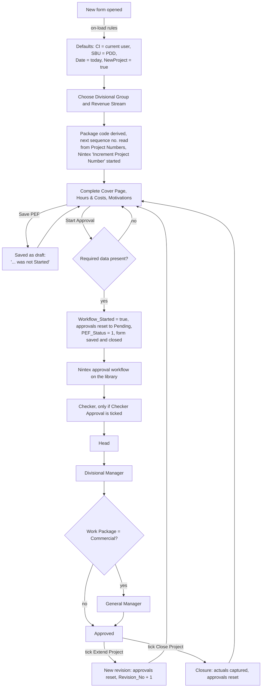

# `template.xsn`: Project Establishment Form (InfoPath)

This document analyses [`template.xsn`](../template.xsn), an InfoPath 2013 form template. I unpacked the `.xsn` (a Microsoft Cabinet archive) and read its form definition (`manifest.xsf`), schema, views, rules, data connections and resources.

Contents:

1. [Summary](#1-summary)
2. [Template facts](#2-template-facts)
3. [Package contents](#3-package-contents)
4. [Views and user interface](#4-views-and-user-interface)
5. [Roles and how they are resolved](#5-roles-and-how-they-are-resolved)
6. [Life cycle and approval flow](#6-life-cycle-and-approval-flow)
7. [Project numbering](#7-project-numbering)
8. [Cost and pricing model](#8-cost-and-pricing-model)
9. [Revisions (Extend) and Closure](#9-revisions-extend-and-closure)
10. [Main data source](#10-main-data-source)
11. [Data connections](#11-data-connections)
12. [Submit configuration](#12-submit-configuration)
13. [Promoted SharePoint columns](#13-promoted-sharepoint-columns)
14. [Validation rules](#14-validation-rules)
15. [Rules inventory](#15-rules-inventory)
16. [Findings: bugs, risks and clean-up](#16-findings-bugs-risks-and-clean-up)
17. [Platform and migration notes](#17-platform-and-migration-notes)
18. [Appendix: how to unpack and inspect](#18-appendix-how-to-unpack-and-inspect)

---

## 1. Summary

`template.xsn` is the **Project Establishment Form (PEF)**. Mintek divisions use it to:

- **motivate** a new project: identity, client, proposals and orders, staff hours, costs, pricing, milestones and deliverables;
- get it **approved** by an optional Checker, the Head, the Divisional Manager and, for commercial work, the General Manager;
- **extend** (revise) an approved project, keeping a revision history;
- **close** a project, comparing original, final and actual figures.

Filled-in forms are saved as XML files in the SharePoint form library **Project Establishment Forms** at `http://portal/Divisions/PDD/Projects/ProjectEstablishmentForms/`. The approval itself is run by a **Nintex Workflow** on that library. The form calls the Nintex web service to start the *Increment Project Number* workflow and to answer approval tasks.

All of the form's logic is declarative (no code):

| Item | Count |
|---|---|
| Views | 7 |
| Rule sets / rules | 138 / 274 |
| Field-change (event) rule bindings | 100 |
| Calculated or default-value fields | 41 |
| Validation conditions | 23 |
| Data connections | 20 (16 SharePoint list, 3 web service, 1 XML resource) |
| Promoted SharePoint columns | 76 |

The template declares managed code (Visual Basic), but no assembly is included in the package, so no custom code runs.

**How this relates to the other files in the repo:** [`Projects.txt`](../Projects.txt) is a SharePoint REST (`_api`) export of the field definitions of list `542fae9e-9f8b-470b-b60e-14e29b5142ac`. That is the same list ID as this form's *Project Establishment Forms* data connection, so `Projects.txt` describes the columns of the library this form saves into, including the promoted columns in [section 13](#13-promoted-sharepoint-columns).

---

## 2. Template facts

| Property | Value |
|---|---|
| Form ID (URN) | `urn:schemas-microsoft-com:office:infopath:Project-Establishment-Forms:-myXSD-2013-02-01T06-44-45` |
| Caption | Project Establishment Forms |
| Template version | `1.0.1.1668`. `upgrade.xsl` upgrades forms saved with versions up to `1.0.1.1666` |
| Designed with | InfoPath 2013 (`productVersion 15.0.0`, `solutionFormatVersion 15.0.0.0`) |
| Schema namespace | `http://schemas.microsoft.com/office/infopath/2003/myXSD/2013-02-01T06:44:45` (the form was first designed on 1 Feb 2013) |
| Root element | `my:myFields` |
| Published location | `http://portal/Divisions/PDD/Projects/ProjectEstablishmentForms/Forms/template.xsn` |
| Runtime | **InfoPath Filler (desktop) only**: `runtimeCompatibility="client"`, `browserEnable="no"` |
| Security level | `automatic` (domain trust) |
| Locale | `en-ZA` (LCID 7177) |
| Default view | Cover Page |
| Offline behaviour | Query results are cached; the form opens even if queries fail |
| Disabled UI | *Save*, *Export to Web* and the *Submit* menu item. Users save only through the form's buttons |
| After submit | Form closes; no status dialog |
| Last modified (CAB timestamps) | 4 May 2026 |

---

## 3. Package contents

The archive holds 127 files.

| Files | Purpose |
|---|---|
| `manifest.xsf` | Form definition: views, rules, data connections, validation, calculations, submit settings, promoted properties |
| `myschema.xsd` | Main data source schema (`my:myFields`) |
| `BuiltInActiveXControls.xsd` | Schema for the person picker (`pc:Person`) |
| `template.xml` | Blank form instance used for *New* |
| `sampledata.xml` | Sample data used in design mode |
| `view1.xsl`, `HoursAndCosts.xsl`, `Motivations.xsl`, `Closure.xsl`, `Revisions.xsl`, `PrintView.xsl`, `Debug.xsl` | The seven views (see [section 4](#4-views-and-user-interface)) |
| `upgrade.xsl` | Upgrades forms saved with older template versions |
| `<List name>N.xsd` (5 per SharePoint list connection) | Schemas for the SharePoint list data connections |
| `ProcessTaskResponse*`, `StartWorkflowOnListItem*`, `GetUserProfileByName*` (`.xsd`, `.xml`) | Schemas and sample requests for the web service connections |
| `New Line`, `New Line.xsd` | XML resource with CR/LF characters (unused, see findings) |
| `Template`, `Template1` … `Template9` | Leftover CAML `<Batch>` snippets for a *Project Numbers* list update. Not used by any connection |
| 10 × `*.png` | 10 identical copies of the Mintek logo (225×160 px) |

---

## 4. Views and user interface

| View | File | Purpose | Notable controls |
|---|---|---|---|
| **Cover Page** (default) | `view1.xsl` | Main form: project identity, numbering, client and proposals, people, pricing summary, milestones and billing plan, service SBUs, approval sections | 130 controls. Buttons: *Start Approval*, *Cancel Approval*, *Save PEF*, *Refresh PICs*, *Load Proposals*, navigation, and Approve/Reject for each approver |
| **Hours And Costs** | `HoursAndCosts.xsl` | Staff hours planning (grade, financial year, activity rate, hours, cost) and running/general costs (cost element, amount), plus contingency and warranty | Two repeating tables (*Add Staff*, *Add Running Costs*). Contingency and warranty can be entered as an amount or a percentage |
| **Motivations** | `Motivations.xsl` | Motivation history (revision no., date, text) and project file attachments | Repeating motivations and attachments, file attachment control |
| **Closure** | `Closure.xsl` | Closure motivation, then Original plan, Final plan and Actuals with the increases between them, plus deliverables achieved | 186 controls |
| **Revisions** | `Revisions.xsl` | Latest values against the original and the last 5 revisions | Repeating `Revision` section |
| **PrintView** | `PrintView.xsl` | Print layout, used as the print view of every other view (A4 portrait) | |
| **Detailed Information** | `Debug.xsl` | Troubleshooting view: workflow state, current user, task ID, outcome, each approver's username, position number and delegate, package code, flags | Read-only expression boxes |

Every view except PrintView and Detailed Information has buttons to move between Cover Page, Hours & Costs, Motivations, Closure and Revisions.

### Cover Page layout

Based on a screenshot of a live form. The header shows the Mintek logo, the title *Project Establishment Form*, the division name and the project number. Below it, a red banner shows `Workflow_State`.

| Area | Fields |
|---|---|
| Toolbar | *Start Approval*, *Cancel Approval*, *Save PEF* (left); *Hours & Costs*, *Motivations*, *Revisions* (right) |
| Identity | Divisional Group, Revenue Stream, Project Sequence No.; PICs (dropdown from the SHEQ *Project Information Charts* list) with *Refresh PICs* and a link to the selected PIC |
| Classification | Sales Group (Z01 Gold … Z15 Light Metals), Cost Centre No., Work Centre No., Work Package, Equipment |
| Flags (check boxes) | *Extend Project* (`Cover_Page/Extend`), *Close Project* (`Cover_Page/Closure`), *Checker Approval* (`group41/CheckerRequired`), *Automated Project No.* (`Div_Short_Code`), *Create Project Site* (`Required_Fields/Project_Size`: on = `Large`, off = `Small`) |
| Description | Project Site (link), Project Title, Project Description |
| People | Administration Officer, Responsible Person (CI), Applicant (Head) with Mintek numbers, Notification List (person picker; excludes Admin, SHEQ, Head and Manager) |
| Pricing summary | Client Price, Project Cost, Project Profit; Start Date, End Date; Project Profit %, Controlling SBU Profit %, Service SBU Profit % |
| Milestones & Billing Plan | Repeating rows: Milestone, Bill %, Bill Amount, Target Date (*Add Milestone*) |
| Controlling SBU Planned Costs | Labour / Machine, Carry Over Labour Costs, Running Cost (OPEX), Contingency, Warranty |
| Totals | *Service SBU Required* toggle; Controlling SBU Revenue and Costs, Total SBU Services Revenue and Costs, Total Project Revenue and Costs |
| Lower sections (below the screenshot) | Client name, site, order value and currency, order and proposal links, products; Service SBU costs and revenues; Checker; Head, Manager, General Manager and Checker approval sections with comments and Approve/Reject buttons |

---

## 5. Roles and how they are resolved

Most people fields are looked up in the **Master Contacts** list. The lookups use the position number, `Managers Position Number`, `Position Title` and `Role` columns.

| Role | Form field | How it is set |
|---|---|---|
| Current user | `Cover_Page/User` | On load: `"i:0#.w\|mntk\" + username`, lower-cased (SharePoint claims format, domain `mntk`) |
| Responsible Person (CI) | `Required_Fields/CI` (`@CI_UserName`, `@CI_PositionNo`) | On a new form, the current user's Master Contacts entry |
| Applicant (Head) | `Required_Fields/Head` (`@Head_UserName`, `@Head_PositionNo`, `@Head_Delegate`) | The CI's manager position. If the chosen person's title is not *Head* or *Executive Manager* and their role is not *Project Approver*, the form moves up to that person's manager |
| Divisional Manager | `Cover_Page/Divisional_Manager` (`@username`, `@Manager_PositionNo`, `@Manager_Delegate`) | The Master Contacts entry in the selected division whose Position Title contains *Manager* |
| General Manager | `GM_Approval_Section/General_Manager` (`@GM_username`, `@GM_PositionNo`, `@GM_Delegate`) | The Divisional Manager's manager |
| Administration Officer | `Required_Fields/Admin_Officer` | The contact in the SBU whose Role contains *SAP* |
| Checker (optional) | `group41/Checker` (`@CheckerAcc`, `@CheckerPositionNo`, `@CheckerDelegate`) | Chosen by the user when *Checker Approval* is ticked. Cannot be the Head or the Manager (a dialog rejects that choice). If no Head is set yet, the Checker's manager becomes Head; if the Checker is a Head, they are moved into the Head field |
| Service SBU Head / CI | `SBUs/SBU_Services/SBU_Head`, `SBU_CI` | From *SBU Contacts* for the selected service division |
| Delegates | `@…_Delegate` attributes | From **Master Calendar**: an entry for the approver's position number whose `EventDate ≤ now ≤ EndDate` names a delegate |

---

## 6. Life cycle and approval flow



> The order of approvers is **inferred** from when each approval section becomes visible. The authoritative sequence is defined in the Nintex workflow, which is not part of this template.
>
> | Section | Shown when |
> |---|---|
> | Checker | `Initial_Approval_Process` is true and *Checker Approval* is ticked |
> | Head | The form has been submitted |
> | Manager | The Head's approval is no longer `Pending` |
> | General Manager | The Manager's approval is no longer `Pending` **and** Work Package = `Commercial` |
>
> Every section is hidden on a closure once the Manager has approved.

### Buttons

| Button (view) | Rule set | What it does |
|---|---|---|
| **Start Approval** (Cover Page) | `ruleSet_95` | Sets `Submitted = true`. If Start Date, End Date, Project Cost, Client Price, PIC Number, Sales Group and Motivation are filled, sets `Workflow_Started = true`. That triggers `ruleSet_275`: `Initial_Approval_Process = true`, `PEF_Status = 1`, Head/Manager/GM approvals = `Pending`, approval dates and *approved by* cleared, `GM_Approved_By = "Not Required"`. It then sets `Workflow_State` to *"Approval for a New Project / Project Extension / Project Closure Motivation has Started"*, re-checks a new project number against the library, **submits** and closes. Validation errors (section 14) block the submit |
| **Save PEF** (Cover Page) | `ruleSet_258` | Sets a *"… was not Started"* / *"was not Submitted"* / *"must be re-approved"* state, re-checks a new project number, clears `OrdersURL`, **submits** and closes |
| **Cancel Approval** (Cover Page) | `ruleSet_285` | Sets `Cancel_Approval_WF = true`, submits and closes. The workflow is expected to react to this promoted column |
| **Approve / Reject**: Manager, Head, GM, Checker | `ruleSet_305`–`312` | Calls Nintex `ProcessTaskResponse3` on list *Workflow Tasks* with the `TaskID` found on load, outcome `Approved` or `Rejected`, and the approver's comments. Then submits and closes |
| **Refresh PICs** (Cover Page) | `ruleSet_243` | Re-queries the SHEQ PIC list and tries to find the Manager's pending PIC approval task |
| **Load Proposals** (Cover Page) | `ruleSet_324` | Queries the Proposals list filtered by division |
| **Hours & Costs** (Cover Page) | `ruleSet_223` | Switches view. If the user is the CI, it also re-queries activity rates for the division |
| Other navigation buttons | `ruleSet_224`–`242`, `250` | Switch view |

### How an approver's task is found

On load, if `Workflow_State` starts with `"Waiting"`, the form queries *Workflow Tasks* for `Pending` items. It takes the task whose `WorkflowLink` contains the project number and whose `AssignedTo` is the current user, and stores its ID in `TaskID` (outcome in `Outcome`). The Approve/Reject buttons send that ID to Nintex.

### `Workflow_State` values written by the form

- `New Project Motivation was not Submitted`
- `Approval for a New Project Motivation was not Started`
- `Approval for a Project Extension Motivation was not Started`
- `Approval for a Project Closure Motivation was not Started`
- `Approval Status: Pending, this motivation must be re-approved`
- `Approval for a New Project Motivation has Started`
- `Approval for a Project Extension Motivation has Started`
- `Approval for a Project Closure Motivation has Started`

The form expects the workflow to write states that start with `Waiting…`.

`PEF_Status` is set to `0` on reset and `1` when submitted for approval. Other values are presumably set by the workflow. `5` appears only in an unused rule set.

---

## 7. Project numbering

**Project No. = `Package_Code` + `-` + `Sequence No.`** (for example `ADE-52705`), when *Automated Project No.* (`Div_Short_Code`) is ticked. When it is not ticked, the manually entered Sequence No. becomes the Project No. and *Create Project Site* is set to `Small`.

**Package code** = first two letters of the division's *SBU Short* code (from the ActivityRates / *Cost Centers* list) plus a revenue-stream letter:

| Revenue Stream | Letter | Other defaults |
|---|---|---|
| State Grant | `R` | Service profit 10%, contingency fee 0, Location `RSA`, Risks `None`. Active *Work Packages* are loaded and a Work Package is required |
| Contract Research | `E` | Service profit 10%, contingency fee 0, Location `RSA`, Risks `None`, Work Package cleared |
| Contract Work | `W` | |
| Cash | `C` | Work Package = `Commercial`, service profit 20% |
| Products and Services | `C` | Work Package = `Commercial`, service profit 20% |

**Sequence number:**

1. When the package code changes on a new project, the form reads `Latest Project No.` for that package code and divisional group from the **Project Numbers** list.
2. When the sequence number is assigned, the form calls Nintex `StartWorkflowOnListItem` to run the **Increment Project Number** workflow on that Project Numbers item.
3. On *Start Approval* or *Save PEF*, the form queries the library for an existing form with the same project number. If it finds one, it re-reads the sequence number (automatic numbering) or clears the number and shows *"Project Number Exists already on the system, please use another number."* (manual numbering).

**Project site link:** for *Large* projects (*Create Project Site* ticked) the link is `http://portal/Divisions/<Division_Code>/Projects/<ResearchProjects|CommercialProjects>/FY<yyyy>Projects/<Project No>`. The financial year starts in April: dates from January to March use that calendar year, April to December use the next year.

---

## 8. Cost and pricing model

All amounts are in Rand. `Nz()` treats empty values as 0.

| Quantity | Formula |
|---|---|
| Staff line cost | `Activity_Rate × Hours`. The rate comes from *Cost Centers* (ActivityRates) by grade, cost centre, work centre, financial year and division |
| **Labour** | `Σ Activity_Costs` |
| **OPEX** (running costs) | `Σ Running_Costs/New_Costs/costs` |
| SBU project costs | `OPEX + Labour + Carry_Over_Labour_Costs` |
| **Contingency** | `SBU project costs × Contingency_Fee`, or entered as an amount (the % is then calculated back) |
| **Warranty** | `SBU project costs × Warranty_Provision`, or entered as an amount (the % is then calculated back) |
| **Controlling SBU Costs** (`Cover_Page/SBU_Costs`) | `SBU project costs + Contingency + Warranty` |
| Service SBU revenue (per SBU) | `SBU_Cost × (1 + Service_Profit)` |
| Total SBU Services Costs / Revenue | `Σ SBU_Cost` / `Σ SBU_Actual_Revenue` |
| **Project Cost** | `Controlling SBU Costs + Total SBU Services Costs` |
| **Client Price** | Non-commercial: `Project Cost × 1.1` (hard-coded 10%; the research rule uses `Service_Profit`, which is also 0.1). Commercial: entered by the user |
| **Project Profit** | `Client Price − Project Cost` |
| **Project Profit %** | `Client Price ÷ Project Cost − 1` |
| Controlling SBU Revenue | `Client Price − Total SBU Services Revenue` |
| Controlling SBU Profit % | `Controlling SBU Revenue ÷ Controlling SBU Costs − 1` |

Example from the screenshot (Contract Research, OPEX only): Project Cost R 27 272,73 × 1.1 = Client Price R 30 000,00, so Profit is R 2 727,27 (10%).

**Orders and proposals:** selecting proposals fills in the site name, proposal IDs and numbers, and links (`http://portal/Divisions/Proposals/<title>`). Selecting orders fills in the client name, currency, exchange rate and order value (sum of `Order Value(R)` for the selected orders that are linked to the selected proposal), and order links (`http://portal/Divisions/Orders/<title>`).

---

## 9. Revisions (Extend) and Closure

**Extend Project** (`ruleSet_135`):

1. Resets the Head, Manager and GM approvals to `Pending` and clears their dates, comments and *approved by* fields.
2. Sets `PEF_Status = 0`, `Initial_Approval_Process = false`, `Workflow_Started = false`, `Revision_No += 1` and `New_Revision = true`.
3. When `Revision_No` becomes 1, the current figures and deliverables are copied to `Original_Values` and `Original_Deliverable_*`.
4. On load after the Manager approves (`Revision_No > 0`, Manager = `Approved`, `New_Revision = true`), the current figures are copied into `Revisions_Group/Revision[Revision_No]`, the latest motivation's date is set to the approval date, and *Extend* is unticked.
5. Only the last 5 revisions are shown (`Rev_Show`).

**Close Project** (`ruleSet_185`):

1. If the project was never revised, the current values are copied to `Original_Values`.
2. If the Manager had approved, all approvals are reset to `Pending` and their dates, comments and *approved by* fields are cleared. `Initial_Approval_Process` and `Workflow_Started` are set to false.
3. *Extend* is unticked.
4. The Closure view then requires the actual client price, project costs, labour, exchange rate and start/end dates, plus a closure description. It calculates the increase of the actuals over both the original and the final plan for each figure.

---

## 10. Main data source

Root `my:myFields`. The main groups are:

| Group | Contents |
|---|---|
| `Required_Fields` | Divisions, Sequence No., Project No., Project Title, Revenue Stream, Head, CI, Start/End Date, Project Costs, Client Price, Project Size, PIC Number, Project Type, Location, Risks, Admin Officer, NewFY, Project Group |
| `Cover_Page` | Description, Sales Group, Products, Work Package, client/site/order value/currency, SBU costs and revenues, Divisional Manager, Extend/Closure flags, Package Code, PIC links, Date, PEF Status, User, Division Code, Major Product, Project Site Link |
| `Hourly_Planning/New_Staff` (repeating) | Staff (grade), Financial Year, Activity Type, Rate, Hours, Activity Costs, Comments |
| `Running_Costs/New_Costs` (repeating) | Cost element (`cc`/`ce`), description, cost |
| `SBUs/SBU_Services` (repeating) | Service division, SBU Head/CI, cost, revenue, delivery date, description, approval, nested `Services` lines |
| `Milestones/New_Milestone` (repeating) | Description, Bill %, Bill Amount, Date |
| `Proposals`, `Orders` | Selected proposals and orders, IDs, counts, link lists |
| `Deliverables` | Deliverable 1–15 with Original, Achieved and Check variants |
| `Motivations/group32` (repeating) | Revision no., date, motivation (rich text) |
| `group34/…/group36` (repeating) | File attachments |
| `Revisions_Group/Revision` (repeating) | Snapshot of the figures, dates, type, location, risks and deliverables for each revision |
| `Original_Values`, `Final_Values`, `Actual_Values` | Closure comparison sets, with `*_Incr` (increase) fields |
| `Head_Approval_Section`, `Manager_Approval_Section`, `GM_Approval_Section`, `group41`/`group42` (Checker) | Approval status, dates, comments, approver identity |
| `Notifiers/Person` (repeating) | Notification list (person picker) |
| Root-level fields | Workflow and state flags: `Submitted`, `Workflow_Started`, `Initial_Approval_Process`, `Workflow_State`, `TaskID`, `Outcome`, `NewProject`, `Revision_No.`, `SavedRevision`, `New_Revision`, `Cancel_Approval_WF`, and the cost totals (`Labour`, `OPEX`, `Contingency`, `Warranty`, `Profit`, `ProfitPerc`, `Service_Profit`, `SBU_Profit`, …) |

---

## 11. Data connections

Relative URLs are resolved against the published template location `http://portal/Divisions/PDD/Projects/ProjectEstablishmentForms/Forms/template.xsn`.

| Connection | Type | Resolves to | Load on open | Used for |
|---|---|---|---|---|
| Cost Centers | SharePoint list | `http://portal/Divisions/Lists/ActivityRates/` | No | Cost/work centre, SBU short code (package code), activity type and rates by grade and FY |
| Work Packages | SharePoint list | `http://portal/Lists/ResearchWorkPackages/` | No | Active research work packages (State Grant) |
| Project Cost Elements | SharePoint list | `http://portal/Divisions/Lists/ProjectCostElements/` | **Yes** | Running cost elements |
| PICs | SharePoint list | `http://sheq/Processes/ProjectInformationCharts` | No | PIC dropdown (PICs not yet linked to a project); submitted PICs pending approval; PIC approval status |
| PICs2 | SharePoint list | `http://sheq/Processes/ProjectInformationCharts` (same list) | **Yes** | PIC dropdown filtering (PICs without an actual start date) |
| Orders | SharePoint list | `http://portal/Divisions/Orders/` | No | Client orders, value, currency, exchange rate |
| Proposals | SharePoint list | `http://portal/Divisions/Proposals/` | No | Proposals, site, proposal number |
| Master Contacts | SharePoint list | `http://portal/Divisions/Lists/MasterContacts/` | No | People, positions, managers, roles (main directory) |
| SBU Contacts | SharePoint list | same list as Master Contacts | No | Service SBU Heads and CIs |
| Master Data | SharePoint list | same list as Master Contacts | **Yes** | Dropdowns in the views |
| Products & Services | SharePoint list | `http://portal/Divisions/Lists/ProductsAndServices/` | **Yes** | Products multi-select, Major Product |
| Master Calendar | SharePoint list | `http://portal/Divisions/Lists/MasterCalendar/` | **Yes** | Delegates (out-of-office) |
| Project Establishment Forms | SharePoint library | `http://portal/Divisions/PDD/Projects/ProjectEstablishmentForms/` | No | Duplicate project number check, created date |
| Divisions Short Codes | SharePoint list | `http://portal/Divisions/Lists/DivisionsShortCodes/` | **Yes** | **Not referenced anywhere** |
| Workflow Tasks | SharePoint list | `http://portal/Divisions/PDD/Projects/Lists/Workflow%20Tasks/` | No | Finding the current user's pending task |
| Project Numbers | SharePoint list | `http://portal/Divisions/PDD/Projects/Lists/ProjectNumbers/` | **Yes** | Latest sequence number per package code |
| StartWorkflowOnListItem | Web service (Nintex) | `…/PDD/Projects/_vti_bin/nintexworkflow/workflow.asmx` | No | Starts *Increment Project Number* |
| ProcessTaskResponse3 | Web service (Nintex) | `…/PDD/Projects/_vti_bin/nintexworkflow/workflow.asmx` | No | Approve or reject workflow tasks |
| GetUserProfileByName | Web service (SharePoint) | `http://portal/Divisions/_vti_bin/UserProfileService.asmx` | **Yes** | **Not referenced anywhere** |
| New Line | XML file (in package) | `x-soln:///New Line` | **Yes** | **Not referenced anywhere** |

All SharePoint list connections are read-only (`submitAllowed="no"`). The form saves only through the library submit described next.

---

## 12. Submit configuration

| Setting | Value |
|---|---|
| Connection | `Submit Form` (WebDAV / library submit) |
| Folder | `../`, i.e. the root of the *Project Establishment Forms* library |
| File name | `translate(Required_Fields/Project_No., lower, UPPER)`: the project number in upper case (e.g. `ADE-52705.xml`) |
| Overwrite existing | **Yes** |
| Submit menu item | Disabled. Only the buttons submit |
| After submit | Close the form |
| Error message | "The form cannot be submitted because of an error." |

---

## 13. Promoted SharePoint columns

76 fields are promoted to library columns. "Editable in SharePoint" means the column is promoted read/write, so a change to the list item (for example by a workflow, *Edit Properties* or Quick Edit) is written back into the form XML. This is presumably how the Nintex workflow updates approval fields and `Workflow_State`.

| # | Column | Form field (XPath under `my:myFields`) | Type | Editable in SharePoint |
|---|---|---|---|---|
| 1 | Project Title | `Required_Fields/Project_Title` | string | No |
| 2 | Project Costs | `Required_Fields/Project_Costs` | double | Yes |
| 3 | CI | `Required_Fields/CI/@CI_UserName` | string | Yes |
| 4 | Head Approval Date | `Head_Approval_Section/Head_Approval_Date` | string | Yes |
| 5 | Divisional Manager | `Cover_Page/Divisional_Manager/@username` | string | Yes |
| 6 | SBU Division | `SBUs/SBU_Services/SBU_Division` | string (merge) | No |
| 7 | Project Size | `Required_Fields/Project_Size` | string | Yes |
| 8 | Manager Comments | `Manager_Approval_Section/Manager_Comments` | string | No |
| 9 | Manager Approval | `Manager_Approval_Section/Manager_Approval` | string | Yes |
| 10 | Head Comments | `Head_Approval_Section/Head_Comments` | string | No |
| 11 | Head Approval | `Required_Fields/Head/@Head_Approval` | string | Yes |
| 12 | PIC Number | `Required_Fields/PIC_Number` | string | Yes |
| 13 | Proposal No | `Proposals/Proposal_Number` | string | No |
| 14 | Divisions | `Required_Fields/Divisions` | string | Yes |
| 15 | SBU Head | `SBUs/SBU_Services/SBU_Head/@SBU_Head_UserName` | string (merge) | No |
| 16 | SBU CI | `SBUs/SBU_Services/SBU_CI/@SBU_CI_UserName` | string (merge) | No |
| 17 | Manager Approval Date | `Manager_Approval_Section/Manager_Approval_Date` | string | Yes |
| 18 | PEF Status | `Cover_Page/PEF_Status` | string | Yes |
| 19 | Original Project Costs | `Original_Values/Original_Project_Costs` | double | Yes |
| 20 | Original End Date | `Original_Values/Original_EndDate` | string | Yes |
| 21 | Notify | `Notifiers/Person/AccountId` | string (merge) | No |
| 22 | Proposal Title | `Proposals/Proposal_Title` | string | Yes |
| 23 | Revision No | `Revision_No.` | integer | Yes |
| 24 | Work Package | `Cover_Page/Work_Package` | string | Yes |
| 25 | Extend | `Cover_Page/Extend` | boolean | Yes |
| 26 | Closure | `Cover_Page/Closure` | boolean | No |
| 27 | Client Price | `Required_Fields/Client_Price` | double | Yes |
| 28 | Project Number | `Required_Fields/Project_No.` | string | Yes |
| 29 | PIC Unique No | `Cover_Page/PIC_Unique_Number` | string | Yes |
| 30 | Head | `Required_Fields/Head/@Head_UserName` | string | Yes |
| 31 | Admin Officer | `Required_Fields/Admin_Officer/@Admin_UserName` | string | Yes |
| 32 | Revenue Stream | `Required_Fields/Revenue_Stream` | string | Yes |
| 33 | Profit % | `ProfitPerc` | double | Yes |
| 34 | GM Approval Date | `GM_Approval_Section/GM_Approval_Date` | string | Yes |
| 35 | GM Approval | `GM_Approval_Section/GM_Approval` | string | Yes |
| 36 | General Manager | `GM_Approval_Section/General_Manager/@GM_username` | string | Yes |
| 37 | SBU Name | `Required_Fields/CI/@SBU_Name` | string | No |
| 38 | Proposal URL | `Cover_Page/ProposalURL` | anyURI | No |
| 39 | PICURL | `Cover_Page/PICURL` | anyURI | No |
| 40 | Original Start Date | `Original_Values/Original_StartDate` | string | Yes |
| 41 | Site Name | `Cover_Page/Site_Name` | string | Yes |
| 42 | Customer | `Cover_Page/Customer` | string | Yes |
| 43 | Client Name | `Cover_Page/Client_Name` | string | Yes |
| 44 | Manager Approved By | `Cover_Page/Divisional_Manager/@Manager_Approved_By` | string | Yes |
| 45 | GM Approved By | `GM_Approval_Section/GM_Approved_By` | string | Yes |
| 46 | Head Approved By | `Required_Fields/Head_Approved_By` | string | Yes |
| 47 | Submitted | `Submitted` | boolean | Yes |
| 48 | Proposal | `Proposal` | string | Yes |
| 49 | Initial Approval Process | `Initial_Approval_Process` | boolean | Yes |
| 50 | On Change | `OnChange` | boolean | Yes |
| 51 | SBU On Change | `SBUs/SBU_Services/SBU_OnChange` | string (merge) | No |
| 52 | Saved Revision | `SavedRevision` | integer | No |
| 53 | New Revision | `New_Revision` | boolean | Yes |
| 54 | Days Completed | `Final_Values/Final_EndDate_Incr` | integer | No |
| 55 | Original Profit % | `Original_Values/Original_ProfitPerc` | double | No |
| 56 | Final Project Costs | `Final_Values/Final_Project_Costs` | double | No |
| 57 | Final Profit % | `Final_Values/Final_ProfitPerc` | double | No |
| 58 | Actual Project Costs | `Actual_Values/Actual_Project_Costs` | double | No |
| 59 | End Date | `Required_Fields/End_Date` | date | No |
| 60 | Actual Profit | `Actual_Values/Actual_Profit` | double | No |
| 61 | Actual Client Price | `Actual_Values/Actual_Client_Price` | double | No |
| 62 | Original Labour Costs | `Original_Values/Original_Labour` | double | No |
| 63 | Labour Costs | `Labour` | double | No |
| 64 | Workflow Started | `Workflow_Started` | boolean | Yes |
| 65 | Major Product | `Cover_Page/Major_Product` | string | No |
| 66 | Start Date | `Required_Fields/Start_Date` | date | No |
| 67 | Sequencel No | `Required_Fields/Sequencel_No.` | string | Yes |
| 68 | Workflow State | `Workflow_State` | string | Yes |
| 69 | Checker Required | `group41/CheckerRequired` | boolean | Yes |
| 70 | Checker | `group41/Checker/@CheckerAcc` | string | Yes |
| 71 | Cancel Approval | `Cancel_Approval_WF` | boolean | Yes |
| 72 | Order | `Order` | string | Yes |
| 73 | Orders IDs | `Orders/Orders_IDs` | string | No |
| 74 | Latest Motivation | `Motivations/Latest_Motivation` | string | Yes |
| 75 | SiteUrl | `Cover_Page/Project_Site_Link` | anyURI | No |
| 76 | SBU Position No | `SBUs/SBU_Services/SBU_Head/@SBU_PositionNo` | string (merge) | No |

`(merge)` means the values of a repeating field are merged into one column.

---

## 14. Validation rules

Most rules apply only after *Start Approval* (`Submitted = true`) or when *Close Project* is ticked. Messages are quoted as they appear in the template, typos included.

| # | Field | Error when | Message |
|---|---|---|---|
| 1 | Start Date | submitted and empty | Start Date is Required |
| 2 | End Date | submitted and empty | End Date is Required |
| 3 | Sales Group | submitted and empty | Sales Group is Required |
| 4 | Project Costs | submitted and empty or 0 | *(short message: project costs are required)* |
| 5 | Client Price | submitted and empty or 0 | Client Price is Required |
| 6 | Work Package | submitted, empty and Revenue Stream = State Grant | Work Package Code is Required |
| 7 | Latest motivation | submitted and empty | Motivation is Required (Motivations Page) |
| 8 | Staff (grade) | submitted and empty | Select at least 1 person who should be involved in the project (Hour & Costs Page) |
| 9 | Staff Financial Year | submitted and empty | Select the financial year for to retgrive the activity rates for the grade (Hour & Costs Page) |
| 10 | Staff Hours | grade chosen and hours empty | Specify the number of hours allocated to the grade (Hour & Costs Page) |
| 11 | Staff Comments | grade chosen and comments empty | Specify what will be done by the grade (Hour & Costs Page) |
| 12 | Running cost amount | cost element chosen and amount empty | *(short: enter amount)* |
| 13 | Running cost description | cost element chosen and description empty | *(short: enter description)* |
| 14 | Project Site Link | empty and Project Size = Large | *(short: link)* |
| 15 | Checker | Checker Approval ticked and empty | *(short: enter checker)* |
| 16 | SBU Head | service division chosen and empty | *(short: enter head)* |
| 17 | Closure Description | closing and empty | Explain the Time & Costs , Deliverables not achieved |
| 18 | Actual Start Date | closing and empty | Enter Actual Start Date |
| 19 | Actual End Date | closing and empty | Enter Actual End Date |
| 20 | Actual Client Price | closing and empty | Enter Actual Client Price in the Closure Page |
| 21 | Actual Project Costs | closing and empty | Enter Actual Project Costs in the Closure Page |
| 22 | Actual Labour | closing and empty | Enter Actual Labour Costs in the Closure Page |
| 23 | Actual Exchange Rate | closing and empty or 0 | Enter Actual Exhange Rate in the Closure Page |

Dialog messages used by rules:

- "Project Sequence Numner exists Already, Please enter a unique number."
- "Project Number Exists already on the system, please use another number."
- "Checker cannot be Head or Manager, please select someone else to check this project."
- "De-select all proposals and re-select again to show the correct URLs."

---

## 15. Rules inventory

**Form load (`ruleSet_57`, 32 rules)**, in order:

1. Identify the current user (claims account) and clear `TaskID`.
2. Migrate forms that still hold old-style (non-claims) account names: re-resolve the SBU, CI, Head, Manager, GM and PIC URL.
3. Query Master Contacts for the division (existing forms).
4. Load active Work Packages for State Grant projects opened by the CI.
5. Load SBU Contacts when service SBUs exist and the CI, Head or Head delegate opens the form.
6. Resolve delegates for the Head, Manager, GM and Checker from the Master Calendar.
7. Resolve the Checker's position number.
8. Find the pending workflow task for the current user (when the state starts with `Waiting`).
9. New form: default SBU and Division Code to `PDD`, CI = current user, `NewProject = true`, Date = today.
10. Fill in the created date from the library; default service profit to 10%.
11. After a Manager-approved revision: snapshot the figures into `Revisions_Group`.
12. Calculate `NewFY` (financial year folder for the project site).
13. Show only the last 5 revisions.
14. Set the products and proposals labels.
15. Rewrite legacy `infoportal` URLs (site, orders, proposals) to `http://portal/...`.
16. Load Cost Centers for existing projects; set the latest motivation; set Work Package = `Commercial` for Cash and Products & Services.
17. Build the research or commercial project site link (the commercial variant is **disabled**).

**Field-change rules (100 bindings)**, grouped by purpose:

| Purpose | Triggered by |
|---|---|
| Division → manager position, cost/work centre, PIC query, Admin Officer, Manager, GM, package code | `Required_Fields/Divisions` |
| Revenue stream → package code, defaults, work packages | `Required_Fields/Revenue_Stream` |
| Numbering | `Cover_Page/Package_Code`, `Required_Fields/Sequencel_No.`, `Div_Short_Code`, `Temp_ProjectNo`, `Required_Fields/Project_No.`, `Required_Fields/Project_Size` |
| People | `Required_Fields/CI`, `Required_Fields/Head`, `@Head_PositionNo`, `group41/Checker`, `@CheckerPositionNo`, `SBUs/…/SBU_Head`, `SBUs/…/SBU_CI`, `Required_Fields/Admin_Officer`, `@Manager_PositionNo`, `@GM_PositionNo` |
| Costing | `Hours`, `Staff`, `Financial_Year`, `Activity_Rate`, `cc`, `costs`, `OPEX`, `Labour`, `SBU_Project_Costs`, `Contingency`, `Contingency_Fee`, `Warranty`, `Warranty_Provision`, `Cover_Page/SBU_Costs`, `Required_Fields/Project_Costs`, `Required_Fields/Client_Price`, `SBU_Cost`, `SBU_Revenue`, `Service_Profit`, `Total_Service_SBU_Costs`, `Total_Services_Revenue`, `Controlling_SBU_Revenue`, `Carry_Over_Labour_Costs` |
| Proposals and orders | `Proposals/Proposal_No.`, `Proposal_Title`, `Proposal_ID`, `Count_Proposals`, `Orders/Order_No.`, `Count_Orders`, `OrdersList`, `ProposalsList`, URLs |
| Life cycle | `Submitted`, `Workflow_Started`, `Cover_Page/Extend`, `Cover_Page/Closure`, `Revision_No.` |
| Closure maths | `Actual_Values/*`, `Original_Values/*_Incr`, `Final_Values/*` |
| Display helpers | `ProfitPerc`, `SBU_Profit`, `MileStone_BillPerc` (append `%`), products and proposals show/hide toggles |

**Calculated fields (41):** sums (`Labour`, `OPEX`, SBU totals, service totals), concatenated proposal and order IDs and numbers (using `xdMath:Eval`), revision labels (`"Revision n"`), motivation numbering and date, and constants used as defaults (`Service_Profit = 0.1`, `Exchange_Rate = 1`, `Revision_No. = 0`, `PEF_Status = 0`, `GM_Approved_By = "Not Required"`, …).

---

## 16. Findings: bugs, risks and clean-up

Ranked by impact. Each finding names the rule or setting involved so it can be checked in InfoPath Designer.

### Likely bugs

1. **Research projects get a *CommercialProjects* site link.** In `ruleSet_255` (on `Project_No.` change), the condition of *Commercial Projects Site Link* ends with `… or . != ""`. That makes it true for **any** project with a number, and because it runs after the *Research* rule it overwrites the research link. The screenshot confirms this: a **Contract Research** project (`ADE-…`) shows `…/Projects/CommercialProjects/…`. The same rule in the on-load rule set is **disabled**, which suggests the problem was noticed there but not here. **Fix:** remove `or . != ""` and add the brackets the condition was meant to have.
2. **The Checker's Approve/Reject sends the General Manager's comments.** `ruleSet_311`/`312` (Checker section `group42`) pass `../GM_Approval_Section/GM_Approval_Comments` to Nintex instead of `group41/CheckerComments`. Checker comments never reach the workflow task.
3. **A data connection that does not exist.** *Refresh PICs* (`ruleSet_243`) reads from `GetDOM("Workflow Tasks PIC")`, but there is no connection with that name. `PIC_TaskID` therefore stays empty.
4. **Refresh PICs does not refresh *PICs*.** `ruleSet_243` queries `PICs2`, then sets the `PICs` query fields (`Submitted`, `Division0`) but never runs the `PICs` query. The PIC approval status it then reads from `PICs` can be stale.
5. **Rule condition that can never be true.** `ruleSet_1`, rule *Commecrial*: `Revenue_Stream = "Cash" and Revenue_Stream = "Products and Services"`. The package code `…C` is therefore never recalculated when the **division** changes on a commercial project (changing the revenue stream still works through `ruleSet_207`). `ruleSet_1` also has no branch for *Contract Work* (`W`).

### Risks

6. **Duplicate project numbers, and possibly an overwritten form.** *Project Numbers* is loaded only once, when the form opens. If two people start new projects at the same time they can both read the same `Latest Project No.`. The duplicate check on save re-reads the sequence from that same stale data, so it can produce the same number again. The submit uses the project number as the file name with **overwrite allowed**, so the second save could replace the first project's form. **Mitigation:** re-query *Project Numbers* before re-deriving the number, block the submit when `Temp_ProjectNo` is still set, or turn off *overwrite* for new projects.
7. **Project numbers are used up without being saved.** *Increment Project Number* starts as soon as a sequence number is assigned (`ruleSet_5`), not when the form is saved. Changing Divisional Group or Revenue Stream back and forth, or closing without saving, skips numbers.
8. **The form save can overwrite the workflow's updates.** The Approve and Reject buttons answer the Nintex task first and then submit the whole form. If the workflow writes back to the item (for example `Workflow_State` or approval columns) between those two steps, the form save can overwrite it.
9. **Approval fields can be edited outside the form.** `Manager Approval`, `Head Approval`, `GM Approval`, `Workflow State`, `Submitted`, `Workflow Started`, `Cancel Approval` and others are promoted **read/write**. Anyone with *Contribute* rights on the library can change them through *Edit Properties* or Quick Edit, and the change is written into the XML. Button visibility is evaluated on the client only. Real authorisation depends on Nintex task permissions.
10. **Weaker gate for Start Approval.** `ruleSet_95` sets `Workflow_Started` with a shorter list of required fields than `ruleSet_276` (it omits Project Type, Location, Risks and staff lines). Validation rules 8–11 still block the submit for missing staff data, but Project Type, Location and Risks are not enforced.

### Performance and clean-up

11. **Connections loaded on open that nothing uses:** `GetUserProfileByName` (a web service call every time the form opens), `Divisions Short Codes` and `New Line`. Remove them, or set them not to load on open.
12. **The whole Master Calendar loads on open** (`initOnLoad`) and is re-queried later with a division filter. Turn off load-on-open.
13. **Three connections to the same list** (*Master Contacts*, *SBU Contacts* and *Master Data* all point to MasterContacts `{3CE180F4-…}`), plus two to the same PIC list (*PICs*, *PICs2*).
14. **Rule sets that nothing calls:** `ruleSet_85`, `ruleSet_86` (view switches), `ruleSet_211` and `ruleSet_213` (an older direct *Approved*/*Rejected* path that bypasses Nintex).
15. **Unused package resources:** `Template` … `Template9` (CAML batch snippets) and 9 duplicate copies of the logo PNG (about 80 KB).
16. **Managed code is declared but empty** (`xsf2:managedCode language="VisualBasic"` with no assembly).
17. **Hard-coded environment values:**
    - claims prefix `i:0#.w|mntk\`;
    - hosts `http://portal/…` and `http://sheq/Processes/…`;
    - default SBU and Division Code `PDD`;
    - default client name `Mintek` for non-commercial work;
    - 10% markup;
    - printer `MTNKPRN069`.

    The screenshot comes from an AMD-division form, so the template is probably copied per division with these values changed. Any server, domain or division change requires republishing every copy.
18. **Typos in user-facing text:** "Exhange", "retgrive", "Numner", and rule names "Commecrial", "Reserch", "Seleceted".

---

## 17. Platform and migration notes

- The template is **not browser-enabled**. Users need the **InfoPath Filler 2013** desktop client.
- Microsoft's support for the InfoPath 2013 client (and InfoPath Forms Services in SharePoint Online) **ended on 14 July 2026** ([MC616550](https://mc.merill.net/message/MC616550)).
- Microsoft's suggested replacements are Power Apps (form), Power Automate (approvals) and SharePoint lists. A migration would carry over:
  - the data model ([section 10](#10-main-data-source));
  - the 76 library columns ([section 13](#13-promoted-sharepoint-columns));
  - the numbering logic ([section 7](#7-project-numbering));
  - the cost model ([section 8](#8-cost-and-pricing-model));
  - the approver resolution and delegation rules ([section 5](#5-roles-and-how-they-are-resolved));
  - the Nintex approval workflow, which has to be analysed separately.

  Fixing the findings in [section 16](#16-findings-bugs-risks-and-clean-up) during the migration avoids carrying them over.

---

## 18. Appendix: how to unpack and inspect

```bash
# An .xsn file is a Microsoft Cabinet archive
mkdir -p /tmp/xsn && cabextract -q -d /tmp/xsn template.xsn

# Form definition (views, rules, data connections, validation, submit)
less /tmp/xsn/manifest.xsf

# Blank instance, which shows the main data source structure
less /tmp/xsn/template.xml
```

To edit the template, open `manifest.xsf` from the extracted folder in InfoPath Designer 2013 (*Design*), or open the `.xsn` directly. Republish it to the form library afterwards.
