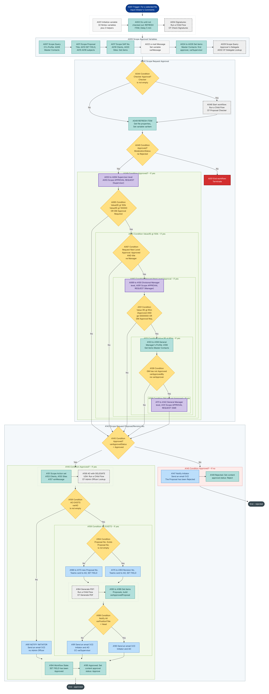
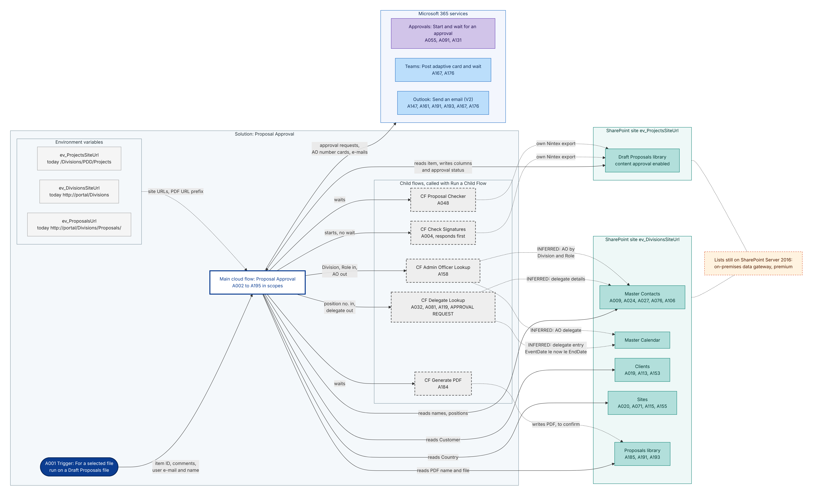
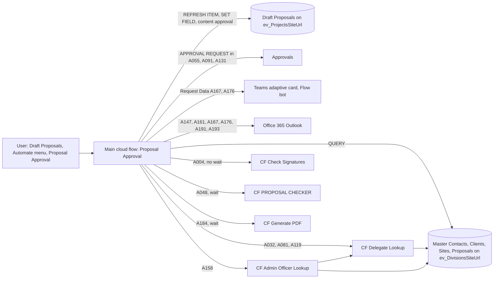
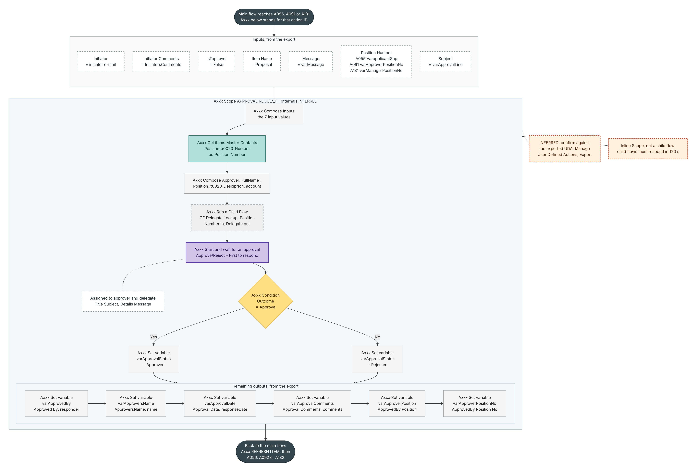
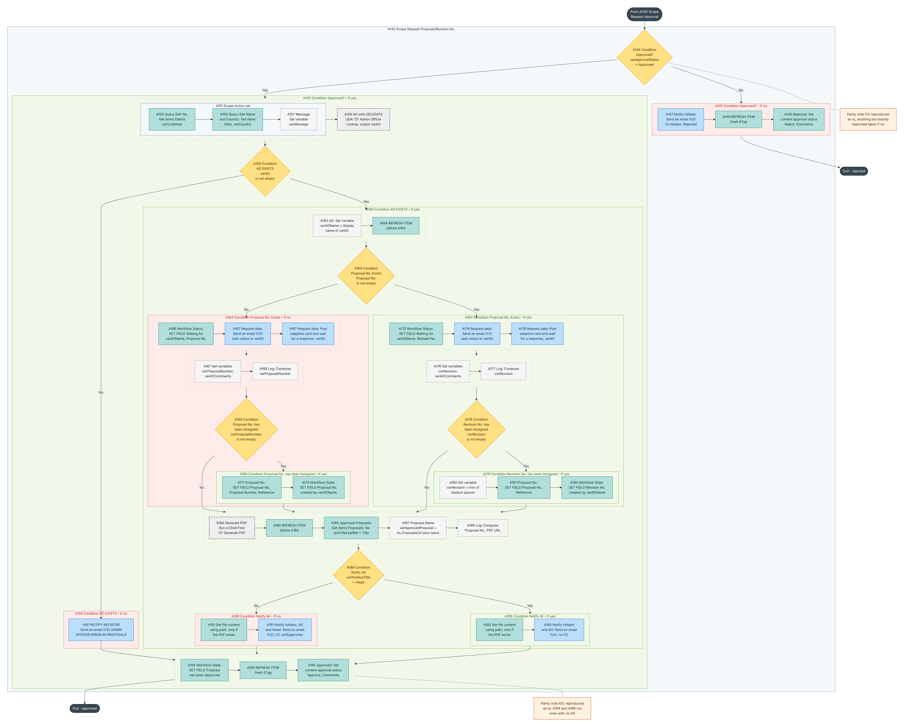

# Proposal Approval – rebuilding the Nintex workflow in Power Automate

This guide shows how to rebuild the Nintex workflow **Proposal Approval** ([`Proposal_Approval.nwf`](../../Proposal_Approval.nwf)) as a Power Automate cloud flow with **the same logic**. It covers every one of the workflow's 195 actions.

The workflow itself is analysed in [`docs/proposal-approval-nwf.md`](../../docs/proposal-approval-nwf.md). Read that first if you need to know what the workflow does and why.

**The parity rule.** The flow reproduces the Nintex workflow exactly:

- the same steps, in the same order;
- the same conditions, including their AND/OR grouping, and the same Yes and No branches;
- the same column values, variables, recipients, subjects and texts.

That includes the defects listed in the analysis. Each reproduced defect is marked with a **Parity note**, which also says how to fix it once the rebuild is live and proven. Where Power Automate cannot behave identically, the difference is listed under [Deviations from Nintex](#deviations-from-nintex), and the [parity test plan](#parity-test-plan) shows how to prove that both versions give the same results.



*The whole main flow at scope and decision level, from the trigger to the approved and rejected endings. Yes means the Power Automate "If yes" branch. The full-size SVG is [images/02-main-flow-overview.svg](images/02-main-flow-overview.svg).*

## How to read this guide

- **Action names.** Every Power Automate action, scope and condition is named after the Nintex action it rebuilds, starting with its ID from the export, for example **A055 Supervisor's Approval**. The IDs are the same as in the analysis document, so you can trace every step back to Nintex. The [action map](#nintex--power-automate-action-map) lists all 195.
- **Branches.** A Nintex *Set a condition* becomes a **Condition**. Its "Yes" branch (condition true) becomes **If yes**, and its "No" branch becomes **If no**. A Nintex *Run if* becomes a Condition whose *If no* is empty. A Nintex *Action set* becomes a **Scope**.
- **Patterns.** Steps that repeat use the named patterns in [Reusable patterns](#reusable-patterns): REFRESH ITEM, SET FIELD, QUERY, LOG, APPROVAL REQUEST and UNLOCK WAIT.
- **Inferred parts.** The three Nintex user-defined actions (UDAs) and the three child workflows are not in the export. Their contracts are exact, but their internals are marked **INFERRED**; confirm them against their own Nintex exports ([Before you go live](#before-you-go-live)).
- **Build order.** Build in this order: the solution and environment variables, then the child flows, then the main flow from the trigger down, stage by stage. Then run the parity tests.

## Contents

1. [Architecture](#architecture)
2. [Prerequisites and setup](#prerequisites-and-setup)
3. [Trigger and variables](#trigger-and-variables)
4. [Reusable patterns](#reusable-patterns)
5. [Child flows](#child-flows)
6. [Build the main flow – Stage 1: start-up and approval variables (A002–A041)](#build-the-main-flow--stage-1-start-up-and-approval-variables-a002a041)
7. [Build the main flow – Stage 2a: checker, rejection guard, supervisor and Divisional Manager (A042–A100)](#build-the-main-flow--stage-2a-checker-rejection-guard-supervisor-and-divisional-manager-a042a100)
8. [Build the main flow – Stage 2b: General Manager (A101–A142) and the rejected outcome (A143–A149)](#build-the-main-flow--stage-2b-general-manager-a101a142-and-the-rejected-outcome-a143a149)
9. [Build the main flow – Stage 3: approved outcome, proposal/revision number and notifications (A150–A195)](#build-the-main-flow--stage-3-approved-outcome-proposalrevision-number-and-notifications-a150a195)
10. [Nintex → Power Automate action map](#nintex--power-automate-action-map)
11. [Deviations from Nintex](#deviations-from-nintex)
12. [Parity test plan](#parity-test-plan)
13. [Before you go live](#before-you-go-live)
14. [Diagram sources](#diagram-sources)

## Architecture



*Components of the Proposal Approval solution: the main cloud flow, the five child flows, the three environment variables, the SharePoint lists the flows read and write, and the Microsoft 365 services they call. Solid arrows show what the main flow reads and writes. Dotted arrows from the lookup child flows to Master Contacts and Master Calendar are INFERRED, because the UDA internals are not in the export. If the lists stay on SharePoint Server 2016, the SharePoint connector needs an on-premises data gateway (premium). Full-size SVG: [images/01-architecture.svg](images/01-architecture.svg).*


This section and the four after it are the foundation of the guide. They cover the Nintex workflow settings record **A001** and everything the step-by-step sections share: the components, setup, trigger, the 32 variables, the reusable build patterns and the child flows. Later sections use the pattern names in capitals: **REFRESH ITEM**, **SET FIELD**, **QUERY**, **LOG**, **APPROVAL REQUEST** and **UNLOCK WAIT**.

The goal is parity. The cloud flow runs the same steps in the same order as the Nintex export, with the same conditions, values, recipients and texts. Two kinds of note mark the exceptions:

- **Deviation.** The platform forces a difference. It is recorded with its impact and a mitigation.
- **Parity note.** The Nintex logic has a known defect (I01–I46 in `docs/proposal-approval-nwf.md`). The defect is reproduced and flagged.

### Components



All components live in one solution, **Proposal Approval**.

| Component | Power Automate type | Replaces (Nintex) | Used by |
|---|---|---|---|
| **Proposal Approval** | Solution cloud flow, instant trigger *For a selected file* | List workflow "Proposal Approval" on Draft Proposals, WorkflowId `{B31A38A3-4412-4667-92A1-2F11F9680A79}`, item-menu label "Proposal Approval" | Users, from the Draft Proposals **Automate** menu |
| **APPROVAL REQUEST** | Inline **Scope**, copied three times | UDA 1000009 (StaticId `db1fd40f-eb56-4477-9cc5-6619dd98a964`), "Supervisor's Approval" / "Next Level Approval Request" / "GM's Approval Request" | A055, A091, A131 |
| **CF Delegate Lookup** | Child cloud flow | UDA 1000010 "Delegate UDA" (StaticId `af51a53f-a5d7-4295-aa1f-93e063cfd28b`) | A032, A081, A119, and the APPROVAL REQUEST reference implementation |
| **CF Admin Officer Lookup** | Child cloud flow | UDA 1000022 "AO with DELEGATE UDA" (StaticId `a2df12fa-bb2f-4a52-a332-8c3b124c912e`) | A158 |
| **CF Check Signatures** | Child cloud flow; responds first, so the parent does not wait | Child workflow "Check Signatures" | A004 |
| **CF PROPOSAL CHECKER** | Child cloud flow, waited for | Child workflow "PROPOSAL CHECKER" | A048 |
| **CF Generate PDF** | Child cloud flow, waited for | Child workflow "Generate PDF" | A184 |
| SharePoint connector | Standard (Premium only through an on-premises data gateway) | All SharePoint reads and writes, and Set approval status | Everywhere |
| Approvals connector | Standard; stores approvals in Dataverse | The approval tasks created inside UDA 1000009 | APPROVAL REQUEST |
| Microsoft Teams connector | Standard | Request Data tasks A167 and A176 (forms "Create Proposal" and "Create Revision" in Workflow Tasks) | A167, A176 |
| Office 365 Outlook connector | Standard | Send notification A147, A161, A191, A193, and the Request Data task e-mails | A147, A161, A167, A176, A191, A193 |
| Office 365 Users connector (optional) | Standard | Turning a person into a display name (`DisplayNameAsText`), if the A163 step uses it | A163 |
| 3 environment variables | Solution component | The hard-coded `http://portal/...` addresses | All SharePoint actions, A187, A191, A193 |
| Connection references | Solution component | Nintex ran under SharePoint's own identity | All connector actions |

### Nintex building blocks and their Power Automate equivalents

| Nintex action type (export) | Power Automate | Pattern / where described |
|---|---|---|
| NWWorkflowVariables (A001) | Trigger *For a selected file*, plus Compose and Initialize variable | [Trigger and variables](#trigger-and-variables) |
| SPWaitForDocumentStatus `unlock` (A002, A133) | Do until | UNLOCK WAIT |
| NWCommit "Commit pending changes" | — (no action) | Every Power Automate write is immediate |
| NWStartWorkflow2 (A004, A048, A184) | Run a Child Flow | [Child flows](#child-flows) |
| NWBusinessProcess (Action set) | Scope | — |
| WFSequence, WFIfElseBranch | — (structural only) | — |
| WFIfElse "Set a condition" | Condition | **If yes** = Nintex Yes branch (the **second** child, condition TRUE). **If no** = Nintex No branch (the **first** child, condition FALSE) |
| NWRunIf2 "Run if" | Condition | Children go in **If yes**; **If no** stays empty |
| NWQueryList | Get items (+ Filter array) + Set variable | QUERY |
| SPUpdateItemWithKey (this item), SPSetFieldWithKey | Send an HTTP request to SharePoint (`validateUpdateListItem`) | SET FIELD |
| SPSetVariable, NWBuildString | Set variable | — |
| NWWriteToHistoryList | Compose (+ optional Create item) | LOG |
| UserDefinedActionWrapper 1000009 | Scope containing the APPROVAL REQUEST steps | APPROVAL REQUEST |
| UserDefinedActionWrapper 1000010 / 1000022 | Run a Child Flow (CF Delegate Lookup / CF Admin Officer Lookup) | [Child flows](#child-flows) |
| NWCollectData (A167, A176) | Teams *Post adaptive card and wait for a response*, plus *Send an email (V2)* | Sections for A167/A176 |
| NWSendMessage | Office 365 Outlook *Send an email (V2)* | Sections for A147, A161, A191, A193 |
| NWSetModerationStatus (A149, A195) | SharePoint *Set content approval status* | Sections for A149/A195 |
| WFTerminate (A051) | Terminate | Section for A051 |

### Conventions used in every section

**Action names.**

- Every action, scope and condition is renamed to start with its Nintex action ID, followed by the Nintex label. Examples: `A055 Supervisor's Approval`, `A049 Condition Approved?`, `A005 Scope Approval Variables`.
- Helper actions that one Nintex action needs carry the same ID, for example `A009 Query Data` and `A009 Set varPositionTitle`.
- Power Automate rejects some characters in action names, such as `&`, `<`, `>`, `%`, `?`, `/` and `\`, and limits names to 80 characters. Replace `&` with `and`, `>` with `gt`, `<` with `lt` and `/` with `-`. For example, A065 becomes `A065 Value(R) gt 100k`.
- In expressions, an action is referenced by its internal name, which has spaces replaced by underscores, and a single quote doubled. For example, `body('A009_Query_Data')` and `outputs('A055_Inputs')`.

**Condition operators.** Nintex "Equal" without *Ignore case* is case-sensitive, and so is `equals()`. No condition in the export sets Ignore case.

| Nintex operator | Power Automate expression (expression editor) |
|---|---|
| Equal | `equals(a, b)` |
| NotEqual | `not(equals(a, b))` |
| NotIsEmpty | `not(empty(a))` |
| GreaterThan / GreaterThanOrEqual on Currency | `greater(n, 100000)` / `greaterOrEquals(n, 5000000)`, where `n` is the numeric Value(R) expression in REFRESH ITEM |
| Boolean item field Equal `true` | `equals(variables('varItem')?['Col'], true)` (an empty value is `null`, which is FALSE, as in Nintex) |
| ConditionPair And / Or | `and(...)` / `or(...)`, keeping the **same grouping** as the export (see A101) |

**Expressions.**

- In text fields, use `@{...}` interpolation.
- In the expression editor, enter plain expressions.
- Code blocks in this guide show expression-editor content unless they contain `@{`.
- The item ID is always `triggerBody()?['entity']?['ID']`.
- Environment variables are referenced as `parameters('<display name> (<schema name>)')`. This guide uses the publisher prefix `pa`, for example `parameters('ev_ProjectsSiteUrl (pa_ev_ProjectsSiteUrl)')`; replace `pa` with your prefix. In a *Site Address* box, choose **Enter custom value** and insert the environment variable token.

**People.**

- Every Nintex **User** value is stored as the person's e-mail (UPN) in **lower case**. That covers `{Common:Initiator}`, `varApprover`, `varAO`, and Person columns read by queries.
- Text variables that identify a person (`varSupervisor`, `varApprovedBy`, `varDelegate`) use the same lower-case e-mail, so identity comparisons and e-mail recipients use one format.
- Display-name variables (`varApproversName`, `varAOName`) hold display names.
- Nintex wrote its own string form of a person (a login name or display name; the format is not visible in the export). See the deviation "Identity format".

**Text.**

- Every string is reproduced exactly, with one documented cosmetic deviation (design decision 17). A literal `&nbsp;` in a **plain-text column value or e-mail subject** is written as a normal space. In **HTML bodies** `&nbsp;` is kept.
- `{Common:NewLine}` becomes `<br>` in HTML and `decodeUriComponent('%0A')` in plain text.
- `fn-FormatDate(x,"yyyy/MM/dd")` becomes `formatDateTime(x,'yyyy/MM/dd')`.
- `fn-Trim(fn-Replace(v," ",""))` becomes `trim(replace(v,' ',''))`.

> **Parity note (I27):** does not reproduce the literal six characters `&nbsp;` that Nintex writes into Workflow State (A053, A056, A061, A063, A092, A134), into `varApproversList` (A041, A089, A129) and into e-mail subjects (A015/A016, A161). Power Automate writes a space instead (design decision 17, cosmetic). To fix later: nothing; this is the intended text.

### Sites and lists

| Site (environment variable) | List / library | Used for | Read/write |
|---|---|---|---|
| `ev_ProjectsSiteUrl` | **Draft Proposals** (document library, content approval on) | Trigger, REFRESH ITEM, SET FIELD, Set content approval status (A149, A195) | Read/write |
| `ev_ProjectsSiteUrl` | Workflow Tasks | **Not used** by the cloud flow (see Prerequisites) | — |
| `ev_ProjectsSiteUrl` | Proposal Approval History (new, optional) | LOG | Write |
| `ev_ProjectsSiteUrl` | Proposal Approval Child Runs (new; needed only for asynchronous child flows) | Completion markers for A048/A184 | Read/write |
| `ev_DivisionsSiteUrl` | Master Contacts | A009, A024, A027, A076, A106; APPROVAL REQUEST; both lookup child flows (inferred) | Read |
| `ev_DivisionsSiteUrl` | Clients | A019, A113, A153 | Read |
| `ev_DivisionsSiteUrl` | Sites | A020, A071, A115, A155 | Read |
| `ev_DivisionsSiteUrl` (`ev_ProposalsUrl` = its library URL) | Proposals (library) | A185 query; A187 URL; A191/A193 attachment | Read |
| `ev_DivisionsSiteUrl` | Master Calendar | CF Delegate Lookup (inferred, from `template-xsn.md` §5) | Read |

### Platform limits that shape the design

- **Run duration.** A cloud flow run can last at most **30 days**, including child flows, approvals, adaptive-card waits and Do until loops. Nintex had no limit (A001 `WorkflowDuration = -1`). See the deviation "30-day run limit".
- **Nesting depth.** An action can sit inside at most **8 nested containers** (Scope, Condition, Do until, Apply to each). Nintex has no such limit.
  - The deepest export path needs **9**: `A042 > A049 (Yes) > A065 > A067 > A101 > A109 > A120 > A122 (Yes) > A125 > A127/A129`.
  - A139/A141 (`… A109 > A135 > A137 > A139`) sit at exactly 8.
  - Recommended fix, which preserves the logic and is applied once in the A042–A142 part: build **A049 as a guard clause**.
    - Keep the Condition and its expression unchanged.
    - **If no** holds A051 Terminate. **If yes** stays empty.
    - A053–A142 follow the Condition inside the A042 scope.
    - A051 ends the run, so the behaviour is identical, and every action in A053–A142 moves up one level.
  - If the designer still reports a nesting error when saving, also build **A125** as one Set variable on `varApproversList` with `if(not(empty(variables('varApprover'))), <A129 value>, <A128 value>)`, where `<A128 value>` is `variables('varDelegatePosition')`.
  - For this reason the UNLOCK WAIT loop contains no Condition, and the APPROVAL REQUEST scope is flat.
- **Do until.** At most 5,000 iterations and a timeout of at most `P30D`. When either limit is reached, the loop simply ends and the flow continues.
- **Child flows.** A synchronous *Run a Child Flow* must get its response within 120 seconds. Anything longer uses the asynchronous pattern in [Child flows](#child-flows).
- **Action count.** The flow has a limit of 500 actions. This design needs roughly 250–320, including about 37 Initialize variable actions, about 15 REFRESH ITEM pairs and 3 approval scopes of 14 actions each.
- **Run history** is kept for 28 days and is visible only to flow owners. See LOG.

## Prerequisites and setup

### Environment and solution

1. Use a Power Platform environment **with a Dataverse database**. Solutions and the Approvals connector require one.
2. Create a publisher (prefix, for example `pa`) and a solution named **Proposal Approval**.
3. In the solution, create the components in this order: environment variables → connection references → child flows → main flow. *Run a Child Flow* lists only child flows that are already in the same solution.

### Environment variables

All three are of type **Text**. The "today" values come from the export.

| Display name | Schema name (example) | Value today | Example value after migration | Used by |
|---|---|---|---|---|
| `ev_ProjectsSiteUrl` | `pa_ev_ProjectsSiteUrl` | `http://portal/Divisions/PDD/Projects`. Derived from the Request Data form folders `/Divisions/PDD/Projects/Lists/Workflow Tasks/Create Proposal` and `/Create Revision` (A167, A176) and the host used elsewhere in the export | `https://<tenant>.sharepoint.com/sites/Divisions/PDD/Projects` | Trigger; REFRESH ITEM; SET FIELD; A149, A195; LOG list; Child Runs list |
| `ev_DivisionsSiteUrl` | `pa_ev_DivisionsSiteUrl` | `http://portal/Divisions`. The export spells this site four ways: `http://Portal/Divisions/` (A009, A027), `http://portal/Divisions/` (A019, A020, A023, A024, A071, A113, A115, A153, A155), `http://Portal/Divisions` (A076, A106) and `http://portal/Divisions` (A185). All are the same web. Store it without a trailing slash | `https://<tenant>.sharepoint.com/sites/Divisions` | Every QUERY; APPROVAL REQUEST; CF Delegate Lookup; CF Admin Officer Lookup; A191/A193 file content |
| `ev_ProposalsUrl` | `pa_ev_ProposalsUrl` | `http://portal/Divisions/Proposals/`, **with** the trailing slash, exactly as A187, A191 and A193 use it | `https://<tenant>.sharepoint.com/sites/Divisions/Proposals/` | A187 `concat(<ev_ProposalsUrl>, variables('varApprovedProposal'))`; A191, A193 body link |

Reference expressions:

```
parameters('ev_ProjectsSiteUrl (pa_ev_ProjectsSiteUrl)')
parameters('ev_DivisionsSiteUrl (pa_ev_DivisionsSiteUrl)')
parameters('ev_ProposalsUrl (pa_ev_ProposalsUrl)')
```

After you change an environment variable's value, turn the flows off and on again so that they pick up the new value.

> **Parity note (I24):** reproduces today's addresses unchanged, including the `http://portal/Divisions/Proposals/` prefix that A187 builds into the attachment URL and that A191/A193 print as a library-root link (I38). To fix later: set the HTTPS / SharePoint Online values at migration. That is a configuration change, not a logic change.

### Connection references

Create one connection reference per connector. Bind each one to a connection owned by a **service account**. Child flows use the same references.

| Connection reference (display name) | Connector (API name) | Used by |
|---|---|---|
| Proposal Approval SharePoint | SharePoint (`shared_sharepointonline`) | Trigger, Get file properties, Send an HTTP request to SharePoint, Get items, Create item, Set content approval status, Get file content using path |
| Proposal Approval Outlook | Office 365 Outlook (`shared_office365`) | Send an email (V2): A147, A161, A167/A176 notifications, A191, A193 |
| Proposal Approval Teams | Microsoft Teams (`shared_teams`) | Post adaptive card and wait for a response: A167, A176 |
| Proposal Approval Approvals | Approvals (`shared_approvals`) | Start and wait for an approval: APPROVAL REQUEST in A055, A091, A131 |
| Proposal Approval Office 365 Users (only if A163 uses it) | Office 365 Users (`shared_office365users`) | Get user profile (V2) for the AO display name |

### Licences

- **SharePoint Online (the assumed target).** Every connector above is **standard**, and so are *Run a Child Flow* and the built-in Control, Variables and Data Operations actions. A Microsoft 365 licence that includes Power Automate covers:
  - the service account that owns the connections and flows; it also needs an Exchange Online mailbox and Teams;
  - every user who starts the flow;
  - approvers and Admin Officers, who only respond in Outlook or Teams.

  No Premium licence is needed.
- **SharePoint Server 2016 kept on-premises.**
  - The SharePoint connector then needs an **on-premises data gateway**, which is a **Premium** feature.
  - Every user who starts the instant flow needs Power Automate Premium. Alternatively, license the flow, including its child flows, with a Power Automate Process licence; check the current Microsoft licensing guide.
  - SharePoint Server 2016 also has **no Automate menu**, so *For a selected file* cannot be started from the file. That start mechanism would have to be redesigned (see the deviation "SharePoint Server 2016").

### SharePoint lists and columns

#### Draft Proposals (site `ev_ProjectsSiteUrl`)

These library settings must stay as they are today:

- **Content approval on.** Library settings → Versioning settings → *Require content approval for submitted items* = Yes. A049 reads `_ModerationStatus`, and A149/A195 set it.
  - Every SET FIELD creates a new version. If the item was Approved or Rejected, the write moves it back to Pending, exactly as Nintex's Update item did. This matters for A049 (see the A049 refresh in REFRESH ITEM).
  - *Set content approval status* needs the file to be **Pending**. If minor versions (drafts) are on, the file can be in Draft, and the A149/A195 steps must first call the action with **Submit**.
- **Require check-out.** Keep today's setting. It decides whether the A002/A133 waits ever loop.

Columns the flow reads and writes. The Power Automate access path assumes the REFRESH ITEM snapshot `varItem`.

| Internal name | Display name | Type | Read by | Written by | Power Automate access |
|---|---|---|---|---|---|
| `FileLeafRef` | Name | File | A013 | — | `?['{FilenameWithExtension}']` |
| `Title` | Title | Text | A015, A016, A022/A073/A117/A157 | — | `?['Title']` |
| `Site_x0020_Name` | Site Name | Text | A015, A016, A022…, A053, A056, A061, A063, A090, A092, A130, A134, A166, A167, A173, A175, A183, A191, A193, A194 | — | `?['Site_x0020_Name']` |
| `Site_x0020_Lookup` | Site Lookup | Lookup | A020, A071, A115, A155 | — | `?['Site_x0020_Lookup']?['Value']` |
| `Client_x0020_Name` | Client Name | Text | A019, A113, A153 | — | `?['Client_x0020_Name']` |
| `Commercial_x0020_Contacts` | Commercial Contacts | Lookup | A024 | — | `?['Commercial_x0020_Contacts']?['Value']` |
| `Division` | Division | Choice | A158 (and A023, which is disabled) | — | `?['Division']?['Value']` |
| `Value_x0028_R_x0029_` | Value(R) | Calculated (currency) | A022…, A065, A101 | — | See REFRESH ITEM |
| `Proposal_x0020_Value` | Proposal Value | Number | A022… | — | `?['Proposal_x0020_Value']` |
| `Currency` | Currency | Choice | A022… | — | `?['Currency']?['Value']` |
| `Acceptance_x0020_Valid_x0020_Date` | Expiry Date | DateTime | A022… | — | `?['Acceptance_x0020_Valid_x0020_Date']` |
| `GM_x0020_Approval_x0020_Required` | GM Approval Required | Boolean | A065, A101 | — | `?['GM_x0020_Approval_x0020_Required']` |
| `Checker` | Checker | Text | A044 | — | `?['Checker']` |
| `_ModerationStatus` / `_ModerationComments` | Approval Status / Approver Comments | ModStat / Note | A049 | A149, A195 (Set content approval status) | `?['{ModerationStatus}']` |
| `Proposal_x0020_No_x002e_1` | Proposal No. | Text | A164, A176, A185, A188 | A171, A181 | `?['Proposal_x0020_No_x002e_1']` |
| `Proposal_x0020_No_x002e_` | Proposal Number | Text | — | A171 | — |
| `Reference` | Reference | Text | — | A171, A181 | — |
| `Proposal_x0020_Title` | Proposal Title | Text | A185 | A013 | `?['Proposal_x0020_Title']` |
| `Workflow_x0020_State` | Workflow State | Text | — | A053, A056, A061, A063, A090, A092, A130, A134, A166, A173, A175, A183, A194 | — |
| `Document_x0020_Approver` | Document Approver | Text | — | A061, A063, A097, A099, A139, A141 | — |
| `Approval_x0020_Date` | Approval Date | DateTime | — | A061, A063, A097, A099, A139, A141 | — |
| `Designation` | Designation | Text | — | A061, A063, A097, A099, A139, A141 | — |
| `Technical_x0020_Full_x0020_Name` | Technical Full Name | Text | A023 only, which is **disabled** and not built | — | — |
| (file properties) | check-out state, link, ETag | — | A002, A133; `{Common:ItemUrl}` in A147, A167, A176; A149, A195 | — | `?['{IsCheckedOut}']`, `?['{Link}']`, `?['{ETag}']` |

The Nintex WorkflowStatus columns `Proposal` ("Proposal Approval"), `Generate` and `Technica` are no longer updated by Proposal Approval. Hide `Proposal` from views after cut-over.

#### Lists on `ev_DivisionsSiteUrl`

Types are taken from the InfoPath data-source schemas in `template.xsn`. Confirm them in SharePoint Online after migration.

| List | Columns used | Used by |
|---|---|---|
| Master Contacts | `Title` (Text); `Position_x0020_Title` (Choice with fill-in); `Position_x0020_Number` (Text); `FullName1` ("Full-Name", **Person** in `Master Contacts3.xsd`, Text in `Master Contacts4.xsd`: confirm); `Position_x0020_Desciprion` (Calculated; keep the source spelling); `Managers_x0020_Position_x0020_Nu` (Text); `SBU_x0020_Short` (Text); `Division_x0020_Name`, `Role` (Text; inferred AO lookup only) | A009, A024, A027, A076, A106; APPROVAL REQUEST; CF Delegate Lookup; CF Admin Officer Lookup |
| Clients | `FileLeafRef`, `Customer` | A019, A113, A153 |
| Sites | `Title`, `Country` (type not in the export; if Choice, read `?['Value']`) | A020, A071, A115, A155 |
| Proposals (library) | `Proposal_x0020_No_x002e_1`, `FileLeafRef` (stands in for the computed `LinkFilenameNoMenu`), file content | A185, A191, A193 |
| Master Calendar | `Position_x0020_No_x002e_` (Text), `EventDate`, `EndDate` (DateTime), `Delegate` (Person) | CF Delegate Lookup (inferred) |

Filtering on a column that is not indexed fails on lists of more than 5,000 items. If any of these lists is that large, index the filtered columns: Title, Position_x0020_Number, SBU_x0020_Short, FileLeafRef, Proposal_x0020_No_x002e_1 and Position_x0020_No_x002e_.

#### New lists on `ev_ProjectsSiteUrl`

| List | Needed when | Columns |
|---|---|---|
| **Proposal Approval History** | Optional (LOG) | `Title` (Text, first 255 characters), `Message` (Multiple lines, plain), `ItemID` (Number), `RunID` (Text), `ActionID` (Text) |
| **Proposal Approval Child Runs** | Only if CF PROPOSAL CHECKER or CF Generate PDF uses the asynchronous pattern | `Title` (Text, key `<parent run id>\|<child name>`), `ItemID` (Number), `ChildFlow` (Text), `ParentRunID` (Text), `Status` (Text: `Running`, `Completed`) |

The completion marker is kept in a separate list and **not** on the Draft Proposals item. Writing to the item would create a version and reset content approval, which would change what A049 reads.

#### Workflow Tasks

The cloud flow does not create or read anything in **Workflow Tasks**:

- Request Data (A167, A176) becomes Teams adaptive cards.
- Approvals (inside UDA 1000009) become Power Automate Approvals, stored in Dataverse.

The forms "Create Proposal" and "Create Revision" are no longer used. **Do not delete the list.** The Project Establishment Form (`template-xsn.md`, sections 6 and 11) still queries it for its own Nintex tasks.

### Permissions and run-only users

| Who | Needs | Why |
|---|---|---|
| People who start the flow (today: anyone who can start workflows on Draft Proposals, because `RequireManagePermission=false`) | **Run-only** permission on the main flow. Flow details → *Run only users* → Edit → add the Draft Proposals library under **SharePoint** (people with access to the library can run it), or an Entra group of proposal authors. They keep their current Edit access to Draft Proposals | The flow then appears under **Automate → Proposal Approval** for a selected file |
| Connections for run-only users | In the same panel, set every connection reference to **Use this connection** (the service account), **not** "Provided by run-only user" | Users need no connections of their own, and long-running steps do not depend on the starter's sign-in |
| Service account | Draft Proposals: **Edit + Approve Items** (for example the *Approve* permission level). Master Contacts, Clients, Sites, Proposals and Master Calendar: **Read**. The two new lists: **Contribute**. An Exchange Online mailbox (or *Send As* on a shared mailbox). A Teams licence. Co-owner of the solution flows | Every action runs with these connections |
| Approvers, delegates and Admin Officers | Read access to the Draft Proposals item (for the links); Outlook/Teams; Teams with the Power Automate (Workflows) app allowed for the Flow bot cards | To respond |
| Flow administrators | Co-owners (preferably a group) of the main and child flows | To maintain the flows and see run history, which run-only users cannot see |
| Child flows | Run only users → every connection = **Use this connection** (embedded) | *Run a Child Flow* fails if a child flow expects connections provided by the run-only user |

### Build order and cut-over

1. Create the environment variables and connection references.
2. Create the optional lists, if used.
3. Build the child flows: **CF Delegate Lookup** first, because CF Admin Officer Lookup and APPROVAL REQUEST call it. Then CF Admin Officer Lookup, CF Check Signatures, CF PROPOSAL CHECKER and CF Generate PDF. Set embedded connections and turn each one on.
4. Build the main flow in export order.
5. Set the run-only users.
6. Run the parity tests on test copies of proposals.
7. At cut-over, stop new Nintex starts by removing the "Proposal Approval" association or its item-menu entry, so that users cannot start both. Let running Nintex instances finish in Nintex.

## Trigger and variables

This section builds Nintex action **A001** (NWWorkflowVariables). It holds the start options, the start form and the 32 declared variables. Every action below is at the **top level**, before A002 and before any scope, because Power Automate requires that for Initialize variable.

### Build steps for A001

1. **A001 For a selected file** · SharePoint › *For a selected file* (instant trigger)
   - Rename the trigger to `A001 For a selected file`.
   - Site Address: **Enter custom value** → `ev_ProjectsSiteUrl`.
   - Library Name: **Draft Proposals**.
     - The value is stored as the library's ID. After importing the solution into another environment, re-select the library, or keep it in an additional *Data source* environment variable.
     - If the drop-down does not load because the site is a custom value, select the site temporarily, pick the library, then switch the site back to the environment variable.
   - **+ Add an input** → **Text** → name `Initiator's Comments`, description `Optional comments`. Then **… → Make the field optional**.
     - This replaces the Nintex start form variable `InitiatorsComments`: MultipleLine, `Required=false`, `StartupOptionsConfigured=true`.
   - No trigger conditions, no content-type filter. Instant triggers have no concurrency setting.
   - Trigger values used in the flow:

   ```
   triggerBody()?['entity']?['ID']                               // item ID
   triggerBody()?['text']                                        // "Initiator's Comments" (insert the dynamic-content token; this is its usual code view)
   toLower(triggerOutputs()?['headers']?['x-ms-user-email'])     // {Common:Initiator}
   triggerOutputs()?['headers']?['x-ms-user-name']               // {Common:InitiatorsDisplayName}
   ```

2. **A001 Common Initiator** · Data Operation › *Compose*
   - Inputs (expression):

   ```
   toLower(triggerOutputs()?['headers']?['x-ms-user-email'])
   ```

   - Equivalent of `{Common:Initiator}`. The Nintex value was a User, which `AsDNString` coerced to a login name. Here it is the lower-case e-mail (design decisions 3 and 4).

3. **A001 Common InitiatorsDisplayName** · Data Operation › *Compose*
   - Inputs (expression):

   ```
   triggerOutputs()?['headers']?['x-ms-user-name']
   ```

   - Equivalent of `{Common:InitiatorsDisplayName}`. It is the Entra ID display name, which must equal the Master Contacts `Title` for A009 to match (I07; confirm in the parity test).

4. **A001 Initialize \<variable\>** · Variables › *Initialize variable* · one action for each of the 32 Nintex variables
   - Create them **in export declaration order**, with the **same names**, for example `A001 Initialize varApprover`.
   - "Value" `''` means: leave the Value box empty, which gives an empty string.

   | # | Name | Nintex type (control) | PA type | Initial value | Purpose (set → read) |
   |---|---|---|---|---|---|
   | 1 | `varApprover` | User (User) | String | `''` | Next-level approver as a lower-case e-mail: Divisional Manager, then GM. Set A076, A103 (cleared with varEmpty), A106 → read A078, A085, A095, A108, A109, A125, A137 |
   | 2 | `varApprovalDate` | DateTime (DateTime) | String (ISO 8601) | `''` | Response date from APPROVAL REQUEST (A055, A091, A131) → Approval Date in A061, A063, A097, A099, A139, A141 |
   | 3 | `varApprovalStatus` | Text (SingleLine) | String | `''` | Exactly `Approved` or `Rejected` from A055, A091, A131 → A056, A057, A067, A092, A093, A101, A134, A135, A145 (I13) |
   | 4 | `varApprovalComments` | Text (MultipleLine) | String | `''` | Approver's comments (A055, A091, A131) → A147, A149, A195 |
   | 5 | `varAO` | User (User) | String | `''` | Admin Officer e-mail from CF Admin Officer Lookup (A158) → A159, A163, A167, A176, A191, A193 |
   | 6 | `varProposalNumber` | Text (SingleLine) | String | `''` | "Proposal No." entered on the A167 card → A168, A169, A171 |
   | 7 | `varApproversName` | Text (SingleLine) | String | `''` | Responder's display name (A055, A091, A131) → Document Approver in A061…A141 |
   | 8 | `varApprovedBy` | Text (SingleLine) | String | `''` | Responder's e-mail (A055, A091, A131) → A059, A095, A109, A132, A137, A147 (From) |
   | 9 | `varRevision` | Text (SingleLine) | String | `''` | "Revision No." from the A176 card; spaces removed at A180 → A177, A178, A181 |
   | 10 | `varAOComments` | Text (MultipleLine) | String | `''` | AO comments from the A167/A176 cards; never read (I36) |
   | 11 | `varApprovalLine` | Text (SingleLine) | String | `''` | Approval subject (A015) → APPROVAL REQUEST input "Subject" |
   | 12 | `varNotificationLine` | Text (SingleLine) | String | `''` | Notification subject (A016) → A147, A167, A176, A191, A193 |
   | 13 | `varMessage` | Text (MultipleLine) | String | `''` | Summary text (A022, A073, A117, A157) → approvals, e-mails, cards |
   | 14 | `varAOName` | Text (SingleLine) | String | `''` | AO display name (A163) → A166, A173, A175, A183 |
   | 15 | `varCustomer` | Text (SingleLine) | String | `''` | Client SAP No. (A019, A113, A153) → message |
   | 16 | `varTitle` | Text (SingleLine) | String | `''` | Declared, never used (I22) |
   | 17 | `varApprovedProposal` | Text (SingleLine) | String | `''` | PDF file name (A185), then its full URL (A187) → A188, A191, A193 |
   | 18 | `varCountry` | Text (SingleLine) | String | `''` | Site country (A020, A071, A115, A155) → message |
   | 19 | `varSite` | Text (SingleLine) | String | `''` | Declared, never used (I22) |
   | 20 | `varDelegate` | Text (SingleLine) | String | `''` | Delegate e-mail from CF Delegate Lookup (A032, A081, A119); cleared at A080 → A033, A034, A082, A120, A122 |
   | 21 | `varApproversList` | Text (SingleLine) | String | `''` | Text for the "Waiting for …" message (A031, A039, A041, A079, A087, A089, A118, A127, A129) → A053, A090, A130 |
   | 22 | `InitiatorsComments` | Text (MultipleLine), **start form** | String | `coalesce(triggerBody()?['text'], '')` | Initiator's comments → A022, A073, A117, A157 and APPROVAL REQUEST input "Initiator Comments" |
   | 23 | `varApproverPosition` | Text (SingleLine) | String | `''` | Position description (A027, A076, A106), overwritten by "ApprovedBy Position" (A055, A091, A131) (I33) |
   | 24 | `varDelegatePosition` | Text (SingleLine) | String | `''` | Delegate's position (A032, A081, A119) → A039, A041, A087, A089, A127, A129 |
   | 25 | `varApproverPositionNo` | Text (SingleLine) | String | `''` | Divisional Manager's position number (A076), overwritten by "ApprovedBy Position No" (A055, A091, A131) → A081, A091 |
   | 26 | `varManagerPositionNo` | Text (SingleLine) | String | `''` | GM's position number (A076) → A106, A119, A131 |
   | 27 | `varPositionTitle` | Text (SingleLine) | String | `''` | The **initiator's** Position Title (A009) → A067, A189 |
   | 28 | `varEmpty` | Text (SingleLine) | String | `''` | Never assigned; used as a blank constant → A080, A103 (I22) |
   | 29 | `varSupervisor` | Text (SingleLine) | String | `''` | First approver's `FullName1`, as a lower-case e-mail (A027) → A037, A059, A191 (CC) |
   | 30 | `varErrors` | Boolean (YesNo), default 0 | Boolean | `false` | Declared, never used (I22) |
   | 31 | `varErrorMessage` | Text (SingleLine) | String | `''` | Declared, never used (I22) |
   | 32 | `VarapplicantSup` | Text (SingleLine) | String | `''` | Position Number of the Commercial Contact (A024) → A026, A027, A032, A055 (I08) |

5. **Helper variables** · Variables › *Initialize variable* · after the 32 above

   | Action | Name | Type | Value | Purpose |
   |---|---|---|---|---|
   | **A001 Initialize varItem** | `varItem` | Object | `{}` | Snapshot of the Draft Proposals file properties, filled by REFRESH ITEM. The first refresh is at A002 |
   | **A001 Initialize varInitiatorEmail** | `varInitiatorEmail` | String | `outputs('A001_Common_Initiator')` | Use for every `{Common:Initiator}` |
   | **A001 Initialize varInitiatorName** | `varInitiatorName` | String | `outputs('A001_Common_InitiatorsDisplayName')` | Use for every `{Common:InitiatorsDisplayName}` |

> **Parity note (I04):** reproduces the rule that whoever starts the flow is the "Chief Investigator". That person is looked up at A009, drives A067 and A189, and receives the initiator e-mails. To fix later: take the CI from an item column (for example Author or the technical contact), or restrict the run-only users.

> **Parity note (I21):** reproduces the absence of any content-type restriction. The flow is offered on every file of Draft Proposals: content types Proposal and Document, and Folder if SharePoint offers it on the selection. To fix later: add a check right after the trigger that terminates when `variables('varItem')?['{ContentType}']` is not *Proposal*. Instant triggers have no trigger conditions.

> **Parity note (I22):** reproduces the unused variables `varTitle`, `varSite`, `varErrors` and `varErrorMessage`. They are initialized and never used. `varEmpty` is never assigned and serves as a blank constant at A080/A103. To fix later: remove the unused variables, and clear values with `''` instead of `varEmpty`.

> **Parity note (I07):** reproduces A009's match of the initiator's display name against Master Contacts `Title`. The display name now comes from Entra ID (`x-ms-user-name`). If its format differs from the SharePoint 2016 display name, A009 finds nothing, A067 becomes TRUE and A189 becomes FALSE, exactly as Nintex behaves when its lookup fails. To fix later: look the initiator up by e-mail.

### A001 settings that need no action

| A001 setting | Value in the export | Power Automate equivalent |
|---|---|---|
| `StartManually` | `true` | Instant trigger *For a selected file* |
| `StartOnCreate`, `StartOnChange`, their conditions, `UsesConditionalStart` | `false` | No automated trigger and no trigger conditions |
| `StartFromMenu` / `StartFromMenuLabel` | `true` / "Proposal Approval" | The flow's display name **Proposal Approval** appears in the library's **Automate** menu (command bar and item context menu) |
| `EcbId`, `CustomActionIcon`, `CustomActionSequence` | `d4563c61-…`, `StartWorkflowECB.png`, `0` | No equivalent: SharePoint places the Automate menu and its icon itself |
| `ContentType` / `ContentTypeName` | `""` / `All` | No content-type filter (I21) |
| `RequireManagePermission` | `false` | Run-only users = everyone who can edit the library |
| `StartPage` + start form variable `InitiatorsComments` | `""`; MultipleLine, optional | Optional trigger input "Initiator's Comments". The run panel shows a **single-line** box (deviation) |
| `TaskListId` | `Workflow Tasks` | Not used. Approvals and Teams cards replace the task list |
| `HistoryListName` / `HistoryLogging` | `NintexWorkflowHistory` / `true` | Run history + LOG Compose, plus the optional *Proposal Approval History* list |
| `VerboseLogging` | `false` | Not applicable. Run history always records each action's inputs and outputs (I40) |
| `WorkflowDuration` | `-1` (no limit) | Not applicable. A run is limited to 30 days (deviation) |
| `DisplayStatusColumn` | `false` | Not applicable |
| `WorkflowName`, `WorkflowDescription`, `ChangeComments` | "Proposal Approval", empty, empty | Flow name "Proposal Approval". A flow description may be added; it does not affect logic (I40) |
| `Id`, `SkipValidation`, `Category` | `{B31A38A3-…}`, `false`, `List` | Not applicable |
| Declared workflow variables | 32 | 32 × *Initialize variable* (step 4) |

## Reusable patterns

Each pattern is described once here. The step-by-step sections name the pattern and give only the values. `Axxx` stands for the Nintex action ID of the step that uses the pattern.

### REFRESH ITEM

Nintex reads `{ItemProperty:…}` and *current item* values **live** at each action. Power Automate reads a snapshot, so the snapshot is refreshed wherever the item may have changed.

1. **Axxx Get file properties** · SharePoint › *Get file properties*
   - Site Address: `ev_ProjectsSiteUrl` (custom value)
   - Library Name: Draft Proposals
   - Id: `triggerBody()?['entity']?['ID']`
2. **Axxx Set varItem** · Variables › *Set variable*
   - Name: `varItem`
   - Value:

   ```
   body('Axxx_Get_file_properties')
   ```

When a step needs two refreshes, for example inside a loop, add a suffix such as `(loop)` to keep the action names unique.

**Nintex token → Power Automate expression** (reading from the last refresh):

| Nintex | PA expression | Notes |
|---|---|---|
| `{ItemProperty:Title}`, `Site_x0020_Name`, `Client_x0020_Name`, `Checker`, `Proposal_x0020_No_x002e_1`, `Proposal_x0020_Title` | `variables('varItem')?['Title']` (and so on, with the internal name) | Text |
| `{ItemProperty:Site_x0020_Lookup}`, `{ItemProperty:Commercial_x0020_Contacts}` | `variables('varItem')?['Site_x0020_Lookup']?['Value']` | Lookup: display value. If Commercial Contacts allows several values it is an array; confirm (I09) |
| `{ItemProperty:Division}`, `{ItemProperty:Currency}` | `variables('varItem')?['Division']?['Value']` | Choice |
| `{ItemProperty:Value_x0028_R_x0029_}` inside text | `string(coalesce(variables('varItem')?['Value_x0028_R_x0029_'], ''))` | The calculated currency column comes back as text. Its formatting may differ from what Nintex printed; confirm |
| `Value_x0028_R_x0029_` in a numeric test (A065, A101) | `if(empty(variables('varItem')?['Value_x0028_R_x0029_']), 0, float(replace(string(variables('varItem')?['Value_x0028_R_x0029_']), ',', '')))` | Thousands separators are removed before `float()`. If the first test shows a currency symbol or spaces, strip them as well |
| `{ItemProperty:Proposal_x0020_Value}` | `string(coalesce(variables('varItem')?['Proposal_x0020_Value'], ''))` | Number |
| `fn-FormatDate({ItemProperty:Acceptance_x0020_Valid_x0020_Date},"yyyy/MM/dd")` | `if(empty(variables('varItem')?['Acceptance_x0020_Valid_x0020_Date']), '', formatDateTime(variables('varItem')?['Acceptance_x0020_Valid_x0020_Date'], 'yyyy/MM/dd'))` | SharePoint returns times in UTC, while Nintex formatted in the site's time zone. If the column stores a time, wrap the value in `convertFromUtc(…, 'South Africa Standard Time')`. The site locale is en-ZA (Lcid 7177); confirm its time zone |
| `GM_x0020_Approval_x0020_Required` (current item) | `variables('varItem')?['GM_x0020_Approval_x0020_Required']` | Boolean, or `null` if never set |
| `_ModerationStatus` (current item) | `variables('varItem')?['{ModerationStatus}']` | Text: `Approved`, `Rejected`, `Pending`, `Draft` or `Scheduled`. Nintex's `1;#Rejected` corresponds to `Rejected` |
| `{ItemProperty:FileLeafRef}` | `variables('varItem')?['{FilenameWithExtension}']` | |
| `{Common:ItemUrl}` | `variables('varItem')?['{Link}']` | |
| Check-out state (A002, A133) | `variables('varItem')?['{IsCheckedOut}']` | |
| ETag (A149, A195) | `variables('varItem')?['{ETag}']` | If that key is missing from the Get file properties output, use `variables('varItem')?['@odata.etag']` (the *ETag* token) |

**Refresh points and the reads that rely on each one.** The list covers the required points (design decision 5) plus the A049, A149 and A195 points.

| Refresh | Placement | Item values read from it |
|---|---|---|
| A002 (UNLOCK WAIT, before and inside the loop) | A002 | A013 (FileLeafRef), A015/A016 (Site Name, Title), A019 (Client Name), A020 (Site Lookup), A022 (message fields), A024 (Commercial Contacts), A044 (Checker) |
| **A049** | After the A044 Condition (outside its branches), immediately before A049 | A049 (`_ModerationStatus`) and A053 (Site Name). This covers "after A048". It must also run when A044 is No, because the A013 write can turn a Rejected document back into Pending, and Nintex would read the new status |
| A055 (after the scope) | First action after the A055 scope | A056, A061, A063 (Site Name) |
| A065 | Before A065 | A065 (Value(R), GM flag), A071 (Site Lookup), A073 (message fields), A090 (Site Name) |
| A091 (after the scope) | First action after the A091 scope | A092 (Site Name) |
| A101 | Before A101 | A101 (Value(R), GM flag), A113 (Client Name), A115 (Site Lookup), A117 (message), A130 (Site Name) |
| A133 (UNLOCK WAIT) | The refresh before the loop doubles as "after the A131 scope", because A132 reads nothing from the item. The last refresh in the loop is "after A133" | A134 (Site Name) |
| Most recent refresh on the path | — | A147 (`{Common:ItemUrl}`), A153 (Client Name), A155 (Site Lookup), A157 (message), A158 (Division), and A194 on the no-AO path. No flow write between that refresh and these steps changes these columns |
| A149 | Immediately before A149 | ETag for *Set content approval status* |
| A164 | Before A164 | A164 (Proposal No.), A166/A175 (Site Name), A167 (Site Name, ItemUrl), A176 (Proposal No., ItemUrl), A173/A183 (Site Name) |
| A185 | Before A185 (after Generate PDF) | A185 (Proposal No., Proposal Title), A188 (Proposal No.), A191/A193 (Site Name), A194 |
| A195 | Immediately before A195 | ETag for *Set content approval status* |

For strict live-read parity, a refresh after the multi-day tasks A167 and A176 is also recommended. A173 and A183 read Site Name after them.

### SET FIELD

Used for SPSetFieldWithKey and SPUpdateItemWithKey with `ThisItem=true`. It writes **only** the named columns, like Nintex.

1. **Axxx \<label\>** · SharePoint › *Send an HTTP request to SharePoint*
   - Site Address: `ev_ProjectsSiteUrl`
   - Method: `POST`
   - Uri:

   ```
   _api/web/lists/getbytitle('Draft Proposals')/items(@{triggerBody()?['entity']?['ID']})/validateUpdateListItem
   ```

   - Headers: `Accept` = `application/json;odata=nometadata`; `Content-Type` = `application/json;odata=nometadata`
   - Body (readable form):

   ```json
   {"formValues":[{"FieldName":"<internal name>","FieldValue":"<value>"}],"bNewDocumentUpdate":false}
   ```

   - Enter the Body as **one expression**, so that values containing quotes or line breaks stay valid JSON. Line breaks below are for reading only; type it on one line. Add one `addProperty(...)` per column, in the export's field order:

   ```
   concat('{"formValues":', string(createArray(
     addProperty(json('{"FieldName":"Proposal_x0020_Title"}'), 'FieldValue', variables('varItem')?['{FilenameWithExtension}'])
   )), ',"bNewDocumentUpdate":false}')
   ```

Rules:

- **Values are strings.** Build them with `concat(...)` from the export text. `&nbsp;` in a column value becomes `' '` (design decision 17).
- **Dates.** `validateUpdateListItem` reads a date as the site's **local** time in the site's locale. Convert the ISO 8601 (UTC) variable first:

  ```
  convertFromUtc(variables('varApprovalDate'), 'South Africa Standard Time', 'yyyy-MM-dd HH:mm')
  ```

  If the en-ZA site rejects that format in the first test, use `'yyyy/MM/dd HH:mm'`. `varApprovalDate` is always set before a date write, because date writes run only after an approval.
- `bNewDocumentUpdate=false` creates a new version and moves an Approved or Rejected document back to Pending, as Nintex's item update did. *Modified By* becomes the service account.
- **Field errors return HTTP 200.** `validateUpdateListItem` reports a rejected field in `value[].HasException` / `ErrorMessage`, where Nintex would have stopped with an error. Wherever the nesting depth allows, add the following platform guard after the request. It is not a Nintex action.
  - **Axxx Check update** · Condition: `contains(string(body('Axxx_<label>')), '"HasException":true')`
  - If yes: **Axxx Update failed** · Terminate, Status *Failed*, Message `@{string(body('Axxx_<label>'))}`

### QUERY

Used for every NWQueryList. The site is the export's BaseUrl, which is `ev_DivisionsSiteUrl` for every query.

1. **Axxx \<label\>** · SharePoint › *Get items*
   - Site Address: `ev_DivisionsSiteUrl`
   - List Name: the list in the CAML `<List Title="…"/>`
   - Filter Query: the CAML `<Where>` translated to OData (table below). Escape every inserted value:

   ```
   Title eq '@{replace(variables('varInitiatorName'), '''', '''''')}'
   ```

   - Order By: `ID asc`. The CAML has no OrderBy, and SharePoint returns such CAML results in ID order in practice.
   - Top Count: leave empty. If a **Filter array** follows, set Top Count to `5000` (or turn on pagination) so that the post-filter sees every row.
2. *(only for a CAML `<Contains>` on a Choice column)* **Axxx Filter \<text\>** · Data Operation › *Filter array*
   - From: `body('Axxx_<label>')?['value']`
   - Condition (advanced):

   ```
   @contains(toLower(string(item()?['Position_x0020_Title']?['Value'])), toLower('Manager'))
   ```

   - CAML `Eq`/`Contains` and OData `eq` are case-insensitive in SharePoint, but `contains()` is not, hence the `toLower`.
3. **Axxx Set \<variable\>** · Variables › *Set variable*: one per output, in ViewFields order. A Nintex non-collection variable takes the **first** result; with no match the variable is set to `''`:

   ```
   coalesce(first(body('Axxx_<label>')?['value'])?['<Column>'], '')
   ```

   After a Filter array, read `first(body('Axxx_Filter_<text>'))?['<Column>']` instead.

| CAML | OData / Power Automate |
|---|---|
| `<Eq>` Text, `Value Type="Text"` | `Col eq '<value>'` |
| `<Eq>` on `FileLeafRef`, `Value Type="File"` | `FileLeafRef eq '<value>'` |
| `<Eq>` on `LinkFilenameNoMenu`, `Value Type="Computed"` | Computed columns cannot be filtered in OData. Filter on `FileLeafRef eq '<value>'`, which holds the same file name |
| `<Contains>` on a Choice column | Filter the other conditions in OData, then a **Filter array** with `contains(toLower(...), toLower('<value>'))` |
| `<And>` / `<Or>` | `and` / `or`, with the same grouping |

| Output column type | Set variable value |
|---|---|
| Text, Calculated | `coalesce(first(body('X')?['value'])?['Col'], '')` |
| Number | `string(coalesce(first(body('X')?['value'])?['Col'], ''))` |
| Choice / Lookup | `coalesce(first(body('X')?['value'])?['Col']?['Value'], '')` |
| Person (`FullName1`), into a User **or** Text variable | `toLower(coalesce(first(body('X')?['value'])?['FullName1']?['Email'], ''))` |
| File name (`LinkFilenameNoMenu` / `FileLeafRef`) | `coalesce(first(body('X')?['value'])?['{FilenameWithExtension}'], '')` |

> **Parity note (I10):** reproduces the absence of any "nothing found" check. On no match the variable becomes `''` and the flow continues. What Nintex did on no match is not visible: it may have kept the previous value. Confirm in the parity test. To fix later: add an explicit empty-result branch.

> **Parity note (I26):** when several rows match, Nintex's choice is not determined by the export. Power Automate takes the lowest ID. To fix later: filter on unique keys.

> **Parity note (I25):** cannot be reproduced. A009 and A027 ran with `XmlEncodeCaml=false`, so a value containing `&` or `<` could break the Nintex query. The OData filter with quote escaping does not break. To fix later: nothing.

### LOG

Used for every NWWriteToHistoryList (A026, A033, A078, A108, A132, A168, A177, A188).

1. **Axxx Log in history list** · Data Operation › *Compose*
   - Inputs: the export message with its tokens replaced, for example A026: `Applicant Supervisor:@{variables('VarapplicantSup')}`. The text appears in the run history.
2. *(optional)* **Axxx Write history** · SharePoint › *Create item*
   - Site Address: `ev_ProjectsSiteUrl`; List Name: Proposal Approval History
   - Title:

   ```
   @{substring(outputs('Axxx_Log_in_history_list'), 0, min(255, length(outputs('Axxx_Log_in_history_list'))))}
   ```

   - Message: `@{outputs('Axxx_Log_in_history_list')}`
   - ItemID: `@{triggerBody()?['entity']?['ID']}`
   - RunID: `@{workflow()?['run']?['name']}`
   - ActionID: `Axxx`

Nintex history (`NintexWorkflowHistory`) was visible on the item's workflow page and kept until purged. Power Automate run history is kept for 28 days and only owners can see it. Use the optional list when users or auditors need the log.

### APPROVAL REQUEST



*Reference implementation of approval UDA 1000009, copied inline at A055, A091 and A131 (Axxx stands for that ID). It is a Scope, not a child flow, because a child flow must respond within 120 seconds. The inputs and outputs come from the export. Everything inside the scope is INFERRED: confirm it against the exported UDA (Nintex: Site Settings, Manage User Defined Actions, Export). The approval outcome is mapped to exactly Approved or Rejected. Full-size SVG: [images/05-approval-request-pattern.svg](images/05-approval-request-pattern.svg).*


**APPROVAL REQUEST replaces UDA 1000009.** It is an inline **Scope**, named after the Nintex action:

- `A055 Supervisor's Approval`
- `A091 Next Level Approval Request`
- `A131 GM's Approval Request`

It is copied at each level instead of being a child flow, because approvals take days and a child flow must respond within 120 seconds.

**Contract.** The inputs and outputs are exactly those in the export. All three calls use identical bindings except Position Number.

| Direction | UDA parameter | Type | A055 | A091 | A131 |
|---|---|---|---|---|---|
| In | Initiator | Text (Nintex: Initiator User, `AsDNString`) | `variables('varInitiatorEmail')` | same | same |
| In | Initiator Comments | Text | `variables('InitiatorsComments')` | same | same |
| In | IsTopLevel | Boolean | `false` | `false` | `false` |
| In | Item Name | Text | `Proposal` | `Proposal` | `Proposal` |
| In | Message | Text | `variables('varMessage')` | same | same |
| In | Position Number | Text | `variables('VarapplicantSup')` | `variables('varApproverPositionNo')` | `variables('varManagerPositionNo')` |
| In | Subject | Text | `variables('varApprovalLine')` | same | same |
| Out | Approval Comments | Text | → `varApprovalComments` | same | same |
| Out | Approval Date | DateTime | → `varApprovalDate` (ISO 8601) | same | same |
| Out | Approval Status | Text | → `varApprovalStatus`, **exactly** `Approved` or `Rejected` | same | same |
| Out | Approved By | Text | → `varApprovedBy` | same | same |
| Out | ApprovedBy Position | Text | → `varApproverPosition` | same | same |
| Out | ApprovedBy Position No | Text | → `varApproverPositionNo` | same | same |
| Out | ApproversName | Text | → `varApproversName` | same | same |

**Reference implementation.** **INFERRED — confirm against the exported UDA (Nintex: Site Settings → Manage User Defined Actions → Export).** The UDA's internals are not in the workflow export. The steps follow the organisation's role and delegate rules (`template-xsn.md` §5).

The scope is deliberately **flat**, with no Condition or loop inside, so that it fits the nesting depth at A131. The steps below are for A055. For A091 and A131, copy the scope, rename every action to the new ID, change only the *Position Number* in **Inputs**, and check in code view that every `outputs()`/`body()` reference inside the copy points to the copy's own actions.

1. **A055 Inputs** · Data Operation › *Compose* · Inputs:

   ```json
   {
     "Initiator": "@{variables('varInitiatorEmail')}",
     "Initiator Comments": "@{variables('InitiatorsComments')}",
     "IsTopLevel": false,
     "Item Name": "Proposal",
     "Message": "@{variables('varMessage')}",
     "Position Number": "@{variables('VarapplicantSup')}",
     "Subject": "@{variables('varApprovalLine')}"
   }
   ```

   The inputs are captured when the scope starts, which is when Nintex evaluated the UDA inputs.

2. **A055 Get approver** · SharePoint › *Get items*
   - Site Address: `ev_DivisionsSiteUrl`; List Name: Master Contacts; Order By: `ID asc`
   - Filter Query:

   ```
   Position_x0020_Number eq '@{replace(outputs('A055_Inputs')?['Position Number'], '''', '''''')}'
   ```

3. **A055 Approver** · *Compose* · Inputs:

   ```json
   {
     "Email": "@{toLower(coalesce(first(body('A055_Get_approver')?['value'])?['FullName1']?['Email'], ''))}",
     "Name": "@{coalesce(first(body('A055_Get_approver')?['value'])?['FullName1']?['DisplayName'], '')}",
     "Position": "@{coalesce(first(body('A055_Get_approver')?['value'])?['Position_x0020_Desciprion'], '')}"
   }
   ```

4. **A055 Delegate lookup** · Flows › *Run a Child Flow* · **CF Delegate Lookup**
   - Approver: (empty)
   - Approver Position Number: `@{outputs('A055_Inputs')?['Position Number']}`

5. **A055 Assigned to** · *Compose* · Inputs: the approver and the delegate, without blanks or duplicates:

   ```
   if(empty(body('A055_Delegate_lookup')?['delegate']), outputs('A055_Approver')?['Email'], if(empty(outputs('A055_Approver')?['Email']), body('A055_Delegate_lookup')?['delegate'], if(equals(outputs('A055_Approver')?['Email'], body('A055_Delegate_lookup')?['delegate']), outputs('A055_Approver')?['Email'], concat(outputs('A055_Approver')?['Email'], ';', body('A055_Delegate_lookup')?['delegate']))))
   ```

6. **A055 Start and wait for an approval** · Approvals › *Start and wait for an approval*
   - Approval type: **Approve/Reject – First to respond**
   - Title: `@{outputs('A055_Inputs')?['Subject']}`
   - Assigned to: `@{outputs('A055_Assigned_to')}`
   - Details (Markdown; each line break doubled so that every line of the message is shown):

   ```
   @{replace(outputs('A055_Inputs')?['Message'], decodeUriComponent('%0A'), decodeUriComponent('%0A%0A'))}
   ```

   - Item link: `@{variables('varItem')?['{Link}']}`
   - Item link description: `@{outputs('A055_Inputs')?['Item Name']}`
   - Requestor: `@{outputs('A055_Inputs')?['Initiator']}`
   - Enable notifications: Yes
   - *Initiator Comments* is not shown separately, because the Message already ends with "Initiator's Comments: …".
   - *IsTopLevel* (always False) is not used.

7. **A055 Response** · *Compose* · Inputs:

   ```
   first(body('A055_Start_and_wait_for_an_approval')?['responses'])
   ```

8. Seven *Set variable* actions, in the export's output order:
   - **A055 Set varApprovalComments**:

     ```
     coalesce(outputs('A055_Response')?['comments'], '')
     ```

   - **A055 Set varApprovalDate**:

     ```
     coalesce(outputs('A055_Response')?['responseDate'], '')
     ```

   - **A055 Set varApprovalStatus**:

     ```
     if(equals(body('A055_Start_and_wait_for_an_approval')?['outcome'], 'Approve'), 'Approved', 'Rejected')
     ```

   - **A055 Set varApprovedBy**:

     ```
     toLower(coalesce(outputs('A055_Response')?['responder']?['email'], ''))
     ```

   - **A055 Set varApproverPosition**: the responder's position. The approver's position, or the delegate's, or `''` if the request was reassigned to someone else:

     ```
     if(equals(variables('varApprovedBy'), outputs('A055_Approver')?['Email']), outputs('A055_Approver')?['Position'], if(equals(variables('varApprovedBy'), body('A055_Delegate_lookup')?['delegate']), body('A055_Delegate_lookup')?['delegateposition'], ''))
     ```

   - **A055 Set varApproverPositionNo**:

     ```
     if(equals(variables('varApprovedBy'), outputs('A055_Approver')?['Email']), outputs('A055_Inputs')?['Position Number'], if(equals(variables('varApprovedBy'), body('A055_Delegate_lookup')?['delegate']), body('A055_Delegate_lookup')?['delegatepositionno'], ''))
     ```

   - **A055 Set varApproversName**:

     ```
     coalesce(outputs('A055_Response')?['responder']?['displayName'], '')
     ```

If neither an approver nor a delegate is found, *Assigned to* is empty, the approval action fails and the run stops with an error. What the Nintex UDA did with a blank position is not visible (I10).

> **Parity note (I13):** reproduces the outcome variables that are never reset. Every level overwrites all seven outputs, and A145 tests only the last `varApprovalStatus`. Together with A101's OR grouping, this lets a GM approval override a Divisional Manager rejection (I02). To fix later: clear the outputs before each scope and branch explicitly on Approved, Rejected and other values.

> **Parity note (I33):** reproduces the overwriting of `varApproverPosition` and `varApproverPositionNo`. The query values are replaced by "ApprovedBy Position" and "ApprovedBy Position No". To fix later: use separate variables for the queried approver and the responder.

> **Parity note (I30):** reproduces the fact that the delegate found by A032/A081/A119 is **not** passed in. The scope resolves its own delegate (inferred). To fix later: pass one resolved assignee list.

> **Parity note (I12):** reproduces the absence of any check that the approver is not the initiator. To fix later: compare *Assigned to* with `varInitiatorEmail` and escalate.

> **Parity note (I14):** `varApprovedBy` is the responder's e-mail. The checks A059 (with `varSupervisor`), A095/A137 (with `varApprover`) and A109 therefore compare e-mails on both sides. Nintex compared strings of unknown, possibly different formats; if those always differed, Nintex's tests were always TRUE. Confirm by comparing Designation values from past Nintex runs. To fix later: compare position numbers.

### UNLOCK WAIT

**UNLOCK WAIT replaces SPWaitForDocumentStatus `DocumentStatus="unlock"`** at A002 and A133. Steps for A002; A133 is identical with its own prefix:

1. **A002 Get file properties** + **A002 Set varItem**: REFRESH ITEM before the loop.
2. **A002 Wait for check out status change** · Control › *Do until*
   - Loop until (advanced):

   ```
   @not(equals(variables('varItem')?['{IsCheckedOut}'], true))
   ```

   - Change limits: Count `5000`, Timeout `P30D`.
   - Inside:
     1. **A002 Delay while checked out** · Schedule › *Delay until* · Timestamp:

        ```
        if(equals(variables('varItem')?['{IsCheckedOut}'], true), addMinutes(utcNow(), 5), utcNow())
        ```

        This adds no nesting level. When the file is not checked out, it continues at once.
     2. **A002 Get file properties (loop)** + **A002 Set varItem (loop)**: REFRESH ITEM.
3. *(platform guard, recommended; not a Nintex action)* **A002 Still checked out?** · Condition `@equals(variables('varItem')?['{IsCheckedOut}'], true)`
   - If yes: **A002 Wait limit reached** · Terminate, Status *Failed*, Message `Document still checked out when the wait limit was reached`.
   - Without the guard, a loop that ends at its limit would let the flow continue while the file is still checked out. Nintex would still be waiting.

Nintex reacts to the lock as soon as it is released and waits without limit. Power Automate checks every 5 minutes and stops at about 17 days (5,000 × 5 minutes) or 30 days.

> **Parity note (I05):** reproduces waits at A002 and A133 only. Nothing waits before the other item updates after human steps (A056–A063, A092–A099, A171–A183, A194–A195). To fix later: add UNLOCK WAIT before those updates.

## Child flows

### Rules for every child flow

- Each child flow is created in the **Proposal Approval** solution:
  - It uses the trigger **Manually trigger a flow**.
  - Its inputs are named **exactly** as in the export.
  - It ends with **Respond to a Power App or flow**, returning the outputs as Text.
  - It is called from the main flow with Flows › **Run a Child Flow**.
- **Keys in code view.**
  - Trigger inputs get the keys `text`, `text_1`, … and `number` in the order you add them, so add them in the order listed below.
  - Outputs get keys made from the output name in lower case without spaces, for example *Delegate Position* → `delegateposition`.
  - Check both in code view. If the designer shows different keys, use the dynamic-content tokens.
- **Every path returns all outputs.** Use `''` when there is no value. An output that Nintex left unmapped is still returned, but the caller does not use it.
- **Run only users.** Set every connection to **Use this connection** (embedded). Turn the child flow on before you build its callers.
- **Item context.** Nintex started the child workflows on the current item with `StartData="<data/>"`, so they had no start parameters. A cloud flow has no "current item", so the workflow child flows receive the item ID as an extra input.

### CF Delegate Lookup (UDA 1000010 "Delegate UDA")

| Direction | Name (exact) | Type | Key | A032 | A081 | A119 |
|---|---|---|---|---|---|---|
| In | Approver | Text (optional) | `text` | `''` | `''` | `''` |
| In | Approver Position Number | Text (optional) | `text_1` | `variables('VarapplicantSup')` | `variables('varApproverPositionNo')` | `variables('varManagerPositionNo')` |
| Out | Delegate | Text | `delegate` | → `varDelegate` | → `varDelegate` | → `varDelegate` |
| Out | Delegate Position | Text | `delegateposition` | → `varDelegatePosition` | → `varDelegatePosition` | → `varDelegatePosition` |
| Out | Acting | Text | `acting` | unmapped | unmapped | unmapped |
| Out | Delegate Position No | Text | `delegatepositionno` | unmapped | unmapped | unmapped |
| Out | DelegatesName | Text | `delegatesname` | unmapped | unmapped | unmapped |

The APPROVAL REQUEST reference implementation also calls it, from inside A055, A091 and A131.

**Caller template** (A032 shown; A081 and A119 differ only in the input):

1. **A032 Delegate UDA** · Flows › *Run a Child Flow* · Child flow: CF Delegate Lookup
   - Approver: (empty)
   - Approver Position Number: `@{variables('VarapplicantSup')}`
2. **A032 Set varDelegate** · Set variable:

   ```
   coalesce(body('A032_Delegate_UDA')?['delegate'], '')
   ```

3. **A032 Set varDelegatePosition** · Set variable:

   ```
   coalesce(body('A032_Delegate_UDA')?['delegateposition'], '')
   ```

**Reference implementation.** **INFERRED — confirm against the exported UDA.** It follows the delegate rule in `template-xsn.md` §5: a Master Calendar entry for the approver's position number whose `EventDate ≤ now ≤ EndDate` names a delegate.

1. Trigger *Manually trigger a flow*: inputs `Approver`, then `Approver Position Number` (both Text, optional).
2. Initialize variables (child-local, String `''`): `Delegate`, `DelegatePosition`, `DelegatePositionNo`, `DelegatesName`, `Acting`.
3. **Get calendar entry** · SharePoint › *Get items*
   - Site Address: `ev_DivisionsSiteUrl`; List Name: Master Calendar; Order By: `ID asc`
   - Filter Query:

   ```
   Position_x0020_No_x002e_ eq '@{replace(coalesce(triggerBody()?['text_1'], ''), '''', '''''')}' and EventDate le '@{utcNow()}' and EndDate ge '@{utcNow()}'
   ```

4. **Set Delegate**:

   ```
   toLower(coalesce(first(body('Get_calendar_entry')?['value'])?['Delegate']?['Email'], ''))
   ```

5. **Delegate found?** · Condition `@not(empty(variables('Delegate')))`. If yes:
   1. **Get delegate contact** · *Get items*
      - Site Address: `ev_DivisionsSiteUrl`; List Name: Master Contacts; Order By: `ID asc`
      - Filter Query: `FullName1/EMail eq '@{variables('Delegate')}'`
   2. **Set DelegatePosition**:

      ```
      coalesce(first(body('Get_delegate_contact')?['value'])?['Position_x0020_Desciprion'], '')
      ```

   3. **Set DelegatePositionNo**:

      ```
      coalesce(first(body('Get_delegate_contact')?['value'])?['Position_x0020_Number'], '')
      ```

   4. **Set DelegatesName**:

      ```
      coalesce(first(body('Get_delegate_contact')?['value'])?['FullName1']?['DisplayName'], first(body('Get_calendar_entry')?['value'])?['Delegate']?['DisplayName'], '')
      ```

   5. `Acting`: its meaning is not visible (no caller maps it). Return `''` until the UDA export shows what it holds.
6. **Respond to a Power App or flow**: outputs *Delegate*, *Delegate Position*, *Acting*, *Delegate Position No* and *DelegatesName* (Text), each set to its variable.

The input *Approver* is not used, because this workflow always passes `''`. Get items does not expand recurring calendar events. The InfoPath form compared dates in local time, while this compares in UTC. Confirm both.

> **Parity note (I35):** A119 is called without clearing `varDelegate` first, as in Nintex. This child flow always returns a value (`''` when there is no delegate), so a stale delegate cannot survive the call. Whether the Nintex UDA always assigned its outputs is not visible. Confirm from the UDA export.

### CF Admin Officer Lookup (UDA 1000022 "AO with DELEGATE UDA")

| Direction | Name (exact) | Type | Key | A158 |
|---|---|---|---|---|
| In | Division | Text (optional) | `text` | `variables('varItem')?['Division']?['Value']` (Nintex `{ItemProperty:Division}`) |
| In | Role | Text (optional) | `text_1` | `Proposals` |
| Out | AO | Text | `ao` | → `varAO` = `toLower(coalesce(body('A158_AO_with_DELEGATE_UDA')?['ao'], ''))` |

**Reference implementation.** **INFERRED — confirm against the exported UDA.** It is based on the AO rule in `template-xsn.md` §5, which reads "the contact in the SBU whose Role contains …", and on the UDA's name, which suggests it returns the AO or the AO's delegate.

1. Trigger: inputs `Division`, then `Role` (Text, optional).
2. Initialize variable `AO` (String `''`).
3. **Get admin officer** · *Get items*
   - Site Address: `ev_DivisionsSiteUrl`; List Name: Master Contacts; Order By: `ID asc`
   - Filter Query:

   ```
   Division_x0020_Name eq '@{replace(coalesce(triggerBody()?['text'], ''), '''', '''''')}' and substringof('@{replace(coalesce(triggerBody()?['text_1'], ''), '''', '''''')}', Role)
   ```

4. **AO delegate** · *Run a Child Flow* · CF Delegate Lookup
   - Approver: (empty)
   - Approver Position Number:

   ```
   @{coalesce(first(body('Get_admin_officer')?['value'])?['Position_x0020_Number'], '')}
   ```

5. **Set AO**:

   ```
   if(empty(body('AO_delegate')?['delegate']), toLower(coalesce(first(body('Get_admin_officer')?['value'])?['FullName1']?['Email'], '')), body('AO_delegate')?['delegate'])
   ```

6. **Respond to a Power App or flow**: output *AO* = `variables('AO')`.

> **Parity note (I34):** reproduces binding the Text output "AO" to the User variable `varAO`, which A167/A176 use as the card recipient and A191/A193 use as an e-mail recipient. In Power Automate it is a lower-case e-mail, which always resolves. An empty result goes to the A159 No branch (I03). To fix later: nothing more.

### CF Check Signatures (child workflow "Check Signatures")

- **Called by** A004 "Signatures": `AssociationId="Check Signatures"`, **WaitForComplete=false**, DontStartIfAlreadyRunning=true, `StartData="<data/>"`, InstanceId not stored.
- **Inputs:**
  - `Item ID` (Number, key `number`): the plumbing input that stands in for "the current item".
  - `Initiator` (Text, key `text`): available in case the child uses `{Common:Initiator}`.
- **Outputs:** none.
- **First action:** **Respond to a Power App or flow** with no outputs. The parent's *Run a Child Flow* then returns within seconds and the child keeps running, which is the cloud-flow version of fire-and-forget.
- **Logic:** must be rebuilt from the "Check Signatures" Nintex export, which is not in the repository.
- **Caller:** **A004 Signatures** · *Run a Child Flow* · Item ID `@{triggerBody()?['entity']?['ID']}`, Initiator `@{variables('varInitiatorEmail')}`.

> **Parity note (I06):** reproduces the fire-and-forget start. Nothing reads the child's result, and the child can run at the same time as the A013 SET FIELD. To fix later: wait for it and test a field it sets.

### CF PROPOSAL CHECKER (child workflow "PROPOSAL CHECKER")

- **Called by** A048: inside the A044 Yes branch, after A047 Commit. **WaitForComplete=true**, DontStartIfAlreadyRunning=true.
- **Inputs:**
  - `Item ID` (Number, `number`)
  - `Initiator` (Text, `text`)
  - `Parent Run ID` (Text, `text_1`): the parent passes `@{workflow()?['run']?['name']}`.
- **Outputs:** none. Nintex stored no InstanceId and nothing reads the result (I11).
- **Mode:** the name suggests a human check step, so use the **asynchronous pattern**. Use synchronous mode (Respond as the **last** action) only if its export shows no human step and tests show it always finishes within 120 seconds.
- **Asynchronous pattern, child side:**
  1. **Respond to a Power App or flow** (no outputs), first.
  2. *Create item* in Proposal Approval Child Runs:
     - Title: `@{triggerBody()?['text_1']}|PROPOSAL CHECKER`
     - ItemID: `@{triggerBody()?['number']}`
     - ChildFlow: `PROPOSAL CHECKER`
     - ParentRunID: `@{triggerBody()?['text_1']}`
     - Status: `Running`
  3. Scope **Checker logic**, rebuilt from the Nintex export.
  4. *Update item* Status = `Completed`, with **Configure run after** = is successful, has failed, is skipped, has timed out, so that the parent always resumes. Whether Nintex resumed the parent after a child error is not visible; confirm.
- **Asynchronous pattern, parent side** (built in the A048 step):
  1. **A048 Start workflow** · *Run a Child Flow*
  2. **A048 Wait for completion** · *Do until* (Count 5000, Timeout `P30D`), until `@greater(length(body('A048_Get_child_run')?['value']), 0)`. Inside:
     - **A048 Delay** · *Delay* 5 minutes
     - **A048 Get child run** · *Get items*
       - Site Address: `ev_ProjectsSiteUrl`; List Name: Proposal Approval Child Runs
       - Filter Query: `Title eq '@{workflow()?['run']?['name']}|PROPOSAL CHECKER' and Status eq 'Completed'`

### CF Generate PDF (child workflow "Generate PDF")

- **Called by** A184: in the A145 Yes and A159 Yes branches, after numbering. **WaitForComplete=true**, DontStartIfAlreadyRunning=true.
- **Inputs:** as for CF PROPOSAL CHECKER: `Item ID`, `Initiator`, `Parent Run ID`.
- **Outputs:** none. A185 then looks for the PDF in the Proposals library (I16).
- **Mode:** synchronous (**Respond as the last action**, after the PDF has been saved) if tests show it always finishes within 120 seconds. Otherwise use the asynchronous pattern above with the key `|Generate PDF`.
- **Logic:** rebuild from the "Generate PDF" Nintex export, which is not in the repository. That export decides where the PDF is saved, how it is named and which metadata is copied.

### Child flows summary

| Child flow | Callers | Wait | Pattern |
|---|---|---|---|
| CF Delegate Lookup | A032, A081, A119 (and APPROVAL REQUEST) | Yes | Synchronous (lookups only, well under 120 s) |
| CF Admin Officer Lookup | A158 | Yes | Synchronous |
| CF Check Signatures | A004 | No | Responds first (fire-and-forget) |
| CF PROPOSAL CHECKER | A048 | Yes | Asynchronous (recommended) |
| CF Generate PDF | A184 | Yes | Synchronous if under 120 s, otherwise asynchronous |

`DontStartIfAlreadyRunning=true` (A004, A048, A184) has no equivalent: Power Automate always starts the child flow. See the deviations.

## Build the main flow – Stage 1: start-up and approval variables (A002–A041)

Stage 1 runs once per run and asks no one for input. It rebuilds Nintex A002–A041 in the same order:

1. Wait until the document is no longer checked out (A002).
2. Start the Check Signatures child flow without waiting for it (A004).
3. Run the "Approval Variables" action set (A005–A041), which:
   - finds the initiator's position title;
   - writes Proposal Title;
   - builds both e-mail subjects;
   - finds the client SAP number and the site country;
   - builds the summary message;
   - finds the first approver and that approver's delegate;
   - builds the approver-list text that A053 writes to Workflow State.

**Before you start.** The trigger and the `Initialize variable` actions are already at the top level: all 32 Nintex variables plus the helpers `varItem`, `varInitiatorEmail` and `varInitiatorName` (see the trigger and variables section). Add Stage 1 directly below them.

**Conventions used in this section**

- **Item ID.** `triggerBody()?['entity']?['ID']`.
- **Action names in expressions.** Expressions refer to an action by its internal name, which is the action name with spaces replaced by `_`, for example `body('A009_Query_Data')`. Pick values from Dynamic content where you can. The expressions below are what code view must show. The action names avoid `&`, `:` and trailing periods, because some of these actions are referenced in expressions.
- **Queries on the Divisions site.** For "Get items", Site Address = environment variable `ev_DivisionsSiteUrl`. Type the list title as a custom value, because the list dropdown cannot resolve a site that comes from an environment variable at design time.
- **R1.** R1 is the REFRESH ITEM after the wait (steps 6–7). Every item value read in Stage 1 comes from R1. No Stage 1 action changes a column that a later Stage 1 action reads: A013 writes Proposal Title, and nothing else in Stage 1 reads it.
- **No match.** When a Stage 1 query runs, its output variable is still at its initial value `''`. A023 is disabled, so A024 is the first write of `VarapplicantSup`. Writing `''` when nothing matches therefore gives the same result whatever Nintex does on no match. That question only matters for the repeated queries in later stages.
- **Actions with no Power Automate equivalent.** These need no action; see the mapping:
  - Commit pending changes: A003, A010, A014, A021, A025, A028.
  - WFSequence containers: A006, A008, A012, A018, A030.
  - If/else branch containers: A035, A036, A038, A040.

**Stage 1 outline**

```text
(top level, below the Initialize variable actions)
A002 Wait for check out status change            Do until
 ├ A002 Refresh item in loop                      Get file properties
 ├ A002 Set varItem in loop                       Set variable
 └ A002 Condition Still checked out in loop       Condition
    └ If yes: A002 Delay 5 minutes                Delay
A002 Refresh item after wait          (R1)        Get file properties
A002 Set varItem after wait           (R1)        Set variable
A002 Condition Still checked out after wait      Condition
 └ If yes: A002 Terminate wait limit reached      Terminate (Failed)
A004 Signatures                                   Run a Child Flow -> CF Check Signatures
A005 Scope Approval Variables                     Scope
 ├ A007 Scope Query CI's Profile                  Scope
 │  ├ A009 Query Data                             Get items (Master Contacts)
 │  └ A009 Set varPositionTitle                   Set variable
 ├ A011 Scope Proposal Title                      Scope
 │  ├ A013 Proposal Title                         Send an HTTP request to SharePoint
 │  ├ A013 Filter field errors                    Filter array
 │  ├ A013 Condition Update failed                Condition
 │  │  └ If yes: A013 Terminate update failed     Terminate (Failed)
 │  ├ A015 e-mail approval subjet                 Set variable varApprovalLine
 │  └ A016 e-mail notification subjet             Set variable varNotificationLine
 ├ A017 Scope SAP No                              Scope
 │  ├ A019 Query SAP No                           Get items (Clients)
 │  ├ A019 Set varCustomer                        Set variable
 │  ├ A020 Query Site Name and Country            Get items (Sites)
 │  └ A020 Set varCountry                         Set variable
 ├ A022 e-mail Message                            Set variable varMessage
 ├ (A023 Query Applicant Supervisor: NOT BUILT, disabled in Nintex)
 ├ A024 Query list                                Get items (Master Contacts)
 ├ A024 Set VarapplicantSup                       Set variable
 ├ A026 Log in history list                       Compose
 ├ A027 Query Approver                            Get items (Master Contacts)
 ├ A027 Set varSupervisor                         Set variable
 ├ A027 Set varApproverPosition                   Set variable
 └ A029 Scope Query Approver's Delegate           Scope
    ├ A031 build approver's list                  Set variable varApproversList
    ├ A032 Delegate UDA                           Run a Child Flow -> CF Delegate Lookup
    ├ A032 Set varDelegate                        Set variable
    ├ A032 Set varDelegatePosition                Set variable
    ├ A033 Log in history list                    Compose
    └ A034 Condition varDelegate not empty        Condition
       ├ If yes: A037 Condition varSupervisor not empty   Condition
       │   ├ If no:  A039 build approver's list   Set variable
       │   └ If yes: A041 build approver's list   Set variable
       └ If no: (empty)
```

### Stage 1: Pre-flight (top level)

**1. A002 Wait for check out status change** · Control – Do until

- Nintex: SPWaitForDocumentStatus, `DocumentStatus = "unlock"`, bottom label "Unlocked by document editor".
- Loop until, in the basic editor: `variables('varItem')?['{IsCheckedOut}']` is equal to `false` (enter `false` as an expression). In advanced mode:

```text
@equals(variables('varItem')?['{IsCheckedOut}'], false)
```

- Change limits: Count = `5000`, Timeout = `P30D`. The defaults are 60 and PT1H. Nintex waits indefinitely; see Deviations.
- Contains steps 2–5.
- Do until checks its condition after each pass. The first pass therefore reads the item and delays only if the file is still checked out. A file that is not checked out continues at once, as in Nintex.
- If your connector version does not return `{IsCheckedOut}`, test `empty(variables('varItem')?['CheckoutUser'])` instead. Confirm this in testing.

**2. A002 Refresh item in loop** · SharePoint – Get file properties

- Site Address: `ev_ProjectsSiteUrl`
- Library Name: `Draft Proposals`
- Id:

```text
triggerBody()?['entity']?['ID']
```

**3. A002 Set varItem in loop** · Variables – Set variable

- Name: `varItem`
- Value:

```text
body('A002_Refresh_item_in_loop')
```

**4. A002 Condition Still checked out in loop** · Control – Condition

- `variables('varItem')?['{IsCheckedOut}']` is equal to `true` (expression).
- If yes: step 5. If no: leave empty.

**5. A002 Delay 5 minutes** · Schedule – Delay

- Count `5`, Unit `Minute`.

**6. A002 Refresh item after wait** · SharePoint – Get file properties · **REFRESH ITEM R1**

- Same settings as step 2. The last loop pass already read the item. R1 makes the snapshot that Stage 1 uses explicit and independent of the loop.

**7. A002 Set varItem after wait** · Variables – Set variable · **R1**

```text
body('A002_Refresh_item_after_wait')
```

**8. A002 Condition Still checked out after wait** · Control – Condition

- `variables('varItem')?['{IsCheckedOut}']` is equal to `true`.
- This is TRUE only when the Do until stopped at its count or timeout limit. A Do until that reaches its limit does not fail; it just carries on. Nintex never continues while it is still waiting, so the run must not continue either.
- If yes: step 9. If no: leave empty.

**9. A002 Terminate wait limit reached** · Control – Terminate

- Status: `Failed`
- Code: `A002_WAIT_LIMIT`
- Message: `A002: the document is still checked out after the wait limit. Nintex would still be waiting. Start the flow again after check-in.`

> **Parity note (I05):** reproduces that this is the only wait before the Stage 1 update A013. No extra waits or checks are added before the later item updates. The wait condition itself has to differ (the check-out flag instead of the editor lock); see Deviations. To fix later: wait for check-in explicitly, and add waits or error handling before A056/A061/A063, A171/A173, A181/A183 and A194/A195.

**10. A004 Signatures** · Flows – Run a Child Flow

- Child flow: **CF Check Signatures**, in the same solution (see the child flow section below).
- Inputs:
  - `ItemID`:

    ```text
    triggerBody()?['entity']?['ID']
    ```

  - `InitiatorEmail`:

    ```text
    variables('varInitiatorEmail')
    ```

  - `InitiatorName`:

    ```text
    variables('varInitiatorName')
    ```

- Outputs: none are read. The Nintex InstanceId is unmapped.
- Nintex settings: NWStartWorkflow2, AssociationId `Check Signatures`, StartData `<data/>`, `WaitForComplete=false`, `DontStartIfAlreadyRunning=true`.
- WaitForComplete=false is reproduced because the child's FIRST action is "Respond to a Power App or flow". This action returns within seconds, and the rest of the child keeps running in parallel.
- DontStartIfAlreadyRunning has no direct equivalent; see Deviations.

> **Parity note (I06):** reproduces fire-and-forget. The child's result is never read, and the child runs in parallel with A013 and the rest of Stage 1, so the same race with the Proposal Title update exists. To fix later: wait for the child (move its Respond to the end) and test a column it sets, or run A013 before A004.

### A005 Scope Approval Variables

**11. A005 Scope Approval Variables** · Control – Scope

- Nintex action set "Approval Variables" (A005, sequence A006). Contains steps 12–43.

#### A007 Scope Query CI's Profile

**12. A007 Scope Query CI's Profile** · Control – Scope

- Nintex action set "Query CI's Profile" (A007, sequence A008). Contains steps 13–14.

**13. A009 Query Data** · SharePoint – Get items

- Site Address: `ev_DivisionsSiteUrl` (export BaseUrl `http://Portal/Divisions/`)
- List Name: `Master Contacts`
- Filter Query:

```text
Title eq '@{replace(variables('varInitiatorName'), '''', '''''')}'
```

- Order By: `ID asc`. Top Count: leave empty (the fixed QUERY pattern; 1 would give the same result).
- Nintex CAML: ViewFields `Position_x0020_Title`, `XmlEncodeCaml=false`:

```xml
<Eq><FieldRef Name="Title" /><Value Type="Text">{Common:InitiatorsDisplayName}</Value></Eq>
```

- Item values: none. It uses the initiator's display name from the trigger header (`varInitiatorName`).

**14. A009 Set varPositionTitle** · Variables – Set variable

- Name: `varPositionTitle`
- Value:

```text
coalesce(first(body('A009_Query_Data')?['value'])?['Position_x0020_Title']?['Value'], '')
```

- `Position_x0020_Title` is treated as a Choice column, because A076 filters it as a Choice. If the Get items output shows a plain string, remove `?['Value']`.
- Stage 1 does not read it. A067 (≠ "Manager") and A189 (= "Head") do.

> **Parity note (I04, I07):** reproduces that whoever started the flow is treated as the Chief Investigator, and is matched to Master Contacts by display name (exact Title match). To fix later: take the CI from an item column, and look people up by e-mail or login.

> **Parity note (I26):** reproduces a single-value result from a filter on a non-unique column. When several rows match, the first by ID is used. `Order By ID asc` stands in for Nintex's CAML, which has no OrderBy. To fix later: filter on a unique key or check the row count.

> **Deviation note (I25):** Nintex inserts the display name without XML encoding (`XmlEncodeCaml=false`). A name containing `&` or `<` makes the CAML malformed, so the query, and with it the workflow, probably fails. The OData filter does not fail on those characters. See Deviations for an optional guard.

#### A011 Scope Proposal Title

**15. A011 Scope Proposal Title** · Control – Scope

- Nintex action set "Proposal Title" (A011, sequence A012). Contains steps 16–21.

**16. A013 Proposal Title** · SharePoint – Send an HTTP request to SharePoint (SET FIELD pattern)

- Site Address: `ev_ProjectsSiteUrl`. Method: `POST`.
- Uri:

```text
_api/web/lists/getbytitle('Draft Proposals')/items(@{triggerBody()?['entity']?['ID']})/validateUpdateListItem
```

- Headers:
  - `Accept`: `application/json;odata=nometadata`
  - `Content-Type`: `application/json;odata=nometadata`
- Body:

```json
{
  "formValues": [
    { "FieldName": "Proposal_x0020_Title", "FieldValue": "@{variables('varItem')?['{FilenameWithExtension}']}" }
  ],
  "bNewDocumentUpdate": false
}
```

- Item values: FileLeafRef (`{FilenameWithExtension}`) from R1. SharePoint file names cannot contain `"`, so the value is safe inside the JSON string.
- Nintex: SPUpdateItemWithKey, `ThisItem=true`, one field "Proposal Title" [`Proposal_x0020_Title`] = `{ItemProperty:FileLeafRef}`, bottom label "Used in PEFs". Only this column is written, as in Nintex.

**17. A013 Filter field errors** · Data Operation – Filter array

- From:

```text
body('A013_Proposal_Title')?['value']
```

- Condition: `item()?['HasException']` is equal to `true`.

**18. A013 Condition Update failed** · Control – Condition

- Condition: `length(body('A013_Filter_field_errors'))` is greater than `0`.
- If yes: step 19. If no: leave empty.
- Why this is needed: validateUpdateListItem returns HTTP 200 even when it rejects a column, and reports the error per field in `HasException`. Nintex's Update item stops the workflow with an error in that case, so the run must fail too. If the file is locked or checked out, the HTTP action itself fails, which also fails the run, as in Nintex.

**19. A013 Terminate update failed** · Control – Terminate

- Status: `Failed`
- Code: `A013_UPDATE_FAILED`
- Message:

```text
A013 Proposal Title: @{first(body('A013_Filter_field_errors'))?['ErrorMessage']}
```

> **Parity note (I16, I21):** reproduces that Proposal Title is set to the file name including its extension, on every run and on any content type (there is no content-type check). A185 later searches the Proposals library with this value. To fix later: restrict the flow to the Proposal content type, and decide which name A185 should match.

**20. A015 e-mail approval subjet** · Variables – Set variable

- Name: `varApprovalLine`
- Value:

```text
Proposal Approval: @{variables('varItem')?['Site_x0020_Name']} @{variables('varItem')?['Title']}
```

- Item values: `Site_x0020_Name` and `Title` from R1.
- Consumer: the "Subject" input of the approval scopes A055, A091 and A131.

**21. A016 e-mail notification subjet** · Variables – Set variable

- Name: `varNotificationLine`
- Value:

```text
Proposal Notification: @{variables('varItem')?['Site_x0020_Name']} @{variables('varItem')?['Title']}
```

- Item values: from R1.
- Consumers: the subjects of A147, A167/A176 (task notifications), A191 and A193.

> **Cosmetic deviation (I27):** Nintex stores `Proposal Approval: {Site Name}&nbsp;{Title}` and `Proposal Notification: {Site Name}&nbsp;{Title}` with the literal text `&nbsp;`, which recipients see in the subject. Following design decision 17, Power Automate writes a normal space. Both variables are used only as subjects, so the change is the same everywhere they are used.

> **Parity note (I23):** the action names keep the Nintex labels, including the misspelling "subjet". To fix later: rename.

#### A017 Scope SAP No

**22. A017 Scope SAP No** · Control – Scope

- Nintex action set "SAP No." (A017, sequence A018); the trailing period is dropped from the PA names. Contains steps 23–26.

**23. A019 Query SAP No** · SharePoint – Get items

- Site Address: `ev_DivisionsSiteUrl` (export BaseUrl `http://portal/Divisions/`)
- List Name: `Clients`
- Filter Query:

```text
FileLeafRef eq '@{replace(coalesce(variables('varItem')?['Client_x0020_Name'], ''), '''', '''''')}'
```

- Order By: `ID asc`
- Nintex CAML: ViewFields `Customer`, `XmlEncodeCaml=true`:

```xml
<Eq><FieldRef Name="FileLeafRef" /><Value Type="File">{ItemProperty:Client_x0020_Name}</Value></Eq>
```

- Item values: `Client_x0020_Name` (Text) from R1.

**24. A019 Set varCustomer** · Variables – Set variable

- Name: `varCustomer`
- Value:

```text
coalesce(first(body('A019_Query_SAP_No')?['value'])?['Customer'], '')
```

- `Customer` is assumed to be Text. If Get items returns it as an object (Choice or Lookup), add `?['Value']`.

**25. A020 Query Site Name and Country** · SharePoint – Get items

- Nintex label "Query Site Name & Country"; the `&` is written as "and".
- Site Address: `ev_DivisionsSiteUrl` (export BaseUrl `http://portal/Divisions/`)
- List Name: `Sites`
- Filter Query:

```text
Title eq '@{replace(coalesce(variables('varItem')?['Site_x0020_Lookup']?['Value'], ''), '''', '''''')}'
```

- Order By: `ID asc`
- Nintex CAML: ViewFields `Country`, `XmlEncodeCaml=true`:

```xml
<Eq><FieldRef Name="Title" /><Value Type="Text">{ItemProperty:Site_x0020_Lookup}</Value></Eq>
```

- Item values: `Site_x0020_Lookup` (Lookup, display value) from R1.

**26. A020 Set varCountry** · Variables – Set variable

- Name: `varCountry`
- Value:

```text
coalesce(first(body('A020_Query_Site_Name_and_Country')?['value'])?['Country'], '')
```

- `Country` is assumed to be Text. If it is a Choice column, add `?['Value']`.

> **Parity note (I28):** reproduces two lookups that may not match. Clients is matched on FileLeafRef against the free-text Client Name; this works only if Clients is a library whose file names equal the client names. Sites is matched on Title against the Site Lookup display value, while A022 takes the site name from `Site_x0020_Name`. A mismatch silently leaves `varCustomer` or `varCountry` empty. To fix later: query by the lookup IDs, or read the projected column `Site_x0020_Lookup_x003A_Country`.

> **Parity note (I23):** A020 is labelled "Query Site Name & Country" but returns only Country, and the "SAP No." group also holds the site query. Both are reproduced as they are.

#### A022 e-mail Message

**27. A022 e-mail Message** · Variables – Set variable

- Name: `varMessage`. Nintex NWBuildString, `ParseTwice=false`.
- Value: type it as ONE continuous value. The line breaks in the listing below are only for reading; the only line breaks in the value are the `decodeUriComponent` tokens.

```text
Chief Investigator: @{variables('varInitiatorName')}@{decodeUriComponent('%0A%0A')}
Site: @{variables('varItem')?['Site_x0020_Name']}@{decodeUriComponent('%0A%0A')}
Site Country: @{variables('varCountry')}@{decodeUriComponent('%0A%0A')}
Title: @{variables('varItem')?['Title']}@{decodeUriComponent('%0A%0A')}
Rand Value: @{variables('varItem')?['Value_x0028_R_x0029_']}@{decodeUriComponent('%0A%0A')}
Foreign Value: @{variables('varItem')?['Proposal_x0020_Value']} , Currency: @{variables('varItem')?['Currency']?['Value']}@{decodeUriComponent('%0A%0A')}
Validity: @{if(empty(variables('varItem')?['Acceptance_x0020_Valid_x0020_Date']), '', convertFromUtc(variables('varItem')?['Acceptance_x0020_Valid_x0020_Date'], 'South Africa Standard Time', 'yyyy/MM/dd'))}@{decodeUriComponent('%0A%0A')}
Client SAP No.: @{variables('varCustomer')}@{decodeUriComponent('%0A%0A')}
Initiator's Comments: @{variables('InitiatorsComments')}@{decodeUriComponent('%0A')}
```

- The Nintex template, as stored in the raw XML. `↵` marks a literal line feed, which the raw XML stores as `&#xA;` after each `{Common:NewLine}`:

```text
Chief Investigator: {Common:InitiatorsDisplayName}{Common:NewLine}↵
Site: {ItemProperty:Site_x0020_Name}{Common:NewLine}↵
Site Country: {WorkflowVariable:varCountry}{Common:NewLine}↵
Title: {ItemProperty:Title}{Common:NewLine}↵
Rand Value: {ItemProperty:Value_x0028_R_x0029_}{Common:NewLine}↵
Foreign Value: {ItemProperty:Proposal_x0020_Value} , Currency: {ItemProperty:Currency}{Common:NewLine}↵
Validity: fn-FormatDate({ItemProperty:Acceptance_x0020_Valid_x0020_Date},"yyyy/MM/dd"){Common:NewLine}↵
Client SAP No.: {WorkflowVariable:varCustomer}{Common:NewLine}↵
Initiator's Comments: {WorkflowVariable:InitiatorsComments}{Common:NewLine}
```

- **Line breaks.** Each separator is therefore two line feeds: `{Common:NewLine}` (LF, design decision 17) plus the literal LF that follows it in the template. The last line ends with `{Common:NewLine}` only. wf_full.txt and the analysis (section 1.2) show a space after each token, because the decode flattened the line feed. The raw XML is the source of truth.
- **Exact text.** Keep the space before the comma in `Foreign Value: … , Currency:` and the trailing `{Common:NewLine}`.
- **Item values (from R1).**
  - `Site_x0020_Name` and `Title`: Text.
  - `Value_x0028_R_x0029_`: a calculated currency column, inserted as the text the connector returns.
  - `Proposal_x0020_Value`: Number.
  - `Currency`: Choice, so `?['Value']`.
  - `Acceptance_x0020_Valid_x0020_Date` ("Expiry Date"): DateTime.
- **Variables.** `varCountry` (A020), `varCustomer` (A019), `InitiatorsComments` (trigger input), `varInitiatorName` (trigger header, standing in for `{Common:InitiatorsDisplayName}`).
- **Date.** `fn-FormatDate(x,"yyyy/MM/dd")` becomes `formatDateTime`-style formatting with `'yyyy/MM/dd'`. `convertFromUtc` both converts and formats: the connector returns UTC, while Nintex formats in the site's local time. A date entered as local midnight would otherwise show the previous day. `South Africa Standard Time` is assumed from the export's en-ZA locale (Lcid 7177); use the site's regional time zone. An empty date gives `''`, because `formatDateTime` would fail on null. Confirm Nintex's output for an empty date in the parity test.

> **Parity note (I29, I04):** reproduces three things:
> - the plain-text line breaks, which collapse when `varMessage` is placed in the HTML e-mails A147, A191 and A193;
> - the unformatted Rand and foreign values;
> - the "Chief Investigator" label applied to whoever started the flow.
>
> To fix later: build an HTML variant with `<br>`, format the values, and take the CI from an item column.

**A023 Query Applicant Supervisor: do not build.** It is disabled in Nintex (`<Enabled>false</Enabled>`) and never runs. It is described here only for completeness. It would have queried Master Contacts (BaseUrl `http://portal/Divisions/`, `XmlEncodeCaml=true`) for `Managers_x0020_Position_x0020_Nu` into `VarapplicantSup`, where:

```xml
<And>
  <Eq><FieldRef Name="Division_x0020_Name" /><Value Type="Text">{ItemProperty:Division}</Value></Eq>
  <Eq><FieldRef Name="Title" /><Value Type="Text">{ItemProperty:Technical_x0020_Full_x0020_Name}</Value></Eq>
</And>
```

> **Parity note (I43, I08):** reproduces that A023 has no effect. Leaving it out is identical, because it is disabled, and A024 writes the same variable anyway. To fix later: delete A023 from the Nintex design history, or restore a real supervisor lookup if that is the business rule.

**28. A024 Query list** · SharePoint – Get items

- Site Address: `ev_DivisionsSiteUrl` (export BaseUrl `http://portal/Divisions/`)
- List Name: `Master Contacts`
- Filter Query:

```text
Title eq '@{replace(coalesce(variables('varItem')?['Commercial_x0020_Contacts']?['Value'], ''), '''', '''''')}'
```

- Order By: `ID asc`
- Nintex CAML: ViewFields `Position_x0020_Number`, `XmlEncodeCaml=true`:

```xml
<Eq><FieldRef Name="Title" /><Value Type="Text">{ItemProperty:Commercial_x0020_Contacts}</Value></Eq>
```

- Item values: `Commercial_x0020_Contacts` (Lookup, display value) from R1. If this lookup allows several values, the connector returns an array and `?['Value']` fails; see Open questions.

**29. A024 Set VarapplicantSup** · Variables – Set variable

- Name: `VarapplicantSup`
- Value:

```text
coalesce(first(body('A024_Query_list')?['value'])?['Position_x0020_Number'], '')
```

- `Position_x0020_Number` is Text (the CAML in A027 compares it as Text).

> **Parity note (I08, I09):** reproduces two things:
> - The first-level "supervisor" is the Master Contacts row whose Title equals the display text of the Commercial Contacts lookup, not the applicant's supervisor.
> - `VarapplicantSup` holds that person's own position number.
>
> To fix later: confirm the business rule, and filter by the lookup ID rather than by name.

**30. A026 Log in history list** · Data Operation – Compose (LOG pattern)

- Inputs:

```text
Applicant Supervisor:@{variables('VarapplicantSup')}
```

- The text appears in the run history. If a persistent log is needed, also add a SharePoint "Create item" in an optional **Proposal Approval History** list. Use the same text as Title, plus the item ID and the run ID `workflow()?['run']?['name']`.

> **Parity note (I23):** reproduces the log text exactly: it says "Applicant Supervisor", has no space after the colon, and logs a position number. To fix later: correct the text.

**31. A027 Query Approver** · SharePoint – Get items

- Site Address: `ev_DivisionsSiteUrl` (export BaseUrl `http://Portal/Divisions/`)
- List Name: `Master Contacts`
- Filter Query:

```text
Position_x0020_Number eq '@{replace(variables('VarapplicantSup'), '''', '''''')}'
```

- Order By: `ID asc`
- Nintex CAML: ViewFields `FullName1`, `Position_x0020_Desciprion`, `XmlEncodeCaml=false`. It has two outputs:

```xml
<Eq><FieldRef Name="Position_x0020_Number" /><Value Type="Text">{WorkflowVariable:VarapplicantSup}</Value></Eq>
```

- Item values: none.

**32. A027 Set varSupervisor** · Variables – Set variable (Nintex output FullName1 → varSupervisor)

```text
toLower(coalesce(first(body('A027_Query_Approver')?['value'])?['FullName1']?['Email'], ''))
```

**33. A027 Set varApproverPosition** · Variables – Set variable (Nintex output Position_x0020_Desciprion → varApproverPosition)

```text
coalesce(first(body('A027_Query_Approver')?['value'])?['Position_x0020_Desciprion'], '')
```

- `varSupervisor` follows the People convention: `FullName1` is assumed to be a Person column, stored as the lower-case e-mail, the same as `varApprover` in A076 and A106. A059 compares it with `varApprovedBy`, so both must use the same format. If `FullName1` is a Text column, change A027, A076, A106 and the APPROVAL REQUEST approver together.
- Keep the source list's spelling `Desciprion`. `Position_x0020_Desciprion` is assumed to be Text; if Get items returns an object, add `?['Value']`.

> **Parity note (I10):** reproduces that nothing checks whether a row was found. An empty `VarapplicantSup` flows into this filter (`Position_x0020_Number eq ''`) and on into A031, A032 and the approval request A055. To fix later: stop with an error when `VarapplicantSup` or `varSupervisor` is empty.

> **Parity note (I33):** reproduces that `varApproverPosition` holds the pending approver's position description here, and that A055 later overwrites it with "ApprovedBy Position". To fix later: use two variables.

#### A029 Scope Query Approver's Delegate

**34. A029 Scope Query Approver's Delegate** · Control – Scope

- Nintex action set "Query Approver's Delegate" (A029, sequence A030). Contains steps 35–43.

**35. A031 build approver's list** · Variables – Set variable

- Name: `varApproversList`
- Value (default):

```text
variables('varApproverPosition')
```

**36. A032 Delegate UDA** · Flows – Run a Child Flow

- Child flow: **CF Delegate Lookup** (UDA 1000010, StaticId `af51a53f-a5d7-4295-aa1f-93e063cfd28b`; see the child flow section below).
- Inputs:
  - `Approver`: leave empty. Nintex passes `""`.
  - `Approver Position Number`:

    ```text
    variables('VarapplicantSup')
    ```

**37. A032 Set varDelegate** · Variables – Set variable (UDA output Delegate → varDelegate)

```text
coalesce(body('A032_Delegate_UDA')?['delegate'], '')
```

**38. A032 Set varDelegatePosition** · Variables – Set variable (UDA output Delegate Position → varDelegatePosition)

```text
coalesce(body('A032_Delegate_UDA')?['delegate_position'], '')
```

- The child also returns `Acting`, `Delegate Position No` and `DelegatesName`. They are not stored, as in Nintex.
- "Respond to a Power App or flow" stores each output under a lower-case key with spaces replaced by `_`. Check the child's response schema and pick the outputs from Dynamic content.

> **Parity note (I30):** reproduces that the delegate found here is display-only. It feeds `varApproversList` and the A033 log, and is not passed to the approval request A055. To fix later: route the approval to the same delegate that is displayed.

**39. A033 Log in history list** · Data Operation – Compose (LOG pattern)

```text
Delegate: @{variables('varDelegate')}
```

**40. A034 Condition varDelegate not empty** · Control – Condition

- Nintex: "Set a condition", "If any value equals value", `NotIsEmpty` on `varDelegate`.
- Condition: `not(empty(variables('varDelegate')))` is equal to `true`. Enter both sides as expressions:

```text
not(empty(variables('varDelegate')))
```

- If yes (Nintex Yes branch A036): step 41.
- If no (Nintex No branch A035): leave empty. `varApproversList` keeps the A031 value.

**41. A037 Condition varSupervisor not empty** · Control – Condition (inside "If yes" of A034)

- Nintex: "Set a condition", `NotIsEmpty` on `varSupervisor`. This nested test is on the supervisor's NAME (A027 FullName1), not on a position.
- Condition: `not(empty(variables('varSupervisor')))` is equal to `true`.

```text
not(empty(variables('varSupervisor')))
```

- If no (Nintex No branch A038): step 42.
- If yes (Nintex Yes branch A040): step 43.

**42. A039 build approver's list** · Variables – Set variable (in "If no" of A037)

- Name: `varApproversList`
- Value:

```text
variables('varDelegatePosition')
```

**43. A041 build approver's list** · Variables – Set variable (in "If yes" of A037)

- Name: `varApproversList`
- Value:

```text
@{variables('varApproverPosition')} Or @{variables('varDelegatePosition')}
```

- Write "Or" with a capital O and a single space after it, exactly as in Nintex: `{WorkflowVariable:varApproverPosition}&nbsp;Or {WorkflowVariable:varDelegatePosition}`.

> **Cosmetic deviation (I27):** the Nintex `&nbsp;` before "Or" becomes a normal space (design decision 17). `varApproversList` is only ever written into the plain-text Workflow State column (A053, A090, A130), so later stages insert it unchanged.

Result of steps 35–43:

| `varDelegate` (A032) | `varSupervisor` (A027) | Path | `varApproversList` |
|---|---|---|---|
| empty | any | A034 If no | `varApproverPosition` (A031) |
| not empty | empty | A034 If yes → A037 If no → A039 | `varDelegatePosition` |
| not empty | not empty | A034 If yes → A037 If yes → A041 | `varApproverPosition Or varDelegatePosition` |

> **Parity note (I30, I10):** reproduces that A034 and A037 test names (`varDelegate`, `varSupervisor`) while A039 and A041 display positions (`varDelegatePosition`, `varApproverPosition`). Blank positions can therefore give ` Or X`, `X Or ` or an empty list. A037 only chooses the text; it does not stop the run when no supervisor was found. To fix later: test the values that are displayed, and stop the run when the approver is missing.

### Child flows used in Stage 1

A004 calls **CF Check Signatures** and A032 calls **CF Delegate Lookup**. Build both as described in [Child flows](#child-flows).

### Stage 1: Variables set by Stage 1

| Variable | Set by | Value after Stage 1 |
|---|---|---|
| `varItem` | A002 (R1) | Item snapshot after the wait |
| `varPositionTitle` | A009 | Initiator's Position Title (Master Contacts) |
| `varApprovalLine` | A015 | `Proposal Approval: <Site Name> <Title>` |
| `varNotificationLine` | A016 | `Proposal Notification: <Site Name> <Title>` |
| `varCustomer` | A019 | Clients `Customer` (SAP no.) |
| `varCountry` | A020 | Sites `Country` |
| `varMessage` | A022 | Summary text (9 lines, LF-separated) |
| `VarapplicantSup` | A024 | Commercial Contact's `Position_x0020_Number` |
| `varSupervisor` | A027 | `FullName1` of that position |
| `varApproverPosition` | A027 | `Position_x0020_Desciprion` of that position |
| `varDelegate`, `varDelegatePosition` | A032 | Delegate UDA outputs |
| `varApproversList` | A031 / A039 / A041 | See the table above |

Control then passes to A042 "Request Approval" (Stage 2).

### Stage 1: Parity checks for Stage 1

Run Nintex and the flow on the same test items and compare:

1. **Text values.** Compare the Proposal Title value, both subjects and `varMessage` character by character. In particular, check the Rand Value, Foreign Value and Validity renderings and the line breaks.
2. **Logged and looked-up values.** Compare the A026 and A033 log texts, and `varPositionTitle`, `varCustomer`, `varCountry`, `VarapplicantSup`, `varSupervisor` and `varApproverPosition`.
3. **Special-case items:**
   - an initiator whose display name contains `'` or `&`;
   - an item with no Commercial Contact;
   - an item whose Commercial Contact has no row in Master Contacts;
   - an approver with an active Master Calendar delegate.
4. **Files that are not free:**
   - a file checked out to another user;
   - a file open in desktop Word (short-term lock).
5. **Approval Status after A013.** Check that it shows the same value (e.g. Pending) in both systems, because A049 depends on it.

## Build the main flow – Stage 2a: checker, rejection guard, supervisor and Divisional Manager (A042–A100)


*Every Power Automate action of A042 Scope Request Approval, in export order, nested as in the export. Multi-row conditions show the diamond with its grouping and a side box with the exact rows: A065 is row 1 OR row 2, A067 is row 1 AND row 2, A101 is (AND group) OR row 3. Value(R) is compared with float() after removing thousands separators. REFRESH ITEM steps show where varItem is re-read. The parity notes mark the reproduced defects I01 (a Manager initiator skips the Divisional Manager and GM levels) and I02 (the GM flag alone lets a GM approval override a Divisional Manager rejection). Dashed grey boxes are layout rows: run their actions from left to right. Full-size SVG: [images/03-approval-chain.svg](images/03-approval-chain.svg).*


This stage rebuilds the Nintex action set **A042 "Request Approval"** from its first action to **A100**, the end of the Divisional Manager level. It covers:

- the optional PROPOSAL CHECKER child workflow (A044–A048);
- the rejection guard (A049–A051);
- level 1, "Supervisor" (A053–A064);
- the two escalation gates (A065, A067);
- level 2, Divisional Manager (A069–A100).

**Where it goes.**

- `A042 Request Approval` is a top-level Scope, placed directly after the Stage 1 scope `A005 Scope Approval Variables`. The Stage 3 scope (A143) follows it.
- **A049 is built as a guard clause.** This is the fix described under "Platform limits that shape the design" in the foundation.
  - Its **If no** branch holds A051 Terminate, and its **If yes** branch stays empty.
  - A053–A100 follow the A049 condition directly inside the A042 scope. In Nintex they sit in A049's Yes branch, A052.
  - A051 ends the run, so the same steps run in the same order as in Nintex.
  - Without the guard clause, the deepest Stage 2b path would need 9 nested containers: A042 > A049 > A065 > A067 > A101 > A109 > A120 > A122 > A125 > A127/A129. Power Automate allows 8.
- **Stage 2b is built inside this stage.** The GM level (A101–A142) goes in the **If yes** branch of `A067 Request Next Level Approval`, after `A093 Run if` (step 39). Nintex nests the GM level there. That nesting is part of defect I01, so it must be kept.

### Stage 2a: Conventions used in this stage

This stage uses these parts of the foundation, and gives only the values here:

- the reusable patterns REFRESH ITEM, SET FIELD, QUERY, LOG and APPROVAL REQUEST;
- the child flows CF PROPOSAL CHECKER and CF Delegate Lookup.

- **Names.**
  - Every action name is the Nintex ID followed by the Nintex label.
  - A helper action carries the ID of the Nintex action it serves, for example `A065 Get file properties`.
  - In expressions, spaces become underscores and a single quote is doubled, for example `body('A065_Get_file_properties')`.
  - The designer rejects some characters, so `&` becomes `and` (A071, A074) and `>` becomes `gt` (A065).
  - `A044 Condition Checker Approval?`, `A049 Condition Approved?` and `A059 Condition delegate?` keep the names from the design decisions. If the designer refuses `?`, drop it. No expression refers to these three conditions.
- **Item ID.** `triggerBody()?['entity']?['ID']`.
- **Environment variables.** In every Site Address, choose **Enter custom value** and insert `ev_ProjectsSiteUrl` or `ev_DivisionsSiteUrl`.
- **Site time zone.** SharePoint and the Approvals connector return UTC. validateUpdateListItem reads date strings as site-local time.
  - Dates are therefore converted with `convertFromUtc(…, 'South Africa Standard Time', …)`, as in Stage 1 A022 and the foundation.
  - The time zone is an assumption. Use the one set in Site settings → Regional settings.
- **REFRESH ITEM** is two actions:
  - `<ID> Get file properties` · SharePoint › Get file properties · Site Address `ev_ProjectsSiteUrl` · Library Name `Draft Proposals` · Id `@{triggerBody()?['entity']?['ID']}`.
  - `<ID> Set varItem` · Variables › Set variable · `varItem` = expression `body('<ID>_Get_file_properties')`.
- **SET FIELD** is one action, SharePoint › Send an HTTP request to SharePoint:
  - Site Address `ev_ProjectsSiteUrl` · Method `POST`.
  - Uri: `_api/web/lists/getbytitle('Draft Proposals')/items(@{triggerBody()?['entity']?['ID']})/validateUpdateListItem`.
  - Headers: `Accept` and `Content-Type`, both `application/json;odata=nometadata`.
  - **Body:** enter it as **one expression**, as shown in each step. The expression builds `{"formValues":[…],"bNewDocumentUpdate":false}` with `string(createArray(addProperty(…)))`, so a value that contains `"`, `\` or a line break still gives valid JSON. Fields follow the export's order. The line breaks in the code blocks are only for reading; type each expression on one line.
  - Optional platform guard (foundation, not a Nintex action): after a SET FIELD, add `<ID> Check update`, a Condition testing `contains(string(body('<ID>_<label>')), '"HasException":true')`. Its **If yes** holds `<ID> Update failed`, a Terminate with status Failed. The nesting depth allows this everywhere in this stage.
- **Conditions.**
  - Expressions are shown in advanced-mode form (`@…`). In the new designer, put the expression without `@` in the left box, choose *is equal to*, and enter the expression `true` on the right.
  - "If yes" is the Nintex **Yes** branch (the second child) and "If no" is the Nintex **No** branch (the first child).
  - For a Nintex *Run if*, "If no" stays empty.
  - `equals()` is case-sensitive, like a Nintex Equal or NotEqual without *Ignore case*. No condition in the export sets Ignore case.
- **Text.** A literal `&nbsp;` in a plain-text column value is written as a normal space (design decision 17). Each place where this applies says so.
- **No PA action.**
  - Commits: A047, A054, A064, A072, A077, A100.
  - Containers: A043, A045, A046, A050, A052, A058, A060, A062, A066, A068, A070, A075, A083, A084, A086, A088, A094, A096, A098.

### Stage 2a: Item reads and the refresh each one relies on

| Nintex action | Item values read | Read from |
|---|---|---|
| A044 | `Checker` | `A044 Get file properties` (step 2) |
| A049 | `_ModerationStatus` (`{ModerationStatus}`) | `A049 Get file properties` (step 5). It sits after the A044 condition, so it runs on both paths, and it is also the "after A048" refresh |
| A053; A055 (inside, `{Link}`) | `Site_x0020_Name`; `{Link}` | A049 refresh |
| A056, A061, A063 | `Site_x0020_Name` | `A055 Get file properties` (step 10) |
| A065 | `Value_x0028_R_x0029_`, `GM_x0020_Approval_x0020_Required` | `A065 Get file properties` (step 16) |
| A071 | `Site_x0020_Lookup` | A065 refresh |
| A073 | `Site_x0020_Name`, `Title`, `Value_x0028_R_x0029_`, `Proposal_x0020_Value`, `Currency`, `Acceptance_x0020_Valid_x0020_Date` | A065 refresh |
| A090; A091 (inside, `{Link}`) | `Site_x0020_Name`; `{Link}` | A065 refresh |
| A092 | `Site_x0020_Name` | `A091 Get file properties` (step 37) |

- **Why A049 and the post-approval refreshes matter most.**
  - The checker and the approvals can take days, and Nintex reads whatever the item holds when the next action runs.
  - The Stage 1 A013 write can move a Rejected document back to Pending before A049, so A049 must read the status live on both paths.
- **The A044 refresh** is one more than the foundation's minimum list, which reads `Checker` from the A002 refresh. It is added because A013 has written to the item since then, and Check Signatures (A004, not waited for) may still be changing it.

### Stage 2a: Flow outline

```text
A042 Request Approval  (Scope)
├─ A044 Get file properties → A044 Set varItem
├─ A044 Condition Checker Approval?
│  ├─ If yes ─ A048 Start workflow  (Run a Child Flow → CF PROPOSAL CHECKER)
│  │           [A048 Wait for completion  (Do until: A048 Delay, A048 Get child run) – asynchronous pattern]
│  └─ If no ── (empty)
├─ A049 Get file properties → A049 Set varItem
├─ A049 Condition Approved?   (guard clause)
│  ├─ If no ── A051 End workflow  (Terminate, Cancelled)
│  └─ If yes ─ (empty)
├─ A053 Workflow Status  (SET FIELD)
├─ A055 Supervisor's Approval  (Scope – APPROVAL REQUEST 1/3)
├─ A055 Get file properties → A055 Set varItem
├─ A056 Workflow State  (SET FIELD)
├─ A057 Run if ── If yes: A059 Condition delegate?
│                         ├─ If yes: A063 document approver
│                         └─ If no:  A061 document approver
├─ A065 Get file properties → A065 Set varItem → A065 Value R as number  (Compose)
└─ A065 Value(R) gt 100k ── If yes:
   └─ A067 Request Next Level Approval ── If yes:
      ├─ A069 Action set  (Scope): A071 Query Site Name and Country, A071 Set varCountry, A073 Message
      ├─ A074 Query Next Approver and Divisional Manager's Profile  (Scope):
      │     A076 Query Divisional Manager, A076 Filter …, 4 × A076 Set …, A078 Log in history list, A079 build approver's list
      ├─ A080 Set variable
      ├─ A081 Delegate UDA → A081 Set varDelegate → A081 Set varDelegatePosition
      ├─ A082 Set a condition ── If yes: A085 Set a condition
      │                                  ├─ If yes: A089 build approver's list
      │                                  └─ If no:  A087 build approver's list
      ├─ A090 Workflow State
      ├─ A091 Next Level Approval Request  (Scope – APPROVAL REQUEST 2/3)
      ├─ A091 Get file properties → A091 Set varItem
      ├─ A092 Workflow State
      ├─ A093 Run if ── If yes: A095 Set a condition
      │                         ├─ If yes: A099 Document Approver
      │                         └─ If no:  A097 Document Approver
      └─ ▶ Stage 2b: A101 … goes here (still inside A067 If yes, after A093)
```

### Stage 2a: Build steps

#### Checker (A042–A048)

**1. A042 Request Approval** · Control › Scope

- Top level, directly after `A005 Scope Approval Variables`.
- Add a note containing the Nintex bottom label: `1. Supervisor, 2. Manager, 3 General Manager`.
- It holds steps 2–42 in order, followed by Stage 2b inside A067. A043 (WFSequence) has no PA action.

**2. A044 Get file properties**, **A044 Set varItem** · REFRESH ITEM

- These are the first two actions inside A042.
- Nintex reads `Checker` live at A044.

**3. A044 Condition Checker Approval?** · Control › Condition

- Nintex: *If current item field equals value*, `Checker` (Text) **NotIsEmpty**.
- If yes is Nintex Yes (A046): step 4. A047 (Commit) has no action. If no is Nintex No (A045), which is empty.

```
@not(empty(variables('varItem')?['Checker']))
```

> **Parity note (I11):** reproduces the test on the Text column `Checker`, not on the Boolean "Checker Required" (`Workflow_x0020_Completed`). Nothing reads the checker's result. Only A049's moderation-status test can stop the chain after a checker rejection. To fix later: confirm which column should trigger the checker, and have CF PROPOSAL CHECKER return an explicit outcome that is tested right after A048.

**4. A048 Start workflow** · Flows › Run a Child Flow (in A044 If yes)

- **Child flow.** **CF PROPOSAL CHECKER**, as specified in the foundation's "Child flows" section. Its logic must be rebuilt from the Nintex "PROPOSAL CHECKER" export, which is not in the repository.
- **Inputs.** Nintex starts the child on the current item. Its StartData is `<data/>`, so it passes nothing else.
  - `Item ID` = `@{triggerBody()?['entity']?['ID']}`
  - `Initiator` = `@{variables('varInitiatorEmail')}`
  - `Parent Run ID` = `@{workflow()?['run']?['name']}`
- **Outputs.** None, because Nintex binds `InstanceId` to nothing.
- **Waiting.** Nintex waits for the child to finish (`WaitForComplete = true`).
  - **Asynchronous pattern (recommended).** The child's **first** action is "Respond to a Power App or flow".
    - It then creates a row in **Proposal Approval Child Runs** with Title `<Parent Run ID>|PROPOSAL CHECKER` and Status `Running`.
    - Its last action sets Status to `Completed`, configured to run after the main scope *is successful, has failed, is skipped, has timed out*.
    - Add in the parent, directly after this step:
  - **A048 Wait for completion** · Control › Do until · Limits: Count `5000`, Timeout `P30D`. Nintex waits indefinitely.

    ```
    @greater(length(body('A048_Get_child_run')?['value']), 0)
    ```

    - **A048 Delay** · Schedule › Delay · Count `5`, Unit `Minute`.
    - **A048 Get child run** · SharePoint › Get items · Site Address `ev_ProjectsSiteUrl` · List Name `Proposal Approval Child Runs` · Filter Query:

      ```
      Title eq '@{workflow()?['run']?['name']}|PROPOSAL CHECKER' and Status eq 'Completed'
      ```

  - **Synchronous mode.** Use it only if the export shows no human step and tests show the child always ends within 120 seconds. The child's "Respond to a Power App or flow" is then its **last** action, and the Do until is left out.
- **Not reproducible.** `DontStartIfAlreadyRunning = true` has no Power Automate equivalent (see deviations).

> **Parity note (I11):** reproduces that the child's result is ignored. The parent continues whatever the checker decided. The only possible effect is the item's moderation status, which A049 tests. To fix later: read an explicit checker outcome.

#### Rejection guard (A049–A051)

**5. A049 Get file properties**, **A049 Set varItem** · REFRESH ITEM

- **Placement.** In A042, after the A044 condition and outside its branches, so that it runs whether or not the checker ran. This is the "after A048" refresh.
- **Why it is needed.** PROPOSAL CHECKER may have changed the item. Also, the Stage 1 A013 write can move a Rejected document back to Pending, and Nintex reads the status live at A049.
- Steps 6 and 8, and the item link inside step 9, read from this refresh.

**6. A049 Condition Approved?** · Control › Condition (guard clause)

- **Nintex test.** *If current item field equals value*: `_ModerationStatus` (ModStat) **NotEqual** `1;#Rejected`.
- **What `1;#Rejected` means.** It is status code 1, which SharePoint calls Denied and displays as "Rejected". Get file properties returns the status as text in `{ModerationStatus}`. The test treats both texts that code 1 can show as Rejected. It is therefore TRUE for every other status and for an empty value, as Nintex's NotEqual is.

```
@not(contains(createArray('Rejected', 'Denied'), coalesce(variables('varItem')?['{ModerationStatus}'], '')))
```

- **Confirm the text in the first test run.** If a rejected file shows another text, replace the expression with a live read of the numeric code:
  - Add **A049 Get moderation status** · Send an HTTP request to SharePoint · GET · Uri `_api/web/lists/getbytitle('Draft Proposals')/items(@{triggerBody()?['entity']?['ID']})?$select=OData__ModerationStatus` · Header `Accept: application/json;odata=nometadata`.
  - Test `@not(equals(string(body('A049_Get_moderation_status')?['OData__ModerationStatus']), '1'))`.
- **Branches.**
  - **If no** (Nintex No, A050): step 7.
  - **If yes** (Nintex Yes, A052): **empty**. Steps 8–42, the Nintex contents of A052, follow this condition in the A042 scope (guard clause).

**7. A051 End workflow** · Control › Terminate (in A049 If no)

- Status `Cancelled`, with no code and no message (Nintex `Message = ""`).
- The whole run ends, so Stage 3 does not run, as in Nintex.

> **Parity note (I31):** reproduces the silent end: no Workflow State update, no log entry and no e-mail. To fix later: before A051, log the reason, set Workflow State (for example "Stopped – previously rejected") and notify the initiator.

#### Level 1 – Supervisor (A053–A064)

These steps follow the A049 condition in the A042 scope. In Nintex they are the Yes branch A052.

**8. A053 Workflow Status** · SET FIELD (A054 Commit after it has no action)

- Nintex: `Workflow_x0020_State` = `Waiting for&nbsp;{WorkflowVariable:varApproversList}&nbsp;to Approve the Proposal document for {ItemProperty:Site_x0020_Name}`.
- Both `&nbsp;` are written as spaces (design decision 17, I27).
- Site Name comes from the A049 refresh.
- Body (expression):

```
concat('{"formValues":', string(createArray(
  addProperty(json('{"FieldName":"Workflow_x0020_State"}'), 'FieldValue', concat('Waiting for ', variables('varApproversList'), ' to Approve the Proposal document for ', coalesce(variables('varItem')?['Site_x0020_Name'], '')))
)), ',"bNewDocumentUpdate":false}')
```

> **Parity note (I10):** reproduces that nothing checks an approver was found. If `VarapplicantSup` or `varApproverPosition` was empty in Stage 1, this writes `Waiting for  to Approve …` and A055 still runs. To fix later: stop with an error and notify when no approver is resolved.

**9. A055 Supervisor's Approval** · Control › Scope (APPROVAL REQUEST, copy 1 of 3: A055, A091, A131)

UDA 1000009 (StaticId `db1fd40f-eb56-4477-9cc5-6619dd98a964`) is rebuilt as an inline scope, not as a child flow (design decision 10). A child flow must answer within 120 seconds, and approvals take days.

The interface below is taken from the export.

| UDA parameter | Direction | Nintex value at A055 | PA value |
|---|---|---|---|
| Initiator | in | `{Common:Initiator}` (AsDNString) | `variables('varInitiatorEmail')` |
| Initiator Comments | in | `InitiatorsComments` | `variables('InitiatorsComments')` |
| IsTopLevel | in | `False` | `false` |
| Item Name | in | `Proposal` | `Proposal` |
| Message | in | `varMessage` | `variables('varMessage')` |
| Position Number | in | `{WorkflowVariable:VarapplicantSup}` | `variables('VarapplicantSup')` |
| Subject | in | `varApprovalLine` | `variables('varApprovalLine')` |
| Approval Comments | out | → `varApprovalComments` | A055 Set varApprovalComments |
| Approval Date | out | → `varApprovalDate` | A055 Set varApprovalDate (ISO 8601, UTC) |
| Approval Status | out | → `varApprovalStatus` | A055 Set varApprovalStatus: exactly `Approved` or `Rejected` |
| Approved By | out | → `varApprovedBy` | A055 Set varApprovedBy |
| ApprovedBy Position | out | → `varApproverPosition` | A055 Set varApproverPosition |
| ApprovedBy Position No | out | → `varApproverPositionNo` | A055 Set varApproverPositionNo |
| ApproversName | out | → `varApproversName` | A055 Set varApproversName |

**Inside the scope**, build the foundation's APPROVAL REQUEST reference implementation exactly, with the `A055` prefix. That implementation is **INFERRED – confirm it against the exported UDA (Nintex: Site Settings → Manage User Defined Actions → Export)**. The scope is flat, with no condition or loop. Its actions, in order:

1. **A055 Inputs** · Data Operation › Compose. This is the only action whose content differs between the three copies:

   ```json
   {
     "Initiator": "@{variables('varInitiatorEmail')}",
     "Initiator Comments": "@{variables('InitiatorsComments')}",
     "IsTopLevel": false,
     "Item Name": "Proposal",
     "Message": "@{variables('varMessage')}",
     "Position Number": "@{variables('VarapplicantSup')}",
     "Subject": "@{variables('varApprovalLine')}"
   }
   ```

   The inputs are captured when the scope starts, before any output is set. This matters at A091, which reads `varApproverPositionNo` as an input and also writes it as an output.
2. **A055 Get approver** · SharePoint › Get items. Master Contacts, filtered by `Position_x0020_Number eq` the Position Number input.
3. **A055 Approver** · Compose. Holds Email, Name and Position.
4. **A055 Delegate lookup** · Run a Child Flow · CF Delegate Lookup. Approver is empty; Approver Position Number is the Position Number input.
5. **A055 Assigned to** · Compose. The approver and the delegate, without blanks or duplicates.
6. **A055 Start and wait for an approval** · Approvals.
   - Type: *Approve/Reject – First to respond*.
   - Title: the Subject input. Details: the Message input.
   - Item link: `@{variables('varItem')?['{Link}']}`, from the A049 refresh. Item link description: the Item Name input.
   - Requestor: the Initiator input.
   - Leave the timeout empty.
7. **A055 Response** · Compose. `first(…['responses'])`.
8. Seven Set variable actions, in the export's output order:
   - A055 Set varApprovalComments
   - A055 Set varApprovalDate
   - **A055 Set varApprovalStatus**: `if(equals(body('A055_Start_and_wait_for_an_approval')?['outcome'], 'Approve'), 'Approved', 'Rejected')`
   - A055 Set varApprovedBy
   - A055 Set varApproverPosition
   - A055 Set varApproverPositionNo
   - A055 Set varApproversName

Notes:

- **IsTopLevel** is captured in A055 Inputs but not used. What it does inside the UDA is not visible.
- **varApprovedBy** holds the responder's lower-case e-mail. Under the foundation's "People" convention, `varSupervisor` (Stage 1 A027) and `varApprover` (A076, A106) are lower-case e-mails too, so A059 and A095 compare like with like.
  - Stage 1 A027 must store `varSupervisor` that way.
  - If the parity test shows that the Nintex UDA returned a display name or a login, change varApprovedBy in all three copies, together with `varSupervisor` and `varApprover`.
- **varApprovalDate** holds the response time in UTC (ISO 8601). It is converted to site time only when written (steps 14, 15, 41, 42).

> **Parity note (I08):** reproduces that the level-1 "Supervisor" is the position of the item's Commercial Contact (`VarapplicantSup`, from A024), not the applicant's supervisor. To fix later: confirm the business rule, then restore a manager lookup or rename the variables.

> **Parity note (I13, I33):** reproduces that each level overwrites the seven output variables and nothing resets them. `varApproverPosition` and `varApproverPositionNo` also switch meaning, from "pending approver" (set by a query) to "who responded" (set by the UDA). To fix later: clear the outputs before each call, and keep the pending and the actual approver in separate variables.

**10. A055 Get file properties**, **A055 Set varItem** · REFRESH ITEM

- This is the first action after the A055 scope. The approval can take days.
- Steps 11, 14 and 15 read from this refresh.

**11. A056 Workflow State** · SET FIELD

- Nintex: `A Proposal document&nbsp;for {ItemProperty:Site_x0020_Name}&nbsp;was {WorkflowVariable:varApprovalStatus}&nbsp;by {WorkflowVariable:varApproverPosition}`.
- The three `&nbsp;` are written as spaces.
- This step runs whatever the outcome.

```
concat('{"formValues":', string(createArray(
  addProperty(json('{"FieldName":"Workflow_x0020_State"}'), 'FieldValue', concat('A Proposal document for ', coalesce(variables('varItem')?['Site_x0020_Name'], ''), ' was ', variables('varApprovalStatus'), ' by ', variables('varApproverPosition')))
)), ',"bNewDocumentUpdate":false}')
```

> **Parity note (I32):** reproduces that a rejection is recorded only as "… was Rejected by …". No separate Rejected state is written, here or later. To fix later: use one message template per state, including Rejected.

**12. A057 Run if** · Control › Condition (If no stays empty)

```
@equals(variables('varApprovalStatus'), 'Approved')
```

> **Parity note (I18):** reproduces that Document Approver, Approval Date and Designation are written only on approval and never cleared, so a rejected item keeps the previous values. To fix later: clear the three columns at A053 and record who rejected.

**13. A059 Condition delegate?** · Control › Condition (in A057 If yes; A058 has no action)

- Nintex: `varApprovedBy` **NotEqual** `varSupervisor`.
- If yes is Nintex Yes (A062): step 15, which writes "(Delegated)". If no is Nintex No (A060): step 14.

```
@not(equals(variables('varApprovedBy'), variables('varSupervisor')))
```

> **Parity note (I14):** reproduces the identity test between the UDA output and the Master Contacts `FullName1` read by A027. In Nintex the two values may have had different formats, which would make the test always TRUE, so Designation would always get "(Delegated)". In Power Automate both sides are lower-case e-mails. To fix later: compare position numbers (ApprovedBy Position No against the queried `Position_x0020_Number`).

**14. A061 document approver** · SET FIELD (in A059 If no)

- The export writes four columns, in this order: Workflow State, Document Approver, Approval Date, Designation.

```
concat('{"formValues":', string(createArray(
  addProperty(json('{"FieldName":"Workflow_x0020_State"}'), 'FieldValue', concat('A Proposal document for ', coalesce(variables('varItem')?['Site_x0020_Name'], ''), ' was ', variables('varApprovalStatus'), ' by ', variables('varApproverPosition'))),
  addProperty(json('{"FieldName":"Document_x0020_Approver"}'), 'FieldValue', variables('varApproversName')),
  addProperty(json('{"FieldName":"Approval_x0020_Date"}'), 'FieldValue', if(empty(variables('varApprovalDate')), '', convertFromUtc(variables('varApprovalDate'), 'South Africa Standard Time', 'yyyy-MM-dd HH:mm'))),
  addProperty(json('{"FieldName":"Designation"}'), 'FieldValue', variables('varApproverPosition'))
)), ',"bNewDocumentUpdate":false}')
```

- **`Approval_x0020_Date`.** validateUpdateListItem needs a site-local date string, so the value is converted from UTC and formatted as `yyyy-MM-dd HH:mm` (design decision 6). If the en-ZA site rejects that format, use `yyyy/MM/dd HH:mm`. Nintex writes the DateTime value directly.
- The `&nbsp;` in Workflow State are written as spaces, as in step 11.

> **Parity note (I44):** reproduces the redundant rewrite of A056's Workflow State text. To fix later: drop `Workflow_x0020_State` from A061 and A063.

**15. A063 document approver** · SET FIELD (in A059 If yes)

- The body is the same as step 14, except for the Designation entry:

```
addProperty(json('{"FieldName":"Designation"}'), 'FieldValue', concat(variables('varApproverPosition'), '(Delegated)'))
```

> **Parity note (I27):** reproduces "(Delegated)" being appended with no space before it. To fix later: add a space. The `&nbsp;` in Workflow State is not reproduced (design decision 17).

A064 (Commit) has no action.

#### Escalation gates (A065, A067)

**16. A065 Get file properties**, **A065 Set varItem** · REFRESH ITEM

- In A042, after step 12 (the A057 condition).
- Nintex reads Value(R) and GM Approval Required live at A065.
- Steps 17–18, 21–22 and 35, and the item link inside step 36, also read from this refresh.

**17. A065 Value R as number** · Data Operation › Compose (helper)

- `Value_x0028_R_x0029_` is a calculated currency column, and SharePoint returns it as text.
- The expression removes thousands separators (comma, space and non-breaking space) and converts the text to a number. A blank value becomes 0.

```
float(if(empty(string(coalesce(variables('varItem')?['Value_x0028_R_x0029_'], ''))), '0', replace(replace(replace(string(variables('varItem')?['Value_x0028_R_x0029_']), ',', ''), ' ', ''), decodeUriComponent('%C2%A0'), '')))
```

**18. A065 Value(R) gt 100k** · Control › Condition (Nintex Run if, so If no stays empty)

- The Nintex label is "Value(R) > 100k". `>` becomes `gt` in the name.
- Nintex: `Value_x0028_R_x0029_` (Currency) **GreaterThan** `100000` **OR** `GM_x0020_Approval_x0020_Required` (Boolean) **Equal** `true`.

```
@or(greater(outputs('A065_Value_R_as_number'), 100000), equals(variables('varItem')?['GM_x0020_Approval_x0020_Required'], true))
```

> **Parity note (I17, I23):** reproduces three things:
>
> - A blank or zero Value(R) routes to the supervisor only, unless the GM flag is ticked.
> - Exactly R100,000 does not escalate, because the operator is GreaterThan.
> - This gate does not look at the approval status; A067 does.
>
> To fix later: fail closed when Value(R) is blank, and confirm the policy boundaries.

**19. A067 Request Next Level Approval** · Control › Condition (in A065 If yes; A066 has no action; If no stays empty)

- Add a note containing the Nintex bottom label `e.g. Paul`.
- Nintex: `varApprovalStatus` **Equal** `Approved` **AND** `varPositionTitle` **NotEqual** `Manager`.

```
@and(equals(variables('varApprovalStatus'), 'Approved'), not(equals(variables('varPositionTitle'), 'Manager')))
```

> **Parity note (I01):** reproduces the nesting: the whole GM level (Stage 2b, A101–A142) is built inside this If yes. An initiator whose Position Title is exactly "Manager" therefore skips both the Divisional Manager and the GM, even at R5m or more or with GM Approval Required ticked. To fix later: move A101 out of A067 so that it sits beside it, with its own guard on the approval status.

> **Parity note (I07):** reproduces the exact, case-sensitive NotEqual "Manager" test on the initiator's title, which A009 found by display name. To fix later: look the initiator up by e-mail and use a matching rule consistent with A076.

#### Level 2 – Divisional Manager (A069–A100, in A067 If yes)

**20. A069 Action set** · Control › Scope (A068 and A070 have no action)

- Holds steps 21–22.

**21. A071 Query Site Name and Country** · SharePoint › Get items, then **A071 Set varCountry** · Variables › Set variable (A072 Commit after them has no action)

- Site `ev_DivisionsSiteUrl` (Nintex BaseUrl `http://portal/Divisions/`) · List `Sites` · Order By `ID asc` · Top Count left empty (QUERY pattern).
- CAML: `<Eq><FieldRef Name="Title" /><Value Type="Text">{ItemProperty:Site_x0020_Lookup}</Value></Eq>`. The OData Filter Query:

```
Title eq '@{replace(coalesce(variables('varItem')?['Site_x0020_Lookup']?['Value'], ''), '''', '''''')}'
```

- A071 Set varCountry gives '' when no row matches. Confirm this in the parity test.

```
coalesce(first(body('A071_Query_Site_Name_and_Country')?['value'])?['Country'], '')
```

- If `Country` in Sites is a Choice or Lookup column, append `?['Value']`. Use exactly the same expression as Stage 1 A020.

> **Parity note (I28, I42, I44):** reproduces three things:
>
> - the repeat of A020's lookup, keyed on the Site Lookup value;
> - a possible mismatch between the lookup and the Sites Title;
> - `varCustomer` not being re-queried at this level.
>
> To fix later: take the country from the projected `Site_x0020_Lookup_x003A_Country`, and build the message once.

**22. A073 Message** · Variables › Set variable · `varMessage`

- Identical to Stage 1 A022, because Nintex uses the same template. Nintex NWBuildString, `ParseTwice=false`.
- Type it as **one** continuous value. The line breaks below are only for reading; the only line breaks in the value come from the `decodeUriComponent` tokens.

```text
Chief Investigator: @{variables('varInitiatorName')}@{decodeUriComponent('%0A%0A')}
Site: @{variables('varItem')?['Site_x0020_Name']}@{decodeUriComponent('%0A%0A')}
Site Country: @{variables('varCountry')}@{decodeUriComponent('%0A%0A')}
Title: @{variables('varItem')?['Title']}@{decodeUriComponent('%0A%0A')}
Rand Value: @{variables('varItem')?['Value_x0028_R_x0029_']}@{decodeUriComponent('%0A%0A')}
Foreign Value: @{variables('varItem')?['Proposal_x0020_Value']} , Currency: @{variables('varItem')?['Currency']?['Value']}@{decodeUriComponent('%0A%0A')}
Validity: @{if(empty(variables('varItem')?['Acceptance_x0020_Valid_x0020_Date']), '', convertFromUtc(variables('varItem')?['Acceptance_x0020_Valid_x0020_Date'], 'South Africa Standard Time', 'yyyy/MM/dd'))}@{decodeUriComponent('%0A%0A')}
Client SAP No.: @{variables('varCustomer')}@{decodeUriComponent('%0A%0A')}
Initiator's Comments: @{variables('InitiatorsComments')}@{decodeUriComponent('%0A')}
```

- **Line breaks.** In the raw XML, each `{Common:NewLine}` is followed by a literal line feed (`&#xA;`), not a space, so each separator is two LFs. The last line ends with `{Common:NewLine}` only. wf_full.txt shows a space there because the decode flattened the line feed.
- **Exact text.** Keep the space before the comma in `Foreign Value: … , Currency:`.
- **Date.** `fn-FormatDate(…,"yyyy/MM/dd")` becomes `convertFromUtc(…, '<site time zone>', 'yyyy/MM/dd')`, which converts and formats in one step. Without the conversion, date-only values would show the previous day. An empty date gives ''.
- **Values.** `Currency` is a Choice column, so `?['Value']` is used. `{Common:InitiatorsDisplayName}` becomes `varInitiatorName`.

> **Parity note (I29, I42):** reproduces the plain-text line feeds and unformatted values. The message goes into the approval request and into HTML e-mails, where Nintex lost these line breaks. It also reproduces the rebuild of the same message here. To fix later: build one formatted message (HTML for e-mails) in one place.

**23. A074 Query Next Approver and Divisional Manager's Profile** · Control › Scope (A075 has no action)

- Holds steps 24–28.

**24. A076 Query Divisional Manager** · SharePoint › Get items

- Add a note containing the Nintex bottom label `store in varApprover`.
- Site `ev_DivisionsSiteUrl` (Nintex BaseUrl `http://Portal/Divisions`) · List `Master Contacts` · Order By `ID asc` · Top Count `5000`. A Filter array follows, so turn on Pagination (threshold 5000) if SBU PDD can have more rows than that.
- The Nintex CAML, reproduced exactly (`PDD` and `Manager` are hard-coded):

```xml
<Where><And>
  <Contains><FieldRef Name="Position_x0020_Title" /><Value Type="Choice">Manager</Value></Contains>
  <Eq><FieldRef Name="SBU_x0020_Short" /><Value Type="Text">PDD</Value></Eq>
</And></Where>
```

- The Filter Query carries the `Eq` half:

```
SBU_x0020_Short eq 'PDD'
```

**25. A076 Filter Position Title contains Manager** · Data Operation › Filter array

- This carries the `Contains` half, because OData cannot apply substringof to a Choice column.
- CAML comparisons are case-insensitive, so both sides are lower-cased.
- From: expression `body('A076_Query_Divisional_Manager')?['value']`.
- Condition, in advanced mode:

```
@contains(toLower(string(item()?['Position_x0020_Title']?['Value'])), toLower('Manager'))
```

- If `Position_x0020_Title` is a multi-choice column, use `@contains(toLower(string(item()?['Position_x0020_Title'])), toLower('Manager'))` instead.

**26. A076 Set varApprover**, **A076 Set varApproverPositionNo**, **A076 Set varApproverPosition**, **A076 Set varManagerPositionNo** · Variables › Set variable × 4 (A077 Commit after them has no action)

- Each takes the first row, or '' when no row matches. Confirm the no-match behaviour in the parity test.

| Action | Nintex output → variable | Value (expression) |
|---|---|---|
| A076 Set varApprover | `FullName1` → varApprover (User) | `toLower(coalesce(first(body('A076_Filter_Position_Title_contains_Manager'))?['FullName1']?['Email'], ''))` |
| A076 Set varApproverPositionNo | `Position_x0020_Number` → varApproverPositionNo | `string(coalesce(first(body('A076_Filter_Position_Title_contains_Manager'))?['Position_x0020_Number'], ''))` |
| A076 Set varApproverPosition | `Position_x0020_Desciprion` → varApproverPosition | `coalesce(first(body('A076_Filter_Position_Title_contains_Manager'))?['Position_x0020_Desciprion'], '')` |
| A076 Set varManagerPositionNo | `Managers_x0020_Position_x0020_Nu` → varManagerPositionNo | `string(coalesce(first(body('A076_Filter_Position_Title_contains_Manager'))?['Managers_x0020_Position_x0020_Nu'], ''))` |

- `varApprover` assumes `FullName1` is a Person column, stored as the lower-case e-mail (design decision 4). If `FullName1` is a Text column, revisit `varApprover`, `varSupervisor` and the APPROVAL REQUEST `A055 Approver` together.

> **Parity note (I15, I26):** reproduces the hard-coded SBU "PDD", the unordered "Contains Manager" match and the use of a single row. The GM (Stage 2b) is derived from that row's `Managers_x0020_Position_x0020_Nu`. When several rows match, Nintex's choice is undefined; PA takes the lowest ID. To fix later: filter by the item's SBU or Division, match an exact position, and check that exactly one row is returned.

> **Parity note (I10, I33):** reproduces that nothing checks a Divisional Manager was found, and that `varApproverPosition` and `varApproverPositionNo` are overwritten with the pending approver's values. To fix later: stop on an empty result, and use separate variables.

**27. A078 Log in history list** · Data Operation › Compose (LOG)

```
Divisional Manager: @{variables('varApprover')}
```

- The text appears in the run history (design decision 8).
- Optional: **A078 Write history** · SharePoint › Create item in "Proposal Approval History", as in the LOG pattern:
  - Title: the first 255 characters of `outputs('A078_Log_in_history_list')`.
  - Message: `outputs('A078_Log_in_history_list')`.
  - ItemID: the item ID.
  - RunID: `workflow()?['run']?['name']`.
  - ActionID: `A078`.

**28. A079 build approver's list** · Variables › Set variable · `varApproversList` = `@{variables('varApproverPosition')}`

**29. A080 Set variable** · Variables › Set variable · `varDelegate` = `@{variables('varEmpty')}`

- In A067 If yes, after the A074 scope.

> **Parity note (I22, I35):** reproduces two things: the delegate is cleared with `varEmpty`, which is never assigned, and `varDelegatePosition` is not cleared. To fix later: clear both variables with an explicit `''` before every Delegate UDA call.

**30. A081 Delegate UDA** · Flows › Run a Child Flow · `CF Delegate Lookup`

- UDA 1000010, StaticId `af51a53f-a5d7-4295-aa1f-93e063cfd28b`. Its internals are INFERRED; see the foundation's child flow section.
- Inputs:
  - Approver = (empty). Nintex passes `""`.
  - Approver Position Number = `@{variables('varApproverPositionNo')}`.
- Then two Set variable actions:
  - **A081 Set varDelegate**: `coalesce(body('A081_Delegate_UDA')?['delegate'], '')`
  - **A081 Set varDelegatePosition**: `coalesce(body('A081_Delegate_UDA')?['delegateposition'], '')`
- The outputs Acting, Delegate Position No and DelegatesName are returned but unused, because Nintex does not map them.
- The keys are the foundation's: lower case, no spaces. Pick them from dynamic content.

> **Parity note (I30):** reproduces that the delegate found here is display-only. It feeds `varApproversList` and is not passed to the approval request A091, which resolves its own assignee. To fix later: route the approval to the same delegate that is displayed.

**31. A082 Set a condition** · Control › Condition

- Nintex: `varDelegate` **NotIsEmpty**.
- If yes is Nintex Yes (A084): step 32. If no is Nintex No (A083), which is empty.

```
@not(empty(variables('varDelegate')))
```

**32. A085 Set a condition** · Control › Condition (in A082 If yes)

- Nintex: `varApprover` (User) **NotIsEmpty**.
- If yes is Nintex Yes (A088): step 34. If no is Nintex No (A086): step 33.

```
@not(empty(variables('varApprover')))
```

> **Parity note (I30):** reproduces that the conditions test `varDelegate` and `varApprover` but display `varDelegatePosition` and `varApproverPosition`. Blank positions can give ` Or X` or an empty list. To fix later: test the values that are actually displayed.

**33. A087 build approver's list** · Variables › Set variable (in A085 If no) · `varApproversList` = `@{variables('varDelegatePosition')}`

**34. A089 build approver's list** · Variables › Set variable (in A085 If yes) · `varApproversList`:

```
@{variables('varApproverPosition')} Or @{variables('varDelegatePosition')}
```

- The Nintex value is `{varApproverPosition}&nbsp;Or {varDelegatePosition}`.
- This variable feeds only the plain-text Workflow State (A090), so `&nbsp;` is written as a space (design decision 17). Stage 1 A041 and Stage 2b A129 apply the same rule.

**35. A090 Workflow State** · SET FIELD (in A067 If yes, after the A082 condition)

- Nintex: `Waiting for {WorkflowVariable:varApproversList} to Approve the Proposal document for {ItemProperty:Site_x0020_Name}`. It uses plain spaces here, unlike A053.
- Item values come from the A065 refresh.

```
concat('{"formValues":', string(createArray(
  addProperty(json('{"FieldName":"Workflow_x0020_State"}'), 'FieldValue', concat('Waiting for ', variables('varApproversList'), ' to Approve the Proposal document for ', coalesce(variables('varItem')?['Site_x0020_Name'], '')))
)), ',"bNewDocumentUpdate":false}')
```

**36. A091 Next Level Approval Request** · Control › Scope (APPROVAL REQUEST, copy 2 of 3)

- Copy the A055 scope (step 9) and rename every inner action from `A055 …` to `A091 …`. Then check in code view that every `outputs()` and `body()` reference inside the copy points to the copy's own actions.
- The only input that differs is in **A091 Inputs**:

```json
  "Position Number": "@{variables('varApproverPositionNo')}"
```

- The other inputs are identical: Initiator, Initiator Comments, IsTopLevel `false`, Item Name `Proposal`, Message (rebuilt at A073) and Subject `varApprovalLine`.
- The seven outputs map to the same variables as in A055.
- The item link reads `{Link}` from the A065 refresh.

> **Parity note (I13, I02):** reproduces that a Divisional Manager rejection only sets `varApprovalStatus` to "Rejected". Nothing here ends the chain. In Stage 2b, A101 can still request GM approval when GM Approval Required is ticked, and a GM approval then overrides this rejection. To fix later: reset the outcome variables before each call, and guard A101 on the current status.

> **Parity note (I33):** reproduces A091 reading `varApproverPositionNo` as its Position Number input and overwriting it with its "ApprovedBy Position No" output. If A076 found nothing and Nintex kept old values, A055's output would be used here. To fix later: use separate variables for the queried approver and the responder.

> **Parity note (I12):** reproduces that nothing checks whether the Divisional Manager (or their delegate) is the initiator. To fix later: compare *Assigned to* with `varInitiatorEmail` before the request.

**37. A091 Get file properties**, **A091 Set varItem** · REFRESH ITEM

- This is the first action after the A091 scope. Step 38 reads from this refresh.

**38. A092 Workflow State** · SET FIELD

- The body is the same as step 11: `A Proposal document for <Site Name> was <varApprovalStatus> by <varApproverPosition>`.
- The three Nintex `&nbsp;` are written as spaces.

```
concat('{"formValues":', string(createArray(
  addProperty(json('{"FieldName":"Workflow_x0020_State"}'), 'FieldValue', concat('A Proposal document for ', coalesce(variables('varItem')?['Site_x0020_Name'], ''), ' was ', variables('varApprovalStatus'), ' by ', variables('varApproverPosition')))
)), ',"bNewDocumentUpdate":false}')
```

**39. A093 Run if** · Control › Condition (If no stays empty)

```
@equals(variables('varApprovalStatus'), 'Approved')
```

> **Parity note (I18):** reproduces that Document Approver, Approval Date and Designation are written only when this level approves. A Divisional Manager rejection leaves the supervisor's values in place. To fix later: clear the columns before the request and record who rejected.

**40. A095 Set a condition** · Control › Condition (in A093 If yes; A094 has no action)

- Nintex: `varApprover` (User) **NotEqual** `varApprovedBy` (Text).
- If yes is Nintex Yes (A098): step 42. If no is Nintex No (A096): step 41.

```
@not(equals(variables('varApprover'), variables('varApprovedBy')))
```

> **Parity note (I14):** reproduces the User-against-Text identity test. In Nintex, if the formats differed, "(Delegated)" was always written. To fix later: compare position numbers.

**41. A097 Document Approver** · SET FIELD (in A095 If no)

- Three columns. Workflow State is **not** written here, as in Nintex.

```
concat('{"formValues":', string(createArray(
  addProperty(json('{"FieldName":"Document_x0020_Approver"}'), 'FieldValue', variables('varApproversName')),
  addProperty(json('{"FieldName":"Approval_x0020_Date"}'), 'FieldValue', if(empty(variables('varApprovalDate')), '', convertFromUtc(variables('varApprovalDate'), 'South Africa Standard Time', 'yyyy-MM-dd HH:mm'))),
  addProperty(json('{"FieldName":"Designation"}'), 'FieldValue', variables('varApproverPosition'))
)), ',"bNewDocumentUpdate":false}')
```

**42. A099 Document Approver** · SET FIELD (in A095 If yes)

- The body is the same as step 41, except for the Designation entry:

```
addProperty(json('{"FieldName":"Designation"}'), 'FieldValue', concat(variables('varApproverPosition'), '(Delegated)'))
```

> **Parity note (I27):** reproduces "(Delegated)" being appended with no space before it. To fix later: add a space.

**Stage 2b insertion point.** A100 (Commit) has no action. Stage 2b starts with A101, placed next in the **If yes** branch of A067, after step 39 (A093).

### Stage 2a: Variables this stage writes

| Variables | Written by |
|---|---|
| `varApprovalStatus`, `varApprovedBy`, `varApproversName`, `varApprovalDate`, `varApprovalComments`, `varApproverPosition`, `varApproverPositionNo` | A055 and A091 |
| `varCountry` | A071 |
| `varMessage` | A073 |
| `varApprover`, `varApproverPositionNo`, `varApproverPosition`, `varManagerPositionNo` | A076 |
| `varApproversList` | A079, A087, A089 |
| `varDelegate` | A080, A081 |
| `varDelegatePosition` | A081 |
| `varItem` | REFRESH ITEM at A044, A049, A055, A065 and A091 |

No other variable is written.

### Stage 2a: Parity test cases for this stage

1. **Checker.** Run with Checker empty, then with Checker filled. With Checker filled, A048 must run and the parent must wait until the child's `Completed` marker exists.
2. **Already rejected.** Reject the item before A049. The run must end at A051 with no write. Also record the `{ModerationStatus}` text that Get file properties returns for the rejected file.
3. **Supervisor rejects.** Workflow State shows "… was Rejected by …", there is no level 2, and Document Approver is unchanged.
4. **Value(R) boundaries.** Use exactly 100000 (no escalation) and 100001 (escalation). Also try Value(R) blank with GM Approval Required ticked.
5. **Initiator title.** Use a title of exactly `Manager` (I01: no level 2 or 3). Also try `manager`. Both Nintex and Power Automate compare case-sensitively, so `manager` must escalate in both.
6. **Delegate responds.** Have a delegate respond at level 1 and at level 2, and check that Designation is `…(Delegated)`.
7. **No delegate.** `varApproversList` holds only the position.
8. **Special characters.** Use a site name containing `"` and a position description containing `\`. The SET FIELD bodies must stay valid, and the stored text must be unchanged.
9. **Character-by-character comparison.** Compare every Workflow State, Document Approver, Approval Date and Designation value with a Nintex run on a copy of the same item.

## Build the main flow – Stage 2b: General Manager (A101–A142) and the rejected outcome (A143–A149)

This stage covers two parts of the Nintex workflow, in export order:

- **Level 3, General Manager (A101–A142):**
  - the GM gate A101;
  - the GM profile query (A104–A108);
  - the "GM has not already approved" test A109;
  - the message refresh (A111–A117);
  - the approver list and the GM's delegate (A118–A129);
  - the GM approval request A131 and the unlock wait A133;
  - the result columns (A134–A141).
- **The start of Stage 3 and its rejected outcome (A143–A149):**
  - the top-level action set A143 "Request Proposal/Revision No." and its condition A145 "Approved?";
  - the No branch: the rejection e-mail A147 and the approval status Denied (A149).

The Yes branch of A145 (A150 onwards) is in the next section.

**Where it goes.**

- **A101–A142** go **inside the If yes branch of `A067 Request Next Level Approval`**, after `A093 Run if` (Stage 2a, step 40). Nintex nests the GM level there (A052 > A065 > A066 > A067 > A068 > A101). Keep that nesting, because it is defect I01.
- **A143** is a top-level Scope, placed directly after the `A042 Request Approval` scope. It runs in every run that A051 did not end.
- **Nesting depth.** Power Automate allows at most 8 nested containers.
  - The deepest actions here, A127 and A129, sit inside A042 > A065 > A067 > A101 > A109 > A120 > A122 > A125. That is exactly 8, but only if **A049 is built as a guard clause** (Foundation › Platform limits: A049 If no = A051 Terminate, If yes empty, and A053–A142 follow the condition inside A042).
  - If A049's If yes holds A053–A142 instead, A127 and A129 sit inside 9 containers and the flow cannot be saved.
  - If the designer still rejects the depth, use the A125 fallback in step 18. Its logic is the same.

### Stage 2b: Conventions used in this stage

- **Patterns.** REFRESH ITEM, SET FIELD, QUERY, LOG, APPROVAL REQUEST and UNLOCK WAIT are defined in the Foundation section "Reusable patterns". This section gives the values for each use.
- **Names.**
  - Every action starts with its Nintex ID. A helper action carries the ID of the Nintex action it serves.
  - Characters the designer rejects are changed: `>` becomes `gt`, `/` becomes `-`, `&` becomes `and`, and `?` and trailing `.` are dropped.
  - In expressions, spaces become `_` and an apostrophe is doubled, for example `body('A106_Query_GM''s_Profile')`.
- **Conditions** are shown in advanced form (`@…`).
  - In the new designer, put the expression without `@` in the left box, choose *is equal to*, and enter the expression `true` on the right.
  - **If yes** is the Nintex Yes branch (the second child). **If no** is the Nintex No branch (the first child).
  - For a Nintex *Run if*, If no stays empty.
- **SET FIELD bodies** are entered as one expression (`concat` + `createArray` + `addProperty`), so that quotes and line breaks in values stay valid JSON.
- **SET FIELD platform guard.** Each SET FIELD is followed by a guard that is not a Nintex action. It stops the run on a field error, as a failed Nintex update would:
  - **Axxx Check update** · Condition `@contains(string(body('Axxx_<name>')), '"HasException":true')`
  - If yes: **Axxx Update failed** · Terminate, Status `Failed`, Message `@{string(body('Axxx_<name>'))}`
- **Dates** are written in site-local time with `convertFromUtc(…, 'South Africa Standard Time', 'yyyy-MM-dd HH:mm')`. The time zone is assumed; use the site's regional setting.
- **Text.**
  - A literal `&nbsp;` in a plain-text column value, or in a variable that feeds only one, becomes a normal space (design decision 17).
  - In the A147 HTML body, `&nbsp;` is kept.
- **No Power Automate action** (see the mapping):
  - Commits: A107, A114, A116, A142, A148.
  - Containers: A102, A105, A110, A112, A121, A123, A124, A126, A128, A136, A138, A140, A144, A146.

### Stage 2b: Item reads and the refresh each one relies on

| Nintex action | Item values read | Read from |
|---|---|---|
| A101 | `Value_x0028_R_x0029_`, `GM_x0020_Approval_x0020_Required` | **A101 refresh** (step 1) |
| A113 | `Client_x0020_Name` | A101 refresh |
| A115 | `Site_x0020_Lookup` | A101 refresh |
| A117 | `Site_x0020_Name`, `Title`, `Value_x0028_R_x0029_`, `Proposal_x0020_Value`, `Currency`, `Acceptance_x0020_Valid_x0020_Date` | A101 refresh |
| A130 | `Site_x0020_Name` | A101 refresh |
| A131 (inside) | `{Link}` (the approval's item link) | A101 refresh |
| A133 | `{IsCheckedOut}` | **A133 refreshes** (step 24): one before the loop, which is also the refresh after the A131 scope, and one in each loop pass |
| A134 | `Site_x0020_Name` | The last A133 loop refresh (the "after A133" refresh) |
| A147 | `{Link}` (`{Common:ItemUrl}`) | The most recent refresh on the path (A133, A101, A091, A065, A055 or A049). The link does not change during a run |
| A149 | `{ETag}`, `{ModerationStatus}` | **A149 refresh** (step 33), immediately before |

Between each refresh and the reads that rely on it, no action writes those columns or waits for a person. Every other read in this stage is a variable.

### Stage 2b: Flow outline

```text
(inside A067 Request Next Level Approval › If yes, after A093 Run if)
A101 Get file properties → A101 Set varItem                    REFRESH ITEM
A101 Value R as number                                          Compose
A101 Condition Value (R) gt R5m                                 Condition
└─ If yes
   A103 Set variable                                            varApprover = varEmpty
   A104 Scope General Manager's Profile
   │  A106 Query GM's Profile → A106 Set varApprover, A106 Set varApproverPosition
   │  A108 Log in history list                                  Compose
   A109 Condition IF, General Manager has not Approved the Project
   └─ If yes
      A111 Scope Action set
      │  A113 Query SAP No → A113 Set varCustomer
      │  A115 Query Site Name and Country → A115 Set varCountry
      │  A117 Message                                           varMessage
      A118 build approver's list                                varApproversList
      A119 Delegate UDA → A119 Set varDelegate, A119 Set varDelegatePosition
      A120 Condition build approver's list
      └─ If yes: A122 Condition Set a condition
                 ├─ If yes: A125 Condition Set a condition
                 │          ├─ If yes: A129 build approver's list
                 │          └─ If no:  A127 build approver's list
                 └─ If no:  (empty – A123, unreachable)
      A130 Workflow State (+ A130 Check update)                 SET FIELD
      A131 GM's Approval Request                                Scope – APPROVAL REQUEST 3/3
      A132 Log in history list                                  Compose
      A133 Get file properties → A133 Set varItem               REFRESH ITEM (after A131)
      A133 Wait for check out status change                     Do until (UNLOCK WAIT)
      A133 Still checked out → A133 Wait limit reached          platform guard
      A134 Workflow State (+ A134 Check update)                 SET FIELD
      A135 Condition Run if
      └─ If yes: A137 Condition Set a condition
                 ├─ If yes: A141 Document Approver (+ check)    SET FIELD "(Delegated)"
                 └─ If no:  A139 Document Approver (+ check)    SET FIELD

(top level, after the A042 scope)
A143 Scope Request Proposal-Revision No
└─ A145 Condition Approved
   ├─ If yes: Stage 3 (A150 onwards, next section)
   └─ If no:  A147 Notify Initiator                             Send an email (V2)
              A149 Get file properties → A149 Set varItem       REFRESH ITEM (ETag)
              A149 Condition Draft ─ If yes: A149 Submit → A149 Get file properties (after submit) → A149 Set varItem (after submit)
              A149 Rejected                                     Set content approval status (Reject)
```

### Stage 2b: Build steps

#### GM gate (A101–A103)

**1. A101 Get file properties**, **A101 Set varItem** · REFRESH ITEM

- Place it in A067's If yes, after the A093 condition. A100 (Commit) has no action.
- Nintex reads Value(R) and GM Approval Required live at A101. Since the last refresh (after A091), A092 and A097/A099 have written to the item.
- Steps 2, 3, 11, 12, 13, 21 and 22 read from this refresh.

**2. A101 Value R as number** · Data Operation › Compose (helper, not a Nintex action)

- `Value_x0028_R_x0029_` is a calculated currency column, which the connector returns as text.
- The expression removes thousands separators (comma, space and non-breaking space), then converts the text with `float()`. A blank value becomes 0.
- It is exactly the same expression as `A065 Value R as number` (Stage 2a, step 18):

```
float(if(empty(string(coalesce(variables('varItem')?['Value_x0028_R_x0029_'], ''))), '0', replace(replace(replace(string(variables('varItem')?['Value_x0028_R_x0029_']), ',', ''), ' ', ''), decodeUriComponent('%C2%A0'), '')))
```

- Check the raw text in the first test run. If the site returns a decimal comma (for example `5 000 000,00`, which is possible with en-ZA), removing `,` multiplies the value by 100. In that case:
  - replace the comma with `.` instead of removing it;
  - strip any currency symbol;
  - change A065 in the same way.

**3. A101 Condition Value (R) gt R5m** · Control › Condition (Nintex Run if, so If no stays empty)

- Nintex label "Value (R) > R5m", bottom label "Request GM's Approval". Add the bottom label as the action's note.
- The stored condition (raw XML) is:
  `Or( And( varApprovalStatus Equal "Approved", Value_x0028_R_x0029_ (Currency) GreaterThanOrEqual 5000000 ), GM_x0020_Approval_x0020_Required (Boolean) Equal true )`
- Enter it as **one expression** with the same grouping. Do not rebuild it from designer rows or groups:

```
@or(and(equals(variables('varApprovalStatus'), 'Approved'), greaterOrEquals(outputs('A101_Value_R_as_number'), 5000000)), equals(variables('varItem')?['GM_x0020_Approval_x0020_Required'], true))
```

- `equals(…, 'Approved')` is case-sensitive, like a Nintex Equal without *Ignore case*.
- A GM flag that was never set is `null`, so its test is FALSE.
- If yes holds steps 4–29. A102 has no action.

> **Parity note (I02):** reproduces the stored grouping **(Approved AND Value(R) ≥ 5,000,000) OR GM Approval Required**, in which the status test does not cover the flag.
>
> - With GM Approval Required ticked, the GM is asked even after the Divisional Manager **rejected** at A091.
> - A131 then overwrites `varApprovalStatus`. A GM approval therefore overrides the rejection at A145, and A195 approves the document.
> - With the flag off and Value(R) ≥ R5m, the same rejection is final.
>
> To fix later: use `and(equals(variables('varApprovalStatus'), 'Approved'), or(greaterOrEquals(outputs('A101_Value_R_as_number'), 5000000), equals(variables('varItem')?['GM_x0020_Approval_x0020_Required'], true)))`, then retest "DM rejects, flag ticked".

> **Parity note (I01):** reproduces the nesting of A101 inside A067's If yes, and so inside A065. When A067 is FALSE because the initiator's Position Title is exactly "Manager", the GM is never asked. This holds even at R5m or more, or with GM Approval Required ticked. To fix later: move A101–A142 out of A067 so that A101 sits beside A067, guarded as in the I02 fix.

> **Parity note (I17, I23):** reproduces two things:
>
> - The operator is GreaterThanOrEqual although the label says "> R5m", so exactly R5,000,000 goes to the GM.
> - A blank Value(R) counts as 0, so only the GM flag can send a proposal with a blank value to the GM.
>
> To fix later: align the label and the operator with the policy, and stop the run when Value(R) is blank.

**4. A103 Set variable** · Variables › Set variable

- Name: `varApprover`. Value: `@{variables('varEmpty')}`.
- Nintex assigns the Text variable `varEmpty` (ValueType Text) to the User variable `varApprover`. `varEmpty` is never assigned, so the result is `''`.

> **Parity note (I22, I34):** reproduces the clearing with `varEmpty`, and that only `varApprover` is cleared before the GM lookup. `varApproverPosition`, `varDelegate` and `varDelegatePosition` keep their level-2 values. To fix later: clear every GM-level variable with an explicit `''`.

#### General Manager's profile (A104–A108)

**5. A104 Scope General Manager's Profile** · Control › Scope

- Holds steps 6–8. A105 has no action.

**6. A106 Query GM's Profile** · SharePoint › Get items (QUERY)

- Site Address: `ev_DivisionsSiteUrl`. The export's BaseUrl `http://Portal/Divisions` (no trailing slash) is the same web.
- List Name: `Master Contacts`. Order By: `ID asc`. Top Count: empty.
- Nintex CAML (`XmlEncodeCaml=true`; ViewFields `FullName1`, `Position_x0020_Desciprion`):

```xml
<Eq><FieldRef Name="Position_x0020_Number" /><Value Type="Text">{WorkflowVariable:varManagerPositionNo}</Value></Eq>
```

- Filter Query:

```
Position_x0020_Number eq '@{replace(variables('varManagerPositionNo'), '''', '''''')}'
```

- `varManagerPositionNo` is the `Managers_x0020_Position_x0020_Nu` of the row that A076 picked (Stage 2a, step 27). No item values are read.

**7. A106 Set varApprover**, **A106 Set varApproverPosition** · Variables › Set variable × 2 (A107 Commit has no action)

Each takes the first row, or `''` when nothing matches. Confirm the no-match result in the parity test.

| Action | Nintex output → variable | Value (expression) |
|---|---|---|
| A106 Set varApprover | `FullName1` → `varApprover` (User) | `toLower(coalesce(first(body('A106_Query_GM''s_Profile')?['value'])?['FullName1']?['Email'], ''))` |
| A106 Set varApproverPosition | `Position_x0020_Desciprion` → `varApproverPosition` | `coalesce(first(body('A106_Query_GM''s_Profile')?['value'])?['Position_x0020_Desciprion'], '')` |

- `FullName1` is assumed to be a Person column, stored as a lower-case e-mail (design decision 4), as in A076.
- If it is a Text column, use `coalesce(first(body('A106_Query_GM''s_Profile')?['value'])?['FullName1'], '')` here, and change A076 in the same way.

> **Parity note (I15, I10):** reproduces two things:
>
> - The GM is whoever holds the "Managers Position Number" of the row that A076 picked, from the hard-coded SBU "PDD" and "Contains Manager" search.
> - Nothing checks that a GM was found. If nothing matches, `varApprover` is `''` (from A103), and Power Automate sets `varApproverPosition` to `''`. Nintex may have kept the A091 value of `varApproverPosition`; its no-match behaviour is not visible in the export.
>
> To fix later: derive the GM from the item's division, and stop when no GM is found.

> **Parity note (I33):** reproduces a change of meaning. After A091, `varApproverPosition` held the "ApprovedBy Position" output (who responded). From here it holds the GM's position description (the pending approver). To fix later: use separate variables.

**8. A108 Log in history list** · Data Operation › Compose (LOG)

```
General Manager: @{variables('varApprover')}
```

- The run history shows the GM's e-mail. Nintex showed its own string form of the User value (see the deviation "Identity values").
- Optional: add *Create item* in the **Proposal Approval History** list (LOG pattern). The same applies to A132.

#### The "GM has not approved" test and the message refresh (A109–A117)

**9. A109 Condition IF, General Manager has not Approved the Project** · Control › Condition (Nintex Run if, so If no stays empty)

- Nintex: `varApprovedBy` (Text) **NotEqual** `varApprover` (User, AsDNString).
  - `varApprovedBy` is whoever responded at level 2 (A091).
  - `varApprover` is the GM found by A106.
- If yes holds steps 10–29. A110 has no action.

```
@not(equals(variables('varApprovedBy'), variables('varApprover')))
```

> **Parity note (I14):** reproduces the identity test between the A091 responder and the GM that was looked up.
>
> - If the GM already responded at level 2, for example as the Divisional Manager's delegate, the GM step is skipped and the level-2 outcome stands.
> - In Power Automate, both sides are lower-case e-mails. Nintex compared strings whose formats are not visible and may have differed; if so, its test was always TRUE.
> - Edge case, kept: if A106 found no GM and `varApprovedBy` is empty, the test is FALSE and the GM step is skipped.
>
> To fix later: compare position numbers.

**10. A111 Scope Action set** · Control › Scope

- Holds steps 11–13. A112 has no action.

**11. A113 Query SAP No** · SharePoint › Get items (QUERY), then **A113 Set varCustomer** · Set variable (A114 Commit has no action)

- Site Address: `ev_DivisionsSiteUrl` (BaseUrl `http://portal/Divisions/`). List Name: `Clients`. Order By: `ID asc`.
- Nintex CAML (`XmlEncodeCaml=true`; ViewFields `Customer`):

```xml
<Eq><FieldRef Name="FileLeafRef" /><Value Type="File">{ItemProperty:Client_x0020_Name}</Value></Eq>
```

- Filter Query, reading Client Name from the A101 refresh:

```
FileLeafRef eq '@{replace(coalesce(variables('varItem')?['Client_x0020_Name'], ''), '''', '''''')}'
```

- **A113 Set varCustomer** uses the same expression as Stage 1 A019:

```
coalesce(first(body('A113_Query_SAP_No')?['value'])?['Customer'], '')
```

**12. A115 Query Site Name and Country** · SharePoint › Get items (QUERY), then **A115 Set varCountry** · Set variable (A116 Commit has no action)

- Site Address: `ev_DivisionsSiteUrl` (BaseUrl `http://portal/Divisions/`). List Name: `Sites`. Order By: `ID asc`.
- Nintex CAML (`XmlEncodeCaml=true`; ViewFields `Country`):

```xml
<Eq><FieldRef Name="Title" /><Value Type="Text">{ItemProperty:Site_x0020_Lookup}</Value></Eq>
```

- Filter Query:

```
Title eq '@{replace(coalesce(variables('varItem')?['Site_x0020_Lookup']?['Value'], ''), '''', '''''')}'
```

- **A115 Set varCountry** uses the same expression as Stage 1 A020. If `Country` is a Choice column, add `?['Value']` in both places.

```
coalesce(first(body('A115_Query_Site_Name_and_Country')?['value'])?['Country'], '')
```

> **Parity note (I28, I42, I44):** reproduces the third run of the same SAP and Country lookups. This time `varCustomer` is refreshed too; A069–A073 refreshed only Country. Matching Client Name against FileLeafRef, and the Site Lookup text against the Sites Title, can fail silently. To fix later: build the message once, from lookup IDs.

**13. A117 Message** · Variables › Set variable · `varMessage`

- Uses the same template as Stage 1 A022 (NWBuildString, `ParseTwice=false`).
- **Line breaks.** The raw XML stores a literal line feed, with no space, after each `{Common:NewLine}`. Each separator is therefore two line feeds, and the last line ends with one.
- Type it as ONE continuous value. The line breaks below are for reading only.

```text
Chief Investigator: @{variables('varInitiatorName')}@{decodeUriComponent('%0A%0A')}
Site: @{variables('varItem')?['Site_x0020_Name']}@{decodeUriComponent('%0A%0A')}
Site Country: @{variables('varCountry')}@{decodeUriComponent('%0A%0A')}
Title: @{variables('varItem')?['Title']}@{decodeUriComponent('%0A%0A')}
Rand Value: @{variables('varItem')?['Value_x0028_R_x0029_']}@{decodeUriComponent('%0A%0A')}
Foreign Value: @{variables('varItem')?['Proposal_x0020_Value']} , Currency: @{variables('varItem')?['Currency']?['Value']}@{decodeUriComponent('%0A%0A')}
Validity: @{if(empty(variables('varItem')?['Acceptance_x0020_Valid_x0020_Date']), '', convertFromUtc(variables('varItem')?['Acceptance_x0020_Valid_x0020_Date'], 'South Africa Standard Time', 'yyyy/MM/dd'))}@{decodeUriComponent('%0A%0A')}
Client SAP No.: @{variables('varCustomer')}@{decodeUriComponent('%0A%0A')}
Initiator's Comments: @{variables('InitiatorsComments')}@{decodeUriComponent('%0A')}
```

- Nintex uses one template for A022, A073 and A117, so the three values must be identical character for character.
- Stage 2a's A073 uses a single line feed followed by a space. That follows the flattened decode, not the raw XML. Align A073 with A022 and with this step.

#### Approver list and delegate (A118–A129)

**14. A118 build approver's list** · Variables › Set variable

- `varApproversList` = `@{variables('varApproverPosition')}`, the GM's position from A106.

**15. A119 Delegate UDA** · Flows › Run a Child Flow · **CF Delegate Lookup**

- UDA 1000010, StaticId `af51a53f-a5d7-4295-aa1f-93e063cfd28b`. Its internals are INFERRED; see Child flows.
- **No reset of `varDelegate` before this step.** Nintex has none here (A080 before A081 has no counterpart). Do not add one.
- Inputs:
  - `Approver` = (empty). Nintex passes `""`.
  - `Approver Position Number` = `@{variables('varManagerPositionNo')}`.
- Then two Set variable actions:
  - **A119 Set varDelegate**: `coalesce(body('A119_Delegate_UDA')?['delegate'], '')`
  - **A119 Set varDelegatePosition**: `coalesce(body('A119_Delegate_UDA')?['delegateposition'], '')`
- The child also returns `Acting`, `Delegate Position No` and `DelegatesName`. They are unused, because the export does not map them.
- Pick the outputs from dynamic content. If code view shows other keys, use those.

> **Parity note (I35):** reproduces the missing reset of `varDelegate` and `varDelegatePosition` before the GM's delegate lookup.
>
> - CF Delegate Lookup returns `''` on every path, so the two Set variable actions overwrite the level-2 delegate.
> - A stale value therefore survives only if the Nintex UDA leaves its outputs unchanged when there is no delegate. If the UDA export shows that it does, mirror it:
>   - add **A119 Delegate value** (Compose): `if(empty(body('A119_Delegate_UDA')?['delegate']), variables('varDelegate'), body('A119_Delegate_UDA')?['delegate'])`;
>   - set `varDelegate` from that Compose, because a Set variable cannot refer to itself;
>   - do the same for the position.
>
> To fix later: clear both variables with `''` before every Delegate UDA call.

**16. A120 Condition build approver's list** · Control › Condition (Nintex Run if, so If no stays empty; A121 has no action)

```
@not(empty(variables('varDelegate')))
```

**17. A122 Condition Set a condition** · Control › Condition (in A120 If yes)

- The same test as A120.
- If yes (Nintex Yes, A124): step 18. If no (Nintex No, A123): empty.

```
@not(empty(variables('varDelegate')))
```

> **Parity note (I44):** reproduces the redundant nested test. A122 repeats A120, so its If no (A123) can never run. Build both conditions anyway, so that the structure matches the export. To fix later: remove A122 and A123.

**18. A125 Condition Set a condition** · Control › Condition (in A122 If yes)

- Nintex: `varApprover` (User) **NotIsEmpty**.
- If yes (Nintex Yes, A128): step 20. If no (Nintex No, A126): step 19.

```
@not(empty(variables('varApprover')))
```

- **Depth fallback**, only if the designer rejects the nesting: replace steps 18–20 with one action, **A125 Set a condition (single action)** · Set variable · `varApproversList`. The result is identical. Record the change in the mapping.

  ```
  if(not(empty(variables('varApprover'))), concat(variables('varApproverPosition'), ' Or ', variables('varDelegatePosition')), variables('varDelegatePosition'))
  ```

> **Parity note (I30):** reproduces that A120 and A122 test `varDelegate` and A125 tests `varApprover`, while A127 and A129 display `varDelegatePosition` and `varApproverPosition`. Blank positions give ` Or X`, `X Or ` or an empty list. To fix later: test the values that are displayed.

**19. A127 build approver's list** · Variables › Set variable (in A125 If no)

- `varApproversList` = `@{variables('varDelegatePosition')}`

**20. A129 build approver's list** · Variables › Set variable (in A125 If yes)

- `varApproversList`:

```
@{variables('varApproverPosition')} Or @{variables('varDelegatePosition')}
```

- The Nintex value is `{WorkflowVariable:varApproverPosition}&nbsp;Or {WorkflowVariable:varDelegatePosition}`.
- The variable feeds only the plain-text Workflow State (A130), so `&nbsp;` becomes a space (design decision 17), as in A041 and A089.

Result of steps 14–20:

| `varDelegate` after A119 | `varApprover` (A106) | Path | `varApproversList` |
|---|---|---|---|
| empty | any | A120 If no | GM position (A118) |
| not empty | empty | A120 → A122 If yes → A125 If no → A127 | `varDelegatePosition` |
| not empty | not empty | A120 → A122 If yes → A125 If yes → A129 | `<GM position> Or <varDelegatePosition>` |

#### GM approval (A130–A133)

**21. A130 Workflow State** · SET FIELD (then A130 Check update → A130 Update failed)

- Column: `Workflow_x0020_State`. Site Name comes from the A101 refresh.
- The Nintex value is `Waiting for {WorkflowVariable:varApproversList} to Approve the Proposal document for {ItemProperty:Site_x0020_Name} `. It uses plain spaces and ends with a **trailing space**. Keep both.
- Body (one expression):

```
concat('{"formValues":', string(createArray(
  addProperty(json('{"FieldName":"Workflow_x0020_State"}'), 'FieldValue', concat('Waiting for ', variables('varApproversList'), ' to Approve the Proposal document for ', coalesce(variables('varItem')?['Site_x0020_Name'], ''), ' '))
)), ',"bNewDocumentUpdate":false}')
```

> **Parity note (I27, I32):** reproduces the trailing space and the third variant of the "Waiting for" text: A053 uses `&nbsp;`, while A090 and A130 use plain spaces. To fix later: use one template, without the trailing space.

> **Parity note (I10):** reproduces that nothing checks the GM was found. With no GM and no delegate, this writes `Waiting for  to Approve …` and A131 still runs. To fix later: stop with an error and notify.

**22. A131 GM's Approval Request** · Control › Scope (APPROVAL REQUEST, copy 3 of 3)

UDA 1000009 (StaticId `db1fd40f-eb56-4477-9cc5-6619dd98a964`) is rebuilt as an inline scope, not as a child flow. A child flow must respond within 120 seconds, and approvals take days.

To build it:

1. Copy the A091 scope.
2. Rename every inner action from `A091` to `A131`, including the action references in its expressions. Check them in code view.
3. Change only **Position Number** in `A131 Inputs`.

The interface below is taken from the export:

| UDA parameter | Direction | Nintex value at A131 | Power Automate |
|---|---|---|---|
| Initiator | in | `{Common:Initiator}` (User, AsDNString) | `variables('varInitiatorEmail')` |
| Initiator Comments | in | `InitiatorsComments` | `variables('InitiatorsComments')` |
| IsTopLevel | in | `False` | `false` |
| Item Name | in | `Proposal` | `'Proposal'` |
| Message | in | `varMessage` (rebuilt at A117) | `variables('varMessage')` |
| Position Number | in | `varManagerPositionNo` | `variables('varManagerPositionNo')` |
| Subject | in | `varApprovalLine` | `variables('varApprovalLine')` |
| Approval Comments | out | → `varApprovalComments` | 22h |
| Approval Date | out | → `varApprovalDate` (DateTime) | 22h (ISO 8601) |
| Approval Status | out | → `varApprovalStatus`: exactly `Approved` or `Rejected` | 22h |
| Approved By | out | → `varApprovedBy` | 22h |
| ApprovedBy Position | out | → `varApproverPosition` | 22h |
| ApprovedBy Position No | out | → `varApproverPositionNo` | 22h |
| ApproversName | out | → `varApproversName` | 22h |

The actions inside the scope are a reference implementation: **INFERRED — confirm against the exported UDA (Nintex: Site Settings → Manage User Defined Actions → Export).** The scope is flat (no condition or loop), so it fits the nesting depth at this level.

22a. **A131 Inputs** · Compose:

```json
{
  "Initiator": "@{variables('varInitiatorEmail')}",
  "Initiator Comments": "@{variables('InitiatorsComments')}",
  "IsTopLevel": false,
  "Item Name": "Proposal",
  "Message": "@{variables('varMessage')}",
  "Position Number": "@{variables('varManagerPositionNo')}",
  "Subject": "@{variables('varApprovalLine')}"
}
```

22b. **A131 Get approver** · SharePoint › Get items

- Site: `ev_DivisionsSiteUrl`. List: `Master Contacts`. Order By: `ID asc`.
- Filter Query:

```
Position_x0020_Number eq '@{replace(outputs('A131_Inputs')?['Position Number'], '''', '''''')}'
```

22c. **A131 Approver** · Compose:

```json
{
  "Email": "@{toLower(coalesce(first(body('A131_Get_approver')?['value'])?['FullName1']?['Email'], ''))}",
  "Name": "@{coalesce(first(body('A131_Get_approver')?['value'])?['FullName1']?['DisplayName'], '')}",
  "Position": "@{coalesce(first(body('A131_Get_approver')?['value'])?['Position_x0020_Desciprion'], '')}"
}
```

22d. **A131 Delegate lookup** · Flows › Run a Child Flow · CF Delegate Lookup

- Approver: (empty).
- Approver Position Number: `@{outputs('A131_Inputs')?['Position Number']}`.

22e. **A131 Assigned to** · Compose. Lists the approver and the delegate, without blanks or duplicates:

```
if(empty(body('A131_Delegate_lookup')?['delegate']), outputs('A131_Approver')?['Email'], if(empty(outputs('A131_Approver')?['Email']), body('A131_Delegate_lookup')?['delegate'], if(equals(outputs('A131_Approver')?['Email'], body('A131_Delegate_lookup')?['delegate']), outputs('A131_Approver')?['Email'], concat(outputs('A131_Approver')?['Email'], ';', body('A131_Delegate_lookup')?['delegate']))))
```

22f. **A131 Start and wait for an approval** · Approvals › Start and wait for an approval

- Approval type: **Approve/Reject – First to respond**
- Title: `@{outputs('A131_Inputs')?['Subject']}`
- Assigned to: `@{outputs('A131_Assigned_to')}`
- Details: `@{replace(outputs('A131_Inputs')?['Message'], decodeUriComponent('%0A'), decodeUriComponent('%0A%0A'))}`
- Item link: `@{variables('varItem')?['{Link}']}` (A101 refresh)
- Item link description: `@{outputs('A131_Inputs')?['Item Name']}`
- Requestor: `@{outputs('A131_Inputs')?['Initiator']}`
- Enable notifications: Yes
- Timeout: leave empty. The wait is then bounded only by the 30-day run limit.

22g. **A131 Response** · Compose: `first(body('A131_Start_and_wait_for_an_approval')?['responses'])`

22h. Seven **Set variable** actions, in the export's output order:

| Action | Variable | Value (expression) |
|---|---|---|
| A131 Set varApprovalComments | `varApprovalComments` | `coalesce(outputs('A131_Response')?['comments'], '')` |
| A131 Set varApprovalDate | `varApprovalDate` | `coalesce(outputs('A131_Response')?['responseDate'], '')` |
| A131 Set varApprovalStatus | `varApprovalStatus` | `if(equals(body('A131_Start_and_wait_for_an_approval')?['outcome'], 'Approve'), 'Approved', 'Rejected')` |
| A131 Set varApprovedBy | `varApprovedBy` | `toLower(coalesce(outputs('A131_Response')?['responder']?['email'], ''))` |
| A131 Set varApproverPosition | `varApproverPosition` | `if(equals(variables('varApprovedBy'), outputs('A131_Approver')?['Email']), outputs('A131_Approver')?['Position'], if(equals(variables('varApprovedBy'), body('A131_Delegate_lookup')?['delegate']), body('A131_Delegate_lookup')?['delegateposition'], ''))` |
| A131 Set varApproverPositionNo | `varApproverPositionNo` | `if(equals(variables('varApprovedBy'), outputs('A131_Approver')?['Email']), outputs('A131_Inputs')?['Position Number'], if(equals(variables('varApprovedBy'), body('A131_Delegate_lookup')?['delegate']), body('A131_Delegate_lookup')?['delegatepositionno'], ''))` |
| A131 Set varApproversName | `varApproversName` | `coalesce(outputs('A131_Response')?['responder']?['displayName'], '')` |

- If neither a GM nor a delegate is found, Assigned to is empty, the approval action fails and the run fails. What the Nintex UDA does with a blank position is not visible (I10).

> **Parity note (I13, I02):** reproduces that the GM's outcome overwrites all seven output variables, whatever the earlier levels decided, and that nothing resets them first. Together with A101's grouping, a GM "Approved" replaces a Divisional Manager "Rejected", and A145 sees only the GM's result. To fix later: clear the outputs before each scope, and keep each level's outcome separately.

> **Parity note (I44):** reproduces `IsTopLevel = False` at the top approval level. Its effect inside UDA 1000009 is not visible, and the reference implementation does not use it. To fix later: confirm whether the GM call should pass True.

> **Parity note (I12):** reproduces that nothing checks whether the GM, or the GM's delegate, is the initiator. To fix later: compare Assigned to with `varInitiatorEmail` before the request.

**23. A132 Log in history list** · Data Operation › Compose (LOG)

```
Approved by: @{variables('varApprovedBy')}
```

> **Parity note (I44):** reproduces the text "Approved by:" for every GM outcome, including a rejection. To fix later: change it to "Responded by:".

**24. A133 Wait for check out status change** · UNLOCK WAIT, built in three parts:

24a. **A133 Get file properties**, **A133 Set varItem** · REFRESH ITEM, before the loop. A132 reads nothing from the item, so this is also the refresh "after the A131 scope".

24b. **A133 Wait for check out status change** · Control › Do until

- Add a note with the Nintex bottom label "Unlocked by document editor" (`DocumentStatus = "unlock"`).
- Loop until (advanced mode):

```
@not(equals(variables('varItem')?['{IsCheckedOut}'], true))
```

- Change limits: Count `5000`, Timeout `P30D`. The defaults are 60 and PT1H. Nintex waits without limit.
- Inside the loop, in this order:
  1. **A133 Delay while checked out** · Schedule › Delay until · Timestamp: `if(equals(variables('varItem')?['{IsCheckedOut}'], true), addMinutes(utcNow(), 5), utcNow())`
  2. **A133 Get file properties (loop)** · Get file properties, with the same settings as 24a.
  3. **A133 Set varItem (loop)** · Set variable `varItem` = `body('A133_Get_file_properties_(loop)')`.

24c. **A133 Still checked out** · Control › Condition (platform guard, not a Nintex action)

- Condition: `@equals(variables('varItem')?['{IsCheckedOut}'], true)`.
- If yes: **A133 Wait limit reached** · Terminate:
  - Status: `Failed`
  - Code: `A133_WAIT_LIMIT`
  - Message: `A133: the document is still checked out after the wait limit. Nintex would still be waiting.`

A file that is not checked out passes through at once. The last loop refresh is the "after A133" refresh that step 25 reads.

> **Parity note (I05):** reproduces that A133 is the only wait in this stage. Nothing waits before A130, A139/A141 or A149, and the earlier approval levels have no wait after their approvals. To fix later: wait, or handle errors, before every item update that follows a human step.

#### Result fields (A134–A142)

**25. A134 Workflow State** · SET FIELD (then A134 Check update → A134 Update failed)

- The Nintex value is `A Proposal document&nbsp;for {ItemProperty:Site_x0020_Name}&nbsp;was {WorkflowVariable:varApprovalStatus}&nbsp;by {WorkflowVariable:varApproverPosition}`. The three `&nbsp;` become spaces (design decision 17).
- Site Name comes from the last A133 refresh. This step runs for every GM outcome.

```
concat('{"formValues":', string(createArray(
  addProperty(json('{"FieldName":"Workflow_x0020_State"}'), 'FieldValue', concat('A Proposal document for ', coalesce(variables('varItem')?['Site_x0020_Name'], ''), ' was ', variables('varApprovalStatus'), ' by ', variables('varApproverPosition')))
)), ',"bNewDocumentUpdate":false}')
```

> **Parity note (I32, I02):** reproduces two things:
>
> - A GM rejection is recorded only as "… was Rejected by …".
> - After an I02 override, this text replaces the Divisional Manager's "… was Rejected by …" from A092, so the item keeps no trace of that rejection.
>
> To fix later: use one template per state, and keep each level's decision.

**26. A135 Condition Run if** · Control › Condition (If no stays empty; A136 has no action)

```
@equals(variables('varApprovalStatus'), 'Approved')
```

**27. A137 Condition Set a condition** · Control › Condition (in A135 If yes)

- Nintex: `varApprover` (User) **NotEqual** `varApprovedBy` (Text).
- If yes (Nintex Yes, A140): step 29. If no (Nintex No, A138): step 28.

```
@not(equals(variables('varApprover'), variables('varApprovedBy')))
```

> **Parity note (I14):** reproduces the identity test between the GM that was looked up and the A131 responder. A response by the delegate, or by anyone the approval was reassigned to, gives "(Delegated)". If Nintex compared values in different formats, it always wrote "(Delegated)". To fix later: compare position numbers.

**28. A139 Document Approver** · SET FIELD (in A137 If no; then A139 Check update → A139 Update failed)

- Three columns, in export order. Workflow State is not written here.

```
concat('{"formValues":', string(createArray(
  addProperty(json('{"FieldName":"Document_x0020_Approver"}'), 'FieldValue', variables('varApproversName')),
  addProperty(json('{"FieldName":"Approval_x0020_Date"}'), 'FieldValue', if(empty(variables('varApprovalDate')), '', convertFromUtc(variables('varApprovalDate'), 'South Africa Standard Time', 'yyyy-MM-dd HH:mm'))),
  addProperty(json('{"FieldName":"Designation"}'), 'FieldValue', variables('varApproverPosition'))
)), ',"bNewDocumentUpdate":false}')
```

- `Approval_x0020_Date`: validateUpdateListItem expects a site-local date string. The UTC response date is therefore converted and formatted as `yyyy-MM-dd HH:mm` (design decision 6). Nintex wrote the DateTime value directly.

**29. A141 Document Approver** · SET FIELD (in A137 If yes; then A141 Check update → A141 Update failed)

- The same as step 28, except for the Designation entry:

```
addProperty(json('{"FieldName":"Designation"}'), 'FieldValue', concat(variables('varApproverPosition'), '(Delegated)'))
```

> **Parity note (I27):** reproduces "(Delegated)" appended with no space before it. To fix later: add a space.

> **Parity note (I18):** reproduces that Document Approver, Approval Date and Designation are written only when the GM approves, and are never cleared. After a GM rejection they keep the Divisional Manager's values. To fix later: clear them at the start of the chain, and record who rejected.

A142 (Commit) has no action. This ends A109's If yes, A101's If yes and the Stage 2 containers A067, A065 and A042.

#### Outcome: rejected path (A143–A149)

**30. A143 Scope Request Proposal-Revision No** · Control › Scope (top level; A144 has no action)

- The Nintex action set is "Request Proposal/Revision No.". In the name, `/` becomes `-` and the trailing `.` is dropped.
- Place it directly after the `A042 Request Approval` scope, with the default run-after (*is successful*).
- Holds step 31.

**31. A145 Condition Approved** · Control › Condition

- The Nintex label is "Approved?"; the `?` is dropped from the name.
- Nintex: `varApprovalStatus` **Equal** `Approved`, without *Ignore case*.
- If yes (Nintex Yes, A150): Stage 3, in the next section. If no (Nintex No, A146): steps 32–35.

```
@equals(variables('varApprovalStatus'), 'Approved')
```

> **Parity note (I13):** reproduces two things:
>
> - The decision uses only the last-written `varApprovalStatus` (from A055, A091 or A131, whichever ran last).
> - The match is exact and case-sensitive, so any other value, including `''`, takes the rejected path.
>
> With the I02 override, a Divisional Manager rejection followed by a GM approval takes the Yes branch. To fix later: keep each level's outcome, and branch explicitly on Approved, Rejected and anything else.

**32. A147 Notify Initiator** · Office 365 Outlook › Send an email (V2) (in A145 If no)

- **To:** `@{variables('varInitiatorEmail')}` (`{Common:Initiator}`).
- **Subject:** `@{variables('varNotificationLine')}`. This variable comes from A016, where `&nbsp;` is already a space.
- **CC, BCC and attachments:** none. Nintex has an empty CC and BCC and `AttachFile=false`.
- **Importance:** Normal (Nintex Priority Normal).
- **From (Send as):** leave empty. Nintex sends from `{WorkflowVariable:varApprovedBy}`; see the deviation "A147 sender".
- **Body:** HTML, reproduced from the raw XML. Switch the body to code view (`</>`) and paste it as one line:

```html
<DIV><SPAN style="FONT-SIZE: 10pt"><SPAN><SPAN><SPAN>The Proposal has been Rejected.</SPAN></SPAN></SPAN></SPAN></DIV><UL><LI><SPAN id=NWRTEReference1><SPAN class=ms-rteFontSize-2>@{variables('varMessage')}</SPAN></SPAN><SPAN style="FONT-SIZE: 10pt"><SPAN><SPAN><SPAN><SPAN></SPAN></SPAN></SPAN></SPAN></SPAN></LI></UL><DIV><SPAN style="FONT-SIZE: 10pt"><SPAN><SPAN><SPAN>Approver's Comments: <SPAN id=NWRTEReference3>@{variables('varApprovalComments')}</SPAN></SPAN></SPAN></SPAN></SPAN></DIV><DIV><SPAN style="FONT-SIZE: 10pt"><SPAN><SPAN></SPAN></SPAN></SPAN>&nbsp;</DIV><DIV><SPAN style="FONT-SIZE: 10pt"><SPAN><SPAN><SPAN><SPAN>Click&nbsp;<SPAN id=NWRTEReference4>@{variables('varItem')?['{Link}']}</SPAN> to view the Proposal.</SPAN></SPAN></SPAN></SPAN></SPAN></DIV><DIV><SPAN style="FONT-SIZE: 10pt"></SPAN>&nbsp;</DIV><DIV><SPAN style="FONT-SIZE: 10pt"></SPAN>&nbsp;</DIV>
```

- **Tokens.**
  - `{WorkflowVariable:varMessage}` becomes `variables('varMessage')`.
  - `{WorkflowVariable:varApprovalComments}` becomes `variables('varApprovalComments')`.
  - `{Common:ItemUrl}` becomes `variables('varItem')?['{Link}']`.
  - They are inserted as they are, without HTML encoding, as Nintex inserted its tokens. Confirm this in the parity test.
- **Link.** The URL is plain text, not a hyperlink, as in Nintex.
- **`&nbsp;`** in the body is HTML and is kept.
- **Header and footer.** Nintex has `ExcludeHeaderAndFooter=false`, so it adds the Nintex global e-mail header and footer if any are configured. They are not in the export.

> **Parity note (I29):** reproduces `varMessage` inside an `<LI>` of an HTML body. Its line feeds collapse, so all message lines run together in one bullet. To fix later: build an HTML variant with `<br>`.

> **Parity note (I34):** Nintex sends this e-mail from the Text value `varApprovedBy` (`IsUser=false`). It is the only e-mail in the workflow with a non-default sender. Power Automate cannot send as an arbitrary approver, so this sender is **not** reproduced; see Deviations. To fix later: use the default sender and name the approver in the body.

A148 (Commit) has no action.

**33. A149 Get file properties**, **A149 Set varItem** · REFRESH ITEM, immediately before A149. It provides the current ETag and moderation status.

**34. A149 Condition Draft** · Control › Condition (platform step, not a Nintex action)

- *Set content approval status* can approve or reject only a file that is Pending. If the library keeps minor versions, the A130/A134 updates (or earlier ones) leave the file in Draft. Nintex's action could set the status directly.

```
@equals(variables('varItem')?['{ModerationStatus}'], 'Draft')
```

- If yes, add these three actions in order:
  1. **A149 Submit** · SharePoint › Set content approval status:
     - Site Address: `ev_ProjectsSiteUrl`
     - Library Name: `Draft Proposals`
     - Id: `@{triggerBody()?['entity']?['ID']}`
     - Action: `Submit`
  2. **A149 Get file properties (after submit)** · REFRESH ITEM, for the new ETag.
  3. **A149 Set varItem (after submit)** · Set variable `varItem` = `body('A149_Get_file_properties_(after_submit)')`.
- If no: empty.
- If the library has no minor versions, this condition is always FALSE and can be left out.

**35. A149 Rejected** · SharePoint › Set content approval status

- Nintex: NWSetModerationStatus, `Status = "Denied"`, `Message = "{WorkflowVariable:varApprovalComments}"`. Add the bottom label "Rejected" as a note.
- Site Address: `ev_ProjectsSiteUrl`. Library Name: `Draft Proposals`. Id: `@{triggerBody()?['entity']?['ID']}`.
- Action: **Reject**. SharePoint stores the status Denied and shows it as "Rejected".
- Comments: `@{variables('varApprovalComments')}`, stored in `_ModerationComments`.
- ETag: `@{variables('varItem')?['{ETag}']}`, from the step 33 refresh (or step 34's, after Submit). If that key is missing, use `variables('varItem')?['@odata.etag']`.
- The connection account needs the *Approve Items* permission on Draft Proposals.
- The run ends after this step. The rejected path has nothing else, and A143 is the last top-level action.

> **Parity note (I32, I18):** reproduces two things:
>
> - The rejected path writes no Workflow State. The item keeps "… was Rejected by …" from A056, A092 or A134.
> - Document Approver, Approval Date and Designation keep the values of the last level that approved.
>
> To fix later: write a "Rejected" state and record who rejected.

> **Parity note (I05):** reproduces that nothing waits for check-in before A149. If the file is checked out, the action fails and so does the run, as the equivalent error would stop the Nintex workflow. To fix later: add an UNLOCK WAIT before A149.

### Stage 2b: Variables this stage writes

| Variable | Written by |
|---|---|
| `varItem` | Refreshes at A101, A133 (before and in the loop) and A149 |
| `varApprover` | A103 (`''`), A106 |
| `varApproverPosition` | A106 (GM position), A131 (ApprovedBy Position) |
| `varCustomer` / `varCountry` / `varMessage` | A113 / A115 / A117 |
| `varApproversList` | A118, A127, A129 |
| `varDelegate`, `varDelegatePosition` | A119 |
| `varApprovalComments`, `varApprovalDate`, `varApprovalStatus`, `varApprovedBy`, `varApproverPositionNo`, `varApproversName` | A131 |

A143–A149 write no variable other than `varItem`.

**Item columns written:**

- `Workflow_x0020_State`: A130, A134.
- `Document_x0020_Approver`, `Approval_x0020_Date`, `Designation`: A139 or A141.
- `_ModerationStatus` = Denied and `_ModerationComments`: A149.

**E-mail sent:** A147.

### Stage 2b: Parity test cases for this stage

1. **R5m boundary.** Value(R) of R4,999,999.99, R5,000,000 and blank, with the GM flag off and the DM approving. The GM must be asked only at R5,000,000.
2. **Flag with a low value.** GM flag ticked, Value(R) below R100k. Both the DM and the GM must be asked (A065 and A101 are TRUE through the OR).
3. **I02.**
   - Flag ticked, DM rejects, GM approves: the result is Approved.
   - Flag ticked, DM rejects, GM rejects: the rejected path runs.
   - Flag off, R5m or more, DM rejects: the rejected path runs without the GM.
4. **I01.** Initiator Position Title exactly `Manager`, R5m or more, flag ticked: no GM request.
5. **GM already responded.** The GM responds at level 2 as the DM's delegate: A109 is FALSE and no GM request is sent.
6. **GM delegate.** An active Master Calendar delegate for the GM:
   - Workflow State reads `Waiting for <GM position> Or <delegate position> to Approve … ` (with the trailing space).
   - If the delegate approves, Designation is `…(Delegated)`.
7. **Stale delegate (I35).** The DM had a delegate and the GM has none. Compare `varApproversList` with Nintex.
8. **Checked-out document.** The document is checked out during the GM approval: A133 waits, and A134 runs after check-in.
9. **Rejected path.** Compare:
   - the A147 e-mail: recipient, sender, subject and body;
   - Approval Status Rejected and the Approver Comments;
   - the unchanged Workflow State and Document Approver.
10. **Minor versions.** In a library with minor versions, A149 goes through Submit and then Reject.
11. **Column values.** Compare Workflow State, Document Approver, Approval Date and Designation character by character with a Nintex run on a copy of the same item.

## Build the main flow – Stage 3: approved outcome, proposal/revision number and notifications (A150–A195)



*A145 splits into the rejected path (A147 e-mail, A149 Reject) and the approved path. On the approved path, both Admin Officer branches meet at A194 and A195: the A159 If no branch (A161 only) and the A159 If yes branch (numbering, Generate PDF, final e-mails). This reproduces I03. The I13 note marks that any value other than exactly Approved takes the rejected path. A149 and A195 use a fresh ETag from a REFRESH ITEM. A191 and A193 attach the PDF only when the file exists. Dashed grey boxes are layout rows: run their actions from left to right. Full-size SVG: [images/04-outcome-and-numbering.svg](images/04-outcome-and-numbering.svg).*


This stage rebuilds **A150**, the Yes branch of A145 "Approved?". It runs when the last approval level that ran returned exactly `Approved`. In export order it:

1. re-reads the client SAP number and the site country, and rebuilds the summary message (action set A151, steps A153–A157);
2. finds the Admin Officer (AO) with the child flow **CF Admin Officer Lookup** (A158) and tests whether one was found (A159);
3. if no AO was found, e-mails the initiator (A161) and does nothing else in that branch;
4. if an AO was found:
   - stores the AO's display name (A163);
   - asks the AO for a **new Proposal No.** (A165–A173) or a **Revision No.** (A174–A183), depending on whether the item already has a Proposal No. (A164);
   - runs **CF Generate PDF** and waits for it (A184);
   - looks up the generated PDF and builds its URL (A185–A188);
   - sends the final notification, with a CC unless the initiator's title is exactly "Head" (A189–A193);
5. on **both** AO paths, writes the final Workflow State (A194) and approves the document (A195).

**Where it goes.** Every step in this section goes into the **If yes** branch of the A145 condition. The previous section builds that condition inside the top-level scope A143 ("Request Proposal/Revision No."). The **If no** branch of A145 holds A147–A149. Nothing follows A195: the run ends there, as the Nintex workflow does.

**Before you start.**

- The child flows **CF Admin Officer Lookup** and **CF Generate PDF** exist in the solution and are turned on (see [Child flows](#child-flows)).
- Connection references exist for SharePoint, Office 365 Outlook, Microsoft Teams and Office 365 Users.
- If CF Generate PDF uses the asynchronous pattern, the list **Proposal Approval Child Runs** exists on `ev_ProjectsSiteUrl`.

### Stage 3: Conventions used in this stage

- **Names.**
  - Every action starts with its Nintex ID. Scopes are named `Axxx Scope <label>` and conditions `Axxx Condition <label>`.
  - Helper actions carry the ID of the Nintex action they serve, for example `A163 Get AO profile`.
  - `&` becomes `and` (A155, A191, A193). Trailing periods are dropped (A153 "Query SAP No.", A171/A181 "Proposal No.").
  - In expressions, spaces become underscores, for example `body('A185_Approved_Proposals')`.
- **Patterns.** REFRESH ITEM, SET FIELD, QUERY and LOG are the patterns in [Reusable patterns](#reusable-patterns).
  - A REFRESH ITEM is two actions: `Axxx Get file properties` (Site Address `ev_ProjectsSiteUrl`, Library Name `Draft Proposals`, Id `triggerBody()?['entity']?['ID']`) and `Axxx Set varItem` = `body('Axxx_Get_file_properties')`.
  - Every SET FIELD is *Send an HTTP request to SharePoint*:
    - Method `POST`.
    - Uri `_api/web/lists/getbytitle('Draft Proposals')/items(@{triggerBody()?['entity']?['ID']})/validateUpdateListItem`.
    - Headers `Accept` and `Content-Type` = `application/json;odata=nometadata`.
    - Body: the single expression given in the step. Type it on one line; the line breaks shown are for reading only.
- **SET FIELD guard.** Each SET FIELD is followed by two actions that are not Nintex actions:
  - `Axxx Check update` · Condition `@contains(string(body('Axxx_<label>')), '"HasException":true')`
  - If yes: `Axxx Update failed` · Terminate, Status *Failed*, Code `Axxx_UPDATE_FAILED`, Message `@{string(body('Axxx_<label>'))}`

  `validateUpdateListItem` returns HTTP 200 even when it rejects a column. Nintex's Update item would stop with an error in that case, and this guard makes the run fail too.
- **Set variable cannot read its own variable.** Power Automate rejects a *Set variable* whose value refers to the variable being set ("self reference is not supported"). A180 and A187 therefore compute the new value in a *Compose* first. The logic is unchanged.
- **Conditions** are shown in advanced form (`@…`). In the new designer, put the expression without `@` in the left box, choose *is equal to*, and enter the expression `true` on the right.
  - **If yes** is the Nintex **Yes** branch (the second child); **If no** is the Nintex **No** branch (the first child).
  - For a Nintex *Run if* (A169, A178), **If no** stays empty.
- **E-mail bodies.** *Send an email (V2)* is used throughout:
  - Switch the Body box to code view (`</>`) before pasting the HTML.
  - Importance is Normal. Nintex `priority=Normal`, `html=true`.
  - Leave From empty: the default sender (see Deviations).
- **Text.** A literal `&nbsp;` in a plain-text column value or e-mail subject is written as a normal space (design decision 17). In HTML bodies `&nbsp;` is kept.
- **No Power Automate action** (see the mapping):
  - Commits: A154, A156, A172, A182, A186.
  - Containers: A150, A152, A160, A162, A165, A170, A174, A179, A190, A192.

### Stage 3: Item reads and the refresh each one relies on

| Nintex action | Item values read | Read from |
|---|---|---|
| A153 | `Client_x0020_Name` | A151 refresh (steps 2–3) |
| A155 | `Site_x0020_Lookup` (display value) | A151 refresh |
| A157 | `Site_x0020_Name`, `Title`, `Value_x0028_R_x0029_`, `Proposal_x0020_Value`, `Currency`, `Acceptance_x0020_Valid_x0020_Date` | A151 refresh |
| A158 | `Division` (Choice value) | A151 refresh |
| A164 | `Proposal_x0020_No_x002e_1` | A164 refresh (steps 15–16) |
| A166, A175 | `Site_x0020_Name` | A164 refresh |
| A167 (card and e-mail) | `Site_x0020_Name`, `{Link}` | A164 refresh |
| A176 (card and e-mail) | `Proposal_x0020_No_x002e_1`, `{Link}` | A164 refresh |
| A173 | `Site_x0020_Name` | A167 refresh after the task (steps 24–25) |
| A183 | `Site_x0020_Name` | A176 refresh after the task (steps 36–37) |
| A185 | `Proposal_x0020_No_x002e_1`, `Proposal_x0020_Title` | A185 refresh after Generate PDF (steps 47–48) |
| A188 | `Proposal_x0020_No_x002e_1` | A185 refresh |
| A191, A193 | `Site_x0020_Name` | A185 refresh |
| A194 | `Site_x0020_Name` | AO found: A185 refresh. No AO: A151 refresh |
| A195 | `{ETag}`; `{ModerationStatus}` for the optional Draft check | A195 refresh after the A194 write (steps 64–65) |

The refreshes after the two Admin Officer tasks and after Generate PDF matter most. Those steps can take days, and Nintex reads whatever the item holds when the next action runs.

The A151 refresh is added in this stage. No flow write since the last Stage 2 refresh touches the columns it serves, so it returns the same values. It makes A153–A158, and A194 on the no-AO path, independent of which Stage 2 path ran.

### Stage 3: Flow outline

```text
A143 Request Proposal-Revision No.   (Scope, previous section)
└─ A145 Approved?                     (Condition, previous section)
   ├─ If no:  A147–A149               (previous section)
   └─ If yes:                         ← THIS SECTION (Nintex A150)
      ├─ A151 Scope Action set
      │  ├─ A151 Get file properties → A151 Set varItem          REFRESH ITEM
      │  ├─ A153 Query SAP No → A153 Set varCustomer             Get items (Clients)
      │  ├─ A155 Query Site Name and Country → A155 Set varCountry  Get items (Sites)
      │  └─ A157 Message                                          Set variable varMessage
      ├─ A158 AO with DELEGATE UDA → A158 Set varAO               Run a Child Flow
      ├─ A159 Condition AO EXISTS
      │  ├─ If no:  A161 NOTIFY INITIATOR                         Send an email (V2)
      │  └─ If yes: A163 Get AO profile → A163 AO
      │             A164 Get file properties → A164 Set varItem
      │             A164 Condition Proposal No. Exists
      │             ├─ If no (new number):
      │             │    A166 Workflow Status (+ guard)
      │             │    A167 Card → A167 Task notification → A167 Request data
      │             │    A167 Set varProposalNumber → A167 Set varAOComments
      │             │    A167 Get file properties → A167 Set varItem
      │             │    A168 Log in history list
      │             │    A169 Condition Proposal No. has been Assigned
      │             │    └─ If yes: A171 Proposal No (+ guard) → A173 Workflow State (+ guard)
      │             └─ If yes (revision):
      │                  A175 Workflow Status (+ guard)
      │                  A176 Card → A176 Task notification → A176 Request data
      │                  A176 Set varRevision → A176 Set varAOComments
      │                  A176 Get file properties → A176 Set varItem
      │                  A177 Log in history list
      │                  A178 Condition Revision No. has been Assigned
      │                  └─ If yes: A180 Compose trimmed revision → A180 Set variable
      │                             A181 Proposal No (+ guard) → A183 Workflow State (+ guard)
      │             A184 Generate PDF   [+ A184 Wait for completion, asynchronous option]
      │             A185 Get file properties → A185 Set varItem
      │             A185 Approved Proposals → A185 Set varApprovedProposal
      │             A187 Compose Proposal Name → A187 Proposal Name
      │             A188 Log in history list
      │             A189 Condition Notify All
      │             ├─ If no:  A191 Condition Attachment found
      │             │          ├─ If yes: A191 Get file content using path → A191 Notify Initiator and AO and Head
      │             │          └─ If no:  A191 Notify Initiator and AO and Head without attachment
      │             └─ If yes: A193 Condition Attachment found
      │                        ├─ If yes: A193 Get file content using path → A193 Notify Initiator and AO
      │                        └─ If no:  A193 Notify Initiator and AO without attachment
      ├─ A194 Workflow State (+ guard)            ← runs on BOTH A159 paths (I03)
      ├─ A195 Get file properties → A195 Set varItem
      ├─ [A195 Condition Is Draft – only if the library has minor versions]
      └─ A195 Approved                            Set content approval status
```

Maximum nesting is 6 containers (A143 › A145 › A159 › A164 › A169 › A171 Check update), within the limit of 8.

### Stage 3: Build steps

#### Approved path: refresh the message data (A151–A157)

**1. A151 Scope Action set** · Control › Scope

- Nintex action set "Action set" (A151) with sequence A152.
- Make it the first action in the **If yes** branch of A145. It contains steps 2–8.

**2. A151 Get file properties** · SharePoint › Get file properties · REFRESH ITEM

- Site Address: `ev_ProjectsSiteUrl` (custom value)
- Library Name: `Draft Proposals`
- Id:

```
triggerBody()?['entity']?['ID']
```

**3. A151 Set varItem** · Variables › Set variable

- Name: `varItem`
- Value:

```
body('A151_Get_file_properties')
```

**4. A153 Query SAP No** · SharePoint › Get items · QUERY

- Site Address: `ev_DivisionsSiteUrl`. The export BaseUrl is `http://portal/Divisions/`.
- List Name: `Clients` (custom value)
- Filter Query:

```
FileLeafRef eq '@{replace(coalesce(variables('varItem')?['Client_x0020_Name'], ''), '''', '''''')}'
```

- Order By: `ID asc`. Top Count: empty.
- Nintex CAML: ViewFields `Customer`, `XmlEncodeCaml=true`. It is identical to A019, apart from one trailing line feed:

```xml
<Eq><FieldRef Name="FileLeafRef" /><Value Type="File">{ItemProperty:Client_x0020_Name}</Value></Eq>
```

**5. A153 Set varCustomer** · Variables › Set variable

- Name: `varCustomer`
- Value:

```
coalesce(first(body('A153_Query_SAP_No')?['value'])?['Customer'], '')
```

- `Customer` is assumed to be Text, as in A019. If Get items returns an object, add `?['Value']`.
- **No match.** The variable becomes `''`. `varCustomer` already holds the A019 (or A113) result at this point, and Nintex may have kept that value when nothing matched. Confirm in the parity test.

**6. A155 Query Site Name and Country** · SharePoint › Get items · QUERY

- Site Address: `ev_DivisionsSiteUrl`. The export BaseUrl is `http://portal/Divisions/`.
- List Name: `Sites`
- Filter Query:

```
Title eq '@{replace(coalesce(variables('varItem')?['Site_x0020_Lookup']?['Value'], ''), '''', '''''')}'
```

- Order By: `ID asc`
- Nintex CAML: ViewFields `Country`, `XmlEncodeCaml=true`. It is identical to A020:

```xml
<Eq><FieldRef Name="Title" /><Value Type="Text">{ItemProperty:Site_x0020_Lookup}</Value></Eq>
```

**7. A155 Set varCountry** · Variables › Set variable

- Name: `varCountry`
- Value:

```
coalesce(first(body('A155_Query_Site_Name_and_Country')?['value'])?['Country'], '')
```

- `Country` is assumed to be Text. If it is a Choice column, add `?['Value']`.
- The same no-match note as step 5 applies. The earlier values come from A020, A071 or A115.

> **Parity note (I42):** reproduces the third Clients lookup, the fourth Sites lookup and the fourth build of `varMessage`. A153, A155 and A157 repeat A019, A020 and A022 byte for byte. To fix later: look the values up once, or read the item's projected column `Site_x0020_Lookup_x003A_Country`.

> **Parity note (I28, I23):** reproduces two lookups that may not match. Clients is matched on `FileLeafRef` against the free-text Client Name. Sites is matched on `Title` against the Site Lookup display value. A mismatch silently leaves `varCustomer` or `varCountry` empty. It also reproduces the label "Query Site Name & Country", although the query returns only Country. To fix later: query by lookup ID and rename the action.

**8. A157 Message** · Variables › Set variable

- Name: `varMessage`. Nintex NWBuildString "Message", `ParseTwice=false`.
- The template in the raw XML is byte-identical to A022, A073 and A117. Use **exactly** the value built for A022.
- Type it as one continuous value. The line breaks below are for reading only; the only line breaks in the value are the `decodeUriComponent` tokens.

```text
Chief Investigator: @{variables('varInitiatorName')}@{decodeUriComponent('%0A%0A')}
Site: @{variables('varItem')?['Site_x0020_Name']}@{decodeUriComponent('%0A%0A')}
Site Country: @{variables('varCountry')}@{decodeUriComponent('%0A%0A')}
Title: @{variables('varItem')?['Title']}@{decodeUriComponent('%0A%0A')}
Rand Value: @{variables('varItem')?['Value_x0028_R_x0029_']}@{decodeUriComponent('%0A%0A')}
Foreign Value: @{variables('varItem')?['Proposal_x0020_Value']} , Currency: @{variables('varItem')?['Currency']?['Value']}@{decodeUriComponent('%0A%0A')}
Validity: @{if(empty(variables('varItem')?['Acceptance_x0020_Valid_x0020_Date']), '', convertFromUtc(variables('varItem')?['Acceptance_x0020_Valid_x0020_Date'], 'South Africa Standard Time', 'yyyy/MM/dd'))}@{decodeUriComponent('%0A%0A')}
Client SAP No.: @{variables('varCustomer')}@{decodeUriComponent('%0A%0A')}
Initiator's Comments: @{variables('InitiatorsComments')}@{decodeUriComponent('%0A')}
```

- **Nintex template (raw XML).** `↵` marks the literal line feed (`&#xA;`) that follows each `{Common:NewLine}`:

```text
Chief Investigator: {Common:InitiatorsDisplayName}{Common:NewLine}↵
Site: {ItemProperty:Site_x0020_Name}{Common:NewLine}↵
Site Country: {WorkflowVariable:varCountry}{Common:NewLine}↵
Title: {ItemProperty:Title}{Common:NewLine}↵
Rand Value: {ItemProperty:Value_x0028_R_x0029_}{Common:NewLine}↵
Foreign Value: {ItemProperty:Proposal_x0020_Value} , Currency: {ItemProperty:Currency}{Common:NewLine}↵
Validity: fn-FormatDate({ItemProperty:Acceptance_x0020_Valid_x0020_Date},"yyyy/MM/dd"){Common:NewLine}↵
Client SAP No.: {WorkflowVariable:varCustomer}{Common:NewLine}↵
Initiator's Comments: {WorkflowVariable:InitiatorsComments}{Common:NewLine}
```

- **Values.**
  - `Value_x0028_R_x0029_` is a calculated currency column. It is inserted as the text the connector returns.
  - `Proposal_x0020_Value` is a Number. `Currency` is a Choice.
  - `fn-FormatDate(…,"yyyy/MM/dd")` is formatted in the site time zone, as in A022. An empty date gives `''`.
  - `varInitiatorName` stands in for `{Common:InitiatorsDisplayName}`.

> **Parity note (I29):** reproduces the plain line feeds in `varMessage`. The message is placed in HTML e-mails (the A167/A176 notifications, A191 and A193), where the line feeds collapse into spaces. It also reproduces the unformatted Rand and foreign values. To fix later: build an HTML variant with `<br>` and format the numbers.

#### Admin Officer lookup and "AO EXISTS" (A158–A163)

**9. A158 AO with DELEGATE UDA** · Flows › Run a Child Flow

- Child flow: **CF Admin Officer Lookup**. It replaces UDA 1000022 "AO with DELEGATE UDA", StaticId `a2df12fa-bb2f-4a52-a332-8c3b124c912e`.
- Placement: after the A151 scope, directly in the A145 **If yes** branch. In Nintex, A158 is a sibling of A151, not part of the action set.
- Inputs, named exactly as the UDA parameters:
  - Division:

    ```
    @{variables('varItem')?['Division']?['Value']}
    ```

  - Role: `Proposals`
- Nintex mapping: Division = `{ItemProperty:Division}` (a Choice; value from the A151 refresh); Role = `"Proposals"`; output **AO** → `varAO` (User).

**10. A158 Set varAO** · Variables › Set variable

- Name: `varAO`
- Value:

```
toLower(coalesce(body('A158_AO_with_DELEGATE_UDA')?['ao'], ''))
```

- `varAO` is a User variable in Nintex. Here it holds a lower-case e-mail (design decision 4).

**What CF Admin Officer Lookup does. INFERRED — confirm against the exported UDA (Nintex: Site Settings → Manage User Defined Actions → Export).**

- **Contract.** Trigger *Manually trigger a flow* with inputs `Division` and `Role` (Text). It ends with *Respond to a Power App or flow*, returning `AO` (Text, `''` when none is found). It is synchronous, because it only does lookups.
- **Reference implementation.** It is described in [Child flows](#child-flows) and follows `template-xsn.md` §5 and the UDA's name:
  1. Read the Master Contacts row (on `ev_DivisionsSiteUrl`) whose `Division_x0020_Name` equals *Division* and whose `Role` contains *Role*.
  2. Ask **CF Delegate Lookup** for a current delegate of that row's `Position_x0020_Number`: a Master Calendar entry with `EventDate ≤ now ≤ EndDate`.
  3. Return the delegate's e-mail if there is one, otherwise the AO's `FullName1` e-mail.

> **Parity note (I34):** reproduces binding the UDA's Text output "AO" to the User variable `varAO`. That variable becomes the task recipient (A167, A176) and an e-mail recipient (A191, A193). In Power Automate it is always an e-mail address, so it resolves. To fix later: nothing more.

**11. A159 Condition AO EXISTS** · Control › Condition

- Nintex: `varAO` (User, AsDNString) **NotIsEmpty**.

```
@not(empty(variables('varAO')))
```

- **If no** (Nintex No branch A160): step 12.
- **If yes** (Nintex Yes branch A162): steps 13–62.

##### A159 If no: no Admin Officer found (A160)

**12. A161 NOTIFY INITIATOR** · Office 365 Outlook › Send an email (V2)

- To:

```
@{variables('varInitiatorEmail')}
```

- Subject: `ADMIN OFFICER ERROR IN PROPOSALS ` (literal, ending with a space). Nintex: `ADMIN OFFICER&nbsp;ERROR&nbsp;IN PROPOSALS&nbsp;`.
- Body (HTML, code view). The export contains four zero-width spaces (U+200B), written here as `&#8203;`, which is the same character:

```html
<SPAN id=ms-rterangepaste-start></SPAN>&#8203; <P>&#8203;&#8203;<SPAN id=ms-rterangepaste-start></SPAN>&#8203;<SPAN id=NWRTEReference1>There is No Admin Officer Or Delegate for this Position to create Proposal/Revision numbers.</SPAN><SPAN id=ms-rterangepaste-end></SPAN></P><SPAN id=ms-rterangepaste-end></SPAN>
```

- CC/BCC: empty. Importance: Normal. No attachments. Nintex `SingleNotification=true`, From = None (the default sender).
- Nothing else runs in this branch. The flow continues with A194 and A195 (steps 63–67).

> **Cosmetic deviation (I27, design decision 17):** the subject contains three literal `&nbsp;` in Nintex, which recipients saw as text. Power Automate writes normal spaces. Outlook may drop the trailing space.

> **Parity note (I03):** reproduces a No branch that contains only this e-mail. No number is requested, no PDF is generated, nothing is logged, and the AO and supervisor are not told. A194 and A195 still follow on this path, so the document becomes "…has been Approved" and Approved (steps 63–67). To fix later: move A194/A195 into the A159 If yes branch after a confirmed number. Here, set an error Workflow State and alert a process owner.

##### A159 If yes: Admin Officer found (A162)

**13. A163 Get AO profile** · Office 365 Users › Get user profile (V2)

- User (UPN):

```
@{variables('varAO')}
```

- This is the helper for A163. Nintex coerces the User `varAO` to text with `DisplayNameAsText`, which gives the user's display name. The Entra ID display name is the same as the SharePoint Online display name.
- If `varAO` is not a valid user principal name, the action fails and the run stops (see Open questions).

**14. A163 AO** · Variables › Set variable

- Name: `varAOName`
- Value:

```
coalesce(body('A163_Get_AO_profile')?['displayName'], '')
```

**15. A164 Get file properties** · SharePoint › Get file properties · REFRESH ITEM

- Settings as in step 2. This is the "before A164" refresh of design decision 5.

**16. A164 Set varItem** · Variables › Set variable

```
body('A164_Get_file_properties')
```

**17. A164 Condition Proposal No. Exists** · Control › Condition

- Nintex: "If current item field equals value", current item `Proposal_x0020_No_x002e_1` (Text) **NotIsEmpty**.

```
@not(empty(variables('varItem')?['Proposal_x0020_No_x002e_1']))
```

- **If no** (Nintex A165): new number, steps 18–29.
- **If yes** (Nintex A174): revision, steps 30–43.

> **Parity note (I45):** reproduces the rule that the only test between "new number" and "revision" is whether Proposal No. has a value. There is no format or uniqueness check. To fix later: add an explicit New/Revision indicator and validate the number.

###### A164 If no: new Proposal No. (A165)

**18. A166 Workflow Status** · SharePoint › Send an HTTP request to SharePoint · SET FIELD

- Nintex SPSetFieldWithKey: `Workflow_x0020_State` = `Waiting for {WorkflowVariable:varAOName} to Create a Proposal No. for {ItemProperty:Site_x0020_Name}`
- Body:

```
concat('{"formValues":', string(createArray(
  addProperty(json('{"FieldName":"Workflow_x0020_State"}'), 'FieldValue', concat('Waiting for ', variables('varAOName'), ' to Create a Proposal No. for ', coalesce(variables('varItem')?['Site_x0020_Name'], '')))
)), ',"bNewDocumentUpdate":false}')
```

- Then the SET FIELD guard: `A166 Check update` and `A166 Update failed`.

**19. A167 Card** · Data Operation › Compose

- Inputs: the JSON object below. Compose stores it as an object, so values with quotes or line breaks stay valid JSON.
- The card reproduces the Nintex task form:
  - Task name `Request Proposal No. from the Admin. Officer`.
  - The task description (TaskBody).
  - Only the fields mapped to variables, because `ShowFieldsWithVariablesOnly=true`: **Proposal No.** (Text, required) → `varProposalNumber` and **Admin. Officers Comments** (Note) → `varAOComments`.
  - The unmapped field "Admin. Officer Comments" was hidden by Nintex and is not shown.

```json
{
  "type": "AdaptiveCard",
  "version": "1.4",
  "body": [
    { "type": "TextBlock", "text": "Request Proposal No. from the Admin. Officer", "weight": "Bolder", "size": "Medium", "wrap": true },
    { "type": "TextBlock", "text": "Please Enter the Proposal Number for: @{variables('varItem')?['Site_x0020_Name']}", "wrap": true },
    { "type": "TextBlock", "text": "@{variables('varMessage')}", "wrap": true },
    { "type": "TextBlock", "text": "Click [here](@{variables('varItem')?['{Link}']}) to view the Proposal.", "wrap": true },
    { "type": "Input.Text", "id": "ProposalNo", "label": "Proposal No.", "isRequired": true },
    { "type": "Input.Text", "id": "AdminOfficersComments", "label": "Admin. Officers Comments", "isMultiline": true }
  ],
  "actions": [ { "type": "Action.Submit", "title": "Submit" } ]
}
```

- The Nintex task description, HTML, from the raw XML:

```html
<span id="NWRTEReference1"><span id="NWRTEReference1">Please Enter the Proposal Number for:&nbsp;<span id="NWRTEReference1">{ItemProperty:Site_x0020_Name}</span>&nbsp; <ul><li><div style="font-family: verdana;"><span id="NWRTEReference2">{WorkflowVariable:varMessage}</span><font face="Arial" size="2"><span style="font-family: verdana;"><span><span><span><span id="NWRTEReference6"></span></span></span></span></span></font></div></li></ul><div style="font-family: verdana;">Click <span id="NWRTEReference_A"><strong><A href="{Common:ItemUrl}" nw="true" style="color: blue; text-decoration: underline;">here</A></strong></span><strong> </strong>to view the Proposal.</div></span><div style="font-family: verdana;"></div><div style="font-family: verdana;"></div><span id="ms-rterangepaste-end"></span></span>
```

- A card is not HTML. The `&nbsp;` after "for:" becomes a space, the trailing `&nbsp; ` is dropped, the bullet becomes a plain text block, and `varMessage` line breaks are shown (see Deviations).

**20. A167 Task notification** · Office 365 Outlook › Send an email (V2)

- This reproduces the e-mail Nintex sends to the assignee when the task is created (`ApprovalRequiredMsg`).
- It is sent **before** the card, because the card action waits until the AO responds.
- To:

```
@{variables('varAO')}
```

- Subject:

```
@{variables('varNotificationLine')}
```

- Body (HTML, code view). This is the exact Nintex text. Its `{Common:ApprovalUrl}` link to the task form becomes a link to Microsoft Teams, where the card waits:

```html
<font face="arial" size="2" style="font-family: verdana; font-size: 10pt;"><p style="font-family: verdana; font-size: 10pt;"><span id="ms-rterangepaste-start"></span><span>A task has been Assigned to you regarding&nbsp;the Proposal No. for this Proposal Document.</span></p><ul style="font-family: verdana; font-size: 10pt;"><li><span></span><span id="NWRTEReference1">@{variables('varMessage')}</span><span id="ms-rterangepaste-end"></span></li></ul><p style="font-family: verdana; font-size: 10pt;">Click<strong> </strong><span id="NWRTEReference_A"><strong><A href="https://teams.microsoft.com/" nw="true" style="color: blue; text-decoration: underline;">here</A></strong></span> to respond to the task.</p></font>
```

- The A167 action-level message (Nintex `<Message>`) is empty and is not built.

**21. A167 Request data** · Microsoft Teams › Post adaptive card and wait for a response

- Post as: **Flow bot**. Post in: **Chat with Flow bot**.
- Recipient:

```
@{variables('varAO')}
```

- Message:

```
@{outputs('A167_Card')}
```

- Update message: `Request Proposal No. from the Admin. Officer`. Should update card: **Yes**, so that the card cannot be submitted twice.
- Settings → Timeout: leave empty. The 30-day run limit applies; Nintex has no due date.
- Nintex settings reproduced or replaced:

| Nintex setting | Value | Power Automate |
|---|---|---|
| TaskName / content type / form | "Request Proposal No. from the Admin. Officer" / "Create Proposal" `0x0108010075A98EFB738BC84B87BE418799FAEACB` / published to `/Divisions/PDD/Projects/Lists/Workflow Tasks/Create Proposal` | Card title and inputs; no task item (Deviations) |
| Assignee | `{WorkflowVariable:varAO}` | Recipient `varAO` |
| AllowDelegation | true | Not available (Deviations) |
| TaskPriority / due date / reminders / escalation | (2) Normal / none / 0 / None | None configured |
| Before/AfterPermissions | Unchanged | Not applicable |

**22. A167 Set varProposalNumber** · Variables › Set variable

```
coalesce(body('A167_Request_data')?['data']?['ProposalNo'], '')
```

**23. A167 Set varAOComments** · Variables › Set variable

```
coalesce(body('A167_Request_data')?['data']?['AdminOfficersComments'], '')
```

> **Parity note (I36):** reproduces capturing "Admin. Officers Comments" into `varAOComments`, which nothing ever reads. The duplicate field "Admin. Officer Comments" stays unmapped (and unshown). To fix later: store the comments in an item column or in the final e-mails.

> **Parity note (I37):** reproduces a task with no due date, no reminders and no escalation. The AO is resolved only once, at A158. To fix later: add reminders (a parallel branch with Delay + e-mail) and an escalation path.

**24. A167 Get file properties** · SharePoint › Get file properties · REFRESH ITEM after the task

- Settings as in step 2. A173 reads Site Name after a wait that can last days.

**25. A167 Set varItem** · Variables › Set variable

```
body('A167_Get_file_properties')
```

**26. A168 Log in history list** · Data Operation › Compose · LOG

- Inputs:

```
@{variables('varProposalNumber')}
```

- Optional: **A168 Write history**, *Create item* in Proposal Approval History, as in the LOG pattern.

> **Parity note (I40):** reproduces a history entry that holds only the bare number, with no context. To fix later: prefix it, for example "Proposal No. entered: …".

**27. A169 Condition Proposal No. has been Assigned** · Control › Condition

- Nintex Run if: `varProposalNumber` (AsDNString) **NotIsEmpty**.

```
@not(empty(variables('varProposalNumber')))
```

- **If yes** (Nintex sequence A170): steps 28–29. **If no**: empty.

> **Parity note (I19):** reproduces a Run if without an else path. If the number is empty, the flow goes straight on to Generate PDF, the "PDF generated" e-mails and Approved. The card's required field makes this unlikely, as did the Nintex form. To fix later: loop back to the AO, or stop with an error Workflow State.

**28. A171 Proposal No** · Send an HTTP request to SharePoint · SET FIELD

- Nintex SPUpdateItemWithKey, `ThisItem=true`. Three fields in export order, each `$varProposalNumber` (AsDNString) with no trimming:
  - "Proposal No." `Proposal_x0020_No_x002e_1`
  - "Proposal Number" `Proposal_x0020_No_x002e_`
  - "Reference" `Reference`
- Body:

```
concat('{"formValues":', string(createArray(
  addProperty(json('{"FieldName":"Proposal_x0020_No_x002e_1"}'), 'FieldValue', variables('varProposalNumber')),
  addProperty(json('{"FieldName":"Proposal_x0020_No_x002e_"}'), 'FieldValue', variables('varProposalNumber')),
  addProperty(json('{"FieldName":"Reference"}'), 'FieldValue', variables('varProposalNumber'))
)), ',"bNewDocumentUpdate":false}')
```

- Then the SET FIELD guard: `A171 Check update` and `A171 Update failed`.
- A172 Commit pending changes needs no action.

**29. A173 Workflow State** · Send an HTTP request to SharePoint · SET FIELD

- Nintex: `Workflow_x0020_State` = `A Proposal No. for {ItemProperty:Site_x0020_Name} has been created by {WorkflowVariable:varAOName}`. Site Name comes from the A167 refresh.
- Body:

```
concat('{"formValues":', string(createArray(
  addProperty(json('{"FieldName":"Workflow_x0020_State"}'), 'FieldValue', concat('A Proposal No. for ', coalesce(variables('varItem')?['Site_x0020_Name'], ''), ' has been created by ', variables('varAOName')))
)), ',"bNewDocumentUpdate":false}')
```

- Then the SET FIELD guard: `A173 Check update` and `A173 Update failed`.

###### A164 If yes: Revision No. (A174)

**30. A175 Workflow Status** · Send an HTTP request to SharePoint · SET FIELD

- Nintex: `Workflow_x0020_State` = `Waiting for {WorkflowVariable:varAOName} to Create a Revised Proposal No. for {ItemProperty:Site_x0020_Name}`
- Body:

```
concat('{"formValues":', string(createArray(
  addProperty(json('{"FieldName":"Workflow_x0020_State"}'), 'FieldValue', concat('Waiting for ', variables('varAOName'), ' to Create a Revised Proposal No. for ', coalesce(variables('varItem')?['Site_x0020_Name'], '')))
)), ',"bNewDocumentUpdate":false}')
```

- Then the SET FIELD guard: `A175 Check update` and `A175 Update failed`.

**31. A176 Card** · Data Operation › Compose

- The card reproduces the "Create Revision" task form:
  - Task name `Request Revision No. from the Admin. Officer`.
  - The task description.
  - The two mapped fields: **Revision No.** (Text, required) → `varRevision` and **Admin. Officers Comments** (Note) → `varAOComments`.

```json
{
  "type": "AdaptiveCard",
  "version": "1.4",
  "body": [
    { "type": "TextBlock", "text": "Request Revision No. from the Admin. Officer", "weight": "Bolder", "size": "Medium", "wrap": true },
    { "type": "TextBlock", "text": "Please Enter the Proposal Revision Number for this Proposal Document: @{variables('varItem')?['Proposal_x0020_No_x002e_1']}", "wrap": true },
    { "type": "TextBlock", "text": "@{variables('varMessage')}", "wrap": true },
    { "type": "TextBlock", "text": "Click [here](@{variables('varItem')?['{Link}']}) to view the Proposal.", "wrap": true },
    { "type": "Input.Text", "id": "RevisionNo", "label": "Revision No.", "isRequired": true },
    { "type": "Input.Text", "id": "AdminOfficersComments", "label": "Admin. Officers Comments", "isMultiline": true }
  ],
  "actions": [ { "type": "Action.Submit", "title": "Submit" } ]
}
```

- The Nintex task description, HTML, from the raw XML:

```html
<span id="NWRTEReference1"><span id="NWRTEReference1"><span id="NWRTEReference1">Please Enter the Proposal Revision Number for this Proposal Document:&nbsp;<span id="NWRTEReference1">{ItemProperty:Proposal_x0020_No_x002e_1}</span>&nbsp; <ul><li><div style="font-family: verdana;"><span id="NWRTEReference2">{WorkflowVariable:varMessage}</span><font face="Arial" size="2"><span style="font-family: verdana;"><span><span><span><span id="NWRTEReference6"></span></span></span></span></span></font></div></li></ul><div style="font-family: verdana;">Click <span id="NWRTEReference_A"><strong><A href="{Common:ItemUrl}" nw="true" style="color: blue; text-decoration: underline;">here</A></strong></span><strong> </strong>to view the Proposal.</div></span></span></span>
```

**32. A176 Task notification** · Office 365 Outlook › Send an email (V2)

- To: `@{variables('varAO')}`
- Subject: `@{variables('varNotificationLine')}`
- Body (HTML, code view). This is the exact Nintex `ApprovalRequiredMsg`, with `{Common:ApprovalUrl}` replaced by the Teams link:

```html
<font face="arial" size="2" style="font-family: verdana; font-size: 10pt;"><span id="ms-rterangepaste-start" style="font-family: verdana; font-size: 10pt;"></span><div style="font-family: verdana; font-size: 10pt;"><span>A task has been Assigned to you regarding&nbsp;the Revision&nbsp;No. for this Proposal Document: <span id="NWRTEReference1">@{variables('varItem')?['Proposal_x0020_No_x002e_1']}</span></span></div><ul style="font-family: verdana; font-size: 10pt;"><li><span><span><span><span id="NWRTEReference2">@{variables('varMessage')}</span></span></span></span></li></ul><p style="font-family: verdana; font-size: 10pt;"><span id="ms-rterangepaste-end"></span>Click <span id="NWRTEReference_A"><span id="NWRTEReference5"><strong><A href="https://teams.microsoft.com/" nw="true" style="color: blue; text-decoration: underline;">here</A></strong></span></span> to respond to the task.</p></font><p style="font-family: verdana; font-size: 10pt;">&nbsp;</p>
```

**33. A176 Request data** · Microsoft Teams › Post adaptive card and wait for a response

- Same settings as step 21, with Message `@{outputs('A176_Card')}` and Update message `Request Revision No. from the Admin. Officer`.
- Nintex: content type "Create Revision" (`0x01080100831569E50FB2C54A8327096EB1ADD759`), form folder `/Divisions/PDD/Projects/Lists/Workflow Tasks/Create Revision`, assignee `varAO`.
- **AllowDelegation=false**, which the card also cannot offer. Priority (2) Normal; no due date, reminders or escalation.

**34. A176 Set varRevision** · Variables › Set variable

```
coalesce(body('A176_Request_data')?['data']?['RevisionNo'], '')
```

**35. A176 Set varAOComments** · Variables › Set variable

```
coalesce(body('A176_Request_data')?['data']?['AdminOfficersComments'], '')
```

**36. A176 Get file properties** · SharePoint › Get file properties · REFRESH ITEM after the task

- Settings as in step 2. A183 reads Site Name.

**37. A176 Set varItem** · Variables › Set variable

```
body('A176_Get_file_properties')
```

**38. A177 Log in history list** · Data Operation › Compose · LOG

```
@{variables('varRevision')}
```

**39. A178 Condition Revision No. has been Assigned** · Control › Condition

- Nintex Run if: `varRevision` (AsDNString) **NotIsEmpty**. The test runs **before** the spaces are removed.

```
@not(empty(variables('varRevision')))
```

- **If yes** (Nintex sequence A179): steps 40–43. **If no**: empty.

> **Parity note (I19):** reproduces the check before the trim. A revision made of spaces only passes A178. A180 then makes it `''`, and A181 blanks Proposal No. and Reference. An empty revision skips straight to Generate PDF and Approved. To fix later: trim before testing, and re-ask when the value is empty.

**40. A180 Compose trimmed revision** · Data Operation › Compose

- This is the helper for A180, because *Set variable* cannot refer to its own variable.
- Nintex: `fn-Trim(fn-Replace({WorkflowVariable:varRevision}," ",""))`

```
trim(replace(variables('varRevision'), ' ', ''))
```

**41. A180 Set variable** · Variables › Set variable

- Name: `varRevision`
- Value:

```
outputs('A180_Compose_trimmed_revision')
```

**42. A181 Proposal No** · Send an HTTP request to SharePoint · SET FIELD

- Nintex SPUpdateItemWithKey, `ThisItem=true`. Two fields, `$varRevision` (AsDNString):
  - "Proposal No." `Proposal_x0020_No_x002e_1`
  - "Reference" `Reference`
- **Not** "Proposal Number" and not "Revision No.".
- Body:

```
concat('{"formValues":', string(createArray(
  addProperty(json('{"FieldName":"Proposal_x0020_No_x002e_1"}'), 'FieldValue', variables('varRevision')),
  addProperty(json('{"FieldName":"Reference"}'), 'FieldValue', variables('varRevision'))
)), ',"bNewDocumentUpdate":false}')
```

- Then the SET FIELD guard: `A181 Check update` and `A181 Update failed`.
- A182 Commit pending changes needs no action.

> **Parity note (I20):** reproduces a revision path that writes different columns from the new-number path:
> - Proposal Number (`Proposal_x0020_No_x002e_`) keeps the earlier value.
> - Revision No. (`Revision_x0020_No_x002e_`) is never written.
> - The revision overwrites Proposal No.
> - Only revisions have their spaces removed.
>
> To fix later: decide the numbering convention and write the same columns on both paths.

**43. A183 Workflow State** · Send an HTTP request to SharePoint · SET FIELD

- Nintex: `Workflow_x0020_State` = `A Revision No. for the Proposal document for {ItemProperty:Site_x0020_Name} has been created by {WorkflowVariable:varAOName}`. Site Name comes from the A176 refresh.
- Body:

```
concat('{"formValues":', string(createArray(
  addProperty(json('{"FieldName":"Workflow_x0020_State"}'), 'FieldValue', concat('A Revision No. for the Proposal document for ', coalesce(variables('varItem')?['Site_x0020_Name'], ''), ' has been created by ', variables('varAOName')))
)), ',"bNewDocumentUpdate":false}')
```

- Then the SET FIELD guard: `A183 Check update` and `A183 Update failed`.

#### Generate PDF and find it (A184–A188)

Steps 44–62 stay in the A159 **If yes** branch, after the A164 condition. They run on both the new-number and the revision path, whether or not a number was entered.

**44. A184 Generate PDF** · Flows › Run a Child Flow

- Child flow: **CF Generate PDF**. It replaces the Nintex child workflow "Generate PDF".
- Inputs:
  - Item ID:

    ```
    @{triggerBody()?['entity']?['ID']}
    ```

  - Initiator:

    ```
    @{variables('varInitiatorEmail')}
    ```

  - Parent Run ID:

    ```
    @{workflow()?['run']?['name']}
    ```

- Nintex: NWStartWorkflow2, `AssociationId="Generate PDF"`, `StartData="<data/>"` (no parameters; runs on the current item), **WaitForComplete=true**, **DontStartIfAlreadyRunning=true**, InstanceId not stored, no schedule.
- **Synchronous mode.** Use it if the child has no human step and tests show it always finishes within 120 seconds. Put *Respond to a Power App or flow* as the child's **last** action, after the PDF is saved. This action then waits for the child, and steps 45–46 are not needed.
- **Asynchronous mode.** Use it otherwise. The child responds first, writes `Running` and then `Completed` to Proposal Approval Child Runs with the key `<Parent Run ID>|Generate PDF`, and the parent waits in step 45.

**45. A184 Wait for completion** · Control › Do until (asynchronous mode only)

- Loop until:

```
@greater(length(body('A184_Get_child_run')?['value']), 0)
```

- Change limits: Count `5000`, Timeout `P30D`.
- Inside:
  1. **A184 Delay** · Schedule › Delay · 5 Minutes
  2. **A184 Get child run** · SharePoint › Get items
     - Site Address: `ev_ProjectsSiteUrl`; List Name: `Proposal Approval Child Runs`
     - Filter Query:

     ```
     Title eq '@{workflow()?['run']?['name']}|Generate PDF' and Status eq 'Completed'
     ```

**46. A184 Child run not completed** · Control › Condition (asynchronous mode only; a platform guard, not a Nintex action)

```
@equals(length(body('A184_Get_child_run')?['value']), 0)
```

- If yes: **A184 Wait limit reached** · Terminate, Status *Failed*, Message `A184: Generate PDF did not complete within the wait limit. Nintex would still be waiting.`

> **Parity note (I06):** reproduces a child workflow that runs on the current item with no parameters, and whose result is never read. A185 searches for the PDF instead. DontStartIfAlreadyRunning has no direct equivalent (see Deviations). To fix later: have CF Generate PDF return the PDF's URL, and use it instead of the A185 search.

> **Parity note (I39):** reproduces the order of actions. The PDF is generated and the "Approved Proposal Document" e-mails are sent **before** A195 sets the approval status. If A195 fails, recipients have already been told. To fix later: run A194/A195 before A184.

**47. A185 Get file properties** · SharePoint › Get file properties · REFRESH ITEM

- Settings as in step 2. This is the "before A185" refresh. Generate PDF may have changed the item.

**48. A185 Set varItem** · Variables › Set variable

```
body('A185_Get_file_properties')
```

**49. A185 Approved Proposals** · SharePoint › Get items · QUERY

- Site Address: `ev_DivisionsSiteUrl`. The export BaseUrl is `http://portal/Divisions`.
- List Name: `Proposals` (the library)
- Filter Query:

```
Proposal_x0020_No_x002e_1 eq '@{replace(coalesce(variables('varItem')?['Proposal_x0020_No_x002e_1'], ''), '''', '''''')}' and FileLeafRef eq '@{replace(coalesce(variables('varItem')?['Proposal_x0020_Title'], ''), '''', '''''')}'
```

- Order By: `ID asc`. Top Count: empty.
- Nintex CAML: ViewFields `LinkFilenameNoMenu`, `XmlEncodeCaml=true`, no RowLimit:

```xml
<Where><And>
  <Eq><FieldRef Name="Proposal_x0020_No_x002e_1" /><Value Type="Text">{ItemProperty:Proposal_x0020_No_x002e_1}</Value></Eq>
  <Eq><FieldRef Name="LinkFilenameNoMenu" /><Value Type="Computed">{ItemProperty:Proposal_x0020_Title}</Value></Eq>
</And></Where>
```

- `LinkFilenameNoMenu` is a computed column and cannot be filtered in OData. The filter uses `FileLeafRef`, which holds the same file name.
- With an empty Proposal No., `eq ''` matches nothing. The CAML `Eq` on an empty value also matched nothing in practice; confirm in the parity test.

**50. A185 Set varApprovedProposal** · Variables › Set variable

- Name: `varApprovedProposal`
- Value (the file name, standing in for `LinkFilenameNoMenu`):

```
coalesce(first(body('A185_Approved_Proposals')?['value'])?['{FilenameWithExtension}'], '')
```

- **No match.** `varApprovedProposal` is `''` before this step in every run, because only A185 and A187 write it, once each. A no-match result is therefore `''` in Nintex and Power Automate alike.

> **Parity note (I16):** reproduces a lookup that will probably not match. `Proposal_x0020_Title` holds the **draft's** file name with its extension (A013), while the PDF that Generate PDF saves probably has another name. With no match, the attachment URL becomes the library root. To fix later: match the PDF name actually produced, or have CF Generate PDF return the file URL.

> **Parity note (I26):** reproduces the absence of OrderBy and RowLimit. When several files match, Nintex's choice is not determined by the export; Power Automate takes the lowest ID. To fix later: filter on a unique key.

**51. A187 Compose Proposal Name** · Data Operation › Compose

- This is the helper for A187, because *Set variable* cannot refer to its own variable.
- Nintex: `http://portal/Divisions/Proposals/{WorkflowVariable:varApprovedProposal}`

```
concat(parameters('ev_ProposalsUrl (pa_ev_ProposalsUrl)'), variables('varApprovedProposal'))
```

**52. A187 Proposal Name** · Variables › Set variable

- Name: `varApprovedProposal`
- Value:

```
outputs('A187_Compose_Proposal_Name')
```

> **Parity note (I24, I38):** reproduces the hard-coded library prefix, now the environment variable `ev_ProposalsUrl` (`http://portal/Divisions/Proposals/` today). The URL is not URL-encoded and does not handle subfolders. With no A185 match it is just the library root. To fix later: use the file's real URL (`{Link}`) from the query.

**53. A188 Log in history list** · Data Operation › Compose · LOG

- Nintex text: `Proposal No.: {ItemProperty:Proposal_x0020_No_x002e_1}` + a line feed (`&#xA;` in the raw XML) + `Approved Proposal pdf:{WorkflowVariable:varApprovedProposal}`
- Inputs (expression):

```
concat('Proposal No.: ', coalesce(variables('varItem')?['Proposal_x0020_No_x002e_1'], ''), decodeUriComponent('%0A'), 'Approved Proposal pdf:', variables('varApprovedProposal'))
```

- Optional: **A188 Write history**, as in the LOG pattern.

#### Final notifications (A189–A193)

**54. A189 Condition Notify All** · Control › Condition

- Nintex: `varPositionTitle` (Text) **Equal** `"Head"`. The match is case-sensitive, with no Ignore case.

```
@equals(variables('varPositionTitle'), 'Head')
```

- **If no** (Nintex A190): steps 55–58.
- **If yes** (Nintex A192): steps 59–62.

> **Parity note (I07, I04):** reproduces an exact, case-sensitive test of the **initiator's** Position Title, found at A009 by display name. "head", "Head of X" or a failed A009 lookup all take the If no branch, which adds the CC. To fix later: test a role code, and take the CI from an item column.

##### A189 If no: initiator is not "Head" (A190)

**55. A191 Condition Attachment found** · Control › Condition

- This is the helper for the URL attachment `{WorkflowVariable:varApprovedProposal}` (Nintex `Type="Url"`, `FileName=""`).
- The test is TRUE only when A185 found a file and that file sits at exactly the URL that A187 built, so that Nintex could have fetched it:

```
@and(greater(length(body('A185_Approved_Proposals')?['value']), 0), equals(toLower(concat(parameters('ev_DivisionsSiteUrl (pa_ev_DivisionsSiteUrl)'), '/', first(body('A185_Approved_Proposals')?['value'])?['{FullPath}'])), toLower(variables('varApprovedProposal'))))
```

- If yes: steps 56–57. If no: step 58.

**56. A191 Get file content using path** · SharePoint › Get file content using path

- Site Address: `ev_DivisionsSiteUrl`
- File Path:

```
/@{first(body('A185_Approved_Proposals')?['value'])?['{FullPath}']}
```

- Infer Content Type: Yes

**57. A191 Notify Initiator and AO and Head** · Office 365 Outlook › Send an email (V2)

- To (one e-mail to both, Nintex `SingleNotification=true`):

```
@{variables('varInitiatorEmail')};@{variables('varAO')}
```

- CC:

```
@{variables('varSupervisor')}
```

- Subject:

```
@{variables('varNotificationLine')}
```

- Body (HTML, code view). This is the exact Nintex body; `http://portal/Divisions/Proposals/` becomes `ev_ProposalsUrl`:

```html
<p rtenodeid="64"><span style='font-family: "Segoe UI Semilight","Segoe UI","Segoe",Tahoma,Helvetica,Arial,sans-serif; font-size: 10pt;' rtenodeid="65"><span id="NWRTEReference1" rtenodeid="68">The Proposal PDF has been generated <font size="2" rtenodeid="69">for <span id="NWRTEReference1" rtenodeid="70">@{variables('varItem')?['Site_x0020_Name']}.</span></font></span></span></p><ul rtenodeid="72"><li rtenodeid="73"><span style='font-family: "Segoe UI Semilight","Segoe UI","Segoe",Tahoma,Helvetica,Arial,sans-serif; font-size: 10pt;' rtenodeid="74"><span id="NWRTEReference3" rtenodeid="79">@{variables('varMessage')}</span></span></li></ul><p rtenodeid="81"><span style='font-family: "Segoe UI Semilight","Segoe UI","Segoe",Tahoma,Helvetica,Arial,sans-serif; font-size: 10pt;' rtenodeid="82">Open the Link below to view the Approved Proposal Document or the attachment.</span></p><p style="font-size: 10pt;" rtenodeid="88"><span style='font-family: "Segoe UI Semilight","Segoe UI","Segoe",Tahoma,Helvetica,Arial,sans-serif;' rtenodeid="89"></span><span style='font-family: "Segoe UI Semilight","Segoe UI","Segoe",Tahoma,Helvetica,Arial,sans-serif;'><span style='font-family: "Segoe UI Semilight","Segoe UI","Segoe",Tahoma,Helvetica,Arial,sans-serif;'><a href="@{parameters('ev_ProposalsUrl (pa_ev_ProposalsUrl)')}" target="_blank" rtenodeid="94"><span style='font-family: "Segoe UI Semilight","Segoe UI","Segoe",Tahoma,Helvetica,Arial,sans-serif;'>@{parameters('ev_ProposalsUrl (pa_ev_ProposalsUrl)')}</span></a></span></span></p>
```

- Attachments:
  - Name:

    ```
    @{first(body('A185_Approved_Proposals')?['value'])?['{FilenameWithExtension}']}
    ```

  - Content: the *File Content* token of step 56. In code view this is `@body('A191_Get_file_content_using_path')`, not interpolated.
- Importance: Normal.

**58. A191 Notify Initiator and AO and Head without attachment** · Office 365 Outlook › Send an email (V2)

- Identical to step 57, with no attachment. It runs in the If no branch of step 55.

> **Parity note (I34):** reproduces the CC to `varSupervisor`, the level-1 approver from A027, who is the Commercial Contact rather than a "Head". In Nintex this was a Text `FullName1` value of unknown format, sent with `IsUser=false`, so the CC may have been dropped. In Power Automate it is an e-mail address and always resolves. Confirm from a sent Nintex e-mail. To fix later: CC a resolved address deliberately.

> **Parity note (I38):** reproduces a body link that always points to the library root, and e-mails that omit the Proposal No. or Revision No. just assigned. To fix later: link the document and include `Proposal_x0020_No_x002e_1`.

##### A189 If yes: initiator is "Head" (A192)

**59. A193 Condition Attachment found** · Control › Condition

- The same expression as step 55. If yes: steps 60–61. If no: step 62.

**60. A193 Get file content using path** · SharePoint › Get file content using path

- Settings as in step 56.

**61. A193 Notify Initiator and AO** · Office 365 Outlook › Send an email (V2)

- To:

```
@{variables('varInitiatorEmail')};@{variables('varAO')}
```

- CC: empty
- Subject:

```
@{variables('varNotificationLine')}
```

- Body (HTML, code view). This is the exact Nintex body. It differs from A191 by an `&nbsp;` after "generated" and by four trailing empty paragraphs:

```html
<p RteNodeId="90"><span style='font-family: "Segoe UI Semilight","Segoe UI","Segoe",Tahoma,Helvetica,Arial,sans-serif; font-size: 10pt;' RteNodeId="91"><span id="NWRTEReference1" RteNodeId="94">The Proposal PDF has been generated&nbsp;<font size="2" RteNodeId="95">for <span id="NWRTEReference1" RteNodeId="96">@{variables('varItem')?['Site_x0020_Name']}.</span></font></span></span></p><ul RteNodeId="98"><li RteNodeId="99"><span style='font-family: "Segoe UI Semilight","Segoe UI","Segoe",Tahoma,Helvetica,Arial,sans-serif; font-size: 10pt;' RteNodeId="100"><span id="NWRTEReference3" RteNodeId="105">@{variables('varMessage')}</span></span></li></ul><p RteNodeId="107"><span style='font-family: "Segoe UI Semilight","Segoe UI","Segoe",Tahoma,Helvetica,Arial,sans-serif; font-size: 10pt;' RteNodeId="108"><span style="font-size: 10pt;" RteNodeId="114">Open the Link below to view the Approved Proposal Document or the attachment.</span></span></p><p style="font-size: 10pt;" RteNodeId="120"><span style='font-family: "Segoe UI Semilight","Segoe UI","Segoe",Tahoma,Helvetica,Arial,sans-serif;' RteNodeId="121"><span style="font-size: 10pt;" RteNodeId="127"></span></span><span style='font-family: "Segoe UI Semilight","Segoe UI","Segoe",Tahoma,Helvetica,Arial,sans-serif;'><a href="@{parameters('ev_ProposalsUrl (pa_ev_ProposalsUrl)')}" target="_blank" RteNodeId="133"><span style='font-family: "Segoe UI Semilight","Segoe UI","Segoe",Tahoma,Helvetica,Arial,sans-serif;'>@{parameters('ev_ProposalsUrl (pa_ev_ProposalsUrl)')}</span></a></span></p><p><span style="font-size: 10pt;"><span><span><span><span></span></span></span></span></span>&nbsp;</p><p>&nbsp;</p><p><span style="font-size: 10pt;"></span>&nbsp;</p><p><span style="font-size: 10pt;"></span>&nbsp;</p>
```

- Attachments: as in step 57, with Content = the *File Content* token of step 60 (`@body('A193_Get_file_content_using_path')`).
- Importance: Normal.

**62. A193 Notify Initiator and AO without attachment** · Office 365 Outlook › Send an email (V2)

- Identical to step 61, with no attachment.

#### Final status on both AO paths (A194–A195)

Steps 63–67 go **after the A159 condition**, directly in the A145 **If yes** branch. In Nintex, A194 and A195 are children of A150 and siblings of A159. They therefore run whether or not an AO was found.

**63. A194 Workflow State** · Send an HTTP request to SharePoint · SET FIELD

- Nintex: `Workflow_x0020_State` = `A Proposal document for {ItemProperty:Site_x0020_Name} has been Approved`. Site Name comes from the A185 refresh (AO found) or the A151 refresh (no AO).
- Body:

```
concat('{"formValues":', string(createArray(
  addProperty(json('{"FieldName":"Workflow_x0020_State"}'), 'FieldValue', concat('A Proposal document for ', coalesce(variables('varItem')?['Site_x0020_Name'], ''), ' has been Approved'))
)), ',"bNewDocumentUpdate":false}')
```

- Then the SET FIELD guard: `A194 Check update` and `A194 Update failed`.
- On the AO path this overwrites the A173 or A183 text.

**64. A195 Get file properties** · SharePoint › Get file properties · REFRESH ITEM

- Settings as in step 2. The A194 write created a new version, so a fresh ETag is needed.

**65. A195 Set varItem** · Variables › Set variable

```
body('A195_Get_file_properties')
```

**66. (only if Draft Proposals has minor versions) A195 Condition Is Draft** · Control › Condition

- *Set content approval status* can approve only a **Pending** file. With minor versions on, the A194 write can leave the file in **Draft**.

```
@equals(variables('varItem')?['{ModerationStatus}'], 'Draft')
```

- If yes:
  1. **A195 Submit** · SharePoint › Set content approval status: Site Address `ev_ProjectsSiteUrl`, Library Name `Draft Proposals`, Id `triggerBody()?['entity']?['ID']`, Action **Submit**, ETag `@{variables('varItem')?['{ETag}']}`
  2. **A195 Get file properties after submit** and **A195 Set varItem after submit**: REFRESH ITEM.
- If no: empty.

**67. A195 Approved** · SharePoint › Set content approval status

- Site Address: `ev_ProjectsSiteUrl`
- Library Name: `Draft Proposals`
- Id:

```
triggerBody()?['entity']?['ID']
```

- Action: **Approve**
- Comments:

```
@{variables('varApprovalComments')}
```

- ETag:

```
@{variables('varItem')?['{ETag}']}
```

  If that key is missing from the Get file properties output, use `variables('varItem')?['@odata.etag']`.
- Nintex: NWSetModerationStatus "Approved", `Status="Approved"`, `Message="{WorkflowVariable:varApprovalComments}"`. It sets `_ModerationStatus` = Approved and `_ModerationComments` = the comments of the last approval level that ran.

> **Parity note (I03):** reproduces A194 and A195 running on **both** A159 paths. When no Admin Officer is found, the document still becomes "A Proposal document for … has been Approved" and Approved, with no Proposal No., no PDF and only the A161 e-mail. A revision keeps its old Proposal No. The same happens when the AO leaves the number blank (I19), except that the PDF is still generated. To fix later: move steps 63–67 into the A159 If yes branch, after a confirmed number.

> **Parity note (I05):** reproduces the absence of any check-out wait before A171, A173, A181, A183, A194 and A195. If another user has the file checked out, the update fails and the run stops, as the Nintex update would error. To fix later: add an UNLOCK WAIT before these updates.

### Stage 3: Variables this stage writes

| Variable | Set by | Read by in this stage |
|---|---|---|
| `varItem` | Refreshes A151, A164, A167, A176, A185, A195 (+ optional A195 after submit) | Every item read (see the refresh table) |
| `varCustomer` | A153 | A157 |
| `varCountry` | A155 | A157 |
| `varMessage` | A157 | A167, A176 (card and e-mail), A191, A193 |
| `varAO` | A158 | A159, A163, A167, A176, A191, A193 |
| `varAOName` | A163 | A166, A173, A175, A183 |
| `varProposalNumber` | A167 | A168, A169, A171 |
| `varAOComments` | A167 or A176 | never (I36) |
| `varRevision` | A176, A180 | A177, A178, A180, A181 |
| `varApprovedProposal` | A185 (file name), A187 (URL) | A187, A188, A191, A193 |

Read but not written here: `varInitiatorEmail`, `varInitiatorName`, `InitiatorsComments`, `varNotificationLine` (A016), `varPositionTitle` (A009), `varSupervisor` (A027) and `varApprovalComments` (last approval scope).

### Stage 3: Parity test cases for this stage

| # | Set-up | Expected result (Nintex and Power Automate alike) |
|---|---|---|
| 1 | Approved; AO found; Proposal No. empty; the AO enters `P123` | The steps run in this order:<br>1. Workflow State "Waiting for {AO name} to Create a Proposal No. for {Site}".<br>2. Card and e-mail to the AO.<br>3. Proposal No., Proposal Number and Reference = `P123`.<br>4. Workflow State "A Proposal No. for {Site} has been created by {AO name}".<br>5. Generate PDF.<br>6. The A188 log.<br>7. A191 or A193.<br>8. Workflow State "A Proposal document for {Site} has been Approved".<br>9. Approval Status Approved, with the last approver's comments |
| 2 | Approved; AO found; Proposal No. `P123`; the AO enters ` P123 R1 ` | Revision path: Proposal No. and Reference = `P123R1`; Proposal Number is unchanged |
| 3 | Approved; CF Admin Officer Lookup returns `''` | Only the A161 e-mail to the initiator. Then "…has been Approved" and Approval Status Approved. No number and no PDF (I03) |
| 4 | Initiator's Position Title is exactly `Head` | A193: To initiator + AO, no CC |
| 5 | Position Title is `head` or `Head of …` | A191 with CC `varSupervisor` (case-sensitive exact match) |
| 6 | No PDF in Proposals whose name equals Proposal Title | `varApprovedProposal` = library root; log "Approved Proposal pdf:" + root; e-mail without attachment (confirm the Nintex behaviour) |
| 7 | PDF in the Proposals root with the same Proposal No. and file name = Proposal Title | E-mail with the PDF attached |
| 8 | A revision of spaces only gets past the form | A178 TRUE; A180 → `''`; A181 blanks Proposal No. and Reference (I19) |
| 9 | The file is checked out to another user when A171, A181 or A194 runs | The update fails and the run stops (I05) |
| 10 | Library with minor versions | A195 Submit, then Approve |
| 11 | Compare the AO name in Workflow State with a past Nintex run | Same display name |

## Nintex → Power Automate action map

Every action in the Nintex export, in export order, with the Power Automate action that rebuilds it. "Not needed" means Power Automate has no equivalent because none is required (for example *Commit pending changes*: every Power Automate write is immediate). "Structural" means the Nintex item is only a container.

| Nintex ID | Nintex action | Power Automate action | Notes |
|---|---|---|---|
| A001 | NWWorkflowVariables "" (workflow settings: StartManually=true, StartOnCreate/StartOnChange=false, StartFromMenu label "Proposal Approval", TaskListId "Workflow Tasks", HistoryListName "NintexWorkflowHistory", HistoryLogging=true, start form variable InitiatorsComments, 32 declared variables) | "A001 For a selected file" (SharePoint instant trigger, input "Initiator's Comments") + "A001 Common Initiator" and "A001 Common InitiatorsDisplayName" (Compose) + 32 x "A001 Initialize <variable>" + "A001 Initialize varItem / varInitiatorEmail / varInitiatorName" (Initialize variable) | StartManually -> instant trigger For a selected file on Draft Proposals (site ev_ProjectsSiteUrl); StartOnCreate/OnChange=false and UsesConditionalStart=false -> no automated trigger, no trigger conditions; StartFromMenuLabel "Proposal Approval" -> flow display name in the library Automate menu (EcbId, icon and CustomActionSequence have no equivalent); ContentTypeName All -> no content-type filter (I21 reproduced); RequireManagePermission=false -> run-only users = everyone who can edit the library, connections 'Use this connection' (service account); start form InitiatorsComments (MultipleLine, optional) -> optional Text trigger input (single-line box: deviation); TaskListId Workflow Tasks -> not used (Approvals + Teams cards); HistoryListName/HistoryLogging -> run history + LOG Compose, optional Proposal Approval History list; VerboseLogging false -> n/a; WorkflowDuration -1 -> 30-day run limit (deviation); DisplayStatusColumn false -> n/a; 32 variables initialized top-level with the same names (User->lower-case e-mail String, DateTime->ISO 8601 String, varErrors Boolean false); unused varTitle/varSite/varErrors/varErrorMessage and never-assigned varEmpty kept (I22). |
| A002 | SPWaitForDocumentStatus "Wait for check out status change" (DocumentStatus=unlock, bottom label "Unlocked by document editor") | Do until "A002 Wait for check out status change" containing Get file properties "A002 Refresh item in loop", Set variable "A002 Set varItem in loop", Condition "A002 Condition Still checked out in loop" with Delay "A002 Delay 5 minutes"; then Get file properties "A002 Refresh item after wait" + Set variable "A002 Set varItem after wait" (REFRESH ITEM R1); Condition "A002 Condition Still checked out after wait" with Terminate "A002 Terminate wait limit reached" | Loop until variables('varItem')?['{IsCheckedOut}'] equals false. Limits: Count 5000, Timeout P30D. The delay runs only while the file is still checked out, so a free file continues at once. The guard stops the run (Failed) if the loop limit was hit, because Nintex would still be waiting. Waits for check-in rather than the editor lock (deviation, I05). R1 is the snapshot every Stage 1 item read uses. |
| A003 | NWCommit "Commit pending changes" | — (not needed) | Every Power Automate write is immediate; nothing is pending here (I41). |
| A004 | NWStartWorkflow2 "Signatures" (AssociationId "Check Signatures", WaitForComplete=false, DontStartIfAlreadyRunning=true) | Run a Child Flow "A004 Signatures" -> child flow "CF Check Signatures" | Inputs ItemID = triggerBody()?['entity']?['ID'], InitiatorEmail, InitiatorName. The child's first action is Respond to a Power App or flow, so the parent does not wait (fire-and-forget, I06). Outputs are not read (InstanceId unmapped). DontStartIfAlreadyRunning has no equivalent (deviation). The child's logic must be rebuilt from its own Nintex export. |
| A005 | NWBusinessProcess "Approval Variables" | Scope "A005 Scope Approval Variables" | Contains A007–A041 (build steps 12–43). |
| A006 | WFSequence "" | — (structural) | Sequence container of A005; its contents go directly into the A005 scope. |
| A007 | NWBusinessProcess "Query CI's Profile" | Scope "A007 Scope Query CI's Profile" | Contains A009. |
| A008 | WFSequence "" | — (structural) | Sequence container of A007. |
| A009 | NWQueryList "Query Data" (Master Contacts, Title = {Common:InitiatorsDisplayName}, XmlEncodeCaml=false) | Get items "A009 Query Data" + Set variable "A009 Set varPositionTitle" | Site ev_DivisionsSiteUrl, list Master Contacts, Filter Title eq '<varInitiatorName with quotes doubled>', Order By ID asc. varPositionTitle = coalesce(first(body('A009_Query_Data')?['value'])?['Position_x0020_Title']?['Value'],'') (Choice column assumed). No item values read. I04/I07/I26 reproduced; I25 (no CAML-encoding failure) is a deviation. |
| A010 | NWCommit "Commit pending changes" | — (not needed) | Follows a read-only query (I41). |
| A011 | NWBusinessProcess "Proposal Title" | Scope "A011 Scope Proposal Title" | Contains A013–A016. |
| A012 | WFSequence "" | — (structural) | Sequence container of A011. |
| A013 | SPUpdateItemWithKey "Proposal Title" (ThisItem; Proposal_x0020_Title = {ItemProperty:FileLeafRef}; bottom label "Used in PEFs") | Send an HTTP request to SharePoint "A013 Proposal Title" (validateUpdateListItem) + Filter array "A013 Filter field errors" + Condition "A013 Condition Update failed" + Terminate "A013 Terminate update failed" | SET FIELD pattern on ev_ProjectsSiteUrl: Proposal_x0020_Title = variables('varItem')?['{FilenameWithExtension}'] (from R1), bNewDocumentUpdate false. The HasException check makes the run fail as Nintex does when the update is rejected. I16/I21 reproduced; races with Check Signatures (I06). |
| A014 | NWCommit "Commit pending changes" | — (not needed) | The HTTP update is already committed. |
| A015 | SPSetVariable "e-mail approval subjet" (varApprovalLine) | Set variable "A015 e-mail approval subjet" | Value: Proposal Approval: @{variables('varItem')?['Site_x0020_Name']} @{variables('varItem')?['Title']} (from R1). The literal &nbsp; becomes a space (cosmetic deviation, I27). Label typo kept (I23). |
| A016 | SPSetVariable "e-mail notification subjet" (varNotificationLine) | Set variable "A016 e-mail notification subjet" | Value: Proposal Notification: @{variables('varItem')?['Site_x0020_Name']} @{variables('varItem')?['Title']} (from R1). &nbsp; becomes a space (I27). |
| A017 | NWBusinessProcess "SAP No." | Scope "A017 Scope SAP No" | Contains A019–A020. Trailing period dropped from the PA names. |
| A018 | WFSequence "" | — (structural) | Sequence container of A017. |
| A019 | NWQueryList "Query SAP No." (Clients, FileLeafRef = {ItemProperty:Client_x0020_Name}) | Get items "A019 Query SAP No" + Set variable "A019 Set varCustomer" | Site ev_DivisionsSiteUrl, list Clients, Filter FileLeafRef eq '<Client_x0020_Name from R1>', Order By ID asc. varCustomer = coalesce(first(...)?['Customer'],''). I28 reproduced. |
| A020 | NWQueryList "Query Site Name & Country" (Sites, Title = {ItemProperty:Site_x0020_Lookup}) | Get items "A020 Query Site Name and Country" + Set variable "A020 Set varCountry" | Site ev_DivisionsSiteUrl, list Sites, Filter Title eq '<Site_x0020_Lookup Value from R1>', Order By ID asc. varCountry = coalesce(first(...)?['Country'],''). '&' written as 'and' in the action name. I28/I23 reproduced. |
| A021 | NWCommit "Commit pending changes" | — (not needed) | Follows read-only queries (I41). |
| A022 | NWBuildString "e-mail Message" (Output varMessage, ParseTwice=false) | Set variable "A022 e-mail Message" | Exact template with tokens. Each {Common:NewLine} is followed by a literal LF in the raw XML (&#xA;), so lines are separated by two LFs and the last line ends with one. Validity uses convertFromUtc(...,'South Africa Standard Time','yyyy/MM/dd') and gives '' when the date is empty. Item values from R1. I29/I04 reproduced. |
| A023 | NWQueryList "Query Applicant Supervisor" **DISABLED** | — (not built: disabled in Nintex) | Never runs. It would have read Managers_x0020_Position_x0020_Nu where Division_x0020_Name = Division AND Title = Technical_x0020_Full_x0020_Name into VarapplicantSup; A024 overwrites the same variable (I43, I08). |
| A024 | NWQueryList "Query list" (Master Contacts, Title = {ItemProperty:Commercial_x0020_Contacts}) | Get items "A024 Query list" + Set variable "A024 Set VarapplicantSup" | Site ev_DivisionsSiteUrl, list Master Contacts, Filter Title eq '<Commercial_x0020_Contacts Value from R1>', Order By ID asc. VarapplicantSup = coalesce(first(...)?['Position_x0020_Number'],''). I08/I09 reproduced. |
| A025 | NWCommit "Commit pending changes" | — (not needed) | Follows a read-only query (I41). |
| A026 | NWWriteToHistoryList "Log in history list" | Compose "A026 Log in history list" | Text: Applicant Supervisor:@{variables('VarapplicantSup')} (no space after the colon, I23). Optional Create item in a 'Proposal Approval History' list. |
| A027 | NWQueryList "Query Approver" (Master Contacts, Position_x0020_Number = VarapplicantSup, XmlEncodeCaml=false; outputs FullName1, Position_x0020_Desciprion) | Get items "A027 Query Approver" + Set variable "A027 Set varSupervisor" + Set variable "A027 Set varApproverPosition" | Site ev_DivisionsSiteUrl, Filter Position_x0020_Number eq '<VarapplicantSup>', Order By ID asc. varSupervisor = FullName1 and varApproverPosition = Position_x0020_Desciprion of the first row, '' if no row. No item values read. I10/I33 reproduced. |
| A028 | NWCommit "Commit pending changes" | — (not needed) | Follows a read-only query (I41). |
| A029 | NWBusinessProcess "Query Approver's Delegate" | Scope "A029 Scope Query Approver's Delegate" | Contains A031–A041. |
| A030 | WFSequence "" | — (structural) | Sequence container of A029. |
| A031 | SPSetVariable "build approver's list" (varApproversList = varApproverPosition) | Set variable "A031 build approver's list" | Value variables('varApproverPosition'). This is the default, kept when varDelegate is empty. |
| A032 | UserDefinedActionWrapper "Delegate UDA" (UDA 1000010) | Run a Child Flow "A032 Delegate UDA" -> "CF Delegate Lookup" + Set variable "A032 Set varDelegate" + Set variable "A032 Set varDelegatePosition" | Inputs Approver = '' and Approver Position Number = variables('VarapplicantSup'). Outputs Delegate -> varDelegate and Delegate Position -> varDelegatePosition. Acting, Delegate Position No and DelegatesName are returned but unmapped. The child's internals are INFERRED (Master Calendar). |
| A033 | NWWriteToHistoryList "Log in history list" | Compose "A033 Log in history list" | Text: Delegate: @{variables('varDelegate')} |
| A034 | WFIfElse "Set a condition" (varDelegate NotIsEmpty) | Condition "A034 Condition varDelegate not empty" | not(empty(variables('varDelegate'))) is equal to true. If yes = Nintex Yes branch (A036); If no = Nintex No branch (A035, empty). |
| A035 | WFIfElseBranch "IfElseBranch" (No branch of A034) | — (structural) | The 'If no' branch of A034, left empty. |
| A036 | WFIfElseBranch "IfElseBranch" (Yes branch of A034) | — (structural) | The 'If yes' branch of A034; holds A037. |
| A037 | WFIfElse "Set a condition" (varSupervisor NotIsEmpty) | Condition "A037 Condition varSupervisor not empty" | Nested in 'If yes' of A034. not(empty(variables('varSupervisor'))) is equal to true. It tests the supervisor's name, not a position (I30). |
| A038 | WFIfElseBranch "IfElseBranch" (No branch of A037) | — (structural) | The 'If no' branch of A037; holds A039. |
| A039 | SPSetVariable "build approver's list" (varApproversList = varDelegatePosition) | Set variable "A039 build approver's list" | Value variables('varDelegatePosition'). |
| A040 | WFIfElseBranch "IfElseBranch" (Yes branch of A037) | — (structural) | The 'If yes' branch of A037; holds A041. |
| A041 | SPSetVariable "build approver's list" (varApproversList = "{varApproverPosition}&nbsp;Or {varDelegatePosition}") | Set variable "A041 build approver's list" | Value @{variables('varApproverPosition')} Or @{variables('varDelegatePosition')}, with a capital 'Or' and one space after it. &nbsp; becomes a space (I27). Used only in the plain-text Workflow State column (A053/A090/A130). |
| A042 | NWBusinessProcess "Request Approval" | A042 Request Approval (Control › Scope) | Top level, after A005 Scope Approval Variables. Add a note with the bottom label '1. Supervisor, 2. Manager, 3 General Manager'. Holds A043–A100. A049 is built as a guard clause, so A053–A100 sit directly in this scope. Stage 2b (A101–A142) is nested inside A067. |
| A043 | WFSequence | — (structural) | Body of the A042 scope. It starts with A044 Get file properties + A044 Set varItem. |
| A044 | WFIfElse "Checker Approval?" | A044 Get file properties + A044 Set varItem (REFRESH ITEM); A044 Condition Checker Approval? (Control › Condition) | not(empty(variables('varItem')?['Checker'])). Nintex: Checker (Text) NotIsEmpty. If yes = Nintex Yes (A046); If no = Nintex No (A045). Parity note I11. |
| A045 | WFIfElseBranch (No branch) | — (structural) | A044 'If no', which is empty. |
| A046 | WFIfElseBranch (Yes branch) | — (structural) | A044 'If yes': A048, plus its Do until wait in the asynchronous pattern. |
| A047 | NWCommit "Commit pending changes" | — (not needed) | Every Power Automate write is immediate. |
| A048 | NWStartWorkflow2 "Start workflow" (PROPOSAL CHECKER, WaitForComplete=true, DontStartIfAlreadyRunning=true) | A048 Start workflow (Flows › Run a Child Flow → CF PROPOSAL CHECKER); asynchronous pattern: A048 Wait for completion (Do until) containing A048 Delay and A048 Get child run | Inputs: Item ID, Initiator, Parent Run ID (foundation contract). The parent waits until a Proposal Approval Child Runs row with Title '<run id>\|PROPOSAL CHECKER' and Status 'Completed' exists. InstanceId is not stored. DontStartIfAlreadyRunning has no equivalent (deviation). The result is never read (I11). The 'after A048' refresh is A049 Get file properties. |
| A049 | WFIfElse "Approved?" | A049 Get file properties + A049 Set varItem (REFRESH ITEM, after the A044 condition on both paths); A049 Condition Approved? (Control › Condition, guard clause) | not(contains(createArray('Rejected','Denied'), coalesce(variables('varItem')?['{ModerationStatus}'],''))) is equivalent to Nintex _ModerationStatus NotEqual '1;#Rejected' (code 1). Fallback: a live REST read of OData__ModerationStatus, tested against 1. If no = A050 (A051 Terminate). If yes = A052, left empty: A053–A100 follow the condition in the A042 scope (nesting limit). |
| A050 | WFIfElseBranch (No branch) | — (structural) | A049 'If no': A051. |
| A051 | WFTerminate "End workflow" | A051 End workflow (Control › Terminate, Status Cancelled) | Nintex Message is empty. The silent end is reproduced (I31). The Nintex status label needs confirming. |
| A052 | WFIfElseBranch (Yes branch) | — (structural) | A049 'If yes' is left empty (guard clause). Its Nintex contents, A053–A100 including Stage 2b in A067, follow the A049 condition in the A042 scope. A051 ends the run, so the behaviour is identical. |
| A053 | SPSetFieldWithKey "Workflow Status" | A053 Workflow Status (Send an HTTP request to SharePoint, POST validateUpdateListItem) | Workflow_x0020_State = 'Waiting for {varApproversList} to Approve the Proposal document for {Site_x0020_Name}'. The body is one expression. The two &nbsp; are written as spaces (design decision 17). Reads the A049 refresh. Parity note I10. |
| A054 | NWCommit "Commit pending changes" | — (not needed) |  |
| A055 | UserDefinedActionWrapper "Supervisor's Approval" (UDA 1000009) | A055 Supervisor's Approval (Control › Scope, APPROVAL REQUEST 1/3: A055 Inputs, A055 Get approver, A055 Approver, A055 Delegate lookup, A055 Assigned to, A055 Start and wait for an approval, A055 Response, 7 × A055 Set …); then A055 Get file properties + A055 Set varItem | Inputs: Initiator = varInitiatorEmail, Initiator Comments = InitiatorsComments, IsTopLevel = false, Item Name = 'Proposal', Message = varMessage, Position Number = VarapplicantSup, Subject = varApprovalLine. Seven outputs as in the export, set in export order. Internals follow the foundation's reference implementation (INFERRED). Parity notes I08, I13, I33. |
| A056 | SPSetFieldWithKey "Workflow State" | A056 Workflow State (Send an HTTP request to SharePoint, validateUpdateListItem) | 'A Proposal document for {Site} was {varApprovalStatus} by {varApproverPosition}', written whatever the outcome. &nbsp; becomes a space. Reads the A055 refresh. I32. |
| A057 | NWRunIf2 "Run if" | A057 Run if (Control › Condition; If no empty) | equals(variables('varApprovalStatus'), 'Approved'). I18. |
| A058 | WFSequence | — (structural) | A057 'If yes'. |
| A059 | WFIfElse "delegate?" | A059 Condition delegate? (Control › Condition) | not(equals(variables('varApprovedBy'), variables('varSupervisor'))). If yes = A062/A063 (Delegated); If no = A060/A061. Relies on Stage 1 A027 storing varSupervisor as a lower-case e-mail (foundation convention). I14. |
| A060 | WFIfElseBranch (No branch) | — (structural) | A059 'If no': A061. |
| A061 | SPUpdateItemWithKey "document approver" (this item) | A061 document approver (Send an HTTP request to SharePoint, validateUpdateListItem) | Four columns in export order: Workflow_x0020_State (A056 text), Document_x0020_Approver = varApproversName, Approval_x0020_Date = convertFromUtc(varApprovalDate, site time zone, 'yyyy-MM-dd HH:mm'), Designation = varApproverPosition. I44. |
| A062 | WFIfElseBranch (Yes branch) | — (structural) | A059 'If yes': A063. |
| A063 | SPUpdateItemWithKey "document approver" (this item) | A063 document approver (Send an HTTP request to SharePoint, validateUpdateListItem) | The same four columns as A061, but Designation = concat(varApproverPosition, '(Delegated)') with no space (I27, reproduced). |
| A064 | NWCommit "Commit pending changes" | — (not needed) |  |
| A065 | NWRunIf2 "Value(R) > 100k" | A065 Get file properties + A065 Set varItem; A065 Value R as number (Compose); A065 Value(R) gt 100k (Control › Condition; If no empty) | or(greater(Value(R) as a number, 100000), equals(GM_x0020_Approval_x0020_Required, true)). Value(R) is calculated text, with separators removed; blank becomes 0. '>' becomes 'gt' in the name. I17, I23. |
| A066 | WFSequence | — (structural) | A065 'If yes': A067. |
| A067 | NWRunIf2 "Request Next Level Approval" | A067 Request Next Level Approval (Control › Condition; If no empty) | and(equals(varApprovalStatus, 'Approved'), not(equals(varPositionTitle, 'Manager'))). Note 'e.g. Paul'. Stage 2b A101 is nested in its If yes (I01, reproduced). I07. |
| A068 | WFSequence | — (structural) | A067 'If yes': A069 to A100, then Stage 2b A101. |
| A069 | NWBusinessProcess "Action set" | A069 Action set (Control › Scope) | Holds A071 and A073. |
| A070 | WFSequence | — (structural) | Body of the A069 scope. |
| A071 | NWQueryList "Query Site Name & Country" | A071 Query Site Name and Country (SharePoint › Get items, Sites, ev_DivisionsSiteUrl) + A071 Set varCountry (Set variable) | Filter: Title eq the Site_x0020_Lookup value (quotes escaped). Order By ID asc. varCountry = first Country, or ''. Same as A020. I28, I42, I44. |
| A072 | NWCommit "Commit pending changes" | — (not needed) |  |
| A073 | NWBuildString "Message" | A073 Message (Set variable varMessage) | Identical to Stage 1 A022. Each {Common:NewLine} plus the literal line feed after it in the raw XML gives two LFs (decodeUriComponent('%0A%0A')), with no space; the last line ends with one LF. Validity uses convertFromUtc(…, 'South Africa Standard Time', 'yyyy/MM/dd'). Reads the A065 refresh. varCustomer is not refreshed (I44). I29, I42. |
| A074 | NWBusinessProcess "Query Next Approver & Divisional Manager's Profile" | A074 Query Next Approver and Divisional Manager's Profile (Control › Scope) | '&' becomes 'and' in the name. Holds A076 to A079. |
| A075 | WFSequence | — (structural) | Body of the A074 scope. |
| A076 | NWQueryList "Query Divisional Manager" | A076 Query Divisional Manager (Get items, Master Contacts, filter SBU_x0020_Short eq 'PDD', ID asc, Top 5000) + A076 Filter Position Title contains Manager (Filter array) + A076 Set varApprover / A076 Set varApproverPositionNo / A076 Set varApproverPosition / A076 Set varManagerPositionNo (4 × Set variable) | Exact CAML: Contains Position_x0020_Title (Choice) 'Manager' AND SBU_x0020_Short = 'PDD'. The four outputs come from the first row, or '' if none. Note 'store in varApprover'. I15, I26, I10, I33. |
| A077 | NWCommit "Commit pending changes" | — (not needed) |  |
| A078 | NWWriteToHistoryList "Log in history list" | A078 Log in history list (Compose); optional A078 Write history (Create item) | 'Divisional Manager: {varApprover}'. The optional Proposal Approval History item has the columns Title, Message, ItemID, RunID and ActionID (LOG pattern). |
| A079 | SPSetVariable "build approver's list" | A079 build approver's list (Set variable varApproversList) | = varApproverPosition. |
| A080 | SPSetVariable "Set variable" | A080 Set variable (Set variable varDelegate) | = variables('varEmpty'), which is never assigned (I22). varDelegatePosition is not cleared (I35). |
| A081 | UserDefinedActionWrapper "Delegate UDA" (UDA 1000010) | A081 Delegate UDA (Flows › Run a Child Flow → CF Delegate Lookup) + A081 Set varDelegate + A081 Set varDelegatePosition | Approver = '' and Approver Position Number = varApproverPositionNo. The outputs 'delegate' and 'delegateposition' go to varDelegate and varDelegatePosition. Acting, Delegate Position No and DelegatesName are unused. Internals INFERRED. I30. |
| A082 | WFIfElse "Set a condition" | A082 Set a condition (Control › Condition) | not(empty(variables('varDelegate'))). If yes = A084/A085; If no = A083 (empty). |
| A083 | WFIfElseBranch (No branch) | — (structural) | A082 'If no', which is empty. |
| A084 | WFIfElseBranch (Yes branch) | — (structural) | A082 'If yes': A085. |
| A085 | WFIfElse "Set a condition" | A085 Set a condition (Control › Condition) | not(empty(variables('varApprover'))). If yes = A088/A089; If no = A086/A087. I30. |
| A086 | WFIfElseBranch (No branch) | — (structural) | A085 'If no': A087. |
| A087 | SPSetVariable "build approver's list" | A087 build approver's list (Set variable varApproversList) | = varDelegatePosition. |
| A088 | WFIfElseBranch (Yes branch) | — (structural) | A085 'If yes': A089. |
| A089 | SPSetVariable "build approver's list" | A089 build approver's list (Set variable varApproversList) | '{varApproverPosition} Or {varDelegatePosition}'. The Nintex &nbsp; is written as a space, because the value reaches only the plain-text Workflow State (A090). |
| A090 | SPSetFieldWithKey "Workflow State" | A090 Workflow State (Send an HTTP request to SharePoint, validateUpdateListItem) | 'Waiting for {varApproversList} to Approve the Proposal document for {Site_x0020_Name}', with plain spaces as in Nintex. Reads the A065 refresh. |
| A091 | UserDefinedActionWrapper "Next Level Approval Request" (UDA 1000009) | A091 Next Level Approval Request (Control › Scope, APPROVAL REQUEST 2/3, a copy of A055 with every inner action renamed A091 …); then A091 Get file properties + A091 Set varItem | Position Number = varApproverPositionNo, captured in A091 Inputs before the outputs overwrite it. The other inputs and the seven outputs are as in A055. I13, I02, I33, I12. |
| A092 | SPSetFieldWithKey "Workflow State" | A092 Workflow State (Send an HTTP request to SharePoint, validateUpdateListItem) | Same text as A056, with &nbsp; written as spaces. Reads the A091 refresh. |
| A093 | NWRunIf2 "Run if" | A093 Run if (Control › Condition; If no empty) | equals(variables('varApprovalStatus'), 'Approved'). I18. Stage 2b A101 follows this condition in the A067 If yes branch. |
| A094 | WFSequence | — (structural) | A093 'If yes'. |
| A095 | WFIfElse "Set a condition" | A095 Set a condition (Control › Condition) | not(equals(variables('varApprover'), variables('varApprovedBy'))). If yes = A098/A099 (Delegated); If no = A096/A097. I14. |
| A096 | WFIfElseBranch (No branch) | — (structural) | A095 'If no': A097. |
| A097 | SPUpdateItemWithKey "Document Approver" (this item) | A097 Document Approver (Send an HTTP request to SharePoint, validateUpdateListItem) | Three columns: Document_x0020_Approver = varApproversName, Approval_x0020_Date (site-local 'yyyy-MM-dd HH:mm'), Designation = varApproverPosition. Workflow State is not written. |
| A098 | WFIfElseBranch (Yes branch) | — (structural) | A095 'If yes': A099. |
| A099 | SPUpdateItemWithKey "Document Approver" (this item) | A099 Document Approver (Send an HTTP request to SharePoint, validateUpdateListItem) | Same as A097, but Designation = concat(varApproverPosition, '(Delegated)') with no space (I27). |
| A100 | NWCommit "Commit pending changes" | — (not needed) | Stage 2b A101 follows here, inside the A067 If yes branch after A093. |
| A101 | NWRunIf2 "Value (R) > R5m" (bottom label "Request GM's Approval") | A101 Condition Value (R) gt R5m · Control › Condition (If no empty); preceded by A101 Get file properties + A101 Set varItem (REFRESH ITEM) and A101 Value R as number (Compose) | Single expression with the exact stored grouping: or(and(equals(varApprovalStatus,'Approved'), greaterOrEquals(Value R as number, 5000000)), equals(GM_x0020_Approval_x0020_Required, true)). Parity notes I02 (grouping), I01 (nested in A067 If yes), I17/I23 (≥ despite the label; blank = 0). Value(R) text converted with float() after removing separators. |
| A102 | WFSequence "" | — (structural) | Contents of A101 If yes (steps 4–29). |
| A103 | SPSetVariable "Set variable" (varApprover = varEmpty) | A103 Set variable · Variables › Set variable | varApprover = variables('varEmpty'), which gives ''. Text into a User variable; the only variable cleared before the GM lookup (I22, I34). |
| A104 | NWBusinessProcess "General Manager's Profile" | A104 Scope General Manager's Profile · Control › Scope | Holds A106 (Get items + 2 Set variable) and A108. |
| A105 | WFSequence "" | — (structural) | Contents of the A104 scope. |
| A106 | NWQueryList "Query GM's Profile" | A106 Query GM's Profile · SharePoint › Get items (Master Contacts, ev_DivisionsSiteUrl) + A106 Set varApprover + A106 Set varApproverPosition · Set variable | Filter Position_x0020_Number eq varManagerPositionNo, Order By ID asc. FullName1 → varApprover (lower-case e-mail); Position_x0020_Desciprion → varApproverPosition. First row; '' on no match (confirm). I10, I15, I33. |
| A107 | NWCommit "Commit pending changes" | — (not needed) | Every Power Automate write is immediate. |
| A108 | NWWriteToHistoryList "Log in history list" | A108 Log in history list · Data Operation › Compose | General Manager: @{variables('varApprover')}. Optional Create item in Proposal Approval History. |
| A109 | NWRunIf2 "IF, General Manager has not Approved the Project" | A109 Condition IF, General Manager has not Approved the Project · Control › Condition (If no empty) | not(equals(varApprovedBy, varApprover)). Both sides are lower-case e-mails (I14). If yes holds A111–A142. |
| A110 | WFSequence "" | — (structural) | Contents of A109 If yes. |
| A111 | NWBusinessProcess "Action set" | A111 Scope Action set · Control › Scope | Holds A113, A115 and A117. |
| A112 | WFSequence "" | — (structural) | Contents of the A111 scope. |
| A113 | NWQueryList "Query SAP No." | A113 Query SAP No · SharePoint › Get items (Clients) + A113 Set varCustomer · Set variable | FileLeafRef eq Client_x0020_Name (A101 refresh), Order By ID asc. Same as Stage 1 A019 (I28, I42). |
| A114 | NWCommit "Commit pending changes" | — (not needed) | Every Power Automate write is immediate. |
| A115 | NWQueryList "Query Site Name & Country" | A115 Query Site Name and Country · SharePoint › Get items (Sites) + A115 Set varCountry · Set variable | Title eq Site_x0020_Lookup Value (A101 refresh). Same as Stage 1 A020 (I28, I42). |
| A116 | NWCommit "Commit pending changes" | — (not needed) | Every Power Automate write is immediate. |
| A117 | NWBuildString "Message" | A117 Message · Variables › Set variable (varMessage) | Identical to A022: {Common:NewLine} plus the literal line feed from the raw XML gives two line feeds; item values from the A101 refresh. A073 must match (I29, I42, I44). |
| A118 | SPSetVariable "build approver's list" | A118 build approver's list · Variables › Set variable | varApproversList = varApproverPosition (the GM position from A106). |
| A119 | UserDefinedActionWrapper "Delegate UDA" (UDA 1000010) | A119 Delegate UDA · Flows › Run a Child Flow (CF Delegate Lookup) + A119 Set varDelegate + A119 Set varDelegatePosition · Set variable | Approver = ''; Approver Position Number = varManagerPositionNo. Deliberately no varDelegate reset before it (I35). Acting, Delegate Position No and DelegatesName unmapped. Internals INFERRED. |
| A120 | NWRunIf2 "build approver's list" | A120 Condition build approver's list · Control › Condition (If no empty) | not(empty(varDelegate)). |
| A121 | WFSequence "" | — (structural) | Contents of A120 If yes. |
| A122 | WFIfElse "Set a condition" | A122 Condition Set a condition · Control › Condition | Repeats A120's test not(empty(varDelegate)); built as-is (I44). If no (A123) is empty. |
| A123 | WFIfElseBranch "IfElseBranch" (No branch of A122) | — (structural) | If no of A122: empty and unreachable. |
| A124 | WFIfElseBranch "IfElseBranch" (Yes branch of A122) | — (structural) | If yes of A122: holds A125. |
| A125 | WFIfElse "Set a condition" | A125 Condition Set a condition · Control › Condition | not(empty(varApprover)) (I30). Sits at the 8-container limit (needs the A049 guard-clause layout). Fallback if rejected: a single Set variable with if(), same result. |
| A126 | WFIfElseBranch "IfElseBranch" (No branch of A125) | — (structural) | If no of A125: holds A127. |
| A127 | SPSetVariable "build approver's list" | A127 build approver's list · Variables › Set variable | varApproversList = varDelegatePosition. |
| A128 | WFIfElseBranch "IfElseBranch" (Yes branch of A125) | — (structural) | If yes of A125: holds A129. |
| A129 | SPSetVariable "build approver's list" | A129 build approver's list · Variables › Set variable | '<varApproverPosition> Or <varDelegatePosition>'; Nintex &nbsp; becomes a space (design decision 17, I27). |
| A130 | SPSetFieldWithKey "Workflow State" | A130 Workflow State · SharePoint › Send an HTTP request to SharePoint (validateUpdateListItem) + A130 Check update / A130 Update failed (platform guard) | Workflow_x0020_State = 'Waiting for {varApproversList} to Approve the Proposal document for {Site Name} ' with the trailing space kept (I27, I32); Site Name from the A101 refresh (I10). |
| A131 | UserDefinedActionWrapper "GM's Approval Request" (UDA 1000009) | A131 GM's Approval Request · Control › Scope (APPROVAL REQUEST 3/3: Inputs, Get approver, Approver, Delegate lookup, Assigned to, Start and wait for an approval, Response, 7 × Set variable) | Position Number = varManagerPositionNo; IsTopLevel false; Item Name 'Proposal'; Subject varApprovalLine; Message varMessage. Outputs overwrite the 7 variables (I13, I02, I44, I12). Internals INFERRED. |
| A132 | NWWriteToHistoryList "Log in history list" | A132 Log in history list · Data Operation › Compose | Approved by: @{variables('varApprovedBy')}, logged for any outcome (I44). |
| A133 | SPWaitForDocumentStatus "Wait for check out status change" (unlock; bottom label "Unlocked by document editor") | A133 Wait for check out status change · Control › Do until (UNLOCK WAIT): A133 Get file properties + Set varItem before (= after-A131 refresh); inside: A133 Delay while checked out, A133 Get file properties (loop) + Set varItem (loop); then A133 Still checked out → A133 Wait limit reached (Terminate) | Loops until {IsCheckedOut} is not true; Count 5000, Timeout P30D. Nintex waits for the editor lock without a limit (I05, deviation). |
| A134 | SPSetFieldWithKey "Workflow State" | A134 Workflow State · SharePoint › Send an HTTP request to SharePoint (validateUpdateListItem) + A134 Check update guard | 'A Proposal document for {Site} was {varApprovalStatus} by {varApproverPosition}', &nbsp; written as spaces; reads the last A133 refresh (I32, I02). |
| A135 | NWRunIf2 "Run if" | A135 Condition Run if · Control › Condition (If no empty) | equals(varApprovalStatus, 'Approved') (I18). |
| A136 | WFSequence "" | — (structural) | Contents of A135 If yes. |
| A137 | WFIfElse "Set a condition" | A137 Condition Set a condition · Control › Condition | not(equals(varApprover, varApprovedBy)); If yes → A141 (Delegated), If no → A139 (I14). |
| A138 | WFIfElseBranch "IfElseBranch" (No branch of A137) | — (structural) | If no of A137: holds A139. |
| A139 | SPUpdateItemWithKey "Document Approver" (this item) | A139 Document Approver · SharePoint › Send an HTTP request to SharePoint (validateUpdateListItem) + A139 Check update guard | Document_x0020_Approver = varApproversName; Approval_x0020_Date = convertFromUtc(varApprovalDate, site time zone, 'yyyy-MM-dd HH:mm'); Designation = varApproverPosition (I18). |
| A140 | WFIfElseBranch "IfElseBranch" (Yes branch of A137) | — (structural) | If yes of A137: holds A141. |
| A141 | SPUpdateItemWithKey "Document Approver" (this item) | A141 Document Approver · SharePoint › Send an HTTP request to SharePoint (validateUpdateListItem) + A141 Check update guard | Same as A139, but Designation = varApproverPosition + '(Delegated)' with no space (I27, I18). |
| A142 | NWCommit "Commit pending changes" | — (not needed) | Every Power Automate write is immediate. End of A109, A101 and the Stage 2 containers. |
| A143 | NWBusinessProcess "Request Proposal/Revision No." | A143 Scope Request Proposal-Revision No · Control › Scope (top level, after the A042 scope) | '/' becomes '-' and the trailing '.' is dropped from the name. Runs in every run that A051 did not end. |
| A144 | WFSequence "" | — (structural) | Contents of the A143 scope. |
| A145 | WFIfElse "Approved?" | A145 Condition Approved · Control › Condition | equals(varApprovalStatus, 'Approved'), exact and case-sensitive (I13). If yes = A150 (Stage 3); If no = A146 (A147–A149). '?' dropped from the name. |
| A146 | WFIfElseBranch "IfElseBranch" (No branch of A145) | — (structural) | If no of A145: holds A147–A149 (the rejected path). |
| A147 | NWSendMessage "Notify Initiator" | A147 Notify Initiator · Office 365 Outlook › Send an email (V2) | To varInitiatorEmail; Subject varNotificationLine; HTML body copied from the raw XML with varMessage, varApprovalComments and {Link}; Importance Normal; no CC, BCC or attachments. From = varApprovedBy is not reproduced (deviation, I34). I29. |
| A148 | NWCommit "Commit pending changes" | — (not needed) | Every Power Automate write is immediate. |
| A149 | NWSetModerationStatus "Rejected" (Status Denied, Message varApprovalComments; bottom label "Rejected") | A149 Rejected · SharePoint › Set content approval status (Action Reject); preceded by A149 Get file properties + A149 Set varItem and A149 Condition Draft (→ A149 Submit + A149 Get file properties (after submit) + A149 Set varItem (after submit)) | Comments = varApprovalComments; ETag from the fresh refresh. The Submit step is a platform step for minor-version drafts. I32, I18, I05. |
| A150 | WFIfElseBranch "IfElseBranch" (YES branch of A145 "Approved?") | — (structural) | Becomes the If yes branch of the A145 Condition; holds steps 1–67 (A151–A195). |
| A151 | NWBusinessProcess "Action set" | A151 Scope Action set (Scope) | First action of A145 If yes. Also holds the added REFRESH ITEM A151 Get file properties / A151 Set varItem, used by A153–A158 and by A194 on the no-AO path. |
| A152 | WFSequence "" | — (structural) | Sequence inside A151. |
| A153 | NWQueryList "Query SAP No." | A153 Query SAP No (SharePoint Get items, Clients) + A153 Set varCustomer (Set variable) | Filter: FileLeafRef eq item Client_x0020_Name; Order By ID asc; first Customer or ''. Same CAML as A019 (I42, I28). No-match value: confirm in the parity test. |
| A154 | NWCommit "Commit pending changes" | — (not needed) | Every Power Automate write is immediate. |
| A155 | NWQueryList "Query Site Name & Country" | A155 Query Site Name and Country (Get items, Sites) + A155 Set varCountry (Set variable) | Filter: Title eq item Site_x0020_Lookup display value; returns only Country (I23, I28, I42). |
| A156 | NWCommit "Commit pending changes" | — (not needed) | Every Power Automate write is immediate. |
| A157 | NWBuildString "Message" | A157 Message (Set variable varMessage) | Template byte-identical to A022/A073/A117; double line feed per separator, as in the raw XML; date formatted yyyy/MM/dd in the site time zone (I29, I42). |
| A158 | UserDefinedActionWrapper "AO with DELEGATE UDA" (UDA 1000022) | A158 AO with DELEGATE UDA (Run a Child Flow → CF Admin Officer Lookup) + A158 Set varAO (Set variable) | Inputs Division = varItem Division Value, Role = "Proposals"; output AO → varAO (lower-case e-mail). Child internals are INFERRED (I34). |
| A159 | WFIfElse "AO EXISTS" | A159 Condition AO EXISTS (Condition) | @not(empty(variables('varAO'))). If no = A160, If yes = A162. A194/A195 are after this condition, not inside it (I03). |
| A160 | WFIfElseBranch "IfElseBranch" (NO branch of A159) | — (structural) | If no of A159; contains only A161. |
| A161 | NWSendMessage "NOTIFY INITIATOR" | A161 NOTIFY INITIATOR (Office 365 Outlook Send an email (V2)) | To varInitiatorEmail; subject 'ADMIN OFFICER ERROR IN PROPOSALS ' (&nbsp; → space, I27); exact HTML body with U+200B written as &#8203;. Branch ends here (I03). |
| A162 | WFIfElseBranch "IfElseBranch" (YES branch of A159) | — (structural) | If yes of A159; holds A163–A193. |
| A163 | SPSetVariable "AO" (varAOName = varAO DisplayNameAsText) | A163 Get AO profile (Office 365 Users Get user profile (V2)) + A163 AO (Set variable varAOName) | displayName of varAO; Entra display name stands in for the SharePoint display name. |
| A164 | WFIfElse "Proposal No. Exists" | A164 Get file properties + A164 Set varItem (REFRESH ITEM) + A164 Condition Proposal No. Exists (Condition) | @not(empty(variables('varItem')?['Proposal_x0020_No_x002e_1'])). If no = new number (A165), If yes = revision (A174) (I45). |
| A165 | WFIfElseBranch "IfElseBranch" (NO branch of A164) | — (structural) | If no of A164: new Proposal No. |
| A166 | SPSetFieldWithKey "Workflow Status" | A166 Workflow Status (Send an HTTP request to SharePoint, SET FIELD) + A166 Check update / A166 Update failed | Workflow_x0020_State = 'Waiting for {varAOName} to Create a Proposal No. for {Site Name}' (A164 refresh). |
| A167 | NWCollectData "Request data" (task "Request Proposal No. from the Admin. Officer", CT Create Proposal) | A167 Card (Compose) + A167 Task notification (Send an email (V2)) + A167 Request data (Teams Post adaptive card and wait for a response) + A167 Set varProposalNumber + A167 Set varAOComments + A167 Get file properties / A167 Set varItem | Card fields Proposal No. (required) → varProposalNumber, Admin. Officers Comments → varAOComments; the unmapped field is hidden (ShowFieldsWithVariablesOnly). The e-mail reproduces ApprovalRequiredMsg; the refresh after the task serves A173 (I36, I37). |
| A168 | NWWriteToHistoryList "Log in history list" | A168 Log in history list (Compose) [+ optional A168 Write history] | Message '{varProposalNumber}' (I40). |
| A169 | NWRunIf2 "Proposal No. has been Assigned" | A169 Condition Proposal No. has been Assigned (Condition, If no empty) | @not(empty(variables('varProposalNumber'))) (I19). |
| A170 | WFSequence "" | — (structural) | Sequence inside A169 (If yes). |
| A171 | SPUpdateItemWithKey "Proposal No." (this item) | A171 Proposal No (Send an HTTP request to SharePoint, SET FIELD) + A171 Check update / A171 Update failed | Proposal_x0020_No_x002e_1, Proposal_x0020_No_x002e_, Reference = varProposalNumber, in export order. |
| A172 | NWCommit "Commit pending changes" | — (not needed) | Every Power Automate write is immediate. |
| A173 | SPSetFieldWithKey "Workflow State" | A173 Workflow State (SET FIELD) + A173 Check update / A173 Update failed | 'A Proposal No. for {Site Name} has been created by {varAOName}'; Site Name from the A167 refresh. |
| A174 | WFIfElseBranch "IfElseBranch" (YES branch of A164) | — (structural) | If yes of A164: revision. |
| A175 | SPSetFieldWithKey "Workflow Status" | A175 Workflow Status (SET FIELD) + A175 Check update / A175 Update failed | 'Waiting for {varAOName} to Create a Revised Proposal No. for {Site Name}' (A164 refresh). |
| A176 | NWCollectData "Request data" (task "Request Revision No. from the Admin. Officer", CT Create Revision) | A176 Card (Compose) + A176 Task notification (Send an email (V2)) + A176 Request data (Teams Post adaptive card and wait for a response) + A176 Set varRevision + A176 Set varAOComments + A176 Get file properties / A176 Set varItem | Card fields Revision No. (required) → varRevision, Admin. Officers Comments → varAOComments; AllowDelegation=false in Nintex. The e-mail reproduces ApprovalRequiredMsg with Proposal No.; the refresh after the task serves A183. |
| A177 | NWWriteToHistoryList "Log in history list" | A177 Log in history list (Compose) [+ optional A177 Write history] | Message '{varRevision}' (I40). |
| A178 | NWRunIf2 "Revision No. has been Assigned" | A178 Condition Revision No. has been Assigned (Condition, If no empty) | @not(empty(variables('varRevision'))), tested before the trim (I19). |
| A179 | WFSequence "" | — (structural) | Sequence inside A178 (If yes). |
| A180 | SPSetVariable "Set variable" (varRevision = fn-Trim(fn-Replace(varRevision," ",""))) | A180 Compose trimmed revision (Compose) + A180 Set variable (Set variable varRevision) | trim(replace(variables('varRevision'),' ','')); a Compose is needed because Set variable cannot reference itself. |
| A181 | SPUpdateItemWithKey "Proposal No." (this item) | A181 Proposal No (SET FIELD) + A181 Check update / A181 Update failed | Proposal_x0020_No_x002e_1 and Reference = varRevision only; not Proposal Number or Revision No. (I20). |
| A182 | NWCommit "Commit pending changes" | — (not needed) | Every Power Automate write is immediate. |
| A183 | SPSetFieldWithKey "Workflow State" | A183 Workflow State (SET FIELD) + A183 Check update / A183 Update failed | 'A Revision No. for the Proposal document for {Site Name} has been created by {varAOName}'; Site Name from the A176 refresh. |
| A184 | NWStartWorkflow2 "Generate PDF" (WaitForComplete=true, DontStartIfAlreadyRunning=true) | A184 Generate PDF (Run a Child Flow → CF Generate PDF) [+ asynchronous: A184 Wait for completion (Do until: A184 Delay, A184 Get child run) + A184 Child run not completed / A184 Wait limit reached] | Inputs Item ID, Initiator, Parent Run ID. Synchronous if under 120 s, otherwise asynchronous. DontStartIfAlreadyRunning has no equivalent (I06, I39). |
| A185 | NWQueryList "Approved Proposals" | A185 Get file properties + A185 Set varItem (REFRESH ITEM) + A185 Approved Proposals (Get items, Proposals library) + A185 Set varApprovedProposal | Filter Proposal_x0020_No_x002e_1 eq item value and FileLeafRef eq item Proposal_x0020_Title (stands in for LinkFilenameNoMenu); output {FilenameWithExtension} or '' (I16, I26). |
| A186 | NWCommit "Commit pending changes" | — (not needed) | Every Power Automate write is immediate. |
| A187 | SPSetVariable "Proposal Name" | A187 Compose Proposal Name (Compose) + A187 Proposal Name (Set variable varApprovedProposal) | concat(ev_ProposalsUrl, varApprovedProposal); a Compose is needed because Set variable cannot reference itself (I24, I38). |
| A188 | NWWriteToHistoryList "Log in history list" | A188 Log in history list (Compose) [+ optional A188 Write history] | 'Proposal No.: {Proposal No.}' + line feed + 'Approved Proposal pdf:{varApprovedProposal}'. |
| A189 | WFIfElse "Notify All" | A189 Condition Notify All (Condition) | @equals(variables('varPositionTitle'), 'Head'), case-sensitive. If no = A190 (A191), If yes = A192 (A193) (I07, I04). |
| A190 | WFIfElseBranch "IfElseBranch" (NO branch of A189) | — (structural) | If no of A189. |
| A191 | NWSendMessage "Notify Initiator & AO & Head" | A191 Condition Attachment found + A191 Get file content using path + A191 Notify Initiator and AO and Head (Send an email (V2) with attachment) / A191 Notify Initiator and AO and Head without attachment | To varInitiatorEmail;varAO, CC varSupervisor, subject varNotificationLine, exact HTML body with ev_ProposalsUrl; URL attachment varApprovedProposal only when that file exists (I34, I38, I16). |
| A192 | WFIfElseBranch "IfElseBranch" (YES branch of A189) | — (structural) | If yes of A189. |
| A193 | NWSendMessage "Notify Initiator & AO" | A193 Condition Attachment found + A193 Get file content using path + A193 Notify Initiator and AO (Send an email (V2) with attachment) / A193 Notify Initiator and AO without attachment | To varInitiatorEmail;varAO, no CC; exact HTML body (with &nbsp; and trailing empty paragraphs); same attachment rule (I38, I16). |
| A194 | SPSetFieldWithKey "Workflow State" | A194 Workflow State (SET FIELD) + A194 Check update / A194 Update failed | 'A Proposal document for {Site Name} has been Approved'. Placed after A159, so it runs on both AO paths (I03, I05). |
| A195 | NWSetModerationStatus "Approved" (Status=Approved, Message=varApprovalComments) | A195 Get file properties + A195 Set varItem (REFRESH ITEM) + [optional A195 Condition Is Draft → A195 Submit + refresh] + A195 Approved (SharePoint Set content approval status, Action Approve) | Comments = varApprovalComments; ETag = varItem {ETag} from the fresh refresh. Runs on both AO paths (I03, I39). |

## Deviations from Nintex

The build steps reproduce the Nintex logic exactly: the same order, conditions, branches, column values, variables, recipients and texts. The differences below are the ones Power Automate cannot avoid, plus one deliberate cosmetic change (D12). None of them changes a routing decision on its own. Where a difference could change an outcome with real data (D06, D09, D15, D17, D21), it is in the [parity test plan](#parity-test-plan).

| ID | Deviation | Nintex actions |
|---|---|---|
| [D01](#d01) | 30-day limit on a run | A048, A055, A091, A131, A167, A176, A184 |
| [D02](#d02) | SharePoint Server 2016 needs a gateway | all SharePoint actions |
| [D03](#d03) | How the flow is started | A001 |
| [D04](#d04) | No "don't start if already running" | A001, A004, A048, A184 |
| [D05](#d05) | Child workflows: 120-second response limit | A004, A048, A184 |
| [D06](#d06) | UDA internals are inferred | A032, A055, A081, A091, A119, A131, A158 |
| [D07](#d07) | Admin Officer tasks become Teams adaptive cards | A167, A176 |
| [D08](#d08) | Waiting for the document to be released | A002, A133 |
| [D09](#d09) | Identity values are lower-case e-mails | A009, A059, A076, A095, A106, A109, A137, A163 |
| [D10](#d10) | E-mail sender, header and footer | A147, A161, A167, A176, A191, A193 |
| [D11](#d11) | URL attachments | A191, A193 |
| [D12](#d12) | Literal `&nbsp;` written as a space | A015, A016, A041, A053, A056, A061, A063, A089, A092, A129, A130, A134, A161 |
| [D13](#d13) | Dates and time zone | A022, A061, A063, A097, A099, A139, A141 |
| [D14](#d14) | Value(R) arrives as text | A065, A101 |
| [D15](#d15) | Item values come from snapshots | every `{ItemProperty}` read |
| [D16](#d16) | Column updates through validateUpdateListItem | every SET FIELD |
| [D17](#d17) | Query no-match, multiple matches and filters | A009, A019, A020, A024, A027, A071, A076, A106, A113, A115, A153, A155, A185 |
| [D18](#d18) | Content approval needs a Pending file and an ETag | A149, A195 |
| [D19](#d19) | Structure-only changes | A049, A051, A125, A180, A187 |
| [D20](#d20) | History and task lists | A026, A033, A078, A108, A132, A168, A177, A188 |
| [D21](#d21) | How item values are rendered in texts | A020, A022, A024 |

<a id="d01"></a>

### D01 – 30-day limit on a run

- **What differs.** One Power Automate run, including its approvals, adaptive-card waits, Do until loops and waited-for child flows, ends after 30 days. Nintex had no limit (`WorkflowDuration -1`), and its approval and Request Data tasks had no due date, reminders or escalation.
- **Impact.** If the approvals plus the Admin Officer task take more than 30 days in total, the run stops part-way. No approval or rejection is written, and Workflow State keeps its last "Waiting for …" text.
- **Mitigation.** Tell approvers and Admin Officers about the limit, and monitor runs older than about 20 days. Optionally add reminder e-mails in a parallel branch while an approval or card is waiting, or build an approval as *Create an approval* plus *Wait for an approval*. Escalation is out of scope, because Nintex has none.

<a id="d02"></a>

### D02 – SharePoint Server 2016 needs a gateway

- **What differs.** The guide assumes the lists move to SharePoint Online with the same names and internal column names. If they stay on SharePoint Server 2016, the SharePoint connector needs an on-premises data gateway, which is a Premium feature. SharePoint 2016 also has no *Automate* menu, so the flow cannot be started from the file the way the Nintex item-menu entry was.
- **Mitigation.** Confirm the migration target before building. If SharePoint 2016 stays, budget for the gateway and Premium licences, and start the flow from a link or button that calls an HTTP- or Power Apps-triggered flow with the item ID.

<a id="d03"></a>

### D03 – How the flow is started

- **What differs.** Nintex added an item-menu entry "Proposal Approval" for anyone allowed to start workflows (`RequireManagePermission=false`). In Power Automate the flow appears under *Automate → Proposal Approval* only for run-only users and co-owners. The start-form field `InitiatorsComments` was a multi-line box; the trigger's text input is single-line, so users cannot type line breaks.
- **Mitigation.** Add the Draft Proposals library, or a group of proposal authors, as run-only users, and set every connection reference to the service account's connection. Remove the Nintex association at cut-over.

<a id="d04"></a>

### D04 – No "don't start if already running"

- **What differs.** SharePoint did not start a second instance of the same Nintex workflow on an item while one was running, and A004, A048 and A184 used `DontStartIfAlreadyRunning=true`. Power Automate lets a user start the flow again on the same file, and *Run a Child Flow* always starts a new run.
- **Impact.** Two runs on the same document could request approvals and write Workflow State and Proposal No. in parallel, and child flows could overlap.
- **Mitigation.** Tell users not to restart a running approval. Optionally, at the start of the main flow and of each child flow, check a "running" record for the item in the *Proposal Approval Child Runs* list and stop if one exists. This is extra protection, not Nintex logic.

<a id="d05"></a>

### D05 – Child workflows: 120-second response limit

- **What differs.** Nintex started *Check Signatures*, *PROPOSAL CHECKER* and *Generate PDF* by name on the current item. A child flow called with *Run a Child Flow* must respond within 120 seconds. Check Signatures (A004, no wait) responds first, so the parent continues straight away, as in Nintex. A048 and A184 wait: if the child can take longer than 120 seconds (for example a human checker step), it uses the asynchronous pattern. It responds first, writes a completion marker to *Proposal Approval Child Runs*, and the parent waits in a Do until that checks every 5 minutes.
- **Impact.** Up to 5 minutes of extra delay after an asynchronous child finishes. The logic of the three child workflows is not in the repository and must be rebuilt from their own Nintex exports.

<a id="d06"></a>

### D06 – UDA internals are inferred

- **What differs.** The three user-defined actions are not in the export: 1000009 (approval), 1000010 (delegate) and 1000022 (Admin Officer). The guide keeps their exact input and output contracts. Their internals are reference implementations inferred from how roles and delegates are resolved in this organisation:
  - approver from Master Contacts by position number;
  - delegate from Master Calendar where `EventDate ≤ now ≤ EndDate`;
  - Admin Officer by Division and Role.
- **Approval outputs.** The approval scope uses *Start and wait for an approval* (Approve/Reject, first to respond), assigned to the approver and the delegate. Its outputs are normalised: Approval Status is exactly `Approved` or `Rejected`, Approved By is the responder's e-mail, and Approval Date is the response time.
- **Impact.** Assignees, delegate routing, the approval e-mail layout (the Approvals service's own format, with Title = Subject and Details = Message), the returned formats and what happens with a blank position may differ from Nintex.
- **Mitigation.** Export the three UDAs (Nintex: *Site Settings → Manage User Defined Actions → Export*) and align the reference implementations before go-live.

<a id="d07"></a>

### D07 – Admin Officer tasks become Teams adaptive cards

- **What differs.** A167 and A176 created Nintex *Request Data* tasks with the *Create Proposal* or *Create Revision* form in Workflow Tasks. Power Automate posts an adaptive card to the Admin Officer in a chat with the Flow bot and waits. The card asks for the same fields (Proposal No. or Revision No., plus Admin. Officers Comments) and writes them to the same variables.
- **Also different:**
  - A167 allowed delegation; a card cannot be reassigned.
  - The assignment e-mail is reproduced word for word, but its link opens Teams instead of the task form, and it is sent just before the card is posted.
  - Nintex's "no longer requires your response" e-mails have no equivalent and are not sent.
- **Impact.** Admin Officers answer in Teams. An Admin Officer without Teams or the Workflows app cannot respond.

<a id="d08"></a>

### D08 – Waiting for the document to be released

- **What differs.** A002 and A133 waited, event-driven and without limit, for the editor's lock to clear (`DocumentStatus` "unlock"). *Get file properties* exposes only check-out (`{IsCheckedOut}`), not the short-term lock of an open document. The Do until checks every 5 minutes, and ends at its limits: about 17 days at 5,000 × 5 minutes, or 30 days. A platform guard then ends the run as Failed instead of continuing.
- **Impact.** A file that is open in desktop Word but not checked out passes at once, so a later update may fail on the lock. A file that is checked out but not open waits until it is checked in.
- **Mitigation.** If the parity test shows lock failures, extend the exit test with the file's lock state (SharePoint REST `File/LockedByUser`).

<a id="d09"></a>

### D09 – Identity values are lower-case e-mails

- **What differs.** Nintex held people as User values or texts in a format the export does not show. Power Automate stores every identity as a lower-case e-mail: `{Common:Initiator}`, varApprover, varAO, varSupervisor, varDelegate and varApprovedBy. The "delegated?" and "GM already approved?" tests (A059, A095, A109, A137) therefore compare like with like.
- **Display names.** These come from Entra ID: the initiator's name (`x-ms-user-name`), which A009 matches against Master Contacts Title, and the Admin Officer's name (A163).
- **Impact.** If Nintex compared values in different formats, its tests may always have been true (issue I14), so Designation may have always ended in "(Delegated)" and A109 may never have skipped the GM. History texts show e-mails.
- **Mitigation.** Compare past Designation values and A109 outcomes in the parity test. Confirm that Entra display names equal the Master Contacts titles, and that FullName1 is a Person column after migration.

<a id="d10"></a>

### D10 – E-mail sender, header and footer

- **What differs.** A147 sent the rejection from varApprovedBy. The other messages were sent from the farm's default address, inside the farm's global header and footer (`ExcludeHeaderAndFooter=false`). *Send an email (V2)* sends from the connection account, or from a shared mailbox with Send As rights. Sending as each approver would need Send As rights on every approver's mailbox. SharePoint *Modified By* also becomes the service account.
- **Mitigation.** Send from a shared mailbox with the old Nintex sender address. Optionally set Reply To = varApprovedBy on A147. Copy the Nintex global header and footer into the bodies if they are not empty.

<a id="d11"></a>

### D11 – URL attachments

- **What differs.** A191 and A193 attached the file at the URL in varApprovedProposal. Power Automate cannot attach by URL. It reads the file with *Get file content using path*, and only when A185 found a file. Otherwise the same e-mail is sent without the attachment.
- **Mitigation.** Check a past Nintex run where the URL was only the library root (issue I16) and align the no-attachment branch with what Nintex did.

<a id="d12"></a>

### D12 – Literal `&nbsp;` written as a space

This is the only deliberate change.

- **What differs.** Nintex wrote the six characters `&nbsp;` into plain-text values: Workflow State, varApproversList, and the e-mail subjects varApprovalLine, varNotificationLine and the A161 subject. Power Automate writes a normal space. HTML e-mail bodies keep `&nbsp;`, and the missing space before "(Delegated)" is still reproduced.
- **Impact.** Cosmetic only (issue I27). Text comparisons in the parity test should ignore it.

<a id="d13"></a>

### D13 – Dates and time zone

- **What differs.** Nintex worked in the server time zone. Power Automate and SharePoint return UTC, and validateUpdateListItem reads date strings as site-local time. Approval Date (A061, A063, A097, A099, A139, A141) is therefore written as `convertFromUtc(…, 'South Africa Standard Time', 'yyyy-MM-dd HH:mm')`, which drops the seconds. The *Validity* date in varMessage is converted before `yyyy/MM/dd` formatting, so date-only values do not shift a day.
- **Mitigation.** Confirm the site's regional time zone and compare the values in the parity test.

<a id="d14"></a>

### D14 – Value(R) arrives as text

- **What differs.** Nintex compared the calculated Currency column `Value_x0028_R_x0029_` natively. The connector returns calculated values as text, so A065 and A101 remove thousands separators and convert with `float()`. A blank value becomes 0. The operators (`>` 100,000 and `≥` 5,000,000) and the AND/OR grouping are unchanged.
- **Impact.** If the text uses a decimal comma (possible with en-ZA) or a currency symbol, the value is misread or the run fails.
- **Mitigation.** Check the raw value for R4,999,999.99, R5,000,000 and blank in a test run, and adjust A065 and A101 together.

<a id="d15"></a>

### D15 – Item values come from snapshots

- **What differs.** Nintex read `{ItemProperty:…}` live at each action. Power Automate reads `varItem`, refreshed at fixed points: after each wait, after A048, before A065 and A101, after each approval, before A164, before A185 and before A149/A195. No flow step writes a column between a refresh and the reads that rely on it.
- **Impact.** Only an edit by a user in the few seconds after a refresh is missed. If *Check Signatures* (running in parallel from A004) writes any column that Stage 1 reads, add a refresh at the start of A005.

<a id="d16"></a>

### D16 – Column updates through validateUpdateListItem

- **What differs.** Each Nintex *Set field* or *Update item* becomes a POST to `validateUpdateListItem`, which writes only the named columns, as Nintex did. SharePoint returns HTTP 200 even when a column is rejected (`HasException`), so a guard ends the run as Failed, as a failed Nintex update would. Values containing `"` or `\` must be JSON-escaped. Power Automate retries transient failures automatically, which Nintex did not. A write to a file checked out to someone else fails.
- **Mitigation.** Review the run history for `HasException` during the parity test.

<a id="d17"></a>

### D17 – Query no-match, multiple matches and filters

- **What differs.** Nintex's Query List had no OrderBy, stored one result in a single-value variable, and its behaviour on no match (clear or keep the old value) is not visible.
  - **Several matches.** Power Automate sorts by ID and takes the first row.
  - **No match.** It sets the variable to `''`.
  - **Contains on a Choice column.** OData cannot apply `substringof` to a Choice column, so A076's *Contains "Manager"* is a *Filter array* with a case-insensitive `contains()`, as CAML compares case-insensitively.
  - **Computed column.** `LinkFilenameNoMenu` (A185) cannot be filtered in OData, so the filter uses `FileLeafRef`, which holds the same value.
  - **Special characters.** Values with `&` or `<` no longer break the query, as they could with `XmlEncodeCaml=false` (A009, A027).
- **Impact.** With duplicate or missing Master Contacts, Clients or Sites rows, the selected approver, GM, SAP number or country can differ from Nintex (issues I10, I15, I26).
- **Mitigation.** Test with a proposal whose Commercial Contact has no Master Contacts row, and check for duplicate titles and position numbers.

<a id="d18"></a>

### D18 – Content approval needs a Pending file and an ETag

- **What differs.** Nintex set Denied (A149) or Approved (A195) directly. *Set content approval status* can reject or approve only a Pending file and needs the current ETag, so a refresh runs just before each call. If the library keeps minor versions and the file is in Draft, the flow calls the action with *Submit* first. That may create an extra version.
- **Mitigation.** Check the Draft Proposals versioning settings, and grant the connection account *Approve Items*.

<a id="d19"></a>

### D19 – Structure-only changes

These change the shape of the flow, not its logic.

- **Nesting depth.** Power Automate allows 8 nested containers, and the Nintex path A042 › A049 › A065 › A067 › A101 › A109 › A120 › A122 › A125 needs 9. A049 is therefore built as a guard clause: the same condition, with *If no* = A051 Terminate and the rest after it. If the designer still reports a nesting error, A125 becomes one *Set variable* with `if()`.
- **Self-referencing variables.** *Set variable* cannot read its own variable, so A180 and A187 compute the value in a *Compose* first.
- **End workflow.** A051 becomes *Terminate* with status Cancelled. If Nintex showed such instances as Completed, use Succeeded.

<a id="d20"></a>

### D20 – History and task lists

- **History.** Nintex wrote history entries (A026, A033, A078, A108, A132, A168, A177, A188) to NintexWorkflowHistory, visible on the item. Power Automate keeps the same texts in Compose actions, visible in the run history to flow owners for 28 days. If users or auditors need the log, add *Create item* in an optional *Proposal Approval History* list next to each log Compose.
- **Tasks.** This workflow's approval and Request Data tasks no longer appear in Workflow Tasks. Keep the list, because the PEF form uses it for its own workflow.

<a id="d21"></a>

### D21 – How item values are rendered in texts

- **What differs.** Power Automate renders lookups and choices as their display text (`?['Value']`), numbers as JSON numbers, Value(R) as the connector's text and `{Common:NewLine}` as a line feed. Nintex's token rendering is not visible in the export. Lookups may render as `ID;#Value`, the calculated column may carry a `float;#` prefix, and the newline may be CRLF.
- **Impact.** The A020 and A024 filters (Site Lookup, Commercial Contacts) and the varMessage text could differ.
- **Mitigation.** Compare the Nintex and Power Automate output for the same items in the parity test, and adjust the expressions so the values match exactly.

## Parity test plan

Run every scenario below on the same test documents with the Nintex workflow and with the Power Automate flow, and compare the results. Keep Nintex in production until every scenario gives the same result, apart from the differences listed in [Deviations](#deviations-from-nintex).

### How to run it

1. **Set up a test site** with copies of Draft Proposals, Master Contacts, Master Calendar, Clients, Sites and Proposals, plus the three child workflows and the three UDAs. Point the environment variables at it.
2. **Prepare the test data** for each scenario: Value(R), *GM Approval Required*, Checker, an existing Proposal No., and Master Contacts or Master Calendar rows for the people involved.
3. **Start the Nintex workflow** on one copy of the document and the Power Automate flow on another. The same people respond in the same way.
4. **Compare** the items listed under [What to compare](#what-to-compare).

### Workflow State texts used below

| Code | Text written to Workflow State | Actions |
|---|---|---|
| W | `Waiting for <approver list> to Approve the Proposal document for <Site Name>` (A130 adds a trailing space) | A053, A090, A130 |
| R | `A Proposal document for <Site Name> was <Approved or Rejected> by <approver position>` | A056, A061, A063, A092, A134 |
| N1 | `Waiting for <AO name> to Create a Proposal No. for <Site Name>` | A166 |
| N2 | `A Proposal No. for <Site Name> has been created by <AO name>` | A173 |
| V1 | `Waiting for <AO name> to Create a Revised Proposal No. for <Site Name>` | A175 |
| V2 | `A Revision No. for the Proposal document for <Site Name> has been created by <AO name>` | A183 |
| AP | `A Proposal document for <Site Name> has been Approved` | A194 |

Unless a scenario says otherwise:

- the initiator's Master Contacts Position Title is neither exactly `Manager` nor exactly `Head`;
- every approver approves, and no delegate responds;
- Proposal No. is empty, and the Admin Officer exists and enters a number;
- Checker is empty, and the item is not already Rejected.

### Approval routing

| # | Scenario | Approvers asked | Workflow State sequence | Final approval status |
|---|---|---|---|---|
| T01 | Value(R) ≤ R100,000, flag off | Supervisor | W, R, N1, N2, AP | Approved |
| T02 | Value(R) exactly R100,000 (A065 uses *greater than*) | Supervisor | as T01 | Approved |
| T03 | R100,000 < Value(R) < R5,000,000, flag off | Supervisor, Divisional Manager | W, R, W, R, N1, N2, AP | Approved |
| T04 | Value(R) exactly R5,000,000 (A101 uses *greater than or equal*) | Supervisor, Divisional Manager, GM | W, R, W, R, W, R, N1, N2, AP | Approved |
| T05 | *GM Approval Required* ticked, Value(R) < R100,000 | Supervisor, Divisional Manager, GM | as T04 | Approved |
| T06 | Initiator's Position Title is exactly `Manager`, Value(R) ≥ R5,000,000 (reproduces I01) | Supervisor only | as T01 | Approved |
| T07 | Supervisor rejects | Supervisor | W, R (Rejected) | Denied |
| T08 | Divisional Manager rejects, flag off, Value(R) ≥ R5,000,000 | Supervisor, Divisional Manager | W, R, W, R (Rejected) | Denied |
| T09 | Divisional Manager rejects, flag ticked, GM approves (reproduces I02) | Supervisor, Divisional Manager, GM | W, R, W, R (Rejected), W, R (Approved), N1, N2, AP | **Approved** |
| T10 | Divisional Manager rejects, flag ticked, GM rejects | Supervisor, Divisional Manager, GM | W, R, W, R, W, R (Rejected) | Denied |
| T11 | GM rejects, Value(R) ≥ R5,000,000 | Supervisor, Divisional Manager, GM | W, R, W, R, W, R (Rejected) | Denied |
| T12 | The person who approved at level 2 is the GM (A109 false) | Supervisor, Divisional Manager | W, R, W, R, N1, N2, AP | Approved |
| T13 | A delegate responds at each level | as T04 | as T04; Designation ends in `(Delegated)` | Approved |
| T14 | The item is already Rejected when the flow starts | none | unchanged; the run ends at A051 after Stage 1 (Proposal Title is still written by A013 and Check Signatures still starts) | Denied (unchanged) |
| T15 | Checker column filled | PROPOSAL CHECKER runs first, then as T01 | as T01, after the checker finishes | Approved |

### Number, PDF and notifications

| # | Scenario | Workflow State sequence after approval | Columns written after approval | E-mails and cards |
|---|---|---|---|---|
| T16 | New number (Proposal No. empty) | N1, N2, AP | Proposal No., Proposal Number, Reference (A171) | A167 card and e-mail to the AO; A191 to the initiator and AO, CC the supervisor |
| T17 | Revision (Proposal No. already set) | V1, V2, AP | Proposal No. and Reference only (A181), with spaces removed | A176 card and e-mail to the AO; A191 |
| T18 | AO leaves the number blank | N1, AP | none (A169 false) | A167; A191; the PDF is still generated |
| T19 | No Admin Officer found (reproduces I03) | AP | none | A161 "ADMIN OFFICER ERROR IN PROPOSALS" to the initiator; no card, no PDF, no A191/A193 |
| T20 | Initiator's Position Title is exactly `Head` | N1, N2, AP | as T16 | A193 to the initiator and AO, no CC |
| T21 | The approved PDF is not found in Proposals (A185 no match) | as T16 | as T16 | A191 links to the library root; with or without attachment (see D11) |

### Data edge cases

| # | Scenario | What to look for |
|---|---|---|
| T22 | The Commercial Contact has no Master Contacts row (I10) | What Nintex does with an empty approver position: approval task, Workflow State text, any error |
| T23 | Two Master Contacts rows have the same title or position number | Which row each system uses (D17) |
| T24 | Value(R) of R4,999,999.99 and a blank Value(R) | A065 and A101 outcomes (D14) |
| T25 | The document is open in Word or checked out when the flow starts | The wait at A002 (D08) |
| T26 | The initiator's comments contain line breaks, `&` or quotes | varMessage text, e-mails and approval details (D03, D16) |

### What to compare

For every scenario, compare:

- **Approvers.** Who received each approval request or card, and in which order.
- **Workflow State.** The full sequence of values, using the item's version history. Ignore `&nbsp;` versus a space (D12).
- **Columns.** Proposal Title, Document Approver, Approval Date, Designation, Proposal No., Proposal Number and Reference, with their final values and which versions changed them.
- **Approval status.** The final content-approval status and the approver comments.
- **E-mails.** For each e-mail: To, CC, subject and body text, and whether the PDF was attached.
- **History.** The Nintex history entries against the Compose outputs in the run history.
- **Dates.** Approval Date and the *Validity* line in the message, in the site time zone (D13).

## Before you go live

These questions cannot be answered from the export. Settle each one before cut-over, because the answer may change an expression or a step in the guide.

### 1. Exports to get from Nintex

| Item | What to confirm | Affects |
|---|---|---|
| **UDA 1000009** (approval) | Who receives the task (incumbent, delegate or both). The exact Approval Status values (only `Approved` / `Rejected`?). The format of Approved By, ApproversName and Approval Date (local or UTC). Whether all seven outputs are always written. What IsTopLevel and a blank position do | APPROVAL REQUEST scope; A055, A091, A131 |
| **UDA 1000010** (delegate) | The Master Calendar site, list and columns, and the rule (`EventDate ≤ now ≤ EndDate` on the position number?). The format of Delegate (login, e-mail or name). What Acting, Delegate Position No and DelegatesName hold. Whether outputs are written as empty when there is no delegate, or left unchanged (I35) | CF Delegate Lookup; A032, A081, A119 |
| **UDA 1000022** (Admin Officer with delegate) | Which list and columns it reads (Master Contacts Division_x0020_Name and Role?), how Role "Proposals" is matched, and how a delegate is chosen | CF Admin Officer Lookup; A158 |
| **Check Signatures** | Its inputs, the item columns it writes (if Stage 1 reads any of them, add a refresh at the start of A005), and whether it can set the approval status | CF Check Signatures; A004 |
| **PROPOSAL CHECKER** | Whether it has a human step or runs longer than 120 seconds (synchronous or asynchronous pattern), and whether it sets the approval status to Rejected when the checker rejects (the only way A049 stops the chain, I11) | CF PROPOSAL CHECKER; A048, A049 |
| **Generate PDF** | Where the PDF is saved and how it is named, which columns it sets on the PDF, and how long it runs | CF Generate PDF; A184, A185 |

### 2. Nintex runtime behaviour to confirm from history or a test run

- **Query List with no match.** Did it clear the variable or keep the old value? Which row did it store when several matched? (A009–A027, A071, A076, A106, A113, A115, A153, A155; D17)
- **Token rendering.** How were `{ItemProperty:Commercial_x0020_Contacts}` and `{ItemProperty:Site_x0020_Lookup}` rendered: as display text or as `ID;#Value`? The same question applies to Value(R), Proposal Value and an empty Expiry Date in varMessage, and to whether `{Common:NewLine}` is CRLF or LF. (D21)
- **Identity format.** How did AsDNString render User values, and did the A059, A095, A109 and A137 comparisons ever come out FALSE? Check past Designation values for `(Delegated)`, and whether A109 ever skipped the GM. (D09, I14)
- **Text comparisons.** Are Equal and NotEqual case-sensitive in Nintex? Test with a Position Title of `manager`. (A067, A189)
- **Workflow status.** Which status did Nintex show after A051 *End workflow*: Cancelled or Completed? (D19)
- **Checked-out documents.** Did Set field or Update item fail on a document checked out to a user, or succeed? (D16)
- **Attachments.** Does A185 ever find the PDF in production? Check the A188 history entries. When the URL attachment could not be fetched, was the e-mail sent without it, or did the workflow fail? (D11, I16)
- **E-mail delivery.** Was the CC to varSupervisor actually delivered (A191)? Did SingleNotification send one e-mail to all recipients (A161, A191, A193)? What does the farm's global header and footer contain? (D10)
- **Trailing space.** Is the trailing space that A130 writes to Workflow State kept?

### 3. SharePoint data and settings

- **Column types after migration:**
  - FullName1 (Person or Text);
  - Position_x0020_Title (single-value Choice?);
  - Position_x0020_Number and Managers_x0020_Position_x0020_Nu (Text or Number);
  - Sites.Country and Clients.Customer (Text?);
  - Division (single-value Choice?);
  - Site_x0020_Lookup and Commercial_x0020_Contacts (single-value lookups?);
  - Approval_x0020_Date (date only, or date and time).
- **GM Approval Required.** Does it have a default value? A blank value is false at A101.
- **Libraries.** Are Clients and Proposals document libraries? A019 and A185 filter on FileLeafRef.
- **Draft Proposals settings.** Is content approval on? Are minor versions on (then A149 and A195 need *Submit* first)? Is check-out required?
- **Permissions.** The connection account needs *Approve Items* on Draft Proposals.
- **Regional settings.** What is the site's time zone and locale (assumed South Africa Standard Time, en-ZA)? Does validateUpdateListItem accept `yyyy-MM-dd HH:mm` for Approval_x0020_Date?
- **Value(R).** What raw text does *Get file properties* return for Value_x0028_R_x0029_: which decimal separator, which thousands separator, and any currency symbol? (D14)
- **Connector output keys.** Confirm the keys in your tenant: `{IsCheckedOut}`, `{ModerationStatus}`, `{ETag}`, `{Link}` and `{FilenameWithExtension}`. Confirm the trigger input's code-view name for *Initiator's Comments*, and the child flows' output keys.
- **List sizes.** Master Contacts, Clients, Sites or Proposals above 5,000 items need indexed filter columns, or pagination for A076.
- **Master Contacts data:**
  - How many PDD rows have a Position Title containing "Manager" (A076, I15)?
  - Are "Head" and "Manager" spelled exactly as A067 and A189 expect?
  - Are there duplicate titles or position numbers?

### 4. Platform and people decisions

- **Target platform.** Is SharePoint Online the confirmed target, or does SharePoint Server 2016 stay (gateway, Premium licences, no *Automate* menu)? (D02)
- **Service account.** Which service account owns the connections, and which mailbox or shared mailbox sends the e-mails? (D10)
- **Teams.** Do all Admin Officers and their delegates have Teams with the Workflows (Flow bot) app allowed? (D07)
- **Starting the flow.** Who starts the flow today? Do users start it on folders or *Document* items, or restart it while it is running? (D03, D04, I21)
- **Display names.** Do Entra ID display names equal the Master Contacts titles that A009 matches on? Is every Admin Officer value a valid user, so that A163 can read the display name? (D09)

## Diagram sources

The images in [`images/`](images/) are generated from the Mermaid sources next to them (`*.mmd`). To change a diagram, edit its `.mmd` file and render it again, for example with the Mermaid CLI (`mmdc -i 03-approval-chain.mmd -o 03-approval-chain.svg`), or paste it into the Mermaid Live Editor. GitHub also renders the `.mmd` content when it is pasted into a `mermaid` code block.

| Image | Shows |
|---|---|
| [01-architecture](images/01-architecture.png) | The solution: main flow, child flows, SharePoint lists, Microsoft 365 services and environment variables |
| [02-main-flow-overview](images/02-main-flow-overview.png) | The whole main flow at scope and decision level |
| [03-approval-chain](images/03-approval-chain.png) | Stage 2 (A042–A142) with the exact conditions |
| [04-outcome-and-numbering](images/04-outcome-and-numbering.png) | Stage 3 (A143–A195): outcome, number, PDF and e-mails |
| [05-approval-request-pattern](images/05-approval-request-pattern.png) | The inline APPROVAL REQUEST scope used at A055, A091 and A131 |
